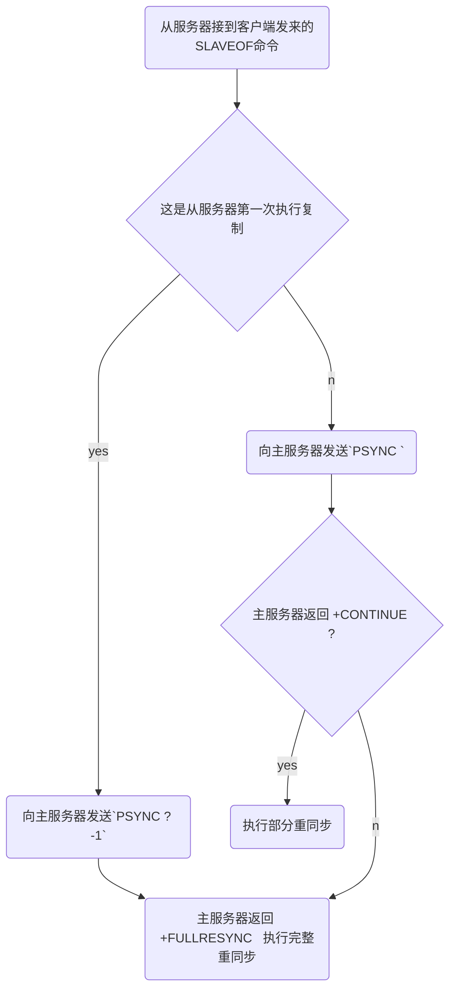

[TOC]

# Redis复制

数据库状态一致：进行复制中的主从服务器双方的数据库将保存相同的数据；


## 旧版复制功能的实现

### 同步

同步（sync），用于将从服务器的数据库状态更新至主服务器当前所处的数据库状态。

```sequence
Title:示例
从服务器->主服务器: 发送SYNC命令
主服务器-->从服务器: 发送RDB文件
主服务器-->从服务器: 发送缓冲区保存的所有写命令
```

1. 从服务器向主服务器发送SYNC命令；
2. 收到SYNC命令的主服务器执行BGSAVE命令，在后台生成一个RDB文件，并使用一个缓冲区记录从现在开始执行的所有写命令；
3. 当主服务器的BGSAVE命令执行完毕时，主服务器会将BGSAVE命令生成的RDB文件发送给从服务器，从服务器接收并载入这个RDB文件，将自己的数据库状态更新至主服务器执行BGSAVE命令时的数据库状态；
4. 主服务器将记录在缓冲区里面所有写命令发送给从服务器，从服务器执行这些写命令，将自己的数据库状态更新至主服务器数据库当前所处的状态。

### 命令传播

（command propagate），用于在主服务器的数据库状态被修改，导致主从服务器的数据库状态出现不一致时，让主从服务器的数据库重新回到一致状态。


## 旧版复制功能的缺陷

从服务器对主服务器的复制可以分为2种情况：

- 初次复制：从服务器以前没有复制过任何主服务器，或者从服务器当前要复制的主服务器和上次一次复制的主服务器不同。
- 断线后重复制：处于命令传播阶段的主从服务器因为网络原因而中断了复制，但从服务器通过自动重连接重新连上了主服务器，并继续复制主服务器。

### SYNC命令是一个非常消耗资源的操作

每次执行SYNC命令，主从服务器需要执行以下动作：

1. 主服务器需要执行BGSAVE命令来生成RDB文件，这个生成操作**会耗费主服务器大量的CPU，内存和磁盘I/O资源**。
2. 主服务器需要将自己生成的RDB文件发送给从服务器，这个发送操作**会耗费主从服务器大量的网络资源（带宽和流量），并对主服务器响应命令请求的时间产生影响**。
3. 接收到RDB文件的从服务器需要载入主服务器发来的RDB文件，并且在载入期间，**从服务器会因为阻塞而没办法处理命令请求**。


## 新版复制功能的实现

PSYNC命令具有完整重同步（full resynchronization）和部分重同步（partial resynchronization）两种模式：

- 完整重同步：用于处理初次复制情况，通过让主服务器创建并发送RDB文件，以及向从服务器发送保存在缓冲区里面的写命令来进行同步；
- 部分重同步：用于处理断线后重复制情况，当从服务器在断线后重新连接主服务器时，主服务器将断线期间执行的写命令发送给从服务器，从服务器接收并执行这些写命令，将数据库更新至主服务器当前所处的状态；

### 部分重同步

**部分重同步**解决了旧版复制功能在断线后重复制时发送整个RDB文件的低效情况；原理如下：

```sequence
Title: 主从服务器执行部分重同步的过程
从服务器->主服务器: PSYNC
主服务器-->从服务器: +CONTINUE
主服务器-->从服务器: 发送主从服务器短线期键主服务器执行的写命令
```

主从服务器分别维护一个复制偏移量（offset）：

1. 主服务器每次向从服务器传送N个字节的数据时，将自己的复制偏移量+N；
2. 从服务器每次收到主服务器传来的N个字节的数据时，将自己的复制偏移量+N；
3. 如果主从服务器处于一致状态，那么主从服务器两者的偏移量总是相同。

主服务器维护一个长度固定（fixed-size）先进先出（FIFO）队列叫复制积压缓冲区（默认1MB）：

1. 如果offset偏移量之后的数据（即offset+1开始的数据）仍然存在于复制积压缓冲区，主服务器对从服务器执行部分重同步操作；

2. 如果offset偏移量之后的数据已经不存在于复制积压缓冲区，主服务器对从服务器执行完整重同步操作；

3. 复制积压缓冲区的最小大小估算公式：$second \times write\_size\_per\_second$​

   - `second` 从服务器断线后重新连上主服务器所需要的平均时间（单位：s）；
   - `write_size_per_second` 主服务器平均每秒产生的写命令数据量（协议格式的写命令的长度总和）。

   例：如果平均每秒产生1MB的写数据，断线之后平均要5s才能重新连上，那么复制挤压缓冲区的最小大小为：5*1 = 5MB；

每个Redis服务器（主/从），都有自己的运行ID(runid)；runid在服务器启动时自动生成，由`REDIS_RUN_ID_SIZE`个随机的16进制字符组成；其用途如下：

- 如果从服务器保存的runid和当前连接的主服务器的runid一致，说明从服务器断线之前复制的就是当前的这个主服务器，此时可以继续执行**部分重同步操作**；
- 如果从服务器保存的runid和当前连接的主服务器的runid不一致，说明从服务器短线之前复制的不是当前的这个主服务器，此时执行**完整重同步操作**；


## PSYNC命令的实现




## 复制的实现

1. 运行`SLAVEOF <IP> <PORT>`命令，设置主服务器的地址和端口；

2. 建立套接字连接；

3. 发送ping命令，并处理返回值；

   ```mermaid
   graph TD
   ping(从服务器向主服务器发送PING命令) --> is_return_pong{主服务器返回 PONG} 
   is_return_pong --yes--> next(继续执行下一个步骤)
   is_return_pong --no--> read(读取PING命令的回复超市或者主服务器返回一个错误) --> disconnect(断开并重连主服务器)
   ```

   - **主服务器返回一个命令回复，从服务器读取超时**：表明主从服务器网络连接状态不佳，从服务器断开并重新创建套接字；
   - **主服务器返回错误**：表明主服务器暂时没有办法处理从服务器的请求，从服务器断开并重新创建套接字；
   - **从服务器读到"PONG"**：表明主从服务器网络连接正常，继续执行下个步骤；

4. 身份验证

   如果从服务器设置了`masterauth`选项，就进行身份验证，否则跳过；验证流程如下：

   ```mermaid
   graph TD
   auth(进入身份验证阶段) --> is_master_slave_setauth{主从服务器都没有设置密码}
   is_master_slave_setauth --yes,无需进行身份验证 --> next(执行复制工作的下一个步骤)
   is_master_slave_setauth --no,进行身份验证 --> is_same_passwd{主从服务器设置的密码相同}
   is_same_passwd --yes,验证成功--> next
   is_same_passwd --no--> detail(主从服务器设置了不同的密码<br>或者<br>主服务器设置了密码,但从服务器没有设置密码<br>或者<br>主服务器没有设置密码但从服务器设置了密码) --> retry(重试)
   ```

   - 如果master没有设置`requirepass`选项，并且slave没有设置`masterauth`选项，复制工作继续进行；
   - 如果slave通过`AUTH`命令发送的密码和主服务器`requirepass`选项所设置的密码一致，复制继续进行；否则，master返回一个`invalid password`错误；
   - 如果master设置了`requirepass`选项，但slave没有设置`masterauth`选项，则master返回一个`NOAUTH`错误；
   - 如果master没有设置`requirepass`选项，但slave设置了`masterauth`选项，则master反悔一个`no password is set`错误。

5. 向master发送端口消息；

6. 同步数据，主从服务器之间互为客户端；

   - 完整重同步操作：master需要成为slave的客户端才能将保存在缓冲区里面的写命令发送给从服务器执行；
   - 部分重同步操作：master需要成为slave的客户端才能向slave发送保存在复制积压缓冲区里面的写命令；

7. 命令传播。

  
  
## 心跳检测

  在命令传播阶段，slave默认以1次/s的频率，向master发送命令`REPLCONF ACK <slave当前的复制偏移量>`，有以下三个作用：

- 检测主从服务器的网络连接状态；
- 辅助实现`min-slaves`选项；
- 检测命令丢失。

### 辅助实现min-slaves配置选项

以下选项可以防止master在不安全的情况下执行写命令：

- `min-slaves-to-write` slave的最少数量
- `min-slaves-max-lag` slave的最大延迟(lag)

### 检测命令丢失

Redis 2.8版本以前没有检测命令丢失功能，2.8以后才有这功能；原理如下：

如果master给slave的写命令半路丢失，当slave向master发送REPLCONF ACK命令时，slave的复制偏移量将少于master的复制偏移量，master从复制积压缓冲区找到缺少的数据，重新发送给slave；


## 参考

- [Redis源码解析：16Resis主从复制之主节点的完全重同步流程](https://blog.csdn.net/gqtcgq/article/details/51241284)

