# Redis哨兵

哨兵(Sentinel)是Redis的高可用性(high availability)解决方案；Sentinel本质上只是一个运行在特殊模式下的Redis服务器；


## 原理

1. Sentinel系统监视服务器

   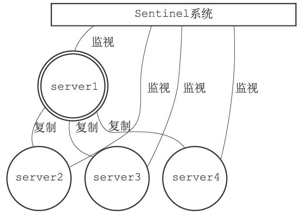

2. master下线

   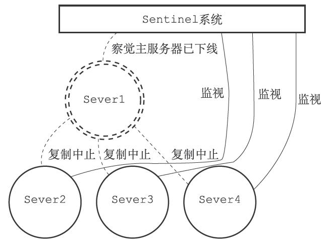

3. 故障转移

   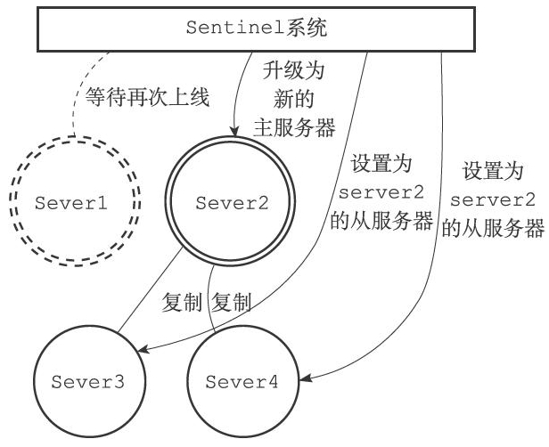

4. master降级

   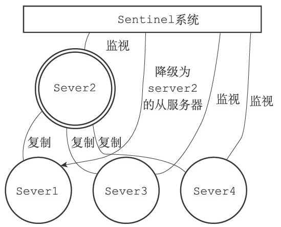


## 启动并初始化Sentinel

1. 启动

   启动Sentinel可以使用以下命令：

   ```sh
   redis-sentinel xxx.conf
   ```

   或

   ```sh
   redis-server xxx.conf --sentinel
   ```

2. 初始化

   Sentinel执行的工作和普通Redis服务器执行的工作不同，Sentinel模式下Redis服务器主要功能的使用情况：

   | 功能                                             | 使用情况                                                     |
   | ------------------------------------------------ | ------------------------------------------------------------ |
   | 数据库和键值对方面的命令；如：SET, DEL, FLUSHDB  | 不使用                                                       |
   | 事务命令；如：MULTI, WATCH                       | 不使用                                                       |
   | 脚本命令；如：EVAL                               | 不使用                                                       |
   | RDB持久化命令；如：SAVE, BGSAVE                  | 不使用                                                       |
   | AOF持久化命令；如：BGREWRITEAOF                  | 不使用                                                       |
   | 复制命令；如：SLAVEOF                            | Sentinel内部可以使用，但客户端不可以使用                     |
   | 发布与订阅命令；如：PUBLISH, SUBSCRIBE           | SUBSCRIBE, PSUBSCRIBE, UNSUBSCRIBE, PUNSUBSCRIBE四个命令在Sentinel内部和客户端都可以使用，但PUBLISH命令只能在Sentinel内部使用 |
   | 文件事件处理器（负责发送命令请求，处理命令回复） | Sentinel内部使用，但关联的文件事件处理器和普通Redis服务器不同 |
   | 时间事件处理器（负责执行serverCron函数）         | Sentinel内部使用，时间事件的处理器仍然是serverCron函数，serverCron函数会调用sentinel.c/sentinelTimer函数，后者包含了Sentinel要执行的所有操作 |

3. 使用Sentinel专用代码

  - Sentinel使用`sentinel.c/REDIS_SENTINEL_PORT`作为服务器端口，而不是普通服务器的`redis.h/REDIS_SERVERPORT`；
  - Sentinel使用`sentinel.c/sentinelcmds`作为服务器的命令表，而不是普通服务器的`redis.c/redisCommandTable`作为服务器的命令表；
  - Sentinel的INFO命令使用`sentinel.c/sentinelInfoCommand`函数，而不是普通服务器的`redis.c/infoCommand`函数

  客户端可以对Sentinel执行的命令：

  1. PING
  2. SENTINEL
  3. INFO
  4. SUBSCRIBE
  5. UNSUBSCRIBE
  6. PSUBSCRIBE
  7. PUNSUBSCRIBE
  
4. 初始化Sentinel状态

   服务器初始化一个`sentinel.c/sentinelState`结构用来保存所有和Sentinel功能有关的状态：

   ```c
   /* Sentinel状态 */
   struct sentinelState {
       uint64_t current_epoch;     /* 当前纪元，用于实现故障转移 */
       dict *masters;              /* 所有被哨兵监视的主服务器；
                                       key:被监视的主服务器名字
                                       value:指向sentinelRedisInstance的指针 */
       int tilt;                   /* 是否进入了TILT模式？*/
       int running_scripts;        /* 目前正在执行的脚本的数量 */
       mstime_t tilt_start_time;   /* 进入TILT模式的时间 */
       mstime_t previous_time;     /* 最后一次执行时间处理器的时间 */
       list *scripts_queue;        /* 一个FIFO队列，包含了所有需要执行的用户脚本 */
       char *announce_ip;          /* 哨兵IP地址 */
   
       int announce_port;          /* 哨兵Port */
   
   } sentinel;
   ```

5. 初始化Sentinel状态的masters属性

   每个sentinelRedisInstance结构代表一个被Sentinel监视的Redis服务器实例（instance），源码如下：

   ```c
   /* 被监视的主服务器实例对象 */
   typedef struct sentinelRedisInstance {
       ...
   }
   ```

6. 创建连向主服务器的网络连接

  对于每个被Sentinel监视的主服务器来说，Sentinel会创建两个连向主服务器的异步网络连接：

  - 一个是命令连接，这个连接专门用于向主服务器发送命令，并接收命令回复；
  - 另一个是订阅连接，这个连接专门用于订阅主服务器的`__sentinel__:hello`频道。

  

## 获取主服务器信息

Sentinel默认以1次/10s的频率，通过命令连接向被监视的master发送INFO命令，并通过分析INFO命令的回复来获取主服务器的当前信息；示意如下：

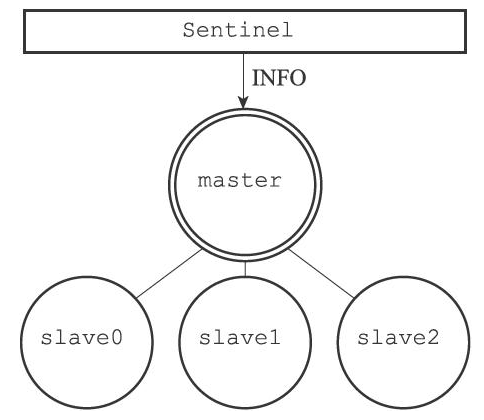

通过分析master返回的INFO命令回复，Sentinel可以获取以下信息：

- 关于主服务器本身的信息
  - `runid` 运行时ID
  - `role` 角色类型
- 关于主服务器属下所有从服务器的信息
  - `ip` 从服务器IP地址
  - `port` 从服务器端口号
  - `state` 从服务器在线状态
  - `offset` 偏移量
  - `lag` 延迟


## 获取从服务器信息

当Sentinel发现主服务器有新的从服务器出现时，Sentinel除了会为这个新的从服务器创建相应的实例结构之外，Sentinel还会创建连接到从服务器的命令连接和订阅连接；示意如下：

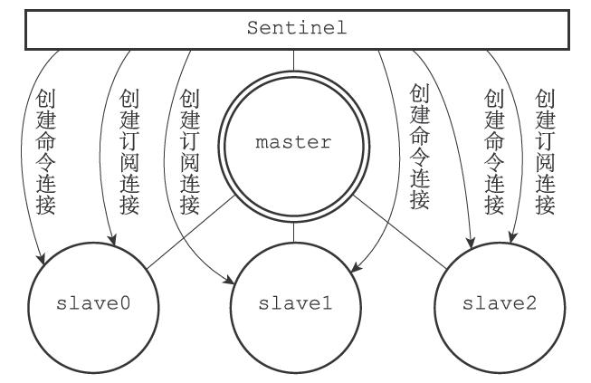

Sentinel默认以1次/10s的频率通过命令连接向slave发送INFO命令；Sentinel通过分析slave返回的回复，得到以下信息：

- `runid` slave的运行ID
- `role` slave的角色信息
- `master_host` master的IP地址
- `master_port` master的端口号
- `master_link_status` 主从服务器的连接状态
- `slave_repl_offset` slave的复制偏移量
- `slave_priority` slave的优先级


## 向主服务器和从服务器发送信息

Sentinel默认以1次/2s的频率，通过命令连接向所有被监视的master和slave发送以下命令：`PUBLISH __sentinel__:hello "<s_ip>,<s_port>,<s_runid>,<s_epoch>,<m_name>,<m_ip>,<m_port>,<m_epoch>"`；参数说明如下：

| 参数    | 说明                                        |
| ------- | ------------------------------------------- |
| s_ip    | Sentinel的IP地址                            |
| s_port  | Sentinel的端口号                            |
| s_runid | Sentinel的运行ID                            |
| s_epoch | Sentinel当前的配置纪元(configuration epoch) |
| m_name  | 主服务器的名字                              |
| m_ip    | 主服务器的IP地址                            |
| m_port  | 主服务器的端口号                            |
| m_epoch | 主服务器当钱的配置纪元                      |

- 以`s_`开头的参数记录的是Sentinel本身的信息
- 以`m_`开头的参数记录的是master的信息


## 接受来自主服务器和从服务器的频道信息

当Sentinel与一个master/slave建立起订阅连接之后，Sentinel通过订阅连接向服务器发送以下命令`SUBSCRIBE __sentinel__:hello`；订阅一直持续到Sentinel与服务器的连接断开为止；

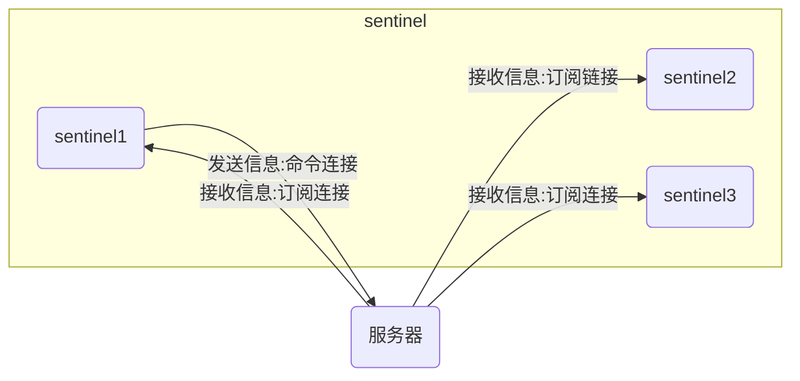

对于监视同一个服务器的多个Sentinel来说，一个Sentinel发送的信息会被其它Sentinel接收到，这些信息会被用于更新其他Sentinel对发送信息Sentinel的认知，也会被用于更新其他Sentinel对被监视服务器的认知；当一个Sentinel从`__sentinel__:hello`频道收到一条消息时，进行以下处理：

- 信息的运行ID和Sentinel的运行ID相同，说明这条信息是Sentinel自己发送的，Sentinel将丢弃这条信息，不做进一步处理；
- 信息的运行ID和Sentinel的运行ID不同，说明这条信息是监视同一个服务器的其他Sentinel发来的，接收信息的Sentinel将根据信息中的各个参数，对相应master的实例结构进行更新。

### 更新sentinels字典

当*目标sentinel*接收到*源sentinel*发来的信息时，*目标sentinel*会检查sentinels字典判断*源sentinel*是否存在：

- 如果*源sentinel*存在，对*源sentinel*的实例结构进行更新；
- 如果*源sentinel*不存在，说明*源sentinel*是刚刚开始监视主服务器的新Sentinel，为*源sentinel*创建一个新的实例结构，并将这个结构添加到sentinels字典里面。

### 创建连向其他Sentinel的命令连接

当sentinel通过频道信息发现一个新的sentinel时，会与新sentinel相互建立连接；如图所示：

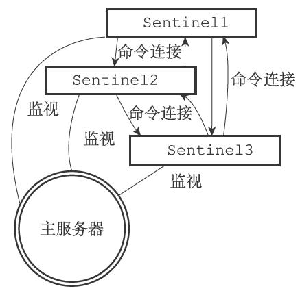

sentinel在连接其他sentinel时，指挥创建命令连接，不会创建订阅连接；


## 检测主观下线状态

sentile以1次/s的频率向所有实例发送PING命令，并通过PING命令的回复来判断实例是否在线：

- 有效回复：`+PONG`, `-LOADING`, `-MASTERDOWN`三种回复中的一种；
- 无效回复：其他回复或在`down-after-milliseconds`时间内没有任何回复；


## 检查客观下线状态

当Sentinel将一个master判断为主观下线后，为了确认这个master是否真的下线了，它会向同样监视这一master的其他sentinel进行询问，确认他们是否也认为master已经进入了下线状态；

### SENTINEL is-master-down-by-addr命令

Sentinel使用命令`SENTINEL is-master-down-by-addr <ip> <port> <current_epoch> <runid>`询问其他sentinel是否同意master已下线；

- `ip` 被sentinel判断为主观下线的主服务器的IP地址；
- `port` 被sentinel判断为主观下线的主服务器的端口号；
- `current_epoch` sentinel当前的配置纪元，用于选举领头sentinel；
- `runid` 可以是`*`符号或者sentinel的运行ID
  - `*` 代表命令仅仅用于检测主服务器的客观下线状态；
  - sentinel的运行ID 用于选举领头sentinel

其它sentinel收到`SENTINEL is-master-down-by-addr`命令之后会返回以下信息；

| 参数         | 意义                                                         |
| ------------ | ------------------------------------------------------------ |
| down_state   | 返回目标sentinel对master的检查结果；<br>  1：主服务器已下线<br>  0：主服务器未下线 |
| leader_runid | 可以是`*`符号或者目标sentinel的局部领头sentinel的运行ID：<br>  `*`：代表命令仅仅用于检测master的下线状态<br>  `局部领头sentinel的运行ID`：用于选举领头sentinel |
| leader_epoch | 目标sentinel的局部领头sentinel的配置纪元，用于选举领头sentinel（仅在`leader_runid`不为`*`时有效，如果`leader_runid`的值为`*`，那么leader_epoch总是为0）； |

### 客观下线状态的判断条件

认为master已经进入下线状态的sentinel数量大于配置`SENTINEL monitor ... <quorm>`中quorm的值时，判定客观下线状态达成；


## 选举领头sentinel

当一个master被判断为客观下线时，监视这个master的各个sentinel会进行协商，选举出一个领头sentinel，并由sentinel对下线master执行故障转移操作；

### 选举规则

1. 所有在线的sentinel都有被选为领头sentinel的资格；
2. 每次选举之后，不论选举是否成功，所有sentinel的配置纪元(configuration epoch)的值都会自增一次；
3. 在每一个纪元里，所有的sentinel都有且只有一次投票机会，投完之后不可再更改；
4. 当源sentinel向目标sentinel发送`SENTINEL is-master-down-by-addr`命令，且命令中的`runid`不是`*`而是源sentinel的runid时，这表示源sentinel要求参选；
5. 最先向目标sentinel发送要求参选请求的源sentinel会获得选票，选票投出后后面再有其它参选请求来时会被拒绝；
6. 目标sentinel在收到`SENTINEL is-master-down-by-addr`命令之后，返回一条回复，回复中的`leader_runid`和`leader_epoch`分别记录了目标sentinel的局部领头sentinel的运行ID和配置纪元；
7. 源sentinel收到回复后检查`leader_epoch`和`leader_runid`是否与自己一致，一致则表示对方已将源sentinel设置为**局部领头sentinel**；
8. 如果某个sentinel被半数以上的sentinel设置为**局部领头sentinel**，那么这个sentinel成为**领头sentinel**；
9. **领头sentinel**有且只有1个；
10. 如果在给定时限内，没有一个sentinel被选举为**领头sentinel**，则一段时间后再次进行选举。

### 示例

1. 三个sentinel都发现master已经进入了客观下线状态

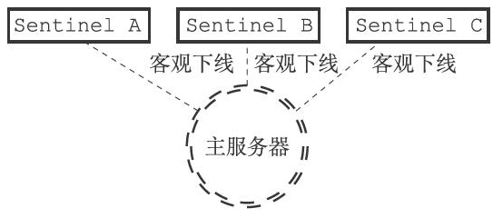

2. sentinel再次向其它sentinel发送命令

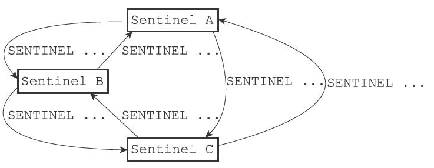


## 故障转移

领头sentinel对已下线的master执行故障转移操作，包含以下步骤：

1. 在已下线的master属下的所有slave里面，挑选出一个slave转换为master；

   挑选slave的规则如下：

   - 剔除所有处于下线或断线状态的slave；
   - 剔除所有最近5s内没有回复过领头sentinel的INFO命令的slave；
   - 剔除所有与已下线master连接断开超过`down-after-milliseconds*10`ms的slave；
   - 根据slave的优先级排序，选出优先级最高的slave；
   - 如果slave的优先级一致，选出偏移量最大的slave；
   - 如果slave的优先级和偏移量一致，选出运行ID最小的slave。

2. 让已下线的master属下的所有slave改为复制新的master；

3. 将已下线的master设置为新master的slave；

示意如图：

1. server1下线

   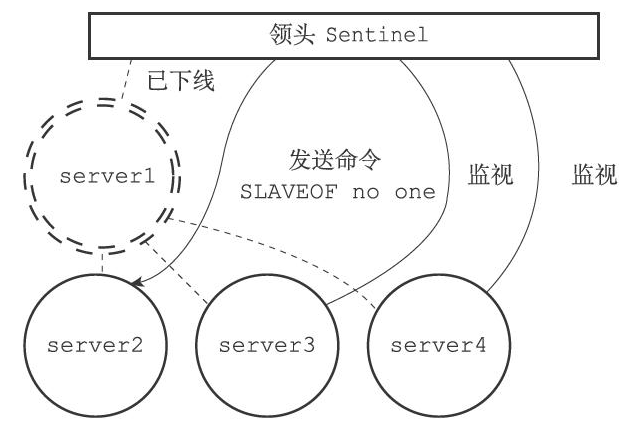

2. server2升级为master

   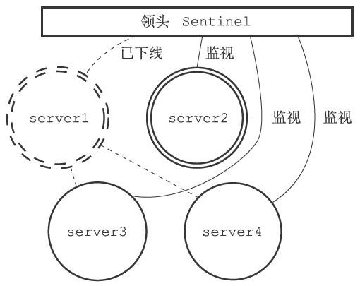

3. 让剩下的slave复制新的master

   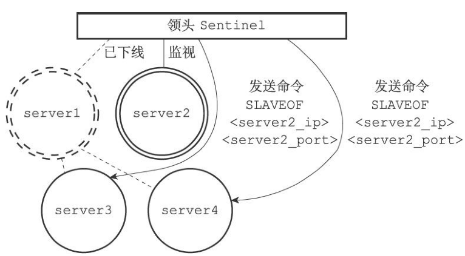

4. 让剩下的slave成为新master的slave

  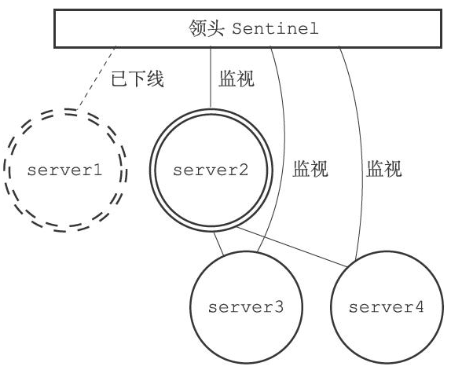

5. 将旧master设置为新master的slave

  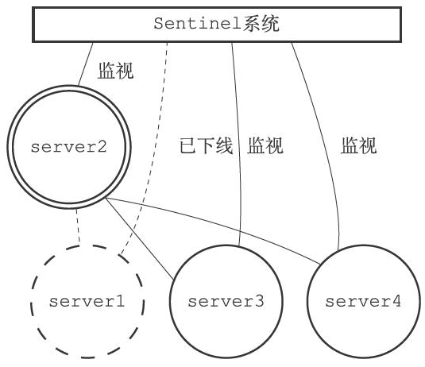

6. 旧master重新上线成为slave

   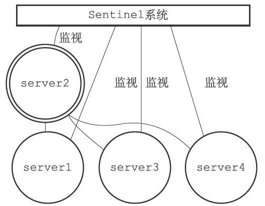

    

