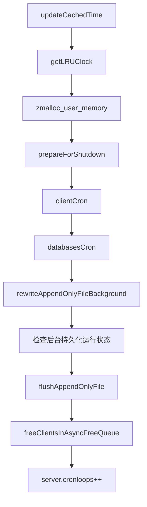

# Redis服务端


## 命令请求的执行过程

### redisCommand结构的主要属性

```c
struct redisCommand { /*Redis命令*/
    char *name;             /* 命令名字 */
    redisCommandProc *proc; /* 命令回调函数 */
    int arity;              /* 命令参数的个数 */
    char *sflags;           /* 命令属性() */
    int flags;              /* 对sflags进行分析得到的二进制标识 */
    redisGetKeysProc *getkeys_proc; /* 从命令行中获取key参数的函数 */
    int firstkey;                   /* 第一个key的位置（0表示没有key）*/
    int lastkey;                    /* 最后一个key的位置，（可以为负数，为正数第argc+lastkey个） */
    int keystep;                    /* 第一个key到最后一个key的跨度 */
    long long microseconds, calls;  /* 执行这个命令所耗费的总时长，这个命令的执行次数 */
};
```

- `name` 命令的名字（命令名字的大小写不影响命令表的查找结果）

- `proc` 函数指针，指向命令的实现函数

- `arity` 命令参数的个数

  用于检查命令请求的格式是否正确。如果这个值为负数-N

- `sflags` 命令属性

  | 标识 | 二进制标识                | 含义                                                         | 相关命令                                        |
  | ---- | ------------------------- | ------------------------------------------------------------ | ----------------------------------------------- |
  | w    | REDIS_CMD_WRITE           | 这是一个写入命令，可能会修改数据库                           | SET, RPUSH, DEL...                              |
  | r    | REDIS_CMD_READONLY        | 这是一个只读命令，不会修改数据库                             | GET, STRLEN, EXISTS...                          |
  | m    | REDIS_CMD_DENYOOM         | 这个命令可能会占用大量内存，执行之前需要先检查服务器的内存使用情况，如果内存紧缺的话就禁止执行这个命令 | SET, APPEND, RPUSH, LPUSH, SADD, SINTERSTORE... |
  | a    | REDIS_CMD_ADMIN           | 这是一个管理命令                                             | SAVE, BGSAVE, SHUTDOWN...                       |
  | p    | REDIS_CMD_PUBSUB          | 这是一个发布与订阅功能方面的命令                             | PUBLISH, SHUBSCRIBE, PUBSUB...                  |
  | s    | REDIS_CMD_NOSCRIPT        | 这个命令不可以在Lua脚本中使用                                | BRPOP, BLPOP, BRPOPLPUSH, SPOP...               |
  | R    | REDIS_CMD_RANDOM          | 这是一个随机命令，对于相同的数据集和相同的参数，命令返回的结果可能不同 | SPOP, SRANDMEMBER, SSCAN, RANDOMKEY...          |
  | S    | REDIS_CMD_SORT_FOR_SCRIPT | 当在Lua脚本中使用这个命令时，对这个命令的输出结果进行一次排序，使得命令的结果有序 | SINTER, SUNION, SDIFF, SMEMBERS, KEYS...        |
  | l    | REDIS_CMD_LOADING         | 这个命令可以在服务器载入数据的过程中使用                     | INFO, SHUTDOWN, PUBLISH...                      |
  | t    | REDIS_CMD_STALE           | 这是一个允许从服务器在带有过期数据时使用的命令               | SLAVEOF, PING, INFO...                          |
  | M    | REDIS_CMD_SKIP_MONITOR    | 这个命令在监视器（monitor）模式下不会自动被传播（propagate） | EXEC                                            |
  | `k`  | REDIS_CMD_ASKING          |                                                              |                                                 |
  | `F`  | REDIS_CMD_FAST            |                                                              |                                                 |

- `flags` 对sflags进行分析得到的二进制标识

- `getkeys_proc` 从命令行中获取key参数的函数

- `firstkey` 第一个key的位置（0表示没有key）

- `lastkey` 最后一个key的位置，（可以为负数，为正数第argc+lastkey个）

- `keystep` 第一个key到最后一个key的跨度

- `calls` 这个命令的执行次数

- `milliseconds` 执行这个命令所耗费的总时长


## serverCron

serverCron函数默认每隔100ms执行一次，这个函数负责管理服务器的资源，并保持服务器自身的良好运转。

### 流程

serverCron流程如下：




1. 更新服务器时间缓存

2. 更新LRU时钟

3. 更新服务器每秒执行命令次数

4. 更新服务器内存峰值记录

5. 处理SIGTERM信号

6. 管理客户端资源

7. 管理数据库资源

8. 执行被延迟的BGREWRITEAOF

9. 检查持久化操作的运行状态

   后台持久化运行状态判断条件：`rdb_child_pid != -1 || aof_child_pid != -1`；

10. 将AOF缓冲区中的内容写入AOF文件

11. 关闭一步客户端

12. 增加cronloops计数器的值

判断是否需要执行持久化操作流程：

```flow
no_persistent=>operation: 服务器没有在执行任何持久化操作
is_delay=>condition: 有BGREWRITEAOF被延迟？
is_autosave=>condition: 自动保存的条件已经满足？
exec_bgrewriteaof=>operation: 执行BGREWRITEAOF
exec_bgsave=>operation: 执行BGSAVE
is_aofrewrite=>condition: AOF重写的条件已经满足？
do_nothing=>operation: 不做动作

no_persistent->is_delay
is_delay(yes)->exec_bgrewriteaof
is_delay(no)->is_autosave
is_autosave(yes)->exec_bgsave
is_autosave(no)->is_aofrewrite
is_aofrewrite(yes)->exec_bgrewriteaof
is_aofrewrite(yes)->do_nothing
```


## 初始化服务器

1. 初始化服务器状态结构
2. 载入配置选项
3. 初始化服务器数据结构
4. 还原数据库状态
5. 执行事件循环


## 参考

- [Redis5设计与源码分析 (第9章　命令处理生命周期)](https://www.cnblogs.com/coloz/p/13812842.html)

