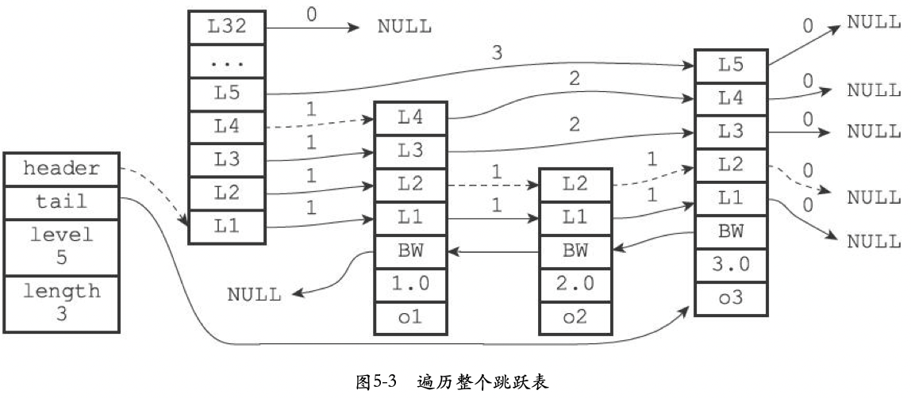
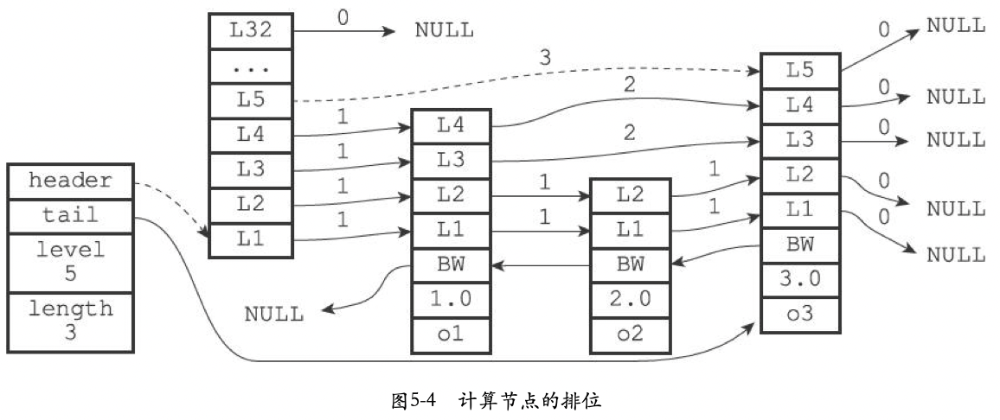

[TOC]

# Redis跳表


## 摘要

Redis使用`skiplist`来作为zset等数据结构的底层实现。


## API

| 函数                    | 作用                                                         | 时间复杂度                                                 |
| ----------------------- | ------------------------------------------------------------ | ---------------------------------------------------------- |
| `zslCreate`             | 创建一个新的跳表                                             | $O(1)$                                                     |
| `zslFree`               | 删除指定score的节点                                          | -                                                          |
| `zslInsert`             | 将包含给定值和分的新节点添加到跳表中                         | 平均$O(logN)$，最坏$O(N)$，N为跳表长度                     |
| `zslDelete`             | 删除跳表中包含给定分和值的节点                               | 平均$O(logN)$，最坏$O(N)$，N为跳表长度                     |
| `zslGetRank`            | 返回包含给定成员和分值的节点在跳表中的排位                   | 平均$O(logN)$，最坏$O(N)$，N为跳表长度                     |
| `zslGetElementByRank`   | 返回跳表在给定排位上的节点                                   | 平均$O(logN)$，最坏$O(N)$，N为跳表长度                     |
| `zslIsInRange`          | 给定一个分值范围（range），比如0到15，20到28，诸如此类，如果跳表中有至少一个节点的分值在这个范围之内，那么返回1，否则返回0 | 通过跳表的表头节点和尾节点，这个检测可以用$O(1)$复杂度完成 |
| `zslFirstInRange`       | 给定一个分值范围，返回跳表中第一个符合这个范围的节点         | 平均$O(logN)$，最坏$O(N)$。N为跳表长度                     |
| `zslLastInRange`        | 给定一个分值范围，返回跳表中最后一个符合这个范围的节点       | 平均$O(logN)$，最坏$O(N)$。N为跳表长度                     |
| `zslDeleteRangeByScore` | 给定一个分值范围，删除跳表中所有在这个范围之内的节点         | $O(N)$，N为被删除节点数量                                  |
| `zslDeleteRangeByRank`  | 给定一个排位范围，删除跳表中所有在这个范围之内的节点         | $O(N)$，N为被删除节点数量                                  |


## 实现

### 结构

```c
/* 跳表节点 */
typedef struct zskiplistNode {
    robj *obj;                          // 成员对象
    double score;                       // 分值
    struct zskiplistNode *backward;     // 后退指针（方向表头，指向上一个节点）
    struct zskiplistLevel {
        struct zskiplistNode *forward;  // 前进指针（方向表尾）
        unsigned int span;              // 前进指针和当前节点的距离
    } level[];                          // 层高，随机[1,32]
} zskiplistNode;

/* 跳表 */
typedef struct zskiplist {
    struct zskiplistNode *header, *tail; // 表头，表尾
    unsigned long length;                // 节点数量（不算表头）
    int level;                           // 最大层级
} zskiplist;
```

### 遍历跳表



查找范围内的第一个节点：

```c
zskiplistNode *zslFirstInRange(zskiplist *zsl, zrangespec *range) {
    zskiplistNode *x;
    int i;

    /* If everything is out of range, return early. */
    if (!zslIsInRange(zsl,range)) return NULL;

    x = zsl->header;
    for (i = zsl->level-1; i >= 0; i--) {
        /* Go forward while *OUT* of range. */
        while (x->level[i].forward &&
            !zslValueGteMin(x->level[i].forward->score,range))
                x = x->level[i].forward;
    }

    /* This is an inner range, so the next node cannot be NULL. */
    x = x->level[0].forward;
    redisAssert(x != NULL);

    /* Check if score <= max. */
    if (!zslValueLteMax(x->score,range)) return NULL;
    return x;
}
```

查找范围内最后一个节点：

```c
zskiplistNode *zslLastInRange(zskiplist *zsl, zrangespec *range) {
    zskiplistNode *x;
    int i;

    /* If everything is out of range, return early. */
    if (!zslIsInRange(zsl,range)) return NULL;

    x = zsl->header;
    for (i = zsl->level-1; i >= 0; i--) {
        /* Go forward while *IN* range. */
        while (x->level[i].forward &&
            zslValueLteMax(x->level[i].forward->score,range))
                x = x->level[i].forward;
    }

    /* This is an inner range, so this node cannot be NULL. */
    redisAssert(x != NULL);

    /* Check if score >= min. */
    if (!zslValueGteMin(x->score,range)) return NULL;
    return x;
}
```

### 排位

查找分值为3.0，成员对象为o3的节点，例：




```c++
/**
 * @brief 返回包含给定成员和分值的节点在跳表中的排位；返回0表示未找到
 * @param score 分值 @param o 成员
 */
unsigned long zslGetRank(zskiplist *zsl, double score, robj *o) {
    zskiplistNode *x;
    unsigned long rank = 0;
    int i;

    x = zsl->header;
    for (i = zsl->level-1; i >= 0; i--) {
        while (x->level[i].forward &&
            (x->level[i].forward->score < score ||
                (x->level[i].forward->score == score &&
                compareStringObjects(x->level[i].forward->obj,o) <= 0))) {
            rank += x->level[i].span;
            x = x->level[i].forward;
        }

        /* x might be equal to zsl->header, so test if obj is non-NULL */
        if (x->obj && equalStringObjects(x->obj,o)) {
            return rank;
        }
    }
    return 0;
}
```

### 随机算法

随机出一个属于`[1, 32]`的层级。

```c
/**
 * @brief 随机出一个层级
 * 
 **/
int zslRandomLevel(void) {
    int level = 1;
    while ((random()&0xFFFF) < (ZSKIPLIST_P * 0xFFFF)) // while(rand < 0.25) { lvl++; }
        level += 1;
    return (level<ZSKIPLIST_MAXLEVEL) ? level : ZSKIPLIST_MAXLEVEL; // level : 32
}
```


