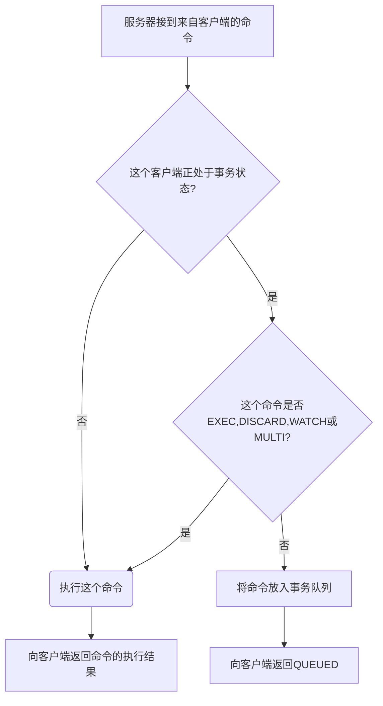
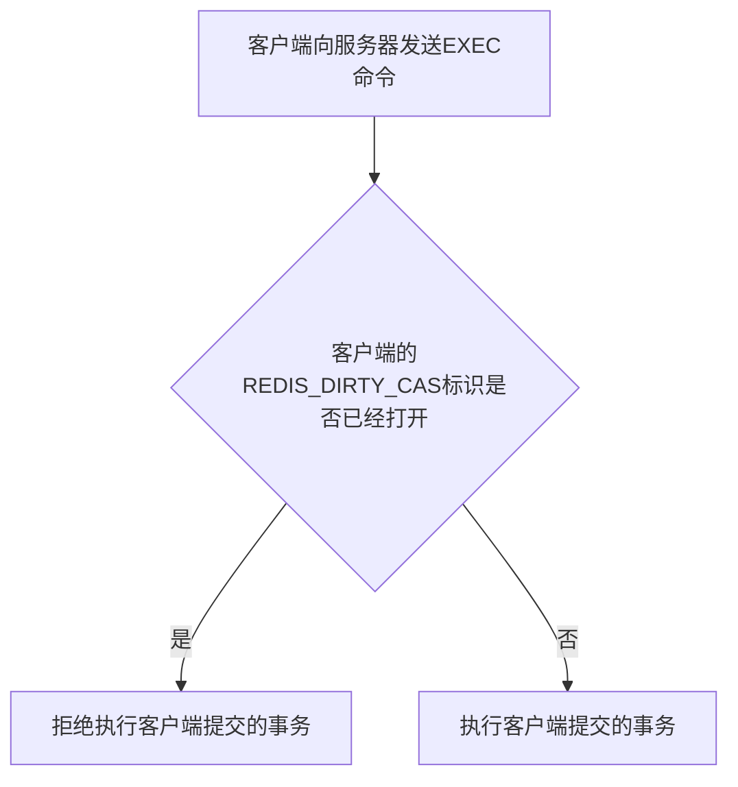

# Redis事务

[TOC]

## 事务的实现

MULTI命令可以将执行该命令的客户端从非事务状态切换至事务状态，这一切换是通过在客户端状态的flags属性中打开REDIS_MULTI标识来完成；

服务器判断命令是该入队还是该执行的过程：

## WATCH命令的实现

WATCH命令是一个乐观锁（optimistic locking），它可以在EXEC命令执行之前，监视任意数量的数据库键，并在EXEC命令执行时，检查被监视的键是否至少有一个已经被修改过了，如果是的话，服务器将拒绝执行事务，并向客户端返回代表事务执行失败的空回复；

### 使用WATCH命令监视数据库键

服务器判断是否执行事务的过程：

## 事务的ACID性质

ACID(Atomicity Consistency Isolation Dirability，原子性 一致性 隔离性 耐久性)

### 原子性

Atomicity：事务队列中的命令要么就全部都执行，要么就一个都不执行；

Redis不支持事务回滚机制（rollback），即使事务队列中的某个命令在执行期间出现了错误，整个事务也会继续执行下去，直到将事务队列中的所有命令都执行完毕为止；

### 一致性

Consistency：如果数据库在执行事务之前是一致的，那么在事务执行之后，无论事务是否执行成功，数据库也应该仍然是一致的；

导致不一致性的场景：

1. 入队错误

   如果一个事务在入队命令的过程中，出现了命令不存在，或者命令的格式不正确等情况，那么Redis将拒绝执行这个事务；

2. 执行错误

   事务在执行的过程中发生错误：

   - 执行过程中发生的错误都是一些不能在入队时被服务器发现的错误，这些错误只会在命令时机执行时被触发；
   - 即使在事务的执行过程中发生了错误，服务器也不会中断事务的执行，它会继续执行事务中余下的其它命令，并且已执行的命令（包括执行命令所产生的结果）不会被出错的命令影响；

3. 服务器停机

   如果Redis服务器在执行事务的过程中停机，那么根据服务器所使用的持久化模式，可能有以下情况出现：

   - 如果服务器运行在无持久化的内存模式下，那么重启之后的数据库将是空白的，因此数据总是一致的；
   - 如果服务器运行在RDB模式下，那么在事务中途停机不会导致不一致性，因为服务器可以根据现有的RDB文件来恢复数据，从而将数据库还原到一个一致的状态；如果找不到可供使用的RDB文件，那么重启之后的数据库将是空白的，而空白数据库总是一致的；
   - 如果服务器运行在AOF模式下，那么事务中途停机不会导致不一致性，因为服务器可以根据现有的AOF文件来恢复数据，从而将数据库还原到一个一致的状态；如果找不到可供使用的AOF文件，那么重启之后的数据库将是空白的，而空白数据库总是一致的；

### 隔离性

Isolation：即使数据库中有多个事务并发地执行，各个事务之间也不会相互影响，并且在并发状态下执行的事务和串行执行的事务产生的结果完全相同；

### 耐久性

Dirability：当一个事务执行完毕时，执行这个事务所得的结果已经被保存到永久性存储介质里面了，即使服务器在事务执行完毕之后停机，执行事务所得的结果也不会丢失；

Redis事务的耐久性由Redis所使用的持久化模式决定：

- 当服务器在无持久化的内存模式下运作时，事务不具有耐久性：一旦服务器停机，包括事务数据在内的所有服务器数据都将丢失；
- 当服务器在RDB持久化模式下运作时，服务器只会在特定的保存条件被满足时，才会执行BGSAVE命令，对数据库进行保存操作，并且异步执行的BGSAVE不能保证事务数据被第一时间保存到硬盘里面，因此RDB之久化模式下的事务也不具有耐久性；
- 当服务器运行在AOF持久化模式下，并且`appendfsync`选项的值为`alwasy`时，程序总会在执行命令之后调用同步（sync）函数，将命令数据真正地保存到硬盘里面，因此这种配置下的事务是具有耐久性的；
- 当服务器运行在AOF持久化模式下，并且`appendfsync`选项的值为`everysec`时，程序会每秒同步一次命令数据到硬盘；因为停机可能会恰好发生在等待同步的那一秒之内，这可能会造成事务数据丢失，所以这种配置下的事务不具有耐久性；
- 当服务器运行在AOF持久化模式下，并且appendfsync选项的值为no时，程序会交由操作系统来决定何时将命令数据同步到硬盘；因为事务数据可能在等待通过的过程中丢失，所以这种配置下的事务不具有耐久性；

`no-appendfsync-on-rewarite`配置选项对耐久性的影响

- 如果服务器打开了`no-appendfsync-on-rewrite`选项，那么即使服务器运行在always模式下的AOF持久化之下，事务也不具有耐久性；
- `no-appendfsync-on-rewrite`默认处于关闭状态；

## 参考

- 数据库系统实现.第六章

