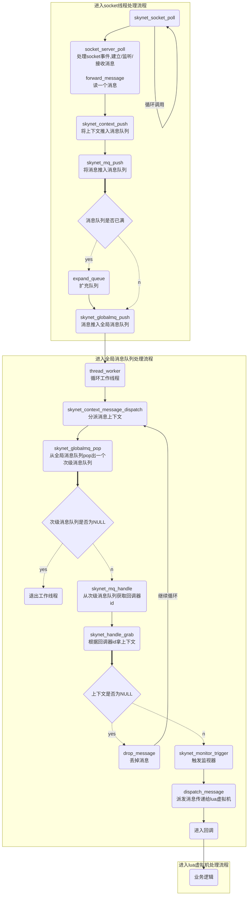

[TOC]

# skynet消息机制


## 消息定义

skynet消息的定义如下：

```c
// 消息
struct skynet_message {
	uint32_t source;// 发送方地址
	int session;    // 消息id，用来找对应的协程
	void * data;    // 消息内容地址
	size_t sz;      // 消息大小
};
```

### 消息分类

TODO


## 消息队列

消息队列定义如下：

```c
// 消息队列
struct message_queue {
	struct spinlock lock; // 自旋锁
	uint32_t handle; 				// 回调器ID
	int cap; 						// 容量
	int head; 						// 管道头索引
	int tail; 						// 管道尾索引
	int release; 					// 是否能释放消息
	int in_global; 					// 是否在全局消息队列；0:不在全局消息队列,1:在全局队列或在递送中
	int overload; 					// 过载数量
	int overload_threshold; 		// 过载阀值
	struct skynet_message *queue; 	// 消息队列
	struct message_queue *next; 	// 指向下一个消息队列
};
```

### 消息队列扩充

在push消息时，如果`head==tail`，表示消息队列已满，需要扩充，源码如下：

```c
static void
expand_queue(struct message_queue *q) {
	struct skynet_message *new_queue = skynet_malloc(sizeof(struct skynet_message) * q->cap * 2);
	int i;
	for (i=0;i<q->cap;i++) {
		new_queue[i] = q->queue[(q->head + i) % q->cap];
	}
	q->head = 0;
	q->tail = q->cap;
	q->cap *= 2;
	
	skynet_free(q->queue);
	q->queue = new_queue;
}
```

1. 队列cap扩充2倍
2. 从头到尾重新赋值


## 消息转发


## 消息流向



## 参考

- [skynet源码赏析](https://manistein.github.io/blog/post/server/skynet/skynet%E6%BA%90%E7%A0%81%E8%B5%8F%E6%9E%90/)