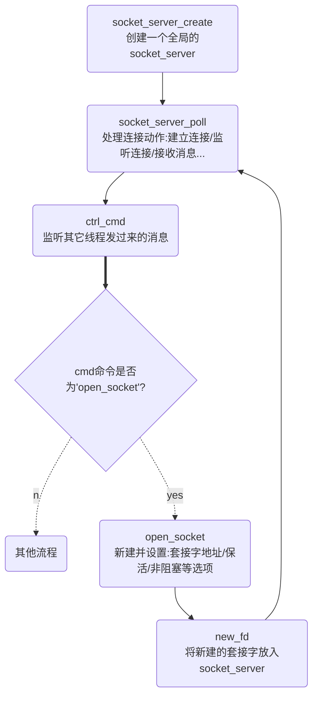

# skynet网络模块


## 定义

- 套接字

  ```c
  // 套接字
  struct socket {
  	uintptr_t opaque;		// 
  	struct wb_list high;	// 高优先级发送队列
  	struct wb_list low;		// 低优先级发送队列
  	int64_t wb_size;		// 发送字节大小
  	struct socket_stat stat;// 
  	ATOM_ULONG sending;		// 
  	int fd;					// socket文件描述符
  	int id;					// socket_server中的slot列表的位置
  	ATOM_INT type;			// 事件类型
  	uint8_t protocol;		// 使用的协议TCP/UDP
  	bool reading;			// 是否正在读
  	bool writing;			// 是否正在写
  	bool closing;			// 是否正在关闭
  	ATOM_INT udpconnecting;	// 
  	int64_t warn_size;		// 
  	union {
  		int size;
  		uint8_t udp_address[UDP_ADDRESS_SIZE];
  	} p;
  	struct spinlock dw_lock;// 自旋锁
  	int dw_offset;			// 
  	const void * dw_buffer;	// 
  	size_t dw_size;			// 
  };
  ```

- 套接字服务器

  ```c
  // 套接字服务器
  struct socket_server {
  	volatile uint64_t time;
  	int recvctrl_fd;					// 接收管道消息的文件描述
  	int sendctrl_fd;					// 发送管道消息的文件描述
  	int checkctrl;						// 判断是否有其他线程通过管道发送消息到socket线程; 1:有
  	poll_fd event_fd;					// epoll实例id
  	ATOM_INT alloc_id;					// 已经分配的socket slot列表id
  	int event_n;						// 标记本次epoll事件的数量
  	int event_index;					// 下一个未处理的epoll事件索引
  	struct socket_object_interface soi;	// 套接字对象接口
  	struct event ev[MAX_EVENT]; 		// epoll事件列表
  	struct socket slot[MAX_SOCKET]; 	// socket列表
  	char buffer[MAX_INFO]; 				// 地址信息转成字符串以后，存在这里
  	uint8_t udpbuffer[MAX_UDP_PACKAGE];	// 
  	fd_set rfds;						// 
  };
  ```

  

## 建立连接



1. 通过`socket_server_create`函数创建一个全局的`socket_server`

2. 通过`socket_server_poll`处理连接动作（建立连接/监听连接/接收消息...），同时检查变量`checkctrl`看看其它线程有没有发送消息到socket线程

3. 如果其它线程有发送消息到socket线程，调用`ctl_cmd`判断cmd是否为`O`；如果是，调用`open_socket`打开套接字

4. 在`open_socket`中新建并设置套接字地址，保活和非阻塞等选项

5. 将新建的套接字放入`socket_server`

6. 重复

   

## 监听和绑定端口

1. 新建gate服务。
2. 绑定端口并监听。
3. gate向socket线程发送一个请求，要求向socket slot里添加一个专门用于监听端口的socket，并在epoll中添加这个socket的监听事件。
4. 当新连接请求到来时，建立连接，并向gate发送一条消息，通知gate服务新建立连接socket的slot id，让gate自己处理。


## 参考

- [skynet源码赏析](https://manistein.github.io/blog/post/server/skynet/skynet%E6%BA%90%E7%A0%81%E8%B5%8F%E6%9E%90/)

