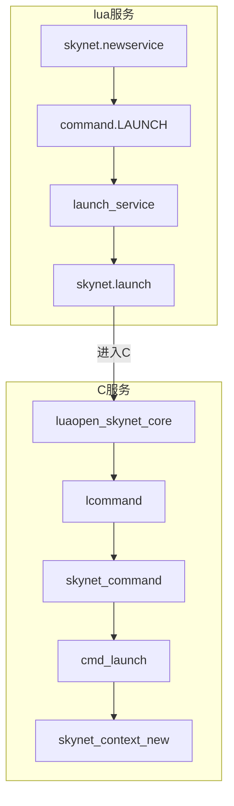
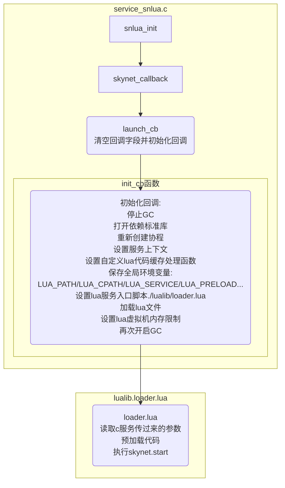

# skynet服务

服务是由消息驱动的，没有消息时服务处于挂起状态，每个服务都有一个属于自己的消息队列，用于内部通信。

[TOC]


## 定义

### C服务

C服务的定义如下：

```c
// skynet服务上下文
struct skynet_context {
	void * instance;             // 由模块的create函数创建的实例指针
	struct skynet_module * mod;  // module对象指针
	void * cb_ud;                // 传递给消息回调函数的userdata
	skynet_cb cb;                // 消息回调函数，由模块的init函数来指定
	struct message_queue *queue; // 内部消息队列
	ATOM_POINTER logfile;        // 日志
	uint64_t cpu_cost;           // cpu回调耗费事件（ms）
	uint64_t cpu_start;          // cpu回调开始时间（ms）
	char result[32];             // 返回值
	uint32_t handle;             // 当前上下文的ID
	int session_id;              // 标识对应的请求
	ATOM_INT ref;                // 引用计数变量，为0表示可以背释放
	int message_count;           // 消息数量统计
	bool init;                   // 是否已初始化
	bool endless;                // 消息是否堵住
	bool profile;                // 是否做信息统计（cpu consume ...）

	CHECKCALLING_DECL
};
```

### snlua服务

snlua服务也是一个特殊的C服务，其定义如下：

```c
// 内存报警阈值(32MB)
#define MEMORY_WARNING_REPORT (1024 * 1024 * 32)
// lua型别的c服务
struct snlua {
	lua_State * L;               // lua状态机
	struct skynet_context * ctx; // 服务上下文
	size_t mem;                  // 当前占用的内存
	size_t mem_report;           // 内存报警阈值
	size_t mem_limit;            // 内存限制
	lua_State * activeL;         // 当前活跃的lua虚拟机
	ATOM_INT trap;               // 触发器
};
```

snlua作为一个[skynet模块](modules.md)必须要实现以下接口：

- `struct snlua *snlua_create(void)`

  snlua模块的create函数

- `int snlua_init(struct snlua *l, struct skynet_context *ctx, const char * args)`

  - `l` snlua服务
  - `ctx` 服务的上下文
  - `args` 参数信息（由空白字符分割的字符串，格式为：lua服务名 ...）

  snlua模块的init函数

- `void snlua_release(struct snlua *l)`

  - `l` snlua服务

  snlua模块的release函数

- `void snlua_signal(struct snlua *l, int signal)`

  - `l` snlua服务
  - `signal` 信号

  snlua模块的signal函数


## 创建

### c服务

在skynet中，`skynet_context`即上下文服务，它的创建函数为：

```c
// 创建服务上下文；name：服务名，param：传递给服务的c风格的字符串，以空白字符分割
struct skynet_context * 
skynet_context_new(const char * name, const char *param) {
    struct skynet_module * mod = skynet_module_query(name);

	if (mod == NULL)
		return NULL;

	void *inst = skynet_module_instance_create(mod); // 创建模块
	if (inst == NULL)
		return NULL;
	struct skynet_context * ctx = skynet_malloc(sizeof(*ctx));
	CHECKCALLING_INIT(ctx)

	ctx->mod = mod;
	ctx->instance = inst;
	ATOM_INIT(&ctx->ref , 2);
	ctx->cb = NULL;
	ctx->cb_ud = NULL;
	ctx->session_id = 0;
	ATOM_INIT(&ctx->logfile, (uintptr_t)NULL);

	ctx->init = false;
	ctx->endless = false;

	ctx->cpu_cost = 0;
	ctx->cpu_start = 0;
	ctx->message_count = 0;
	ctx->profile = G_NODE.profile;
	// Should set to 0 first to avoid skynet_handle_retireall get an uninitialized handle
	ctx->handle = 0;	
	ctx->handle = skynet_handle_register(ctx); // 分配handle
	struct message_queue * queue = ctx->queue = skynet_mq_create(ctx->handle); // 创建消息队列
	// init function maybe use ctx->handle, so it must init at last
	context_inc();

	CHECKCALLING_BEGIN(ctx)
	int r = skynet_module_instance_init(mod, inst, ctx, param);
	CHECKCALLING_END(ctx)
	if (r == 0) {
		struct skynet_context * ret = skynet_context_release(ctx);
		if (ret) {
			ctx->init = true;
		}
		skynet_globalmq_push(queue); // 添加模块消息队列到全局消息队列中
		if (ret) {
			skynet_error(ret, "LAUNCH %s %s", name, param ? param : "");
		}
		return ret;
	} else { // 模块已经存在，报错
		skynet_error(ctx, "FAILED launch %s", name);
		uint32_t handle = ctx->handle;
		skynet_context_release(ctx);
		skynet_handle_retire(handle);
		struct drop_t d = { handle };
		skynet_mq_release(queue, drop_message, &d);
		return NULL;
	}
}
```

c服务的创建流程如下：


1. skynet_start调用skynet_context_new创建服务上下文

### lua服务

lua服务本质上也是c服务(即`snlua`)，然后在lua中调用`skynet.start`将lua回调函数注册到c服务中；

`skynet.newservice`用于创建lua服务，其流程如下：



1. 当前服务通过`skynet.newservice`向launcher服务发送`LAUNCH`命令，请求创建服务；
2. launcher服务调用`skynet_context_new`创建新服务并返回新服务的地址；
3. 其最终还是到了`skynet_context_new`这里


## 初始化

### C服务

TODO

### lua服务

加载lua服务时，函数`snlua_init`被自动调用，其流程如下：

- `snlua_init`

  ```c
  // 初始化snlua服务(模块初始化时被自动调用); l:snlua服务,ctx:上下文服务,args:参数信息(由空白字符分割的字符串，格式为：lua服务名 ...)
  int
  snlua_init(struct snlua *l, struct skynet_context *ctx, const char * args) {
  	int sz = strlen(args);
  	char * tmp = skynet_malloc(sz);
  	memcpy(tmp, args, sz);
  	skynet_callback(ctx, l , launch_cb); // 注册回调函数
  	const char * self = skynet_command(ctx, "REG", NULL); // 注册服务，获得服务ID
  	uint32_t handle_id = strtoul(self+1, NULL, 16);
  	// it must be first message
  	skynet_send(ctx, 0, handle_id, PTYPE_TAG_DONTCOPY,0, tmp, sz);
  	return 0;
  }
  ```

- `skynet_callback`

  ```c
  // 向框架注册回调函数，处理接收到的消息；context:服务上下文, ud:用户自定义数据, cb:回调函数
  void 
  skynet_callback(struct skynet_context * context, void *ud, skynet_cb cb) {
  	context->cb = cb;
  	context->cb_ud = ud;
  }
  ```

- `launch_cb`

  ```c
  // 服务消息回调函数; context:服务上下文, ud:用户自定义数据, type:, session:发送方凭证, source:发送方, msg:消息内容, sz:消息长度
  static int
  launch_cb(struct skynet_context * context, void *ud, int type, int session, uint32_t source , const void * msg, size_t sz) {
  	assert(type == 0 && session == 0);
  	struct snlua *l = ud;
  	skynet_callback(context, NULL, NULL);  // 清空回调字段
  	int err = init_cb(l, context, msg, sz); // 这里才是真正的注册和初始化
  	if (err) {
  		skynet_command(context, "EXIT", NULL);
  	}
  
  	return 0;
  }
  ```

- `init_cb`

  ```c
  // 初始化回调
  static int
  init_cb(struct snlua *l, struct skynet_context *ctx, const char * args, size_t sz) {
  	lua_State *L = l->L;
  	l->ctx = ctx;
  	lua_gc(L, LUA_GCSTOP, 0); // 停掉GC
  	lua_pushboolean(L, 1);  /* signal for libraries to ignore env. vars. */
  	lua_setfield(L, LUA_REGISTRYINDEX, "LUA_NOENV");
  	luaL_openlibs(L); // 打开标准库
  	luaL_requiref(L, "skynet.profile", init_profile, 0);
  
  	int profile_lib = lua_gettop(L);
  	// replace coroutine.resume / coroutine.wrap
  	lua_getglobal(L, "coroutine");
  	lua_getfield(L, profile_lib, "resume");
  	lua_setfield(L, -2, "resume");	// 重启协程
  	lua_getfield(L, profile_lib, "wrap");
  	lua_setfield(L, -2, "wrap");	// 创建协程
  
  	lua_settop(L, profile_lib-1);
  
  	lua_pushlightuserdata(L, ctx); // 设置服务上下文
  	lua_setfield(L, LUA_REGISTRYINDEX, "skynet_context");
  	luaL_requiref(L, "skynet.codecache", codecache , 0); // 设置自定义的lua代码缓存接口
  	lua_pop(L,1);
  
  	lua_gc(L, LUA_GCGEN, 0, 0);	// 开启gc
  	// 保存全局环境变量
  	const char *path = optstring(ctx, "lua_path","./lualib/?.lua;./lualib/?/init.lua");
  	lua_pushstring(L, path);
  	lua_setglobal(L, "LUA_PATH");
  	const char *cpath = optstring(ctx, "lua_cpath","./luaclib/?.so");
  	lua_pushstring(L, cpath);
  	lua_setglobal(L, "LUA_CPATH");
  	const char *service = optstring(ctx, "luaservice", "./service/?.lua");
  	lua_pushstring(L, service);
  	lua_setglobal(L, "LUA_SERVICE");
  	const char *preload = skynet_command(ctx, "GETENV", "preload");
  	lua_pushstring(L, preload);
  	lua_setglobal(L, "LUA_PRELOAD");
  
  	lua_pushcfunction(L, traceback);
  	assert(lua_gettop(L) == 1);
  	// 设置lua服务入口脚本
  	const char * loader = optstring(ctx, "lualoader", "./lualib/loader.lua");
  
  	int r = luaL_loadfile(L,loader); // 加载lua文件
  	if (r != LUA_OK) {
  		skynet_error(ctx, "Can't load %s : %s", loader, lua_tostring(L, -1));
  		report_launcher_error(ctx);
  		return 1;
  	}
  	lua_pushlstring(L, args, sz);
  	r = lua_pcall(L,1,0,1); // 进入./lublib/loader.lua
  	if (r != LUA_OK) {
  		skynet_error(ctx, "lua loader error : %s", lua_tostring(L, -1));
  		report_launcher_error(ctx);
  		return 1;
  	}
  	lua_settop(L,0);
  	if (lua_getfield(L, LUA_REGISTRYINDEX, "memlimit") == LUA_TNUMBER) {
  		size_t limit = lua_tointeger(L, -1);
  		l->mem_limit = limit; // 设置内存限制
  		skynet_error(ctx, "Set memory limit to %.2f M", (float)limit / (1024 * 1024));
  		lua_pushnil(L);
  		lua_setfield(L, LUA_REGISTRYINDEX, "memlimit");
  	}
  	lua_pop(L, 1);
  
  	lua_gc(L, LUA_GCRESTART, 0); // gc下先
  
  	return 0;
  }
  ```



1. 服务加载时自动调用`snlua_init`函数
2. `snlua_init`调用`skynet_callback`注册回调函数
3. `skynet_callback`调用`launch_cb`来初始化回调
4. `launch_cb`执行以下步骤：
   - 停止GC
   - 打开依赖标准库
   - 重新创建协程
   - 设置服务上下文
   - 设置自定义lua代码缓存处理函数
   - 保存配置文件地值为以下全局环境变量：
     - `LUA_PATH` 配置文件的lua_path选项
     - `LUA_CPATH` 配置文件的lua_cpath选项
     - `LUA_SERVICE` 配置文件的luaservice选项
     - `LUA_PRELOAD` 配置文件的preload选项
   - 加载&执行lua入口脚本`./lualib/loader.lua`，来加载其它lua文件
   - 设置LUA虚拟机内存限制
   - 通过`loader.lua`，最终执行lua服务定义的`skynet.start`
   - 再次开启LUA GC
5. 结束lua文件调用
6. 执行`skynet_command`注册snlua服务并获得服务ID

**注意：init_cb全程是关闭lua gc的，完成后才开启**


## 销毁

TODO


## 服务代理

TODO


## 用例

TODO 


## 参考

- [Skynet 服务创建流程](https://my.oschina.net/iirecord/blog/3076443)
- [skynet 服务的沙盒保护](https://blog.codingnow.com/2016/05/skynet_memory.html)
- [skynet 服务启动优化](https://blog.codingnow.com/2013/12/skynet_agent_pool.html)
- [深入理解skynet —— 服务](https://zhuanlan.zhihu.com/p/360760006)
- [Skynet服务器框架 Lua服务创建和启动剖析](https://blog.csdn.net/u010144805/article/details/80423388)

