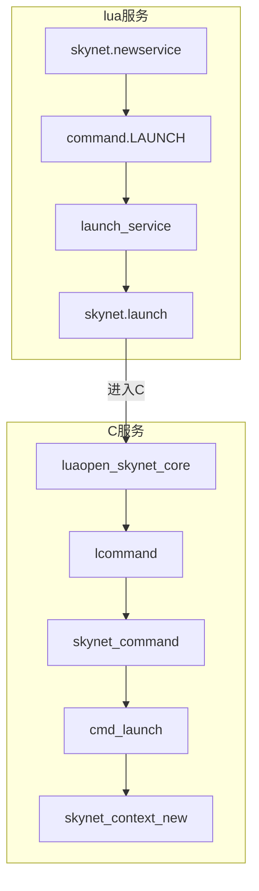

[TOC]

# skynet服务

服务是由消息驱动的，没有消息时服务处于挂起状态，每个服务都有一个属于自己的消息队列，用于内部通信。


## API

- `skynet.newservice(name, ...)`

  - `name` 服务名

  启动一个名为name的新服务（可以在一个进程其启动多个服务）

- `skynet.uniqueservice(name, ...)`

  - `name` 服务名

  启动一个唯一服务（单例），如果该服务已经启动，则返回已启动的服务地址

- `skynet.queryservice(name)`

  - `name` 服务名

  查询一个由uniqueservice启动的唯一服务的地址，若该服务尚未启动则等待

- `skynet.localname(name)`

  - `name` 服务名

  返回同一进程内，用register注册的具名服务的地址


## 定义

### C服务

C服务的定义如下：

```c
// skynet服务上下文
struct skynet_context {
	void * instance; 				// 由模块的create函数创建的实例指针
	struct skynet_module * mod; 	// module对象指针
	void * cb_ud;					// 传递给消息回调函数的userdata
	skynet_cb cb;					// 消息回调函数，由模块的init函数来指定
	struct message_queue *queue;	// 内部消息队列
	ATOM_POINTER logfile;			// 日志
	uint64_t cpu_cost;				// cpu回调耗费事件（ms）
	uint64_t cpu_start;				// cpu回调开始时间（ms）
	char result[32];				// 返回值
	uint32_t handle;				// 当前上下文的ID
	int session_id;					// 标识对应的请求
	ATOM_INT ref;					// 引用计数变量，为0表示可以背释放
	int message_count;				// 消息数量统计
	bool init;						// 是否已初始化
	bool endless;					// 消息是否堵住
	bool profile;					// 是否做信息统计（cpu consume ...）

	CHECKCALLING_DECL
};
```

### lua服务

lua服务也是一个特殊的C服务，其定义如下：

```c
// 内存报警阈值(32MB)
#define MEMORY_WARNING_REPORT (1024 * 1024 * 32)
// lua型别的c服务
struct snlua {
	lua_State * L; 					// lua状态机
	struct skynet_context * ctx; 	 // 服务上下文
	size_t mem; 					// 当前占用的内存
	size_t mem_report; 				// 内存报警阈值
	size_t mem_limit; 				// 内存限制
	lua_State * activeL; 			// 当前活跃的lua虚拟机
	ATOM_INT trap; 					// 触发器
};
```

snlua作为一个[skynet模块](modules.md)必须要实现以下接口：

- xxx_create
- xxx_init
- xxx_release
- xxx_signal


## 创建

### c服务

在skynet中，`skynet_context`即上下文服务，它的创建函数为：

```c
// 创建服务上下文；name：服务名，param：传递给服务的c风格的字符串，以空白字符分割
struct skynet_context * 
skynet_context_new(const char * name, const char *param) {
    ...
}
```

c服务的创建流程如下：


1. skynet_start调用skynet_context_new创建服务上下文

### lua服务

lua服务本质上也是c服务(即`snlua`)，然后在lua中调用`skynet.start`将lua回调函数注册到c服务中；

`skynet.newservice`用于创建lua服务，其流程如下：



1. 当前服务通过`skynet.newservice`向launcher服务发送`LAUNCH`命令，请求创建服务；
2. launcher服务调用`skynet_context_new`创建新服务并返回新服务的地址；

其最终还是到了`skynet_context_new`这里


## 初始化

### C服务

TODO

### lua服务

加载lua服务时，函数`snlua_init`被自动调用，其流程如下：


1. 服务加载时自动调用`snlua_init`函数
2. `snlua_init`调用`skynet_callback`注册回调函数
3. `skynet_callback`调用`launch_cb`来清空并初始化回调字段
4. 执行lua文件`lualib/loader.lua`，最终执行lua服务定义的`skynet.start`
5. 结束lua文件调用，
6. 执行`skynet_command`注册snlua服务并获得服务ID

**注意：init_cb全程是关闭lua gc的，完成后才开启**

#### 参考源码

- `service-src/service_snlua.c`
- `lualib/loader.lua`


## 销毁

TODO


## 消息分派

skynet.register_protocol/skynet.dispatch 

TODO


## 用例

TODO 


## 参考

- [Skynet 服务创建流程](https://my.oschina.net/iirecord/blog/3076443)
- [skynet 服务的沙盒保护](https://blog.codingnow.com/2016/05/skynet_memory.html)
- [skynet 服务启动优化](https://blog.codingnow.com/2013/12/skynet_agent_pool.html)
- [深入理解skynet —— 服务](https://zhuanlan.zhihu.com/p/360760006)
- [Skynet服务器框架 Lua服务创建和启动剖析](https://blog.csdn.net/u010144805/article/details/80423388)

