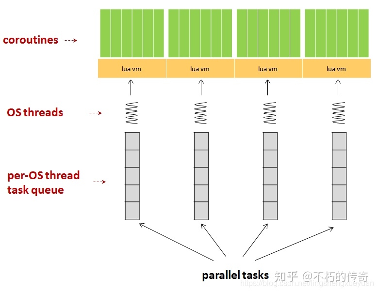

# Skynet总结

## 架构

1. 每一个`socket`对应一个`lua vm`和一个`per client mq`
2. 有一个`socket thread`轮询所有的`socket`，收到信息后，打包发送到`per client mq`中
3. 将`per client mq`挂到`global message queue`的尾部
4. `worker threads`从`global message queue`头部开始，获取每个`client`对应的消息队列
5. 处理获取到的消息队列，用完放回`global message queue`

## 多线程

## 任务调度

1. 每个`OS thread`会创建一个`lua vm`
2. 每个`lua vm`会创建海量的`coroutine`

**注意：**

- 不支持任务跨`lua vm`迁移，coroutine是`lua vm`内部的数据结构，两个`lua vm`之间的coroutine无法通用。

## 消息

## 集群

## 参考

- [skynet的总体架构以及任务调度分析](https://zhuanlan.zhihu.com/p/339599579)
- [skynet简介](https://blog.csdn.net/o8413897/article/details/79044437)
- [Skynet 设计综述](https://blog.codingnow.com/2012/09/the_design_of_skynet.html)

