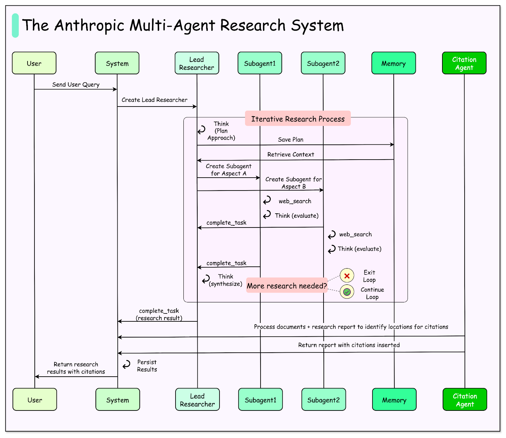
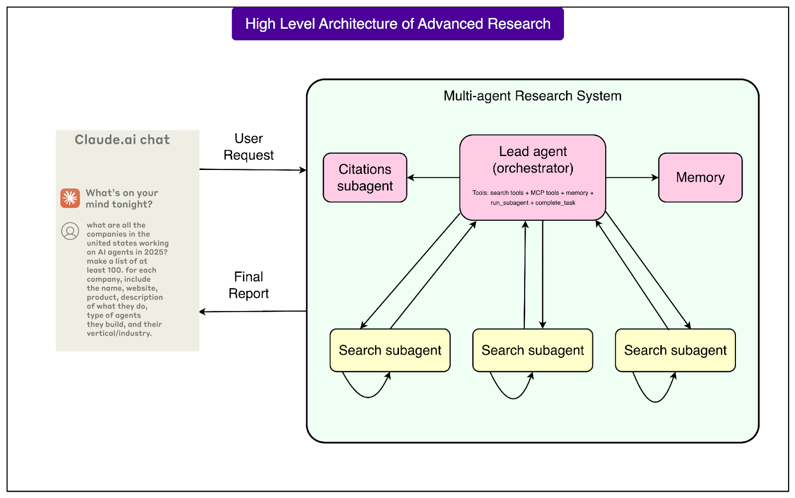
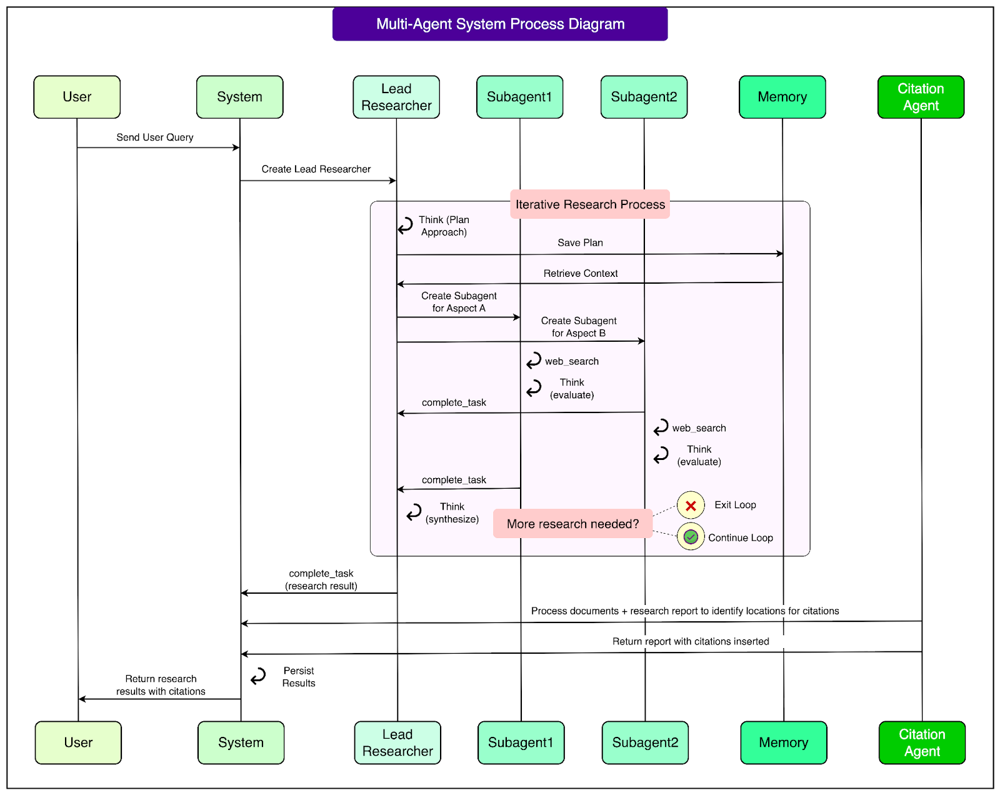

# AI

[TOC]

## Example 1: Anthropic's Multi-Agent Research System

**High-Level Design:**

## References

[1] [How Anthropic Built a Multi-Agent Research System](https://blog.bytebytego.com/p/how-anthropic-built-a-multi-agent)