# API Design

[TOC]


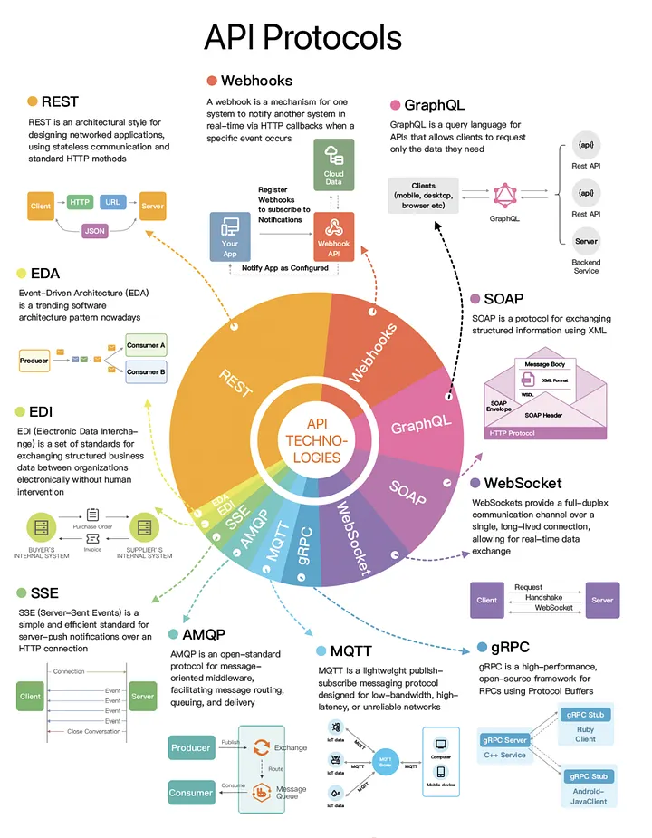

## Intro

### API Architecture Styles

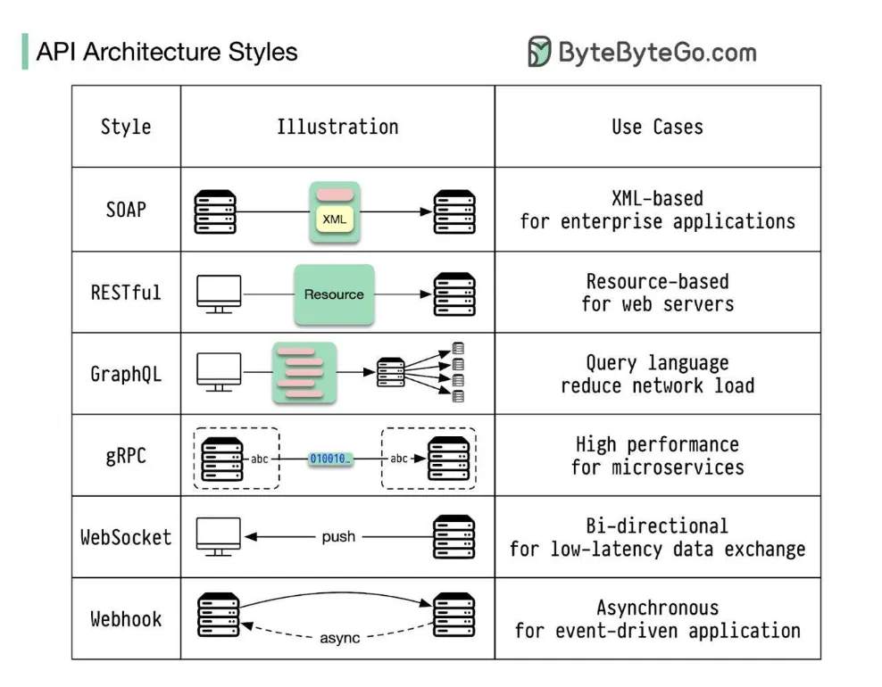

Different API architecture styles have their unique characteristics and best-use scenarios. The common API types:

- Restful API
- JSON API
- WebSocket API
- SOAP API
- GraphQL API
- gRPC API
- ...

### API Versioning

API Versioning is the practice of creating different versions of an API to ensure that existing users can still access the features they rely on while allowing for changes and improvements in new versions.

Advantages:

- Old clients can continue to use the old version without issues.
- It's different versions can have distinct features or behaviors, making it easy to manage changes.
- Users can choose when to upgrade to a new version based on their needs.

Disadvantages:

- Supporting multiple versions can lead to more work for developers.
- It is managing different versions can complicate the codebase.
- Users may be unsure which version to use.

### API Evolution

API Evolution is the practice of making changes to an API without creating new versions. This means updating the existing API while trying to maintain compatibility for current users.

Advantages:

- Users always interact with a single version, reducing confusion.
- There is no need to manage multiple versions, simplifying development.
- Updates can be rolled out more easily and frequently.

Disadvantages:

- It changes might by mistake disrupt existing users.
- Users must adapt to changes without the option to stick to an old version.
- If something goes wrong, reverting to an old state can be difficult.

### API Integration

The process of connection two or more software applications or processes using APIs is referred to as API integration.

Benefits of API integration:

- Efficiency
- Scalability
- Cost Savings
- Reduced Errors

### API Key Security

API Keys are special strings that identify an entity without a biometric measure.

#### API Key for User Authentication

How API Key Authentication works:

1. The API Key is included in the HTTP header, query parameter, or request body.
2. The API server checks if the API Key is valid and associated with an active account.
3. If the API Key is correct, access is granted to the requested API resources.

For example:

```http
curl -H "x-api-key: YOUR_API_KEY" https://api.example.com/user/profile
```

#### API Key for User Authorization

API Keys can be configured with different permission levels, such as:

- Read-Only Access: the API Key allows fetching data but restricts modification.
- Write Access: The API Key permits data updates but restricts administrative changes.
- Admin Access: Full access to API resources, including sensitive operations.

For example:

```http
curl -X GET "https://api.twitter.com/2/tweets?ids=123456" \
     -H "Authorization: Bearer YOUR_API_KEY"
```

#### API Key-Based Access Control Mechanisms

Since API Keys lack built-in security controls like OAuth, access control mechanisms are used to enhance security:

- IP Address Restriction
- Domain or Referrer Restriction
- Usage Limits and Quotas
- Expiration and Rotation

For example:

```http
curl -X GET "https://maps.googleapis.com/maps/api/geocode/json?address=New+York&key=YOUR_API_KEY" \ 
--referer "https://www.bedpage.com/"
```

### API Performance

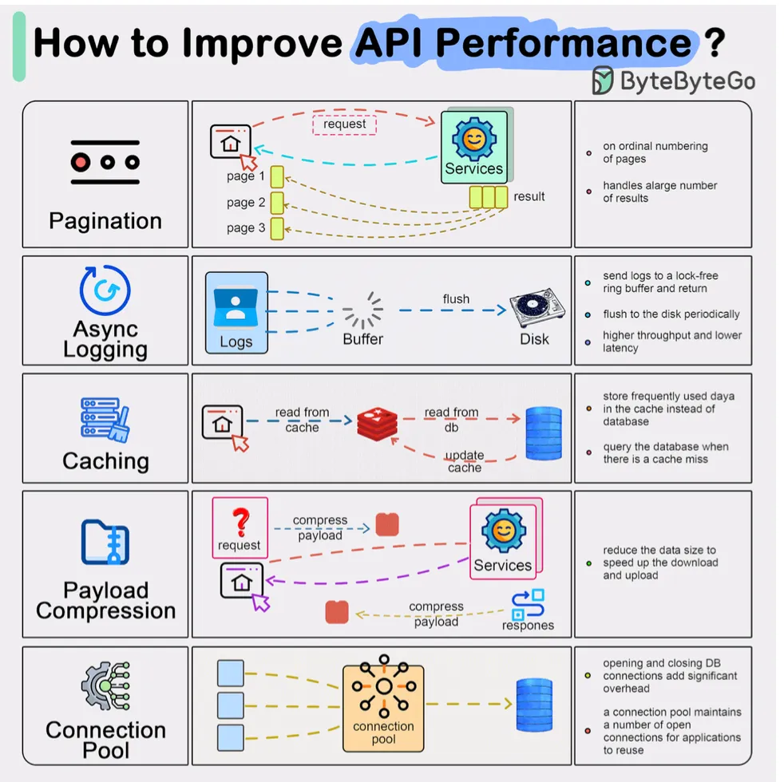

### API Security

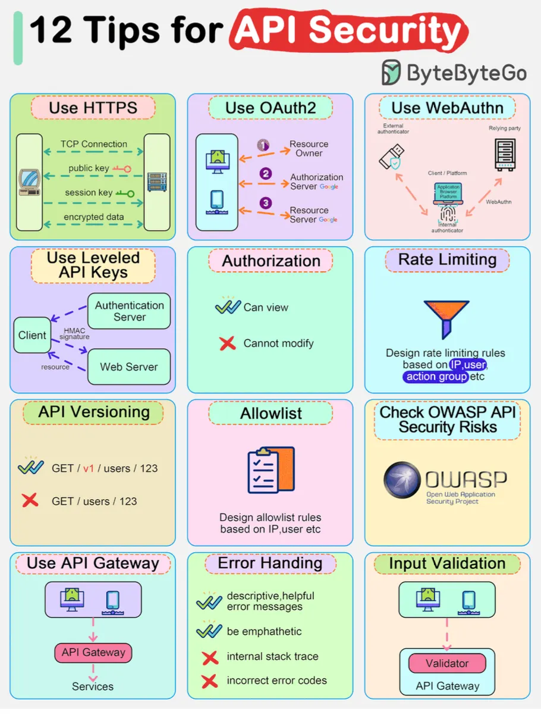

### API Monitoring

API Monitoring is a process that monitors the activity, output, and performance of an API based on Environment, Time, regions, etc.

Benefits of API Monitoring:

- Faster Issue Identification
- Ensures Reliability
- Improve Performance
- Business Growth
- Scalable

### API Testing

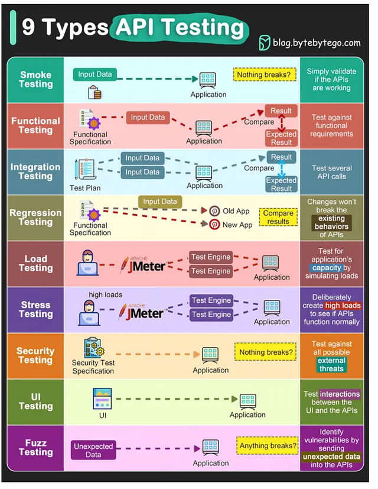

Key Reasons for API Testing:

1. Core Functionality
2. Scalability
3. Security
4. Faster Regression Cycles
5. Cross-Platform Compatibility

### API Contract

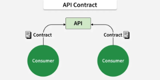

Here are some key reasons why API contracts are important:

1. Clarity & Consistency
   - Clear Specs
   - Consistency
2. Parallel Development
   - Team Collaboration
   - Fewer Dependencies
3. Interoperability
   - Standardization
   - Easy Integration
4. Testing & Validation
   - Automated Testing
   - Mocking
5. Error Handling & Reliability
   - Defined Errors
   - Better Reliability


## REST API

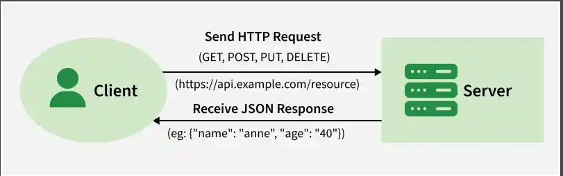

A REST API(Representational State Transfer API) enables communication between client and server over HTTP. It exchanges data typically in JSON format using standard web protocols.

### Feature

- Stateless
- Client-Server
- Cacheable
- Uniform Interface
- Layered System

### Status Code

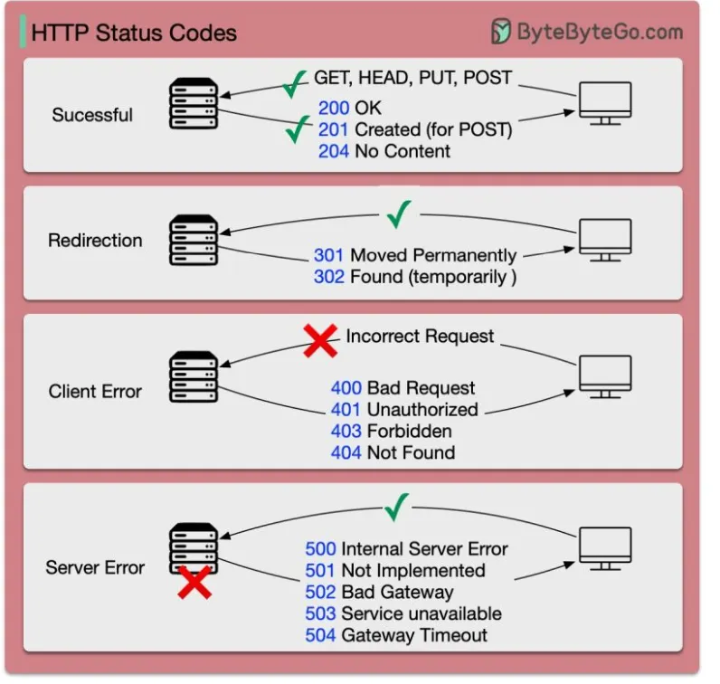

### Method

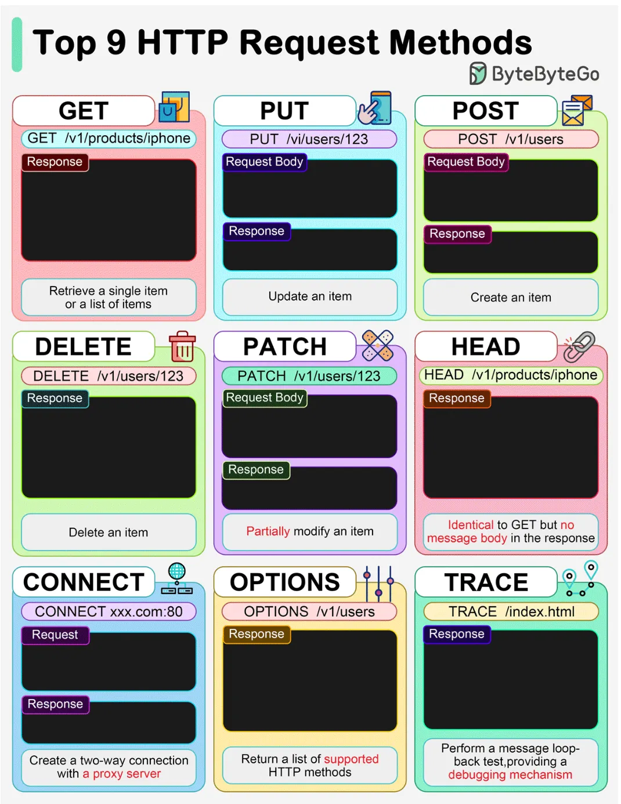

- GET

  The HTTP GET method retrieves a resource:

  ```http
  GET /users/123
  ```

- PUT

  The HTTP PUT is used to update or create a resource. It sends the complete resource in the request body and replaces the existing one at the specified URL:

  ```http
  PUT /users/123
  { 
    "name": "Anne", 
    "email": "gfg@example.com"
  }
  ```

- POST

  The HTTP POST method creates new resources:

  ```http
  POST /users
  { 
    "name": "Anne", 
    "email": "gfg@example.com"
  }
  ```

- DELETE

  It is used to delete a resource identified by a URI:

  ```http
  DELETE /users/123
  ```
  
- PATCH

  The HTTP PATCH is used to partially update a resource. It sends only the fields to be modified, instead of replacing the entire resource:

  ```http
  PATCH /users/123
  { 
    "email": "new.email@example.com" 
  }
  ```
  
- HEAD

  TODO

- CONNECT

  TODO

- OPTIONS

  TODO

- TRACE

  TODO

### Idempotency

In REST APIs, idempotence means that application of the same operation more than once changes nothing except for the first iteration.

**Safe Mothods** are naturally idempotent since they do not change server state of the resource. Include:

Idempotent methods:

- GET
- PUT
- DELETE

Non-idempotent methods:

- PATCH
- POST

### Auth

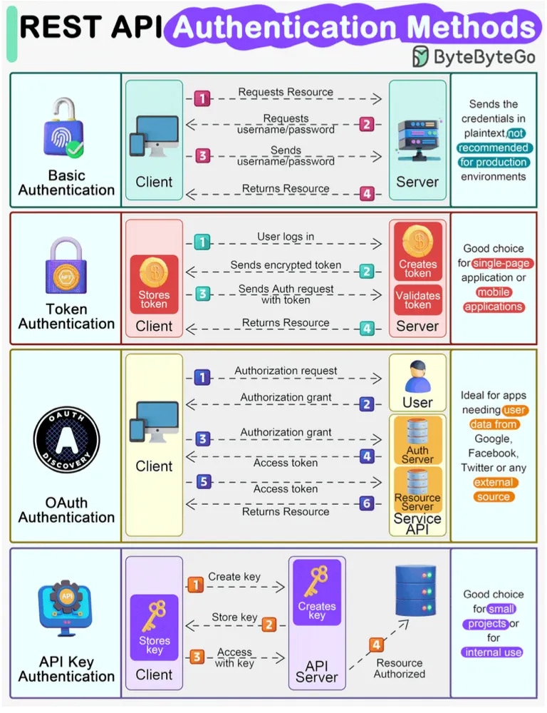

### Rules

- REST is based on the resource or noun instead of action or verb based

  For example:

  ```http
   /api/users 	 # good
   /api?type=users # bad(not end with a noun)
  ```

- HTTP verbs(GET, PUT, POST, DELETE, ...) are used to identify the action.

- A web application should be organized into resources like users and then uses HTTP verbs to modify those resources.

- Always use plurals in URL to keep an API URI consistent throughout the application.

- Send a proper HTTP code to indicate a success or error status.


## WebSocket API

WebSocket API allows us to create web sockets, it's capable of full-duplex communication using a TCP connection.

### Feature

- Bidirectional means data can be sent and received by both sides client-side as well as the server-side.
- Use of full-duplex model for communication.
- It uses a single TCP connection for communication between the client and server.
- Mainly used in real-time applications.
- Fast transmission of data can be achieved using web sockets.
- Scaling is possible but only vertically.


## SOAP API

SOAP, or Simple Object Access Protocol, is a messaging protocol. It allows the exchange of structural information without any platform. Soap uses the XML data format due to its complexity. It is mostly used for complex systems with strict standards ensuring security and reliability.


## GraphQL API

GraphQL consists of several core components that define how data is structured, queried, and modified in an API. Include:

- Schema

  It defines the data types that can be queried and their relationships. Schemas has two main types:

  1. Queries(for retrieving data)
  2. Mutations(for modifying data)

- Types

  GraphQL defines custom types to define the structure of data. There are two main types of type:

  1. Scalar Types
  2. Object Types

- Queries

  It is used to retrieve data from a GraphQL server.

- Mutations

  It is used to modify data on the server.

### Advantage

- Efficient Data Fetching
- Single Endpoint
- Strongly Typed Schema
- Reduced Network Requests
- Better Developer Experience


## gRPC API

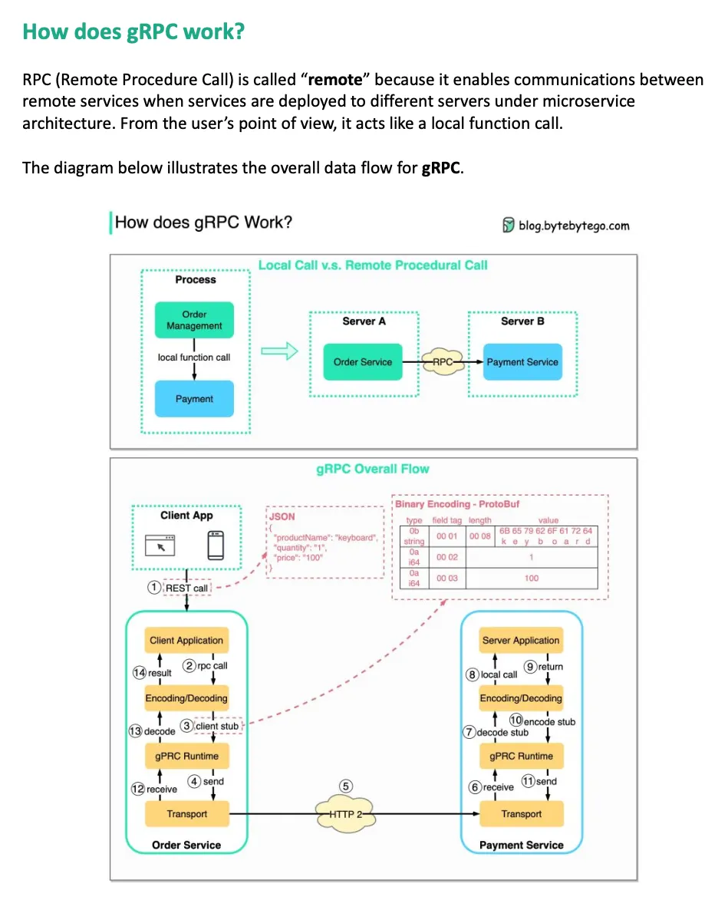

### Feature

- Cross-Language Support
- Load Balancing
- Pluggable Authentication
- Error Handling
- Retries and Timeouts

### Architecture

The architecture of gRPC centres on Protocol Buffers' definition of service methods and messages. It's elements are high-level summarised here:

- Protocol Buffers let developers specify gRPC services and their approaches in `.proto` file.
- From these, gRPC instruments create client and server code `.proto` file in many languages, offering the required stubs and skeletons to run the services.
- Developers define the behaviour of the RPC methods and extend the created server classes, therefore implementing the server-side logic.
- Client Stub: Created client code handles the underlying communication complexities and offers a stub clients use to call remote methods as though they were local.
- Transport Layer: gRPC leverages HTTP/2's characteristics for enhanced performance and efficiency as it moves messages between clients and servers.


## Summary

### API vs SDK

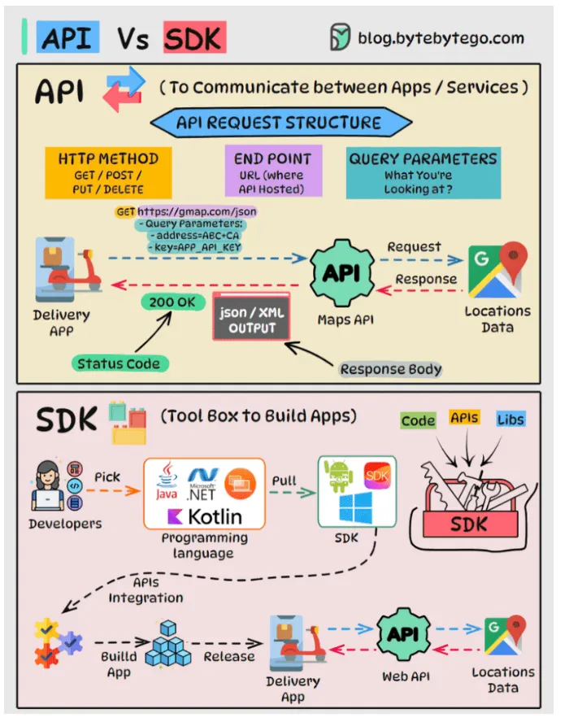

### RPC vs REST API

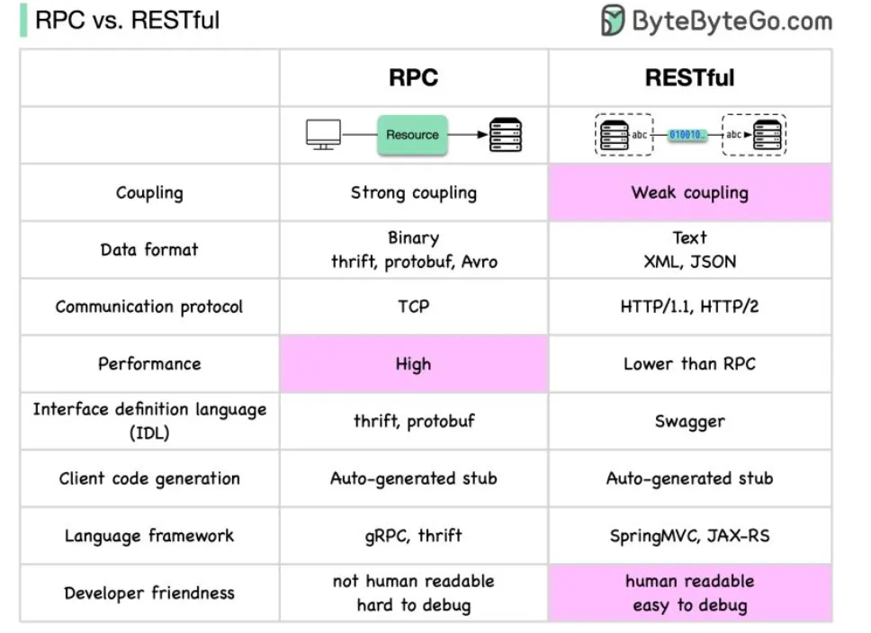

### GraphQL vs REST API

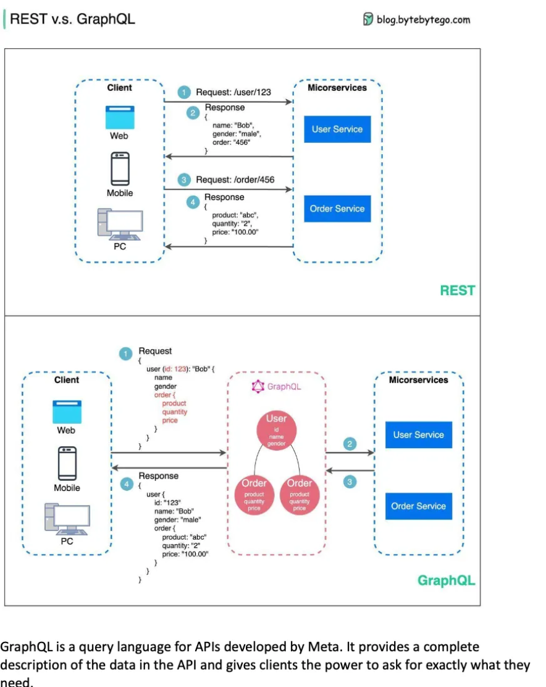

| Graph QL                                                     | REST API                                                     |
| ------------------------------------------------------------ | ------------------------------------------------------------ |
| GraphQL uses a single endpoint to perform all operations such as fetching, creating, updating, or deleting data. | REST APIs use multiple endpoints for different resources and operations. |
| In GraphQL, the client specifies exactly what data it needs in the query. | In REST, the server defines the structure of the response returned by each endpoint. |
| GraphQL reduces over-fetching and under-fetching of data by returning only the requested fields. | REST APIs may cause over-fetching or under-fetching, requiring multiple requests. |
| GraphQL supports real-time data updates using subscriptions. | REST APIs usually rely on polling or WebSockets for real-time updates. |
| GraphQL typically does not require versioning, as clients request only the needed fields. | REST APIs often use versioning(v1, v2, etc.) when the API changes. |
| GraphQL has a strongly typed schema, which clerly defines available data types and relationships. | REST APIs do not always enforce a strict schema structure.   |
| GraphQL is commonly used in modern applications with complex data requirements. | REST APIs are widely used and have a large, mature ecosystem of tools and libraries. |

### SOAP API vs REST API

| SOAP API                                                     | REST API                                                     |
| ------------------------------------------------------------ | ------------------------------------------------------------ |
| Relies on SOAP(Simple Object Access Protocol)                | Relies on REST(Representational State Transfer) architecture using HTTP. |
| Transport data in standard XML format.                       | Generally transports data in JSON. It it based on URI. Because REST follows a stateless model, REST does not enforce message format as XML or JSON et. |
| Because it is XML based and relies on SOAP, it works with WSDL | It works with GET, POST, PUT, DELETE                         |
| Works over HTTP, HTTPS, SMTP, XMPP                           | Works over HTTP and HTTPS                                    |
| Highly structured/typed                                      | Less structured -> less bulky data                           |
| Designed with large enterprise applications in mind          | Designed with mobile devices in mind                         |

### API Versioning vs API Evolution

| API Versioning                                               | API Evolution                                                |
| ------------------------------------------------------------ | ------------------------------------------------------------ |
| In API Versioning multiple versions of an API                | In API Evolution single version with updates                 |
| It's higher due to version management and routing            | It's lower fewer conditions to handle                        |
| API Versioning is lower, as changes can be isolated in new versions | API Evolution higher, since changes may disrupt current functionality |
| Higher effort to implement and manage multiple versions      | Lower effort easy to implement gradual changes               |
| It is less frequent major changes require new versions       | It more frequent continuous updates can be deployed          |
| It can be incorporated in new versions based on specific user needs | Immediate feedback can affect ongoing development            |
| Needs testing for each version to ensure compatibility       | Focused testing for the single version                       |

### API Key Security vs OAuth Security

| Feature                         | API Key                                                      | OAuth                                                        |
| ------------------------------- | ------------------------------------------------------------ | ------------------------------------------------------------ |
| Definition                      | A unique string assigned to users for API authentication.    | A token-based authentication and authorization framework.    |
| Authentication vs Authorization | Provides authentication only, allowing access to the system but not defining roles. | Manages both authentication and authorization, allowing role-based access control. |
| Security Level                  | Less secure--if an API Key is exposed, it can be used indefinitely. | More secure--OAuth tokens are session based and expire after a set duration. |
| Vulnerability                   | Prone to Man-in-the-Middle(MITM) attacks, API key leakage, and unauthorized usage. | Reduces risks by generating short-lived tokens and requiring reauthentication. |
| Usage                           | Sent with each request in an Authorization Header, Query String, or Body Data. | Uses tokens instead of credentials, reducing exposure. Tokens expire after a session. |
| Token Expiry                    | No expiration--an API Key remains valid until revoked manually. | Expires after each session, requiring reauthentication for continued access. |
| Access Control                  | Lacks granular access control--either grants full access or no access. | Allows role-based access control(RBAC), restricting access to specific resources. |
| Best Used For                   | Simple applications where security is not a major concern.   | Secure an scalable applications requiring user-specific access control. |
| Risk of Unauthorized Access     | High--stolen API Keys grant full access until revoked.       | Low--tokens expire after a session, and multi-factor authentication can be added. |
| Performance                     | Fast and lightweight, since it does not require token management. | Slightly slower, due to authentication flow but significantly more secure. |

### Compare API Architectural

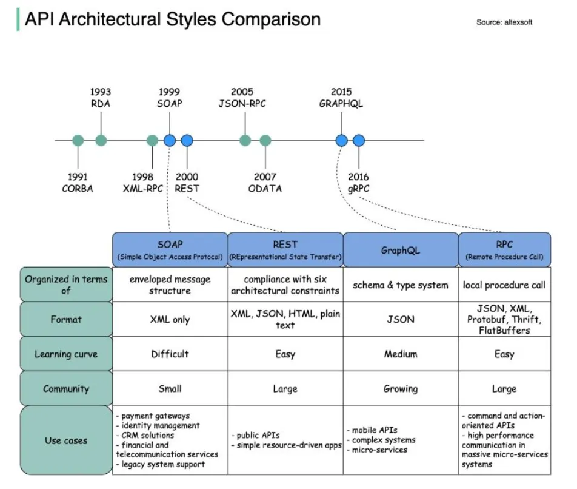

### Why are idempotent APIs important?

- Reliability

  For systems that may exhibit network issues or retries, idempotent APIs guarantee that repeated requests do not cause different response.

- Consistency

  Idempotent APIs do not alter the state of the server which avoids the occurrence of undesired impacts or alterations to data.

- Predictability

  The advantage of idempotent APIs is the simpler concept for developers to grasp and apply because the responses of API calls do not change if the same request is made multiple times.

- Robustness

  Idempotent APIs also make the system more reliable since only the intended modification is made without repetition or mistakes hence making it friendly to users.

- Simplified Client Logic

  Idempotent APIs reduce the complexity of client logic since the clients do not have to handle errors or changes in the state.

- Improved User Experience

  It makes the APIs more user friendly because operations are guaranteed to complete regardless of network conditions or retries.


## References

[1] [System Design CheatSheet for Interview](https://medium.com/javarevisited/system-design-cheatsheet-4607e716db5a)
