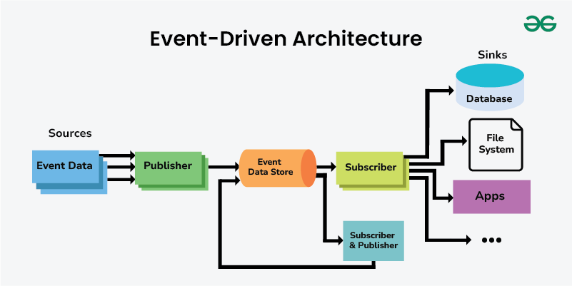
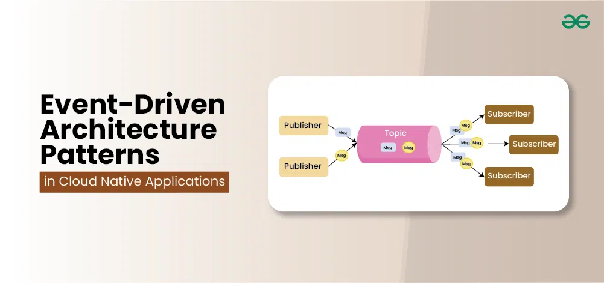
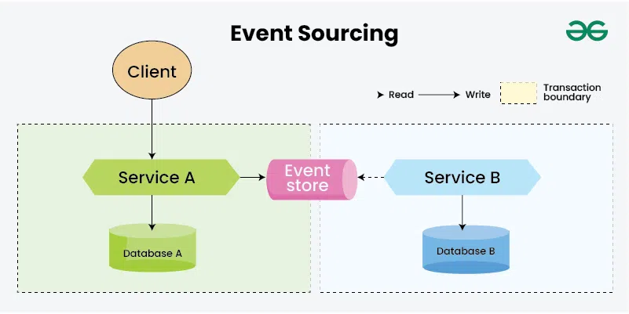
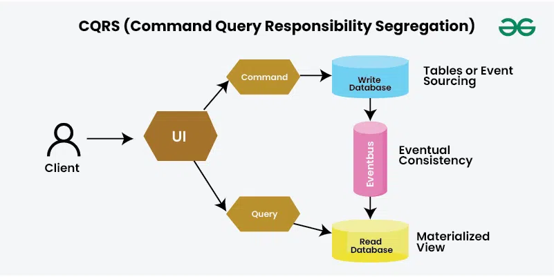
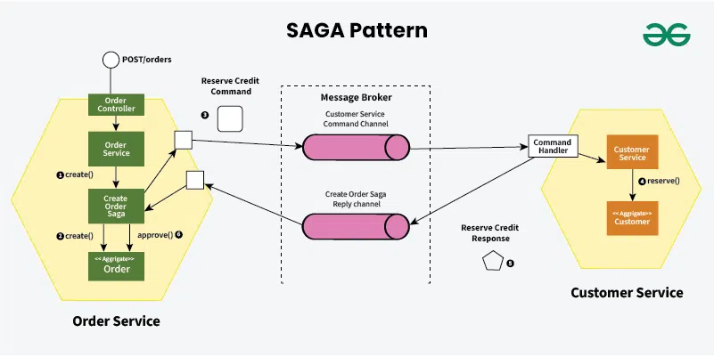
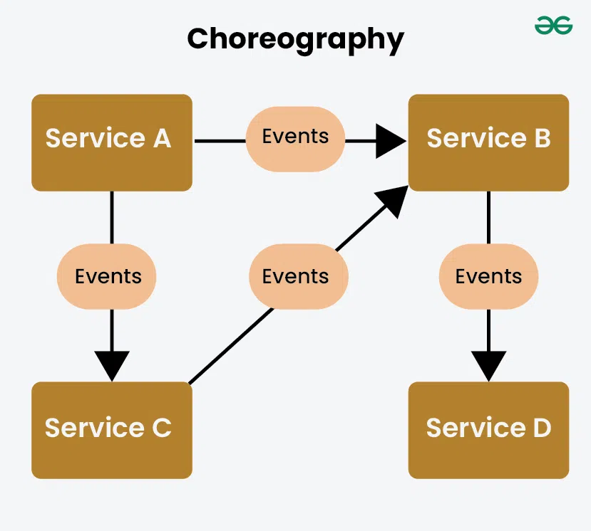
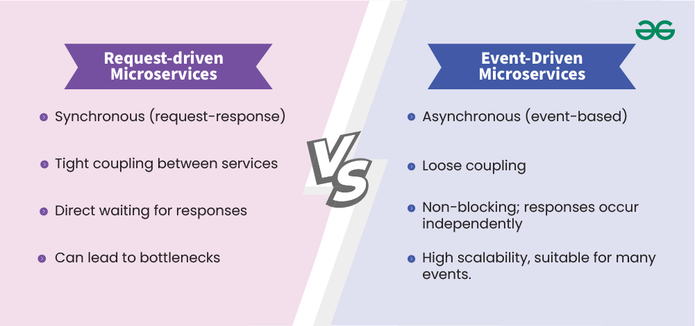

# Architectural

[TOC]

## Architectural Design

### MVC Pattern

The MVC pattern is used when there are multiple ways to view and interact with data. Also used when the future requirements for interaction and presentation of data are unknown.

By separates presentation and interaction from the system data. The system is structured into three logical components that interact with each other. The **Model** component manages the system data and associated operations on that data. The **View** component defines and manages how the data is presented to the user. The **Controller** component manages user interaction (e.g., key presses, mouse clicks, etc) and passes these interactions to the view and the Model.

*Notic*:

- MVC pattern allows the data to change independently of its representation and vice versa. Supports presentation of the same data in different ways with changes made in one representation shown in all of them.
- It can involve additional code and code complexity when the data model and interactions are simple.

### Layered Architecture Pattern

The Layered Architecture pattern is used when building new facilities on top of existing systems; when the development is spread across several teams with each responsibility for a layer of functionality; when there is a requirement for multi-level security.

By organizing the system into layers with related functionality associated with each layer. A layer provides services to the layer above it, so the lowest-level layers represent core services that are likely to be used throughout the system.

*Notice*:

- Layer Architecture Pattern allows replacement of entire layers so long as the interface is maintained. Redundant facilities (e.g., authentication) can be provided in each layer to increase the dependability of the system.
- In practice, providing a clean separation between layers is often difficult and a high-level layer may have to interact directly with lower-level layers rather than through the layer immediately below it. Performance can be a problem because of multiple levels of interpretation of a service request as it is processed at each layer.

### Repository Architecture Pattern

The Repository Architecture Pattern is used when you have a system in which large volumes of information are generated that have to be stored for a long time. You may also use it in data-driven systems where the inclusion of data in the repository triggers an action or tool.

All data in a system is managed in a central repository that is accessible to all system components. Components do not interact directly, only through the repository.

*Notice*:

- Components can be independent--they do not need to know of the existence of other components. Changes made by one component can be propagated to all components. All data can be managed consistently (e.g., backups done at the same time) as it is all in one place.
- The repository is a single point of failure, so problems in the repository affect the whole system. May be inefficiencies in organizing all communication through the repository. Distributing the repository across several computers may be difficult.

### Client-Server Architecture

The Client-Server Architecture is used when data in a shared database to be accessed from a range of locations. Because servers can be replicated, may be used when the load on a system is variable.

In a client-server architecture, the functionality of the system is organized into services, with each service delivered from a separate server. Clients are users of these services and access servers to make use of them.

*Notice*:

- The principal advantage of this model is that servers can be distributed across a network. General functionality (e.g., a printing service) can be available to all clients and does not need to be implemented by all services.
- Each service is a single point of failure so susceptible to denial of service attacks or server failure. Performance may be unpredictable because it depends on the network as well as the system. May be management problems if servers are owned by different organizations.

### Pipe And Filter Architecture

The Pipe And Filter Architecture Pattern is commonly used in data processing applications (both batch- and transaction-based) where inputs are processed in separate stages to generate related outputs.

The processing of the data in a system is organized so that each processing component (filter) is discrete and carries out one type of data transformation. The data follows (as in a pipe) from one component to another for processing.

*Notice*:

- The Pipe And Filter Architecture is easy to understand and supports transformation reuse.  Workflow style matches the structure of many business processes. Evolution by adding transformations is straightforward. Can be implemented as either a sequential or concurrent system.
- The format for data transfer has to be agreed upon between communicating transformations. Each transformation must parse its input and unparse its output tp the agreed form. This increases system overhead and may mean that it is impossible to reuse functional transformations that use incompatible data structures.

## Event-Driven Architecture(EDA)

Event-Driven Architecture(EDA) is a software design approach where system components communicate by producing and responding to events, such as user actions or system state changes.

### Importance

Event-Driven Architecture(EDA) holds significant importance in system design for several reasons:

- Flexibility and Responsiveness
- Scalability
- Real-time Processing

### Design Pattern

Design patterns for Event-Driven APIs in system design provide structured approaches to address common challenges and optimize the implementation of event-driven architectures. Here are several key design patterns relevant to Event-Driven APIs:

- Publish-Subscribe

- Event Sourcing

  

- CQRS(Command Query Responsibility Segregation)

  

- Saga Pattern

  

- Event-Driven Choreography

  

- Event Collaboration

- Event Versioning

- Event Mesh

- Event-Driven Microservices

### Error Handling

Effective error handling in Event-Driven Architecture(EDA) is crucial for ensuring system reliability, scalability, and data integrity. Here are some key strategies for managing errors in an EDA system:

1. Retry Mechanism
   - Automatic Retries
   - Exponential Backoff
2. Dead-Letter Queues(DLQ)
   - Unprocessable Events Handling
   - Manual Review and Intervention
3. Idempotency
   - Idempotent Event Handlers
   - Unique Event Identifiers
4. Circuit Breakers
   - Failure Isolation
   - Graceful Degradation
5. Event Logging and Monitoring
   - Comprehensive Logging
   - Real-Time Monitoring

### Use Case

Event-Driven Architecture(EDA) is a great choice in below scenarios:

- Real-Time Applications
- Scalability Needs
- Complex Event Processing
- Integration of Diverse Systems

### Challenge

Event-Driven Architecture(EDA) has a few key challenges:

- Increased Complexity
- Event Order and Consistency
- Debugging and Tracing
- Event Latency

## Microservice Architecture

Microservice architecture is an approach to system design where a large application is built as a collection of small, loosely coupled, and independently deployable services. Each service, known as a microservice, focuses on a specific business function and can be developed, deployed, and scaled independently of otehr services.

### APIs

APIs (Application Programming Interfaces) are crucial in microservice architectures for several reasons:

- Communication
- Decoupling
- Scalability
- Interoperability
- Reusability
- Evolvability

### Request-Driven VS Event-Driven Microservices

| Feature             | Request-driven Microservices    | Event-driven microservices                   |
| ------------------- | ------------------------------- | -------------------------------------------- |
| Communication Model | Synchronous(request-response)   | Asynchronous(event-based)                    |
| Coupling            | Tight coupling between services | Loose coupling                               |
| Response Time       | Direct waiting for responses    | Non-blocking; responses occur independently  |
| Scalability         | Can lead to bottlenecks         | High scalability, suitable for many events   |
| Complexity          | Generally simpler to implement  | More complex due to event management         |
| Debugging           | Easier to trace request flows   | Harder to debug; requires tracking events    |
| Use Cases           | APIs, payment processing        | Order management, notifications              |
| Data Consistency    | Easier to ensure consistency    | Requires strategies for eventual consistency |

Below are the use cases of request-driven microservices:

- User Authentication
- Payment Processing
- APIs for Web Applications
- CRUD Operations

Below are the use cases of event-driven microservices:

- Order Processing
- Notification Systems
- Real-time Analytics
- Microservices Communication

## Reference

[1] Ian Sommerville. SOFTWARE ENGINEERING . 9th Edition

[2] [Event-Driven APIs in Microservice Architectures](https://www.geeksforgeeks.org/system-design/event-driven-apis-in-microservice-architectures/)