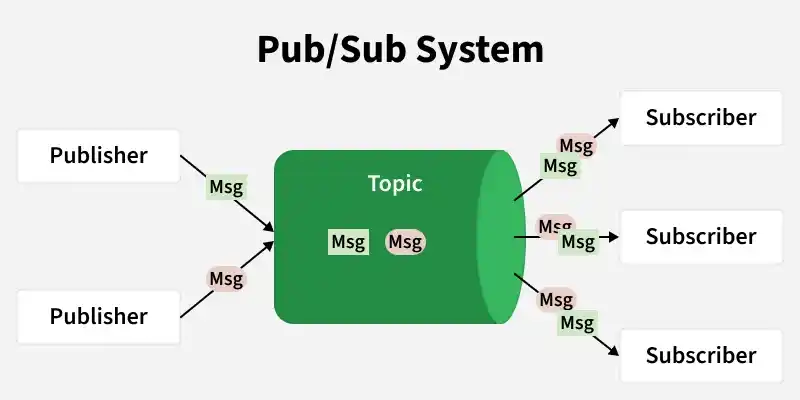
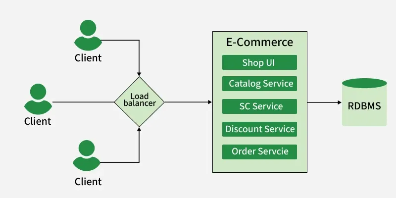
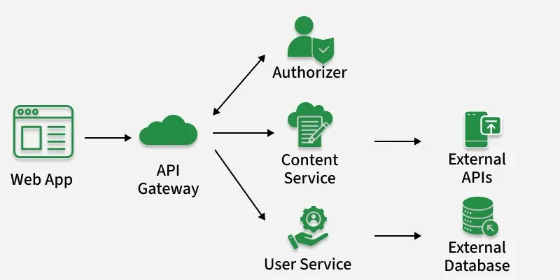
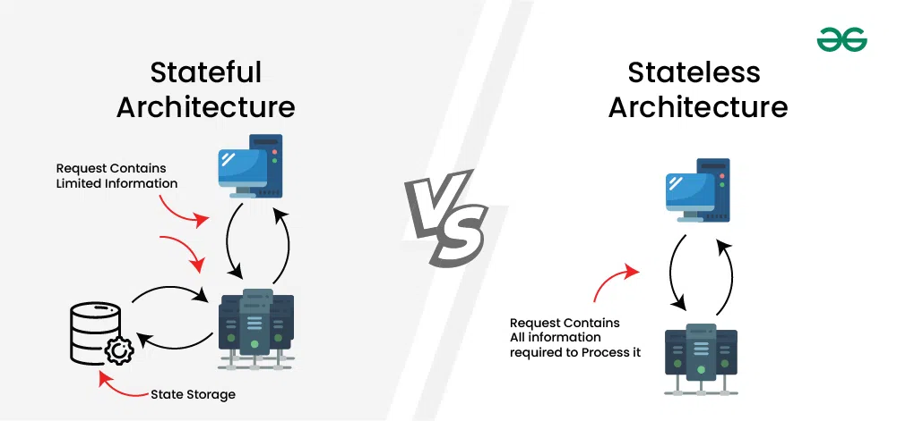
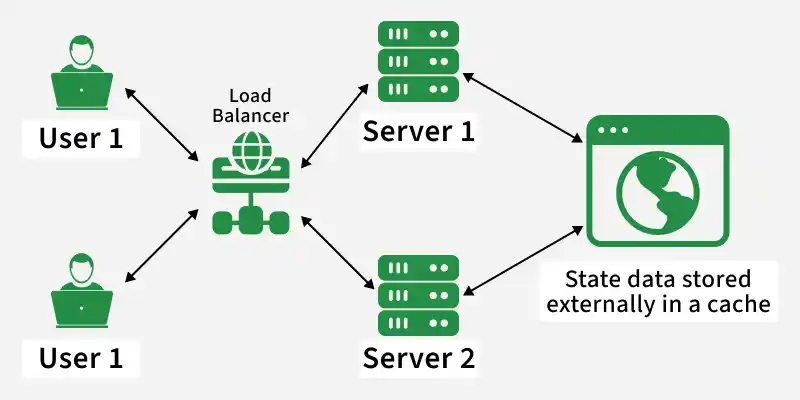
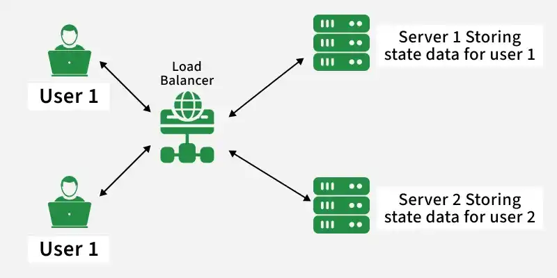
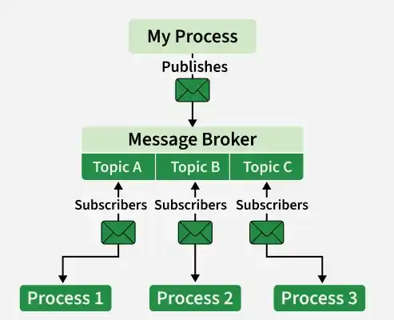

# Architectural

[TOC]

## Architectural Design

### MVC Pattern

The MVC pattern is used when there are multiple ways to view and interact with data. Also used when the future requirements for interaction and presentation of data are unknown.

By separating presentation and interaction from the system data. The system is structured into three logical components that interact with each other. The **Model** component manages the system data and associated operations on that data. The **View** component defines and manages how the data is presented to the user. The **Controller** component manages user interaction (e.g., key presses, mouse clicks, etc) and passes these interactions to the view and the Model.

*Notic*:

- The MVC pattern allows the data to change independently of its representation and vice versa. Supports presentation of the same data in different ways, with changes made in one representation shown in all of them.
- It can involve additional code and code complexity when the data model and interactions are simple.

### Layered Architecture Pattern

The Layered Architecture pattern is used when building new facilities on top of existing systems; when the development is spread across several teams, with each responsibility for a layer of functionality; and when there is a requirement for multi-level security.

By organizing the system into layers with related functionality associated with each layer. A layer provides services to the layer above it, so the lowest-level layers represent core services that are likely to be used throughout the system.

*Notice*:

- Layer Architecture Pattern allows replacement of entire layers so long as the interface is maintained. Redundant facilities (e.g., authentication) can be provided in each layer to increase the dependability of the system.
- In practice, providing a clean separation between layers is often difficult, and a high-level layer may have to interact directly with lower-level layers rather than through the layer immediately below it. Performance can be a problem because of multiple levels of interpretation of a service request as it is processed at each layer.

### Repository Architecture Pattern

The Repository Architecture Pattern is used when you have a system in which large volumes of information are generated that have to be stored for a long time. You may also use it in data-driven systems where the inclusion of data in the repository triggers an action or tool.

All data in a system is managed in a central repository that is accessible to all system components. Components do not interact directly, only through the repository.

*Notice*:

- Components can be independent--they do not need to know of the existence of other components. Changes made by one component can be propagated to all components. All data can be managed consistently (e.g., backups done at the same time) as it is all in one place.
- The repository is a single point of failure, so problems in the repository affect the whole system. May be inefficiencies in organizing all communication through the repository. Distributing the repository across several computers may be difficult.

### Client-Server Architecture

The Client-Server Architecture is used when data in a shared database is accessed from a range of locations. Because servers can be replicated, they may be used when the load on a system is variable.

In a client-server architecture, the functionality of the system is organized into services, with each service delivered from a separate server. Clients are users of these services and access servers to make use of them.

*Notice*:

- The principal advantage of this model is that servers can be distributed across a network. General functionality (e.g., a printing service) can be available to all clients and does not need to be implemented by all services.
- Each service is a single point of failure so susceptible to denial of service attacks or server failure. Performance may be unpredictable because it depends on the network as well as the system. May be management problems if servers are owned by different organizations.

### Pipe And Filter Architecture

The Pipe And Filter Architecture Pattern is commonly used in data processing applications (both batch- and transaction-based) where inputs are processed in separate stages to generate related outputs.

The processing of the data in a system is organized so that each processing component (filter) is discrete and carries out one type of data transformation. The data follows (as in a pipe) from one component to another for processing.

*Notice*:

- The Pipe and Filter Architecture is easy to understand and supports transformation reuse.  Workflow style matches the structure of many business processes. Evolution by adding transformations is straightforward. Can be implemented as either a sequential or concurrent system.
- The format for data transfer has to be agreed upon between communicating transformations. Each transformation must parse its input and unparse its output to the agreed form. This increases system overhead and may mean that it is impossible to reuse functional transformations that use incompatible data structures.

## Event-Driven Architecture (EDA)

`Event-Driven Architecture(EDA)` is a software design approach where system components communicate by producing and responding to events, such as user actions or system state changes.

`Event-Driven Architecture(EDA)` holds significant importance in system design for several reasons:

- Flexibility and Responsiveness
- Scalability
- Real-time Processing

### EDA Design Pattern

Design patterns for Event-Driven APIs in system design provide structured approaches to address common challenges and optimize the implementation of event-driven architectures. Here are several key design patterns relevant to Event-Driven APIs:

- Publish-Subscribe

  

  This pattern involves producers (publishers) broadcasting events to multiple consumers (subscribers) interested in those events. It promotes loose coupling, as publishers and subscribers are unaware of each other's existence. Implementations often use a message broker to manage subscriptions and event delivery.

- Event Sourcing

  

  Event sourcing stores all changes as a sequence of events instead of just keeping the latest state. The current state of the system can be rebuilt anytime by replaying these events. This approach is useful in systems where tracking history and changes is important.

- CQRS(Command Query Responsibility Segregation)

  

  CQRS (Command Query Responsibility Segregation) separates operations that change data from those that read data. Commands are used to update the system, while queries are used to fetch information. This separation helps improve performance and flexibility in modern systems.

- Saga Pattern

  

  Saga is a pattern used to manage long-running transactions by breaking them into smaller steps. Each step is handled by a different service, and if something fails, previous steps can be undone using compensating actions. This helps maintain consistency across distributed systems.

- Event-Driven Choreography

  

  Choreography is a pattern where microservices work independently by reacting to events, without any central controller. Each service listens for events it is interested in and performs its own actions. This makes the system more flexible and loosely coupled.

- Event Collaboration

  This pattern emphasizes collaboration among services through shared events. Services emit events that other services might use to enrich their own behavior or data, fostering modularity and flexibility.

- Event Versioning

  Ensures compatibility between producers and consumers as event schemas evolve. Techniques such as schema evolution, backward compatibility, and versioned APIs help manage changes in event structure over time.

- Event-Driven Microservices

  Combines microservice architecture with event-driven patterns, emphasizing autonomous services that communicate through events. This approach enhances scalability, resilience, and agility by minimizing direct dependencies and promoting asynchronous communication.

### EDA Error Handling

Event-driven systems can encounter different types of errors that affect stability and performance. Understanding these errors helps in designing effective error-handling strategies. Here are some common types of errors encountered in event-driven systems:

1. Event Production Errors

   These occur when problems happen while creating or generating events in the system.

   - Data Validation Errors: Occur when the data used to generate an event is invalid or does not meet predefined criteria, such as missing fields or incorrect formats.
   - Timeouts: Happen when the event producer fails to generate an event within a specified time frame, often due to resource constraints or network delays.

2. Event Transmission Errors

   These happen while events are being sent from producers to consumers through channels.

   - Failures: Occur when events cannot be transmitted due to network issues, leading to event loss or delays.
   - Message Queue Overflows: Happen when the event queue exceeds its capacity, causing events to be lost or delayed.
   - Serialization/Deserialization Errors: Occur when events cannot be properly serialized (converted to a transmittable format) or deserialized (converted back to a usable format) due to data corruption or incompatible formats.

3. Event Consumption Errors

   These arise when issues occur while processing events on the consumer side.

   - Processing Failures: Happen when the event consumer encounters an error while processing an event, such as a database write failure or an unhandled exception.
   - Concurrency Issues: Occur when multiple consumers attempt to process the same event simultaneously, leading to race conditions or deadlocks.
   - Resource Limitations: Happen when event consumers run out of resources (e.g., memory, CPU) needed to process events, leading to crashes or degraded performance.

4. System-Level Errors

   These are broader issues that affect the overall system and its dependencies.

   - Dependency Failures: Occur when external systems or services that the event-driven system depends on fail, leading to unprocessed or delayed events.
   - Configuration Errors: Happen when incorrect or inconsistent configurations cause components to behave unexpectedly, leading to errors in event handling or routing.
   - Security Issues: Include unauthorized access or tampering with events, which can lead to data breaches or compromised system integrity.

5. Logical Errors

   These occur due to mistakes in the application logic or event flow design.

   - Business Logic Failures: Occur when the event handling logic does not align with the intended business rules, leading to incorrect or unexpected outcomes.
   - Event Looping: Happen when events trigger a loop of actions that unintentionally generate more events, causing infinite loops or resource exhaustion.

6. Event Ordering Errors

   These happen when the sequence or duplication of events is not handled correctly.

   - Out-of-Order Events: Occur when events are processed in the wrong sequence, leading to inconsistent state changes or data corruption.
   - Duplicate Events: Happen when the same event is processed multiple times, potentially leading to redundant or conflicting actions.

Effective error handling in Event-Driven Architecture(EDA) is crucial for ensuring system reliability, scalability, and data integrity. Here are some key strategies for managing errors in an EDA system:

1. Retry Mechanism
   - Automatic Retries
   
     Implement automatic retry logic for transient errors, such as network timeouts or temporary service unavailability. This allows the system to recover from momentary issues without manual intervention.
   
   - Exponential Backoff
   
     Use an exponential backoff strategy, where the retry interval increases progressively, to prevent overwhelming the system or dependent services.
   
2. Dead-Letter Queues(DLQ)
   - Unprocessable Events Handling
   
     Route events that cannot be processed after several attempts to a dead-letter queue. This isolates problematic events and prevents them from causing further disruptions in the system.
   
   - Manual Review and Intervention
   
     Allow for manual inspection and resolution of events in the DLQ to identify root causes and apply fixes before reprocessing.
   
3. Idempotency
   - Idempotent Event Handlers
   
     Design event consumers to be idempotent, meaning that processing the same event multiple times results in the same outcome. This prevents issues related to duplicate events or retries.
   
   - Unique Event Identifiers
   
     Use unique identifiers for events to detect and ignore duplicates, ensuring that only one instance of an event is processed.
   
4. Circuit Breakers
   - Failure Isolation
   
     Implement circuit breakers to temporarily halt event processing when a certain error threshold is reached. This prevents cascading failures and allows time for the system to recover.
   
   - Graceful Degradation
   
     Allow the system to degrade gracefully by providing fallback mechanisms, such as serving cached data or default responses when event processing fails.
   
5. Event Logging and Monitoring
   - Comprehensive Logging
   
     Log all events and associated errors in a centralized logging system. This provides visibility into the system’s behavior and helps in diagnosing and resolving issues.
   
   - Real-Time Monitoring
   
     Set up real-time monitoring and alerting for key metrics, such as event processing latency, error rates, and queue depths, to detect and respond to issues promptly.

## Microservice Architecture

Microservice architecture is an approach to system design where a large application is built as a collection of small, loosely coupled, and independently deployable services. Each service, known as a microservice, focuses on a specific business function and can be developed, deployed, and scaled independently of other services.

Advantages:

- Independent Development and Deployment
- Small Focused Team
- Small CodeBase
- Mix of Technologies
- Fault Isolation
- Scalability
- Data Isolation

Disadvantages:

- Complexity
- Testing
- Data Integrity
- Network Latency
- Versioning

### Tech Stack

### Design Pattern

- API Gateway Pattern

  [Gateway#API Gateway](#getway.md) pattern simplifies the client’s experience by hiding the complexities of multiple services behind one interface. It can also handle tasks like authentication, logging, and rate limiting, making it a crucial part of microservices architecture.

- Circuit Breaker Pattern

  In `circuit breaker pattern` If a service fails repeatedly, the circuit breaker trips, preventing further requests to that service. After a timeout period, it allows limited requests to test if the service is back online. This reduces the load on failing services and enhances system resilience.

- Saga Pattern

  `Saga pattern` is useful for managing complex business processes that span multiple services. Instead of treating the process as a single transaction, the saga breaks it down into smaller steps, each handled by different services.

  If one step fails, compensating actions are taken to reverse the previous steps. This way, you maintain data consistency across the system, even in the face of failures.

- Event Sourcing Pattern

  In `Event Sourcing Pattern`, Each event describes a change that occurred, allowing services to reconstruct the current state by replaying the event history. This provides a clear audit trail and simplifies data recovery in case of errors.

- API Composition Pattern

  A separate service (the composition service) collects responses from various services and combines them into a single response for the client. This reduces the need for clients to make multiple requests and simplifies their interaction with the system.

- CQRS Design Pattern

  `CQRS Design Pattern` divides the way data is handled into two parts: commands and queries. Commands are used to change data, like creating or updating records, while queries are used just to fetch data. This separation allows you to tailor each part for its specific purpose.

### APIs

APIs (Application Programming Interfaces) are crucial in microservice architectures for several reasons:

- Communication
- Decoupling
- Scalability
- Interoperability
- Reusability
- Evolvability

### Use Case

Below are the use cases of request-driven microservices:

- User Authentication
- Payment Processing
- APIs for Web Applications
- CRUD Operations

Below are the use cases of event-driven microservices:

- Order Processing
- Notification Systems
- Real-time Analytics
- Microservices Communication

### Data Consistency

Eventual Consistency between microservices refers to the concept that, in a distributed system where data is replicated across multiple microservices or databases, eventual consistency is maintained over time. This means that while updates to data may not be immediately reflected across all microservices, they will eventually converge to a consistent state.

To achieve eventual consistency between microservices, various strategies, and techniques can be used, such as:

1. Asynchronous Communication

   Microservices can communicate with each other asynchronously, allowing them to continue processing requests without waiting for a response. This can help reduce the impact of network delays on consistency.

2. Eventual Consistency Models

   Microservices can use eventual consistency models, where updates are propagated asynchronously and conflicts are resolved over time. This allows each microservice to maintain its own copy of the data and eventually converge to a consistent state.

3. Conflict Resolution

   Microservices can implement conflict resolution mechanisms to resolve conflicts that arise when multiple microservices update the same data concurrently. This can involve using timestamps, version numbers, or other techniques to determine the most recent update.

4. Compensating Transactions

   Microservices can use compensating transactions to undo or reverse the effects of a previous transaction if it is found to be in conflict with another transaction. This can help maintain consistency in the presence of conflicting updates.

### Data Sharing

### Key Transition Patterns From Monolith

Microservices architecture addresses the challenges of monoliths by breaking the application into smaller, independent services. Each service is responsible for a specific functionality and can be developed, deployed, and scaled independently.

### Best Practice

## Monolithic Architecture

Monolithic architecture is a software design methodology that combines all of an application's components into a single, inseparable unit.

## SOA Architecture

Service-Oriented Architecture (SOA) is a huge collection of services in which services communicate with each other.

### Roles

- **Service provider:** The service provider is the maintainer of the service and the organization that makes available one or more services for others to use. To advertise services, the provider can publish them in a registry, together with a service contract that specifies the nature of the service, how to use it, the requirements for the service, and the fees charged.
- **Service consumer:** The service consumer can locate the service metadata in the registry and develop the required client components to bind and use the service.

### Components

## Cell-Based Architecture

In cell-based architecture, there are multiple isolated instances of a workload, where each instance is known as a cell. There are three properties of a cell:

- Each cell is independent.
- A cell does not share the state with other cells.
- Each cell handles a subset of the overall traffic.

## Serverless Architecture

A serverless architecture is a cloud computing execution model that allows the cloud provider to dynamically control server provisioning and allocation. Since cloud providers handle the underlying infrastructure-including scaling, maintenance, and provisioning-developers may concentrate entirely on code with this method.

## Domain-Driven Design (DDD)

Domain-Driven Design (DDD) is an approach to software development that tackles domain complexity by emphasizing the importance of modeling the core domain and business logic and using those models as the foundation for software design.

At its heart, Domain-Driven Design is about:

- Placing the primary focus on the core domain.
- Basing complex designs on a model of the domain
- Building collaboration between technical and domain experts.

## Stateful and Stateless Architecture

Stateful architecture patterns are design approaches that focus on keeping track of information (state) within a system. These patterns are useful when you need to remember data across different interactions or transactions.

- Session State Management

  Stores user sessions (login, preferences, cart) on the server using memory, databases, or distributed caches.

- Database-Centric Architecture

  Keeps all state in the database; apps read/write to track state, common in monolithic or client-server apps.

- Stateful Replication

  Copies state across servers for high availability and fault tolerance using methods like primary-backup or quorum replication.

- Stateful Microservices

  Some microservices maintain state for sessions, caching, or workflows that require memory across interactions.

- Saga Pattern

  Manages long-running distributed transactions with compensating actions to ensure consistency across multiple services.

### Stateless Architecture

The server does not store any client session information between requests. Each request from the client is treated as an independent transaction.

- To maintain user sessions, stateless architectures often use techniques like JSON Web Tokens (JWT) or client-side cookies to store session data
- Designed to be more scalable and fault-tolerant because they do not require server resources to maintain client state.
- Examples include RESTful APIs, where each request contains all the necessary information for the server to process it independently.

### Stateful Architecture

The server maintains the state or session information of each client. This means that the server keeps track of the client's data and context throughout multiple interactions or requests.

- Often involve storing session data in server memory, databases, or other storage mechanisms.
- Examples include traditional web applications that use server-side sessions to store user data or shopping cart contents.

## Pub/Sub Architecture

The Pub/Sub model is a messaging pattern where a message broker routes messages from publishers to subscribers based on subscriptions, ensuring scalable and reliable delivery.

### Pub/Sub Service

This is the main messaging service that most users and applications choose. It provides:

- High Reliability: Ensures that messages are delivered consistently.
- Integrations: Supports a wide range of integrations with other services.
- Automatic Capacity Management: Handles scaling automatically based on demand.
- Data Replication: Synchronously replicates all data to at least two zones and offers best-effort replication to a third zone for added reliability.

### Pub/Sub Lite Service

This is a separate messaging service designed to be more cost-effective but comes with some trade-offs:

- Lower Reliability: Offers less reliability compared to the standard Pub/Sub service.
- Zonal or Regional Storage: Zonal Lite topics are stored in one zone, while Regional Lite topics replicate data to a second zone asynchronously.
- Pre-provisioning Required: You need to manage and provision your own storage and throughput capacity.
- Cost-Effective: Consider this option if keeping costs low is essential, and you can accept the lower reliability and some extra management tasks.

## Example 1: Reddit's Go Microservice Migration

### Datastore Solutions

Reddit’s engineering team came up with a solution they called “sister datastores”. They created three completely separate datastores that mirrored their production infrastructure (Postgres, Memcached, and Redis). The critical difference was that only the new Go microservice would write to these sister stores.

### Verification

Reddit’s engineering team added another verification layer. They ran all tap comparisons through actual CDC event consumers in the legacy Python service. This meant Python code would attempt to deserialize and process events written by Go. If Python could successfully read and handle these events, they knew cross-language compatibility was working. This end-to-end verification ensured not just that Go wrote correct data, but that the entire ecosystem could consume it.

## Summary

### System Integration

### Handling Growth and Failure

### Monolith vs Microservices vs Modular Monolith

### Microservices vs Monolithic Architecture

| Monolithic Architecture                                      | Microservice Architecture                                    |
| ------------------------------------------------------------ | ------------------------------------------------------------ |
| Single-tier architecture                                     | Multi-tier architecture                                      |
| Built as one large application with tightly coupled components | Composed of small, loosely coupled services components       |
| Deployed as a single unit                                    | Individual services can be deployed independently            |
| Horizontal scaling can be challenging                        | Easier to scale horizontally                                 |
| Development is simpler initially                             | Development is more complex due to multiple services         |
| Tehcnology stack choices are usually limited                 | Freedom to choose the best technology for each service       |
| Entire application may fail if a part fails                  | Individual services can fail without affecting others        |
| Easier to maintain due to its simplicity                     | Requires more effort to manage multiple services             |
| Less flexible as all components are tightly coupled          | More flexible as components can be developed, deployed, and scaled independently |
| Communication between components is faster                   | Communication may be slower due to network calls             |

### Microservices vs SOA

|                             SOA.                             |                             MSA.                             |
| :----------------------------------------------------------: | :----------------------------------------------------------: |
| It is a huge collection of services in which services communicate with each other. | It is a general architecture that takes a large number of services and break down into small services or shareable components. |
|      It works on a Share-as-much-as-possible approach.       |       It works on a Share-little-as-promise approach.        |
|            It is used to share the data storage.             |               It has independent data storage.               |
|               It supports multiple protocols.                |       It supports the HTTP/REST lightweight protocol.        |
| In service-oriented architecture, there is a multi-threaded system with more handle I/O. | In Micro service Architecture, there is a single-threaded with non-locking I/O handle. |
|          It has a common platform for all services.          | It has a platform like Nodejs is used, and an application server not used. |
|   It uses of containers is less popular with Docker Linux.   |                Its container works very well.                |
|               It uses a traditional database.                |              It uses a non-relational database.              |
|           It uses ESB services for communication.            | It does not use ESB services. It has a simple messaging system. |
|             It has a common governance standard.             |        Relaxed governance with more focus on people.         |

### Microservices vs Event-Driven Architecture

|             **Event-Driven Architecture (EDA)**              |                **Microservices Architecture**                |
| :----------------------------------------------------------: | :----------------------------------------------------------: |
|        Communication is asynchronous through events.         | Communication is mainly synchronous using APIs, but events can also be used. |
| Components are loosely coupled and interact through events.  | Services are independent but may still have some interdependencies. |
| Often uses event sourcing, which can make data management more complex. | Each service usually has its own database, giving more autonomy. |
| Scales efficiently with event streams and can handle traffic spikes well. | Individual services can be scaled independently based on demand. |
| Components can evolve independently with minimal impact on others. | Different teams can use different technologies for each service. |
|         Very suitable for real-time data processing.         | Can support real-time features but it is not always the main focus. |
|   Event handling and management can introduce complexity.    | Complexity comes from managing multiple services and their dependencies. |
| Commonly used for real-time analytics, IoT systems, and event-based applications. | Commonly used for large applications like e-commerce, banking, and CMS platforms. |
| Failure in one component usually does not directly impact others. | Failures are isolated but need careful handling to prevent cascading issues. |

### Orchestraion vs Choreography

### Event-Driven Microservices vs Request-Driven

| Feature             | Request-driven Microservices    | Event-driven microservices                   |
| ------------------- | ------------------------------- | -------------------------------------------- |
| Communication Model | Synchronous(request-response)   | Asynchronous(event-based)                    |
| Coupling            | Tight coupling between services | Loose coupling                               |
| Response Time       | Direct waiting for responses    | Non-blocking; responses occur independently  |
| Scalability         | Can lead to bottlenecks         | High scalability, suitable for many events   |
| Complexity          | Generally simpler to implement  | More complex due to event management         |
| Debugging           | Easier to trace request flows   | Harder to debug; requires tracking events    |
| Use Cases           | APIs, payment processing        | Order management, notifications              |
| Data Consistency    | Easier to ensure consistency    | Requires strategies for eventual consistency |

### Event-Driven vs Message-Driven Architecture

| **Event-Driven Architecture**                   |       **Message-Driven Architecture**        |
| ----------------------------------------------- | :------------------------------------------: |
| Focuses on reacting to events or state changes  | Focuses on message delivery between services |
| Loose coupling between components               |  Tight coupling between sender and receiver  |
| Supports real-time event reactions              |    Not always real-time, can have delays     |
| More complex due to event handling and sourcing |     Easier to track and manage messages      |
| Scales well for dynamic and flexible systems    |        Scales for high message volume        |
| Harder to guarantee event delivery              |          Strong delivery guarantees          |

### Batch vs Stream Processing

### Strategies To Share Data Between Services

### Migrating From Monolithic To Microservices Architecture

1. Begin by evaluating your current monolithic application. Identify its components and determine which parts can be shifted to microservices.
2. Break down the monolith into specific business functions. Each microservice should represent a distinct capability that aligns with your business needs.
3. Implement the Strangler Pattern to gradually replace parts of the monolithic application with microservices. This method allows for a smooth migration without a complete transition at once.
4. Establish clear APIs and contracts for your microservices. This ensures they can communicate effectively and interact seamlessly.
5. Create Continuous Integration and Continuous Deployment (CI/CD) pipelines. This automates testing and deployment, enabling faster and more reliable releases.
6. Introduce mechanisms for service discovery so that microservices can dynamically locate and communicate with each other, enhancing flexibility.
7. Set up centralized logging and monitoring tools. This provides insights into the performance of your microservices, helping to identify and resolve issues quickly.
8. Ensure consistent management of cross-cutting concerns, such as security and authentication, across all microservices to maintain system integrity.
9. Take an iterative approach to your microservices architecture. Continuously refine and expand your services based on feedback and changing requirements

### Serverless Architecture Security Best Practices

Here are some best practices to enhance security in serverless environments:

1. Least Privilege Principle

   Follow strictly to the principle of least privilege (PoLP). Only the permissions required to carry out its function should be granted to each serverless function. In the event of a security compromise, this reduces the possible harm.

2. Secure Application Secrets

   Sensitive data should never be exposed directly in code or configuration.

   - Avoid hard-coding API keys, tokens, or credentials.
   - Use managed secret services (e.g., cloud secret managers).

3. Input Validation

   Validating input helps protect serverless functions from common attacks.

   - Prevents SQL injection, XSS, and command injection.
   - Especially important as functions often access databases directly.

4. Secure API Gateway

   Enable security features like rate limiting, authentication, and CORS policies if you're using an API gateway. Use IAM permissions, API keys, or OAuth to manage access to your API endpoints.

5. Encryption

   Turn on encryption both in transit and at rest.

   - Encrypt database connections, use HTTPS for serverless APIs, and make sure data storage providers are set up to encrypt data while it's in storage.
   - By doing this, data exposure to unauthorized parties is less likely to occur.

### Stateful vs Stateless Architecture

|                    Stateful Architecture                     |                    Stateless Architecture                    |
| :----------------------------------------------------------: | :----------------------------------------------------------: |
|      Scaling requires synchronization of session data.       |            Horizontal scaling is straightforward.            |
|   Failure in one server can affect sessions stored on it.    |  Failures are isolated, impacting only individual requests.  |
| May experience increased latency due to session management.  | Typically faster response times due to lack of session overhead. |
|  Requires more resources to store and manage session state.  | Uses resources efficiently because no session state is stored. |
|     Caching can be complex due to session-specific data.     |      Caching is simpler since requests are independent.      |
| Deployment can be complex because session data must be synchronized. | Deployment and maintenance are easier due to stateless nature. |
| Maintains session context to ensure transaction continuity.  | Transactions are handled independently at the request level. |
| Load balancing may require session affinity (sticky sessions). | Load balancing is simpler since any server can handle any request. |
| Developers must manage session handling and related issues.  | Developers can focus mainly on business logic without session concerns. |

### Pub/Sub vs P2P Messaging

|                    **Pub/Sub Messaging**                     |                 **Point-to-Point Messaging**                 |
| :----------------------------------------------------------: | :----------------------------------------------------------: |
|       Messages are broadcast to multiple subscribers.        |         Messages are delivered to a single receiver.         |
|      Publishers do not need to know about subscribers.       |                Sender must know the receiver.                |
| Highly scalable because new subscribers can be added easily. | Less scalable since messages are sent directly to a specific receiver. |
|                Loosely coupled architecture.                 |                Tightly coupled communication.                |
|        Used for broadcasting events to many services.        |          Used for direct one-to-one communication.           |
|      Examples: Google Cloud Pub/Sub, Amazon SNS, Kafka.      |     Examples: JMS queues, AMQP queues, RabbitMQ queues.      |

### Event Sourcing vs Event Streaming

|    **Feature**    |             **Event Sourcing**             |            **Event Streaming**            |
| :---------------: | :----------------------------------------: | :---------------------------------------: |
|    **Concept**    | Stores every event to recreate state later | Handles and processes events in real-time |
| **Data Handling** |  Rebuilds current state from past events   |       Processes data as it happens        |
|   **Use Case**    |  Audit logs, rebuilding application state  |   Real-time data pipelines, live feeds    |
| **Data Storage**  |           Stores all past events           |     Often keeps short history or none     |
|  **Performance**  |         Slower due to event replay         |    Faster as events are processed live    |
|  **Complexity**   |      More complex to manage long-term      |      Complex to set up and maintain       |
|   **Recovery**    |   Easy to fix issues by replaying events   |    Harder to recover from lost events     |

## Reference

[1] Ian Sommerville. SOFTWARE ENGINEERING. 9th Edition

[2] [Event-Driven APIs in Microservice Architectures](https://www.geeksforgeeks.org/system-design/event-driven-apis-in-microservice-architectures/)

[3] [Monolith vs Microservices vs Modular Monoliths: What's the Right Choice](https://blog.bytebytego.com/p/monolith-vs-microservices-vs-modular)

[4] [A Crash Course on Microservices Design Patterns](https://blog.bytebytego.com/p/a-crash-course-on-microservices-design)

[5] [Mastering Data Consistency Across Microservices](https://blog.bytebytego.com/p/mastering-data-consistency-across)

[6] [Data Sharing Between Microservices](https://blog.bytebytego.com/p/data-sharing-between-microservices)

[7] [Saga Pattern Demystified: Orchestration vs Choreography](https://blog.bytebytego.com/p/saga-pattern-demystified-orchestration)

[8] [EP122: API Gateway 101](https://blog.bytebytego.com/p/ep122-api-gateway-101)

[9] [Consistent Hashing 101: How Modern Systems Handle Growth and Failure](https://blog.bytebytego.com/p/consistent-hashing-101-how-modern)

[10] [Batch vs Stream Processing](https://blog.bytebytego.com/p/ep185-docker-vs-kubernetes)

[11] [How Reddit Migrated Comments Functionality from Python to Go](https://blog.bytebytego.com/p/how-reddit-migrated-comments-functionality)

[12] [2. What Are the Differences Between SOA and Microservices?](https://blog.bytebytego.com/i/139741133/2-what-are-the-differences-between-soa-and-microservices)

[13] [Service-Oriented Architecture](https://www.geeksforgeeks.org/software-engineering/service-oriented-architecture/)

[14] [Top Strategies to Share Data Between Services](https://blog.bytebytego.com/p/top-strategies-to-share-data-between)

[15] [From Monolith to Microservices: Key Transition Patterns](https://blog.bytebytego.com/p/from-monolith-to-microservices-key)

[16] [A Crash Course on Domain-Driven Design](https://blog.bytebytego.com/p/a-crash-course-on-domain-driven-design)

[17] [Monolithic Architecture](https://www.geeksforgeeks.org/system-design/monolithic-architecture-system-design/)

[18] [Microservices](https://www.geeksforgeeks.org/system-design/microservices/)

[19] [Event-Driven Architecture(EDA)](https://www.geeksforgeeks.org/system-design/event-driven-architecture-system-design/)

[20] [Serverless Architecture](https://www.geeksforgeeks.org/system-design/serverless-architectures/)

[21] [Stateless and Stateful Systems in System Design](https://www.geeksforgeeks.org/system-design/stateless-and-stateful-systems-in-system-design/)

[22] [Stateful Vs Stateless Architecture](https://www.geeksforgeeks.org/system-design/stateful-vs-stateless-architecture/)

[23] [Pub/Sub Architecture](https://www.geeksforgeeks.org/system-design/what-is-pub-sub/)

[24] [What is eventual consistency between Microservices?](https://www.geeksforgeeks.org/system-design/what-is-eventual-consistency-between-microservices/)

[25] [Event Sourcing Vs Event Streaming in System Design](https://www.geeksforgeeks.org/system-design/event-sourcing-vs-event-streaming-in-system-design/)

[26] [Error Handling in Event-Driven Architecture](https://www.geeksforgeeks.org/system-design/error-handling-in-event-driven-architecture/)

[27] [Event-Driven Architecture Patterns in Cloud Native Applications](https://www.geeksforgeeks.org/system-design/event-driven-architecture-patterns-in-cloud-native-applications/)

[28] [Event-Driven Architecture vs. Microservices Architecture](https://www.geeksforgeeks.org/system-design/event-driven-architecture-vs-microservices-architecture/)

[29] [Message-Driven Architecture Vs Event-Driven Architecture](https://www.geeksforgeeks.org/system-design/message-driven-architecture-vs-event-driven-architecture/)