# Caching Design

[TOC]


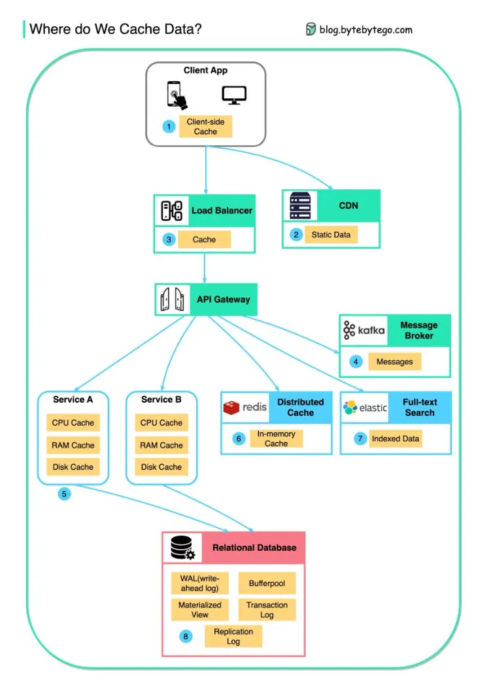

## Eviction Strategies

### Least Recently Used(LRU)

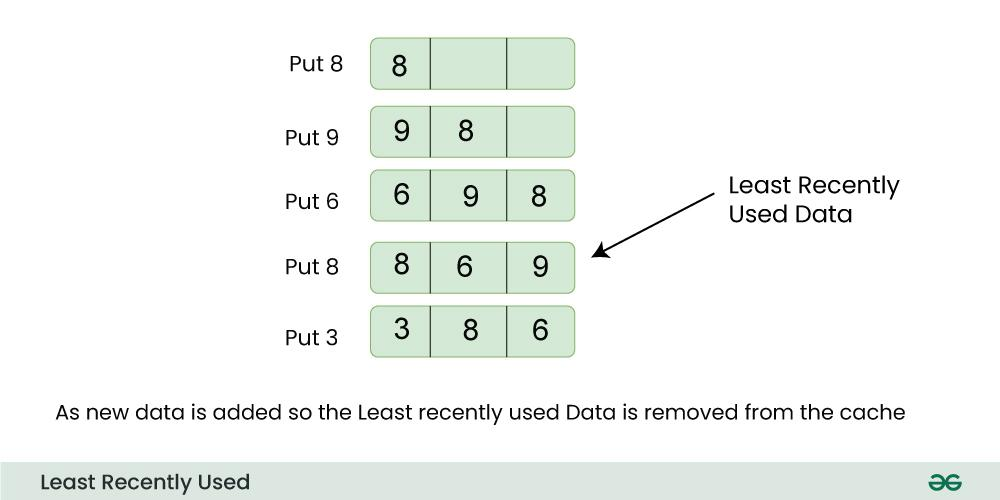

Advantages:

- Easy Implementation
- Efficient Use of Cache
- Adaptability

Disadvantages:

- Strict Ordering
- Cold Start Issues
- Memory Overhead

### Least Frequently Used(LFU)

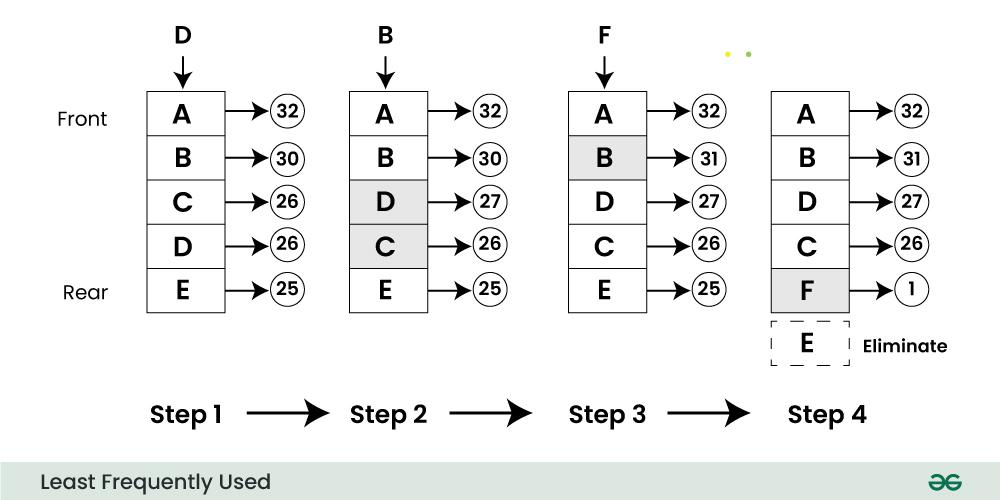

Advantages:

- Adaptability to Varied Access Patterns
- Optimized for Long-Term Trends
- Low Memory Overhead

Disadvantages:

- Sensitivity to Initial Access
- Difficulty in Handling Changing Access Patterns
- Complexity of Frequency Counters

### First-In-First-Out(FIFO)

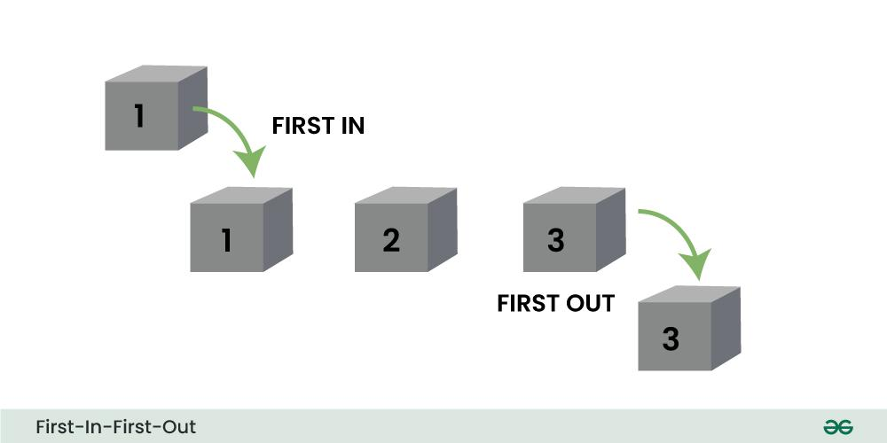

Advantages:

- Simple Implementation
- Predictable Behavior
- Memory Efficiency

Disadvantages:

- Lack of Adaptability
- Inefficiency in Handling Variable Importance
- Cold Start Issues

### Random Replacement

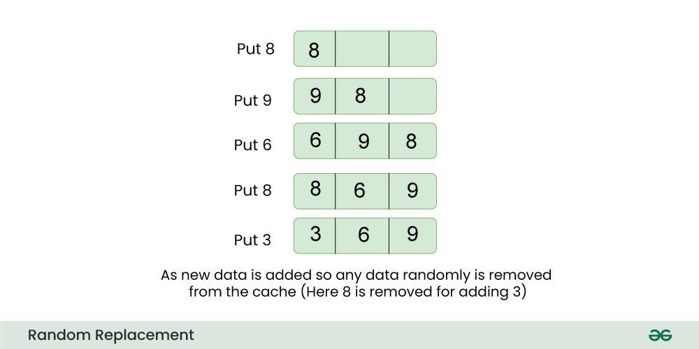

Advantages:

- Simplicity
- Avoids Biases
- Low Overhead

Disadvantages:

- Suboptimal Performance
- No Adaptability
- Possibility of Poor Hit Rates


## Caching For API

Caching APIs can significantly improve performance in system design by addressing several key factors:

- Faster Data Retrieval
- Reduced Database Load
- Minimized Network Latency
- Enhanced Throughput
- Improved User Experience
- Resource Optimization
- Decreased API Rate Limiting
- Scalability

Caching APIs reduces server load in system design through several mechanisms:

- Serving Repeat Requests from Cache
- Decreasing Database Queries
- Reducing Computational Work
- Handling Spikes in Traffic
- Efficient Use of Resources
- Enhanced System Stability and Reliability

### Client-Side Caching

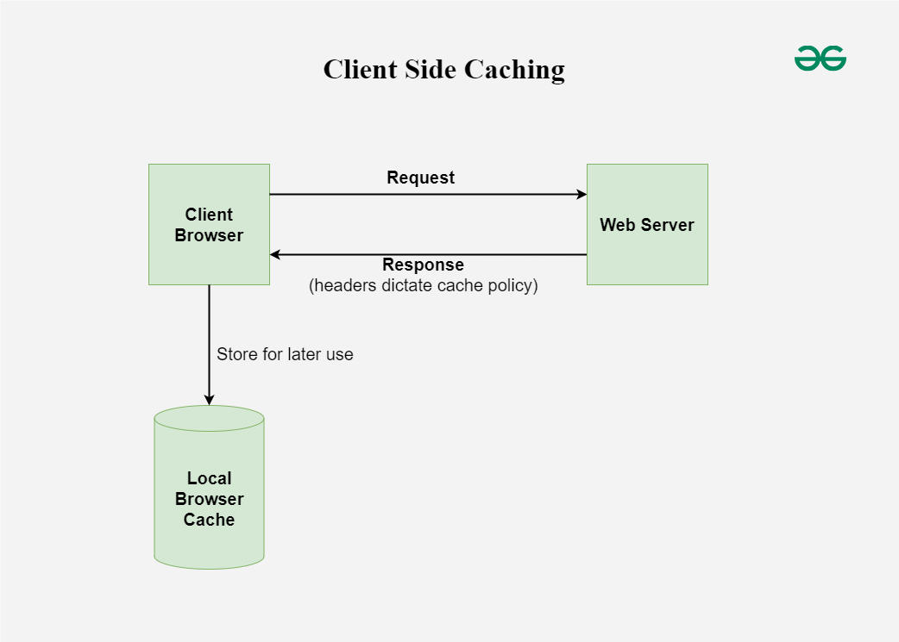

Benefits:

- Reduces server load by storing responses directly on the client.
- Decreases latency since the data is fetched from the client's local storage.

Use Cases:

- Static assets like images, CSS, and JavaScript files.
- API responses that change infrequently, such as user profile data.

### Server-Side Caching

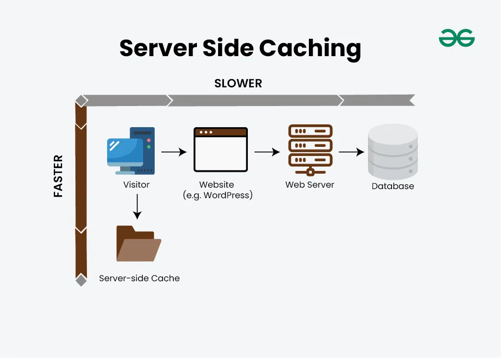

Benefits:

- Reduces the need to recompute responses for repeated requests.
- Can handle a large number of requests efficiently.

Use Cases:

- Frequently accessed data like product catalogs or new feeds.
- API responses that are resource-intensive to generate.

### Reverse Proxy Caching

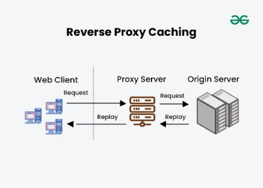

Benefits:

- Caches responses at the network edge, reducing latency and load on the origin server.
- Improves response times for end-users.

Use Cases:

- Publicly accessible APIs with high traffic volumes.
- Content delivery networks(CDNs) for static and dynamic content.

### Distributed Caching

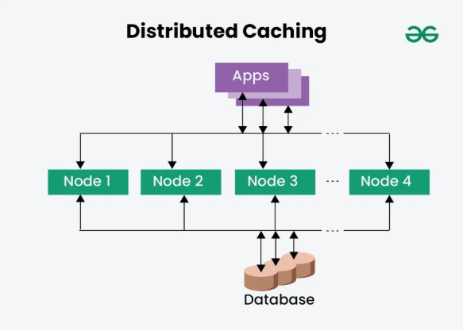

Benefits:

- Spreads the cache across multiple nodes, improving scalability and fault tolerance.
- Maintains data availability in the event that a node fails.

Use Cases:

- Large-scale applications with significant amounts of data to cache.
- Systems requiring high availability and reliability.

### Application-Level Caching

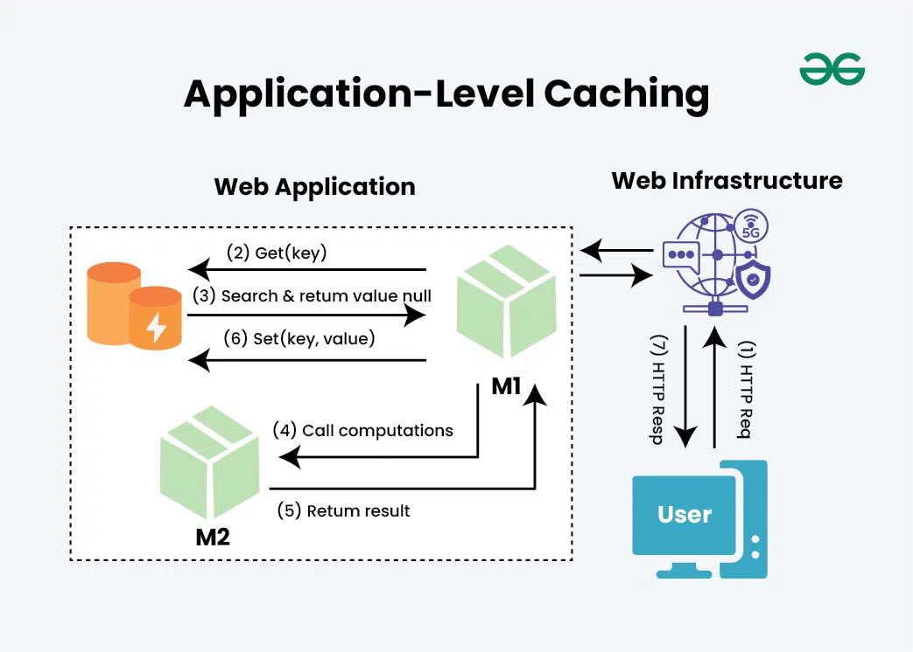

Benefits:

- Customizable caching strategies based on application logic.
- Can be integrated directly into the application code.

Use Cases:

- Specific parts of an application that require fine-grained control over caching.
- Scenarios where data validity and freshness need to be closely managed.

### Database Caching

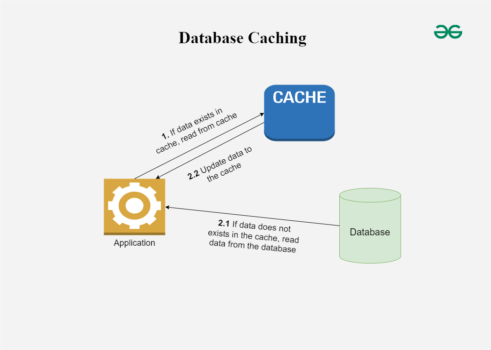

Benefits:

- Offloads database queries, improving database performance.
- Can cache query results or specific database rows.

Use Cases:

- Frequently queried database tables.
- Complex queries that require significant computation.


## Caching Strategy

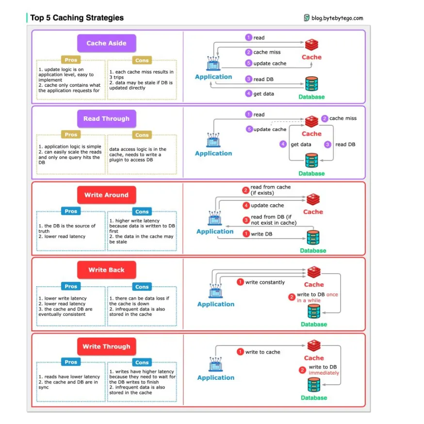


## Example: General-Purpose DB Caching System

### Cache System Evaluation Metrics

- Strong Consistency (Strict Consistency)
  1. Any read can retrieve the most recent write of some data (eventual consistency)
  2. All processes in the system see operation order consistent with the order under a global clock
- Weak Consistency (Weak Consistency)
  1. After data updates, subsequent accesses can tolerate only partial or no access to the data
- Concurrency
  1. Single table single database concurrent reads and writes
  2. Multiple tables multiple databases concurrent reads and writes

### Data Consistency Solutions

#### Solution One: Delete Cache First, Then Update Database

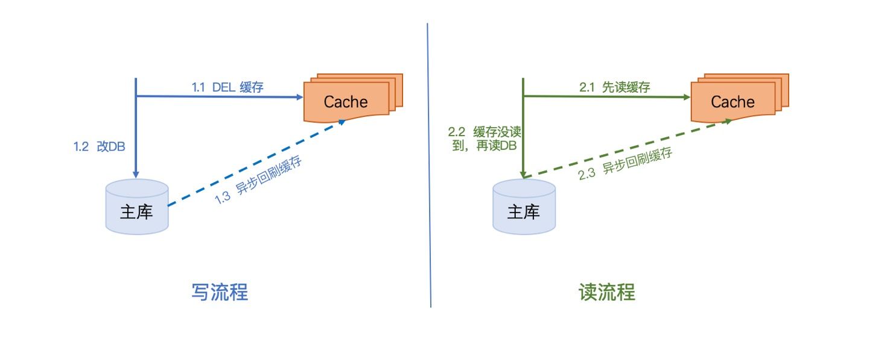

- Write Operation

  1. Delete cache data first
  2. Update database data to avoid dirty data
  3. Asynchronously refresh data back to cache

- Read Operation

  1. Read cache data
  2. If cache data is not found, read from database
  3. Asynchronously refresh data back to cache

Advantages:

1. The entire process is very simple, suitable for low concurrency scenarios

Disadvantages:

1. Insufficient Disaster Recovery

   What to do if deleting cache fails in "Write 1"? If execution continues, the cache data being read would be incorrect;

2. Concurrency Issues

   - Write-Write Concurrency

     If multiple services update the database simultaneously, operation order cannot be guaranteed, causing mutual overwriting issues

   - Read-Write Concurrency

     If consumer A's read operation occurs simultaneously with consumer B's write operation; the process is as follows:

     1. B deletes cache data v1

     2. A reads cache data, cache not found

     3. A reads database data, database returns data v1

     4. B updates database data from v1 to v2

     5. B refreshes v2 back to cache

     6. A refreshes v1 back to cache

        At this point, A's "dirty data" overwrites B's modified cache data. The cache still contains v1, and this solution cannot guarantee eventual consistency.

     Sequence diagram as follows:

     ```sequence
     Title: Read-Write Concurrency Exception Diagram
     B->Cache: 1. Delete cache data v1
     A->Cache: 2. Read cache data
     Cache-->A: Cache data not found
     A->Database: Read database data
     Database-->A: Return data v1
     B->Database: Update database data v2
     B->Cache: Update cache data v2
     A->Cache: Update cache data v1
     ```

Summary:

>  Use Case: Scenarios with low concurrency and not very high consistency requirements
>
> Since its cache refresh strategy may fail, cache data remains in an error state after failure. It cannot guarantee eventual consistency and cannot ensure concurrent read-write safety.

#### Solution Two: Delete Cache First, Update Database with Binlog Mechanism

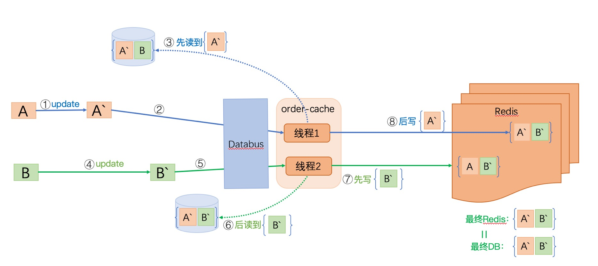

- Write Operation
  1. Delete cache data
  2. Update database
  3. Listen to database binlog, find data that needs refreshing
  4. Read database data
  5. Write retrieved data to cache
- Read Operation
  1. Read cache data
  2. If cache data is not found, read from database
  3. Asynchronously refresh data back to cache

Advantages:

1. If "Write 4" or "Write 5" fails, log replay can be performed and retried
2. Regardless of "Write 1" success, cache will be refreshed afterwards

Disadvantages:

1. Concurrency Issues

   Invalid for cases where cache has no data:

   - When reading, cache data has expired, and then update occurs simultaneously
   - When updating data, cache data has expired, and then another update occurs simultaneously

Summary:

> Applicable Scenario: Simple business logic, relatively low read-write QPS.
>
> Binlog refreshes cache. Due to its natural sequentiality, it has advantages for synchronous operations. However, when binlogs from different rows, tables, and databases are consumed simultaneously, binlog is not time-sequential.

Use Cases:

- [Alibaba Open Source Component: canal](https://github.com/alibaba/canal)
- [LinkedIn Open Source Component: databus](https://github.com/linkedin/databus)

#### Solution Three: Based on Solution Two with MQ Serialization Mechanism

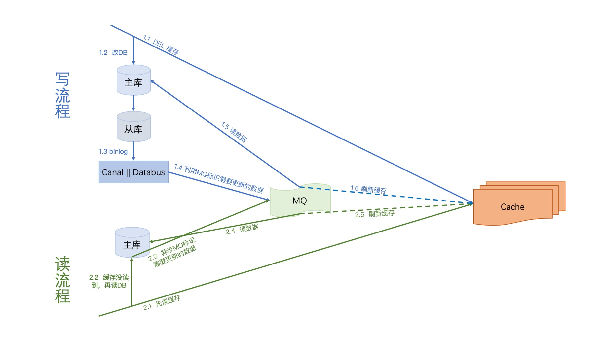

- Write Operation
  1. Delete cache first
  2. Update database
  3. Listen to database binlog, analyze data identifiers that need refreshing
  4. Push data identifiers to MQ
  5. Consume data identifiers from MQ, read data from database based on identifiers
  6. Update cache
- Read Operation
  1. Read cache first
  2. If cache not found, read from database
  3. Push data identifiers needing update to MQ
  4. Consume data identifiers from MQ, read data from database based on identifiers
  5. Update cache

Advantages:

1. Complete Disaster Recovery

   - "Write 1" cache deletion fails: will be overwritten later
   - "Write 4" MQ write fails: Databus or Canal will retry
   - "Write 5" or "Write 6" fails: MQ supports re-consumption
   - "Read 3" MQ write fails: does not affect cache, database will be read next time

2. Serialization

   Leveraging MQ mechanism, read and write operations are all serialized, no concurrency issues

Disadvantages:

1. "Write 5" reads database every time, increasing database pressure (only adds one more read per write, not a big issue)

#### Solution Four: Based on Solution Three with Marking

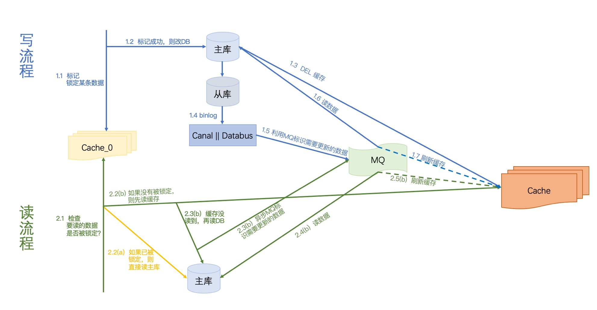

- Write Operation
  1. Mark the data to be modified, indicating "being modified", and set the mark validity period. If marking fails, abandon this modification.
  2. Update database.
  3. Delete cache.
  4. Listen to database binlog, analyze data identifiers needing refresh.
  5. Push data identifiers to MQ.
  6. Consume data identifiers from MQ, read data from database based on identifiers.
  7. Update cache.
- Read Operation
  1. Check data mark. If marked, read directly from database and finish.
  2. If not marked, read from cache first.
  3. If cache missing, read from database.
  4. Push data identifiers needing update to MQ
  5. Consume data identifiers from MQ, read data from database based on identifiers
  6. Update cache

### Common Cache System Problems

#### Cache Penetration

Data that doesn't exist in either cache or database, yet users continuously send requests, causing every request to reach the database, overwhelming it.

Solutions:

1. Business Layer Validation

   Check user requests, directly block if problematic

2. For data not found, set its value to NULL in cache with a shorter expiration time

3. Bloom Filter

   Utilize Bloom filter characteristics to determine data existence, only search if it exists

#### Cache Breakdown

A hot key in cache expires simultaneously while a large number of requests arrive, all reaching the database and overwhelming it.

Solutions:

1. Set Hot Data to Never Expire

   Set frequently read data to never expire

2. Periodically Update Expiration Time

   Renew the expiration time before it expires (refresh TTL)

3. Mutual Exclusion Lock

   Use a cached data value as lock marker, set to 1 or true when locked, set to 0 or false when released (remember to set expiration to prevent deadlock). To modify database, must first acquire this lock marker.

#### Cache Avalanche

Large-scale expiration of mixed data in cache or cache downtime, causing large numbers of requests to directly reach the database, overwhelming it.

Solutions:

1. Don't make data expiration times too dense; don't have all expire together;

2. Data preheating; for incoming large request volumes, pre-cache data;

3. Ensure cache high availability; implement clustering.

---


## References

[1] [How to Design Game Database for 200,000 Concurrent Users](https://cloud.tencent.com/developer/article/1071145)

[2] [Game Database Design Experience](https://blog.csdn.net/pengdali/article/details/95376038)

[3] [E-commerce System Design: Orders](https://segmentfault.com/a/1190000015784047)

[4] [Cache and Database Consistency Series-01](https://blog.kido.site/2018/12/01/db-and-cache-01/)

[5] [Cache and Database Consistency Series-02](https://blog.kido.site/2018/12/07/db-and-cache-02/)

[6] [Canal and Databus Comparison](https://www.cnblogs.com/xunshao/p/9762377.html)

[7] [Most Comprehensive Cache Architecture Design](https://blog.csdn.net/zjttlance/article/details/80234341)

[8] [Cache Architecture in Large Distributed Systems](https://www.cnblogs.com/panchanggui/p/9503666.html)

[9] [Discussion on Web Cache Architecture](https://www.cnblogs.com/neal-ke/p/8966971.html)

[10] [Database Replication in System Design](https://www.geeksforgeeks.org/system-design/database-replication-and-their-types-in-system-design/)

[11] [Introduction to Database Normalization](https://www.geeksforgeeks.org/dbms/introduction-of-database-normalization/)

[12] [Denormalization in Databases](https://www.geeksforgeeks.org/dbms/denormalization-in-databases/)

[13] [Cache Eviction Policies | System Design](https://www.geeksforgeeks.org/system-design/cache-eviction-policies-system-design/)

