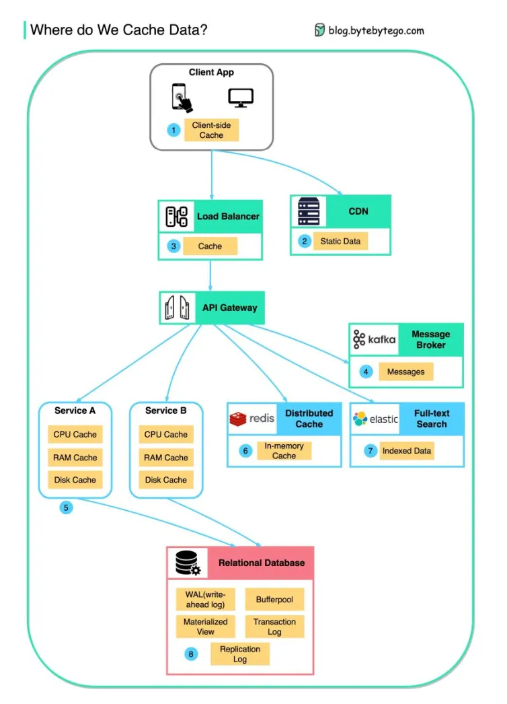
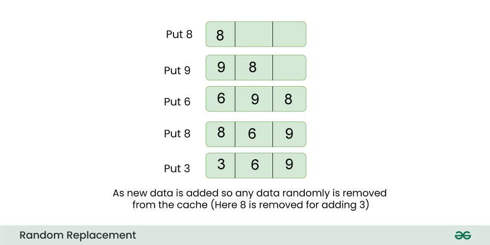
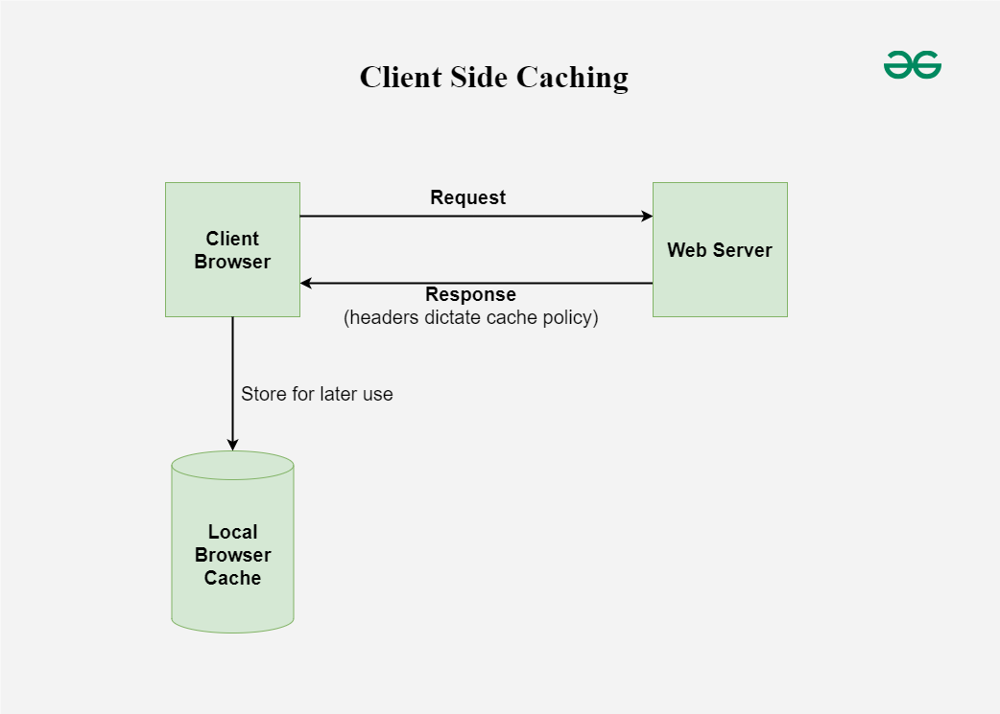
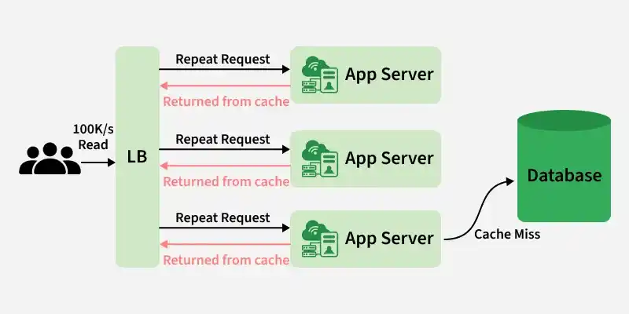
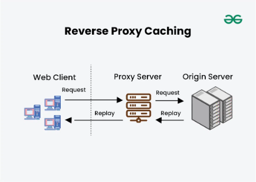
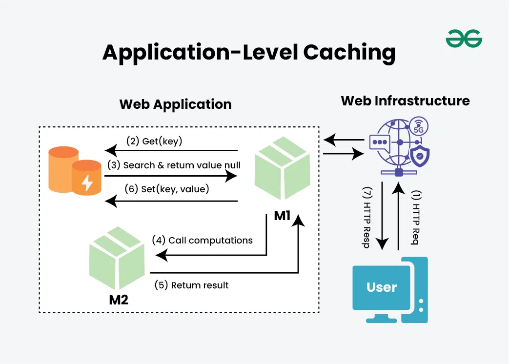
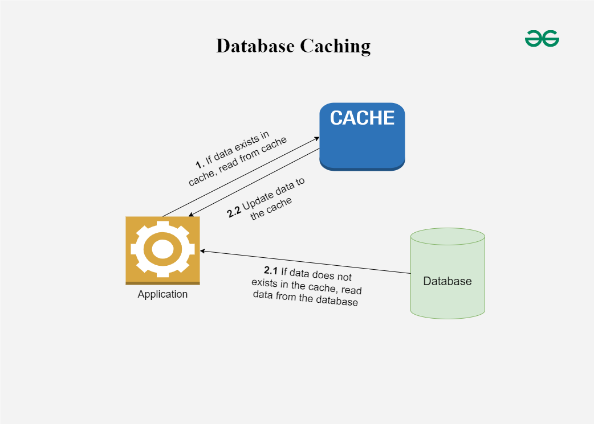
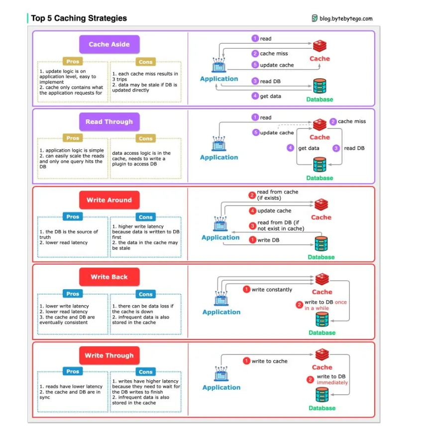

# Caching Design

[TOC]

## Eviction Strategies

### Least Recently Used(LRU)

Advantages:

- Easy Implementation
- Efficient Use of Cache
- Adaptability

Disadvantages:

- Strict Ordering
- Cold Start Issues
- Memory Overhead

### Least Frequently Used(LFU)

Advantages:

- Adaptability to Varied Access Patterns
- Optimized for Long-Term Trends
- Low Memory Overhead

Disadvantages:

- Sensitivity to Initial Access
- Difficulty in Handling Changing Access Patterns
- Complexity of Frequency Counters

### First-In-First-Out(FIFO)

Advantages:

- Simple Implementation
- Predictable Behavior
- Memory Efficiency

Disadvantages:

- Lack of Adaptability
- Inefficiency in Handling Variable Importance
- Cold Start Issues

### Random Replacement

Advantages:

- Simplicity
- Avoids Biases
- Low Overhead

Disadvantages:

- Suboptimal Performance
- No Adaptability
- Possibility of Poor Hit Rates

## Caching For API

Caching APIs can significantly improve performance in system design by addressing several key factors:

- Faster Data Retrieval
- Reduced Database Load
- Minimized Network Latency
- Enhanced Throughput
- Improved User Experience
- Resource Optimization
- Decreased API Rate Limiting
- Scalability

Caching APIs reduces server load in system design through several mechanisms:

- Serving Repeat Requests from Cache
- Decreasing Database Queries
- Reducing Computational Work
- Handling Spikes in Traffic
- Efficient Use of Resources
- Enhanced System Stability and Reliability

### Client-Side Caching

Benefits:

- Reduces server load by storing responses directly on the client.
- Decreases latency since the data is fetched from the client's local storage.

Use Cases:

- Static assets like images, CSS, and JavaScript files.
- API responses that change infrequently, such as user profile data.

### Server-Side Caching

Benefits:

- Reduces the need to recompute responses for repeated requests.
- Can handle a large number of requests efficiently.

Use Cases:

- Frequently accessed data like product catalogs or new feeds.
- API responses that are resource-intensive to generate.

### Reverse Proxy Caching

Benefits:

- Caches responses at the network edge, reducing latency and load on the origin server.
- Improves response times for end-users.

Use Cases:

- Publicly accessible APIs with high traffic volumes.
- Content delivery networks(CDNs) for static and dynamic content.

### Distributed Caching

Benefits:

- Spreads the cache across multiple nodes, improving scalability and fault tolerance.
- Maintains data availability in the event that a node fails.

Use Cases:

- Large-scale applications with significant amounts of data to cache.
- Systems requiring high availability and reliability.

### Application-Level Caching

Benefits:

- Customizable caching strategies based on application logic.
- Can be integrated directly into the application code.

Use Cases:

- Specific parts of an application that require fine-grained control over caching.
- Scenarios where data validity and freshness need to be closely managed.

### Database Caching

Benefits:

- Offloads database queries, improving database performance.
- Can cache query results or specific database rows.

Use Cases:

- Frequently queried database tables.
- Complex queries that require significant computation.

## Caching Strategy

### Cache Aside

TODO

### Read Through

TODO

### Write Around

TODO

### Write Back

TODO

### Write Through

TODO

## References

[1] [How to Design Game Database for 200,000 Concurrent Users](https://cloud.tencent.com/developer/article/1071145)

[2] [Game Database Design Experience](https://blog.csdn.net/pengdali/article/details/95376038)

[3] [E-commerce System Design: Orders](https://segmentfault.com/a/1190000015784047)

[4] [Cache and Database Consistency Series-01](https://blog.kido.site/2018/12/01/db-and-cache-01/)

[5] [Cache and Database Consistency Series-02](https://blog.kido.site/2018/12/07/db-and-cache-02/)

[6] [Canal and Databus Comparison](https://www.cnblogs.com/xunshao/p/9762377.html)

[7] [Most Comprehensive Cache Architecture Design](https://blog.csdn.net/zjttlance/article/details/80234341)

[8] [Cache Architecture in Large Distributed Systems](https://www.cnblogs.com/panchanggui/p/9503666.html)

[9] [Discussion on Web Cache Architecture](https://www.cnblogs.com/neal-ke/p/8966971.html)

[10] [Database Replication in System Design](https://www.geeksforgeeks.org/system-design/database-replication-and-their-types-in-system-design/)

[11] [Introduction to Database Normalization](https://www.geeksforgeeks.org/dbms/introduction-of-database-normalization/)

[12] [Denormalization in Databases](https://www.geeksforgeeks.org/dbms/denormalization-in-databases/)

[13] [Cache Eviction Policies | System Design](https://www.geeksforgeeks.org/system-design/cache-eviction-policies-system-design/)

[14] [Distributed Caching: The Secret to High-Performance Applications](https://blog.bytebytego.com/p/distributed-caching-the-secret-to)

