# Caching Design

[TOC]


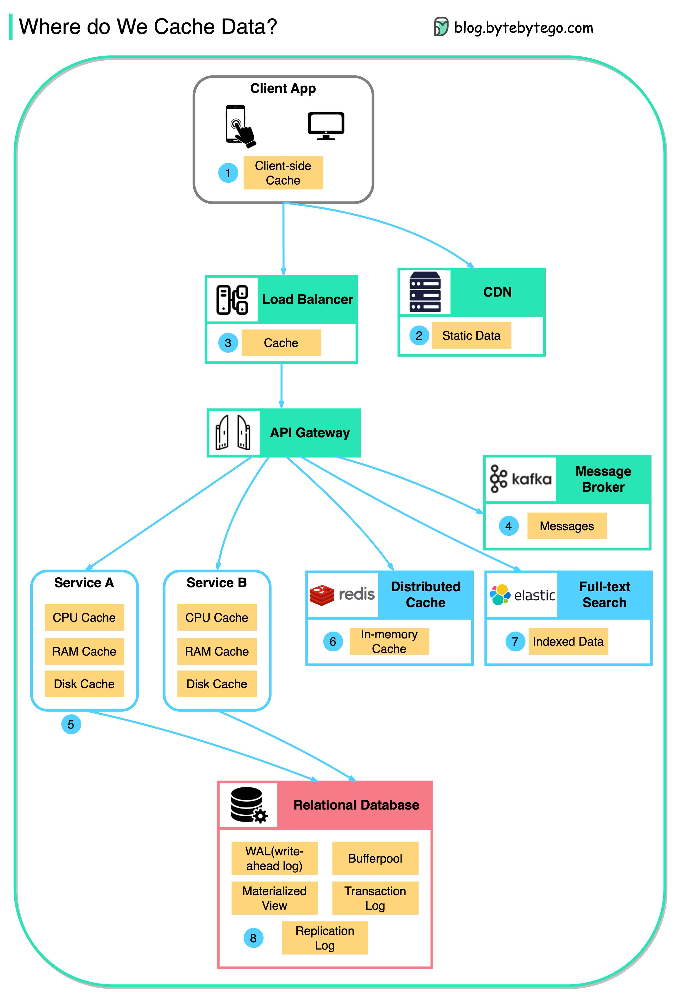

## Eviction Strategies

### Least Recently Used(LRU)


LRU (Least Recently Used) is a cache eviction policy that removes the item that has not been accessed for the longest time when the cache is full. It assumes that recently used data is more likely to be used again, so it keeps track of access order and evicts the least recently used item.

Advantages:

- Easy Implementation
- Efficient Use of Cache
- Adaptability

Disadvantages:

- Strict Ordering
- Cold Start Issues
- Memory Overhead

### Least Frequently Used(LFU)


The least frequently accessed entries are eliminated first under the LFU cache eviction policy. It is based on the idea that things that are used the least are less likely to be needed later. When the cache is full, LFU removes the item with the lowest access frequency after keeping track of the amount of times each item is accessed.

Advantages:

- Adaptability to Varied Access Patterns
- Optimized for Long-Term Trends
- Low Memory Overhead

Disadvantages:

- Sensitivity to Initial Access
- Difficulty in Handling Changing Access Patterns
- Complexity of Frequency Counters

### First-In-First-Out(FIFO)


First-In-First-Out (FIFO) is a cache eviction policy that removes the oldest item from the cache when it becomes full. In this strategy, data is stored in the cache in the order it arrives, and the item that has been present in the cache for the longest time is the first to be evicted when the cache reaches its capacity.

Advantages:

- Simple Implementation
- Predictable Behavior
- Memory Efficiency

Disadvantages:

- Lack of Adaptability
- Inefficiency in Handling Variable Importance
- Cold Start Issues

### Random Replacement


Random Replacement is a cache eviction policy where, when the cache is full and a new item needs to be stored, a randomly chosen existing item is evicted to make room. Unlike some deterministic policies like LRU (Least Recently Used) or FIFO (First-In-First-Out), which have specific criteria for selecting items to be evicted, Random Replacement simply selects an item at random.

Advantages:

- Simplicity
- Avoids Biases
- Low Overhead

Disadvantages:

- Suboptimal Performance
- No Adaptability
- Possibility of Poor Hit Rates

---


## Caching Strategies


### Cache Aside

TODO

### Read Through

TODO

### Write Around

TODO

### Write Back

TODO

### Write Through

TODO

---


## Distributed Caching


In the distributed cache, each node will have a part of the whole cache space, and then, using the consistent hashing function, each request can be routed to where the cache request can be found.

Benefits:

- Spreads the cache across multiple nodes, improving scalability and fault tolerance.
- Maintains data availability in the event that a node fails.

Use Cases:

- Large-scale applications with significant amounts of data to cache.
- Systems requiring high availability and reliability.

### Distributed Caching Workflow

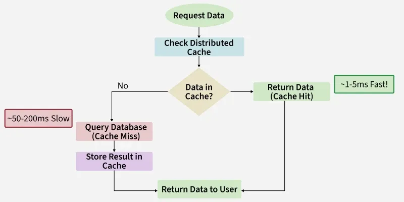

1. Data Storage: Each cache node uses RAM to store cached data, enabling fast reads and writes compared to disk-based storage.

2. Data Replication: Cached entries are duplicated across multiple nodes to ensure high availability and fault tolerance.

3. Cache Eviction: Automatically removes less valuable entries when memory limits are reached.

   - LRU (Least Recently Used)

     Removes the data that has not been accessed for the longest time, assuming it is less likely to be used again.

   - LFU (Least Frequently Used)

     Removes the data that is accessed the least number of times, keeping frequently used data in cache.

   - TTL (Time To Live)

     Automatically deletes data after a fixed time duration to ensure outdated data is removed.

   - FIFO (First In First Out)

     Removes the oldest data in the cache first, regardless of how often it is used.

4. Cache Invalidation: Expire or remove entries when underlying data changes to prevent stale reads.

5. Cache Coherency: Keeps all nodes’ copies synchronized so updates are reflected cluster-wide.

6. Cache Access: Applications use a simple API (GET/SET/DELETE) to retrieve or update data in the nearest cache node, minimizing latency.

### Distributed Caching Strategies

#### Cache Aside Setup

TODO

#### Read-Through Setup

TODO

#### Write-Through Setup

TODO

#### Write-Back Setup

TODO

### Distributed Caching Solutions

Some of the popular distributed caching solutions are:

1. Redis

   A highly popular in-memory data store, Redis supports caching, databases, and message brokering. It’s known for speed and flexibility, and works well for distributed caching with built-in data replication and persistence options.

2. Memcached

   A lightweight, in-memory key-value store. Memcached is widely used for caching frequently accessed data and is easy to set up, though it lacks some advanced features like persistence and replication.

3. Amazon ElastiCache

   A fully managed service by AWS, it supports both Redis and Memcached, allowing you to use caching in a distributed cloud environment without managing the infrastructure yourself.

4. Apache Ignite

   An in-memory computing platform that offers distributed caching with advanced features like transactions and real-time streaming. It’s designed for high-performance computing scenarios.

5. Hazelcast

   A scalable in-memory data grid that provides distributed caching, data partitioning, and failover features. It’s often used in highly scalable enterprise applications.

---


## Database Caching


Benefits:

- Offloads database queries, improving database performance.
- Can cache query results or specific database rows.

Use Cases:

- Frequently queried database tables.
- Complex queries that require significant computation.

---


## Edge Caching

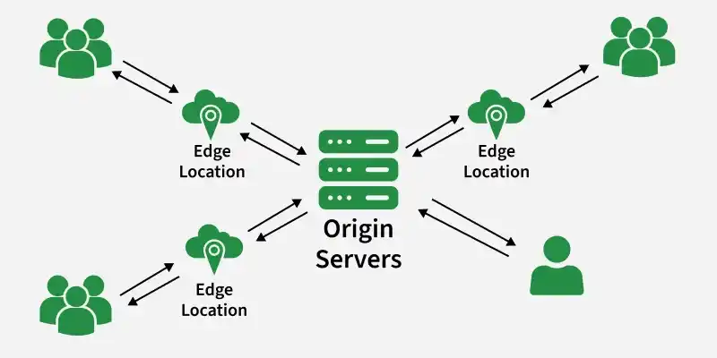

Edge caching stores frequently accessed data near users (e.g., CDN or edge servers) to reduce data travel distance. It delivers faster access with lower latency by serving data from nearby locations instead of a central server, improving overall performance.

### Edge Caching Workflow

1. Request Flow

   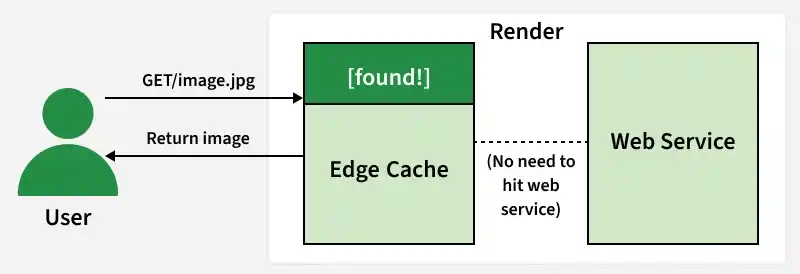

   Whenever a client sends an HTTP request, the system first checks whether the request is eligible to be served from the edge cache (based on caching rules like TTL, headers, etc.). If the request is cache-eligible, the nearest edge node checks its local cache for the requested content. This reduces the need to contact the central server for every request.

2. Cache Hit (Fast Path)

   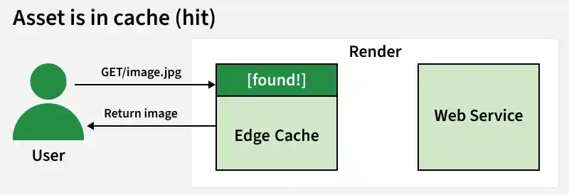

   If the requested content is already available in the edge cache and is not expired, it is directly served to the user.

3. Cache Miss (Fallback Path)

   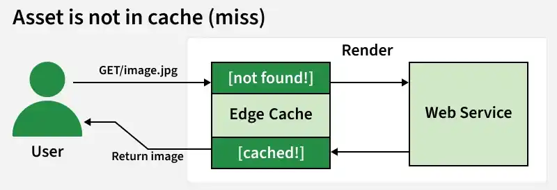

   If the content is not available in the cache (cache miss), the edge node forwards the request to the central server to fetch the data.

4. Cache Management & Updates

   To maintain performance and freshness, the system applies caching techniques like TTL (expiration), eviction policies (LRU/LFU), and cache invalidation. Edge nodes may also periodically sync with the central server to update outdated content.

5. Optimization

   The system continuously monitors cache hits, misses, and user behavior to optimize caching strategies and ensure frequently accessed content is always available at the edge.

---


## Caching For API

Caching APIs can significantly improve performance in system design by addressing several key factors:

- Faster Data Retrieval
- Reduced Database Load
- Minimized Network Latency
- Enhanced Throughput
- Improved User Experience
- Resource Optimization
- Decreased API Rate Limiting
- Scalability

Caching APIs reduces server load in system design through several mechanisms:

- Serving Repeat Requests from Cache
- Decreasing Database Queries
- Reducing Computational Work
- Handling Spikes in Traffic
- Efficient Use of Resources
- Enhanced System Stability and Reliability

### Client-Side Caching


Benefits:

- Reduces server load by storing responses directly on the client.
- Decreases latency since the data is fetched from the client's local storage.

Use Cases:

- Static assets like images, CSS, and JavaScript files.
- API responses that change infrequently, such as user profile data.

### Server-Side Caching


An Application Server Cache is a storage layer within an application server that temporarily holds frequently accessed data, so it can be quickly retrieved without needing to go back to the main database each time. This helps applications run faster by reducing the load on the database and speeding up response times for users.

Benefits:

- Reduces the need to recompute responses for repeated requests.
- Can handle a large number of requests efficiently.

Use Cases:

- Frequently accessed data like product catalogs or new feeds.
- API responses that are resource-intensive to generate.

### Reverse Proxy Caching


Benefits:

- Caches responses at the network edge, reducing latency and load on the origin server.
- Improves response times for end-users.

Use Cases:

- Publicly accessible APIs with high traffic volumes.
- Content delivery networks(CDNs) for static and dynamic content.

### Application-Level Caching


Benefits:

- Customizable caching strategies based on application logic.
- Can be integrated directly into the application code.

Use Cases:

- Specific parts of an application that require fine-grained control over caching.
- Scenarios where data validity and freshness need to be closely managed.

---


## Cold and Warm Cache

### Cold Cache

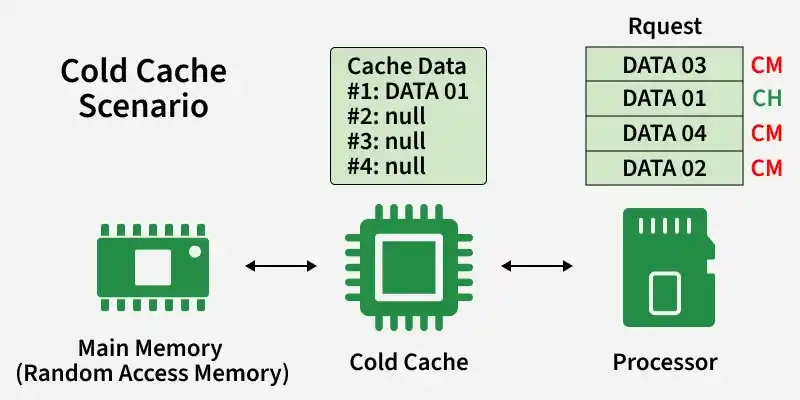

A cold cache is a newly initialized cache with little or no data, so most requests result in misses and require fetching data from the backend, leading to slower performance.

### Warm Cache

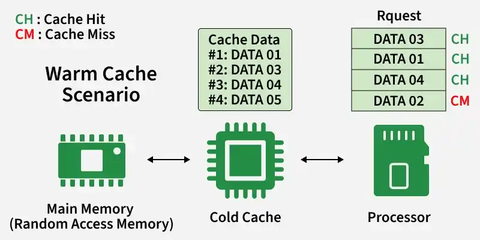

A warm cache contains frequently accessed data, leading to a high cache hit rate and faster responses. It reduces dependency on backend systems and improves overall performance.

### Cache Warming

Cache warming is the process of filling a cold cache with frequently or likely-to-be-used data so that the system can quickly move to a warm state and improve performance. It helps reduce initial latency and ensures faster response for early requests.

---


## Challenges

### Cache Miss Attack

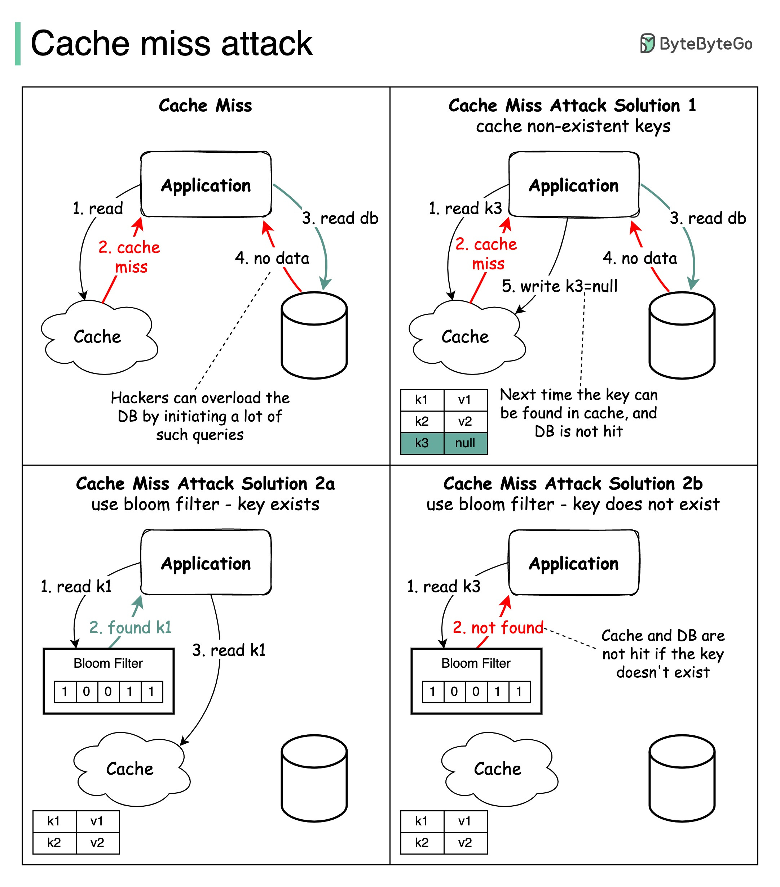

`Cache Miss Attack`: It refers to the scenario where data to fetch doesn't exist in the database and the data isn’t cached either. So every request hits the database eventually, defeating the purpose of using a cache. If a malicious user initiates lots of queries with such keys, the database can easily be overloaded.

---


## Example 1: General Cache System Design

### Cache System Evaluation Metrics

- Strong Consistency
  1. Any read can always get the latest written data (eventual consistency)
  2. All processes in the system see operations in the same order as a global clock
- Weak Consistency
  1. After data is updated, it is acceptable if subsequent accesses can only see part of the update or none at all
- Concurrency
  1. Concurrent read/write on a single table/database
  2. Concurrent read/write on multiple tables/databases

### Data Consistency Solutions

#### Solution 1: Delete Cache First, Then Update Database

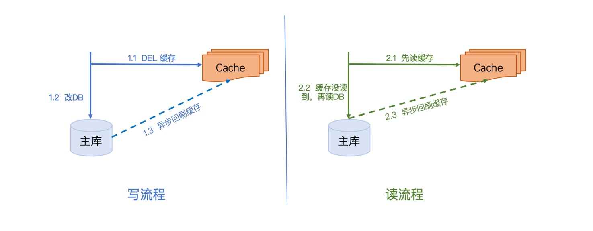

- Write Operation
  1. Delete cache data first
  2. Update database data to avoid dirty data
  3. Asynchronously refresh data back to cache

- Read Operation
  1. Read cache data
  2. If cache miss, read from database
  3. Asynchronously refresh data back to cache

Advantages:

1. The whole process is very simple, suitable for low concurrency scenarios

Disadvantages:

1. Insufficient disaster recovery
   What if deleting the cache fails in step 1 of writing? If you continue, the cache may always have stale data.

2. Concurrency issues

   - Write-Write Concurrency
     If multiple services update the database at the same time, operation order cannot be guaranteed, leading to overwrites

   - Read-Write Concurrency
     If consumer A reads and consumer B writes at the same time, the process is as follows:

     1. B deletes cache data v1
     2. A reads cache, cache miss
     3. A reads database, gets v1
     4. B updates database data to v2
     5. B writes v2 to cache
     6. A writes v1 to cache
        Now, A's "dirty data" overwrites B's updated cache, so cache is still v1. This solution cannot guarantee eventual consistency.

     Diagram:

     ```sequence
     Title: Read-Write Concurrency Exception
     B->Cache: 1. Delete cache data v1
     A->Cache: 2. Read cache data
     Cache-->A: Cache miss
     A->DB: Read database data
     DB-->A: Return data v1
     B->DB: Update database data to v2
     B->Cache: Update cache data to v2
     A->Cache: Update cache data to v1
     ```

Summary:

Use case: Scenarios with low concurrency and low consistency requirements

Because the cache refresh strategy may fail, and after failure the cache may always be in an incorrect state, this solution cannot guarantee eventual consistency or safe concurrent read/write.

#### Solution 2: Delete Cache First, Then Update Database, with Binlog Mechanism

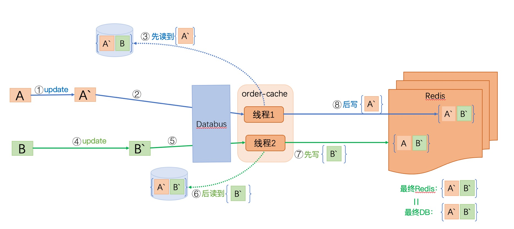

- Write Operation
  1. Delete cache data
  2. Update database
  3. Listen to database binlog to find data to refresh
  4. Read database data
  5. Write data to cache
- Read Operation
  1. Read cache data
  2. If cache miss, read from database
  3. Asynchronously refresh data back to cache

Advantages:

1. If step 4 or 5 of writing fails, you can replay logs and retry
2. Whether or not step 1 succeeds, the cache will be refreshed later

Disadvantages:

1. Concurrency issues
   Ineffective when cache is empty:
   - When reading, cache data is already invalid, and an update happens
   - When updating, cache data is already invalid, and another update happens

Summary:

Use case: Simple business, low read/write QPS

Binlog is used to refresh cache, and its natural ordering is advantageous for synchronization. But when binlogs from different rows, tables, or databases are consumed simultaneously, binlog is not strictly sequential.

Examples:

- [Alibaba open source: canal](https://github.com/alibaba/canal)
- [LinkedIn open source: databus](https://github.com/linkedin/databus)

#### Solution 3: Add MQ Serialization Mechanism on Top of Solution 2

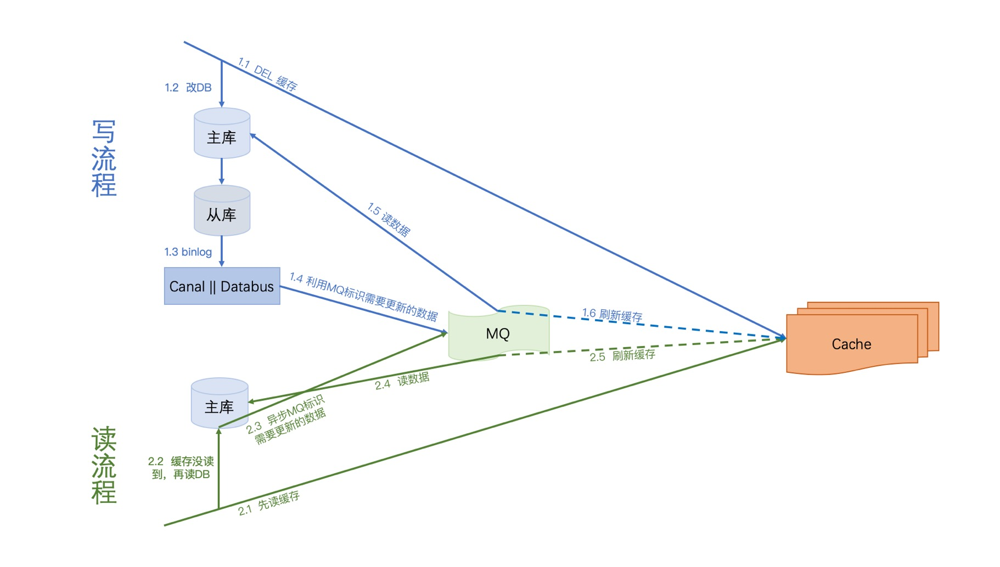

- Write Operation
  1. Delete cache first
  2. Update database
  3. Listen to database binlog, analyze which data needs to be refreshed
  4. Push data identifier to MQ
  5. Consume data identifier from MQ, read data from database
  6. Update cache
- Read Operation
  1. Read cache first
  2. If cache miss, read from database
  3. Push data identifier to MQ
  4. Consume data identifier from MQ, read data from database
  5. Update cache

Advantages:

1. Complete disaster recovery
   - Step 1 delete cache fails: will be overwritten later
   - Step 4 write to MQ fails: Databus or Canal will retry
   - Step 5 or 6 fails: MQ supports re-consume
   - Step 3 of read, write to MQ fails: does not affect cache, next time will still read database

2. Serialization
   With MQ, read and write operations are serialized, so no concurrency issues

Disadvantages:

1. Step 5 of writing always reads database, increasing DB load (but only one extra read per write, not a big problem)

#### Solution 4: Add Marking Mechanism on Top of Solution 3

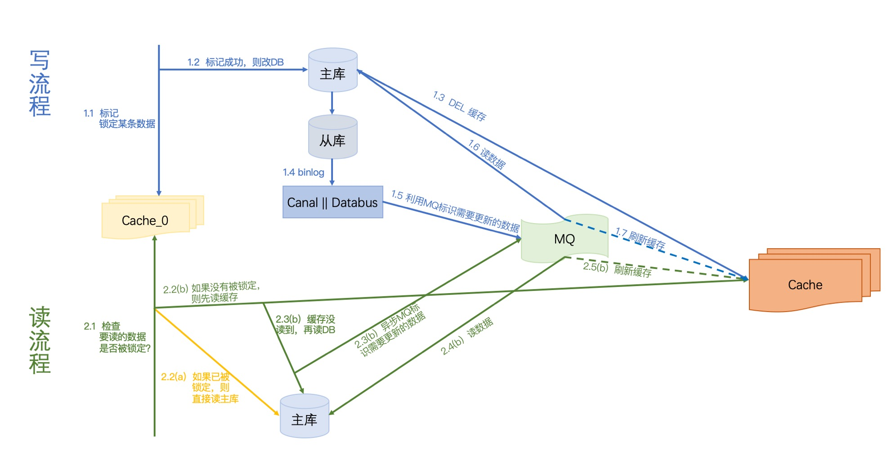

- Write Operation
  1. Mark the data to be modified as "being modified" with a valid time; if marking fails, abandon this modification
  2. Update database
  3. Delete cache
  4. Listen to database binlog, analyze which data needs to be refreshed
  5. Push data identifier to MQ
  6. Consume data identifier from MQ, read data from database
  7. Update cache
- Read Operation
  1. Check data mark; if marked, read database directly and finish
  2. If not marked, read cache first
  3. If cache miss, read from database
  4. Push data identifier to MQ
  5. Consume data identifier from MQ, read data from database
  6. Update cache

### Cache System Components

- Redis
- ...

### Common Cache System Issues

#### Cache Penetration

If neither cache nor database has the data, but users keep sending requests, every request hits the database, overwhelming it

Solutions:

1. Business layer validation
   Check user requests and block invalid ones
2. For data not found, set value as NULL in cache with a short expiration
3. Bloom filter
   Use Bloom filter to check if data exists before querying

#### Cache Breakdown

When a hot key in cache expires, a large number of requests come in, all hitting the database and overwhelming it

Solutions:

1. Set hot data to never expire
   For frequently read data, set it to never expire
2. Periodically update expiration
   Before expiration, refresh the expiration (keep-alive)
3. Mutex lock
   Use a value in cache as a lock; set to 1/true when locked, 0/false when released (remember to set expiration to avoid deadlock); to modify DB, must acquire the lock first

#### Cache Avalanche

When a large amount of cached data expires or cache crashes, a flood of requests hit the database, overwhelming it

Solutions:

1. Stagger data expiration times; don't let all expire at once
2. Data preheating: pre-cache data before a large number of requests arrive
3. Ensure high cache availability, use clustering

---


## Summary

### CDN vs Edge Server

|                   CDN                    |                  Edge Server                  |
| :--------------------------------------: | :-------------------------------------------: |
|    Reduces latency for static content    | Reduces latency for processing & dynamic data |
|       Distributes content globally       |           Processes data near users           |
|       Globally distributed servers       |        Located close to users/devices         |
| Best for static content (images, videos) |   Best for real-time processing (IoT, apps)   |
|        Mainly caching & delivery         |         Can process and analyze data          |
|        Subscription-based pricing        |         High setup & maintenance cost         |

### Cold vs Warm Cache

|            **Cold Cache**             |                 **Warm Cache**                  |
| :-----------------------------------: | :---------------------------------------------: |
|    Empty cache with no stored data    | Cache already contains frequently accessed data |
| First requests result in cache misses |       Most requests result in cache hits        |
|      Slower initial performance       |           Faster overall performance            |
|    Higher latency on first access     |        Lower latency for repeated access        |
|    Needs time to build cache data     |      Already optimized for quick responses      |
|    Less efficient at the beginning    |        More efficient due to stored data        |
|  Suitable for testing, benchmarking   |        Ideal for production environments        |
|  Increases load on backend initially  |       Reduces backend load significantly        |

---


## References

[1] [How to Design Game Database for 200,000 Concurrent Users](https://cloud.tencent.com/developer/article/1071145)

[2] [Game Database Design Experience](https://blog.csdn.net/pengdali/article/details/95376038)

[3] [E-commerce System Design: Orders](https://segmentfault.com/a/1190000015784047)

[4] [Cache and Database Consistency Series-01](https://blog.kido.site/2018/12/01/db-and-cache-01/)

[5] [Cache and Database Consistency Series-02](https://blog.kido.site/2018/12/07/db-and-cache-02/)

[6] [Canal and Databus Comparison](https://www.cnblogs.com/xunshao/p/9762377.html)

[7] [Most Comprehensive Cache Architecture Design](https://blog.csdn.net/zjttlance/article/details/80234341)

[8] [Cache Architecture in Large Distributed Systems](https://www.cnblogs.com/panchanggui/p/9503666.html)

[9] [Discussion on Web Cache Architecture](https://www.cnblogs.com/neal-ke/p/8966971.html)

[10] [Database Replication in System Design](https://www.geeksforgeeks.org/system-design/database-replication-and-their-types-in-system-design/)

[11] [Introduction to Database Normalization](https://www.geeksforgeeks.org/dbms/introduction-of-database-normalization/)

[12] [Denormalization in Databases](https://www.geeksforgeeks.org/dbms/denormalization-in-databases/)

[13] [Cache Eviction Policies | System Design](https://www.geeksforgeeks.org/system-design/cache-eviction-policies-system-design/)

[14] [Distributed Caching: The Secret to High-Performance Applications](https://blog.bytebytego.com/p/distributed-caching-the-secret-to)

[15] [Cache miss attack](https://blog.bytebytego.com/p/cache-miss-attack?utm_source=publication-search)

[16] [Caching - System Design Concept](https://www.geeksforgeeks.org/system-design/caching-system-design-concept-for-beginners/)

[17] [Distributed Cache](https://www.geeksforgeeks.org/system-design/what-is-a-distributed-cache/)

[18] [Design Distributed Cache | System Design](https://www.geeksforgeeks.org/system-design/design-distributed-cache-system-design/)

[19] [Edge Caching - System Design](https://www.geeksforgeeks.org/system-design/edge-caching-system-design/)

[20] [CDN Vs Edge Server - System Design](https://www.geeksforgeeks.org/system-design/cdn-vs-edge-server-system-design/)

[21] [Cold and Warm Cache in System Design](https://www.geeksforgeeks.org/system-design/cold-and-warm-cache-in-system-design/)
