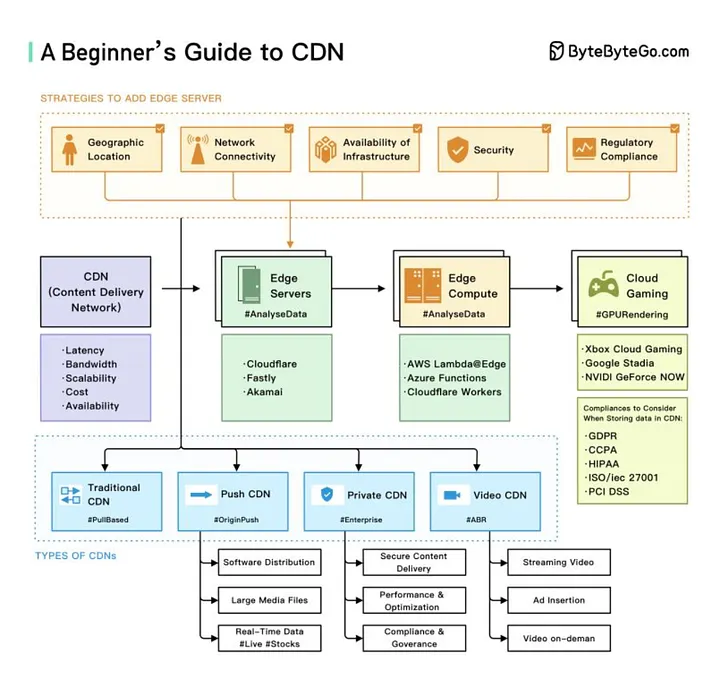
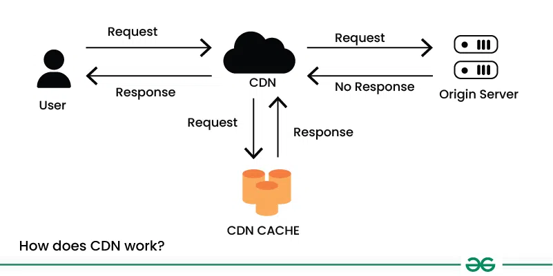

# CDN

[TOC]

When a user requests content from a website with a CDN, the CDN identifies the user's location and routes the request to the nearest edge server. The edge server, which stores cached copies of the website's content, quickly delivers teh requested content to the user.

## Importance

CDNs offer several key benefits that make them important for delivering content over the internet:

- Faster Content Delivery
- Improved Website Performance
- Scalability
- Redundancy and Reliability
- Cost Saving
- Security

## Benefits

The benefits of incorporating a CDN into your system design can be follows:

- Improved website performance
- Reduced bandwidth costs
- Increased global reach

## Challenges

Below are the challenges of using CDN:

- Cost
- Complexity
- Security considerations

## Types

CDNs can be classified into several types based on their architecture and functionality:

- Public CDNs
- Private CDNs
- Peer-to-Peer(P2P) CDNs
- Hybrid CDNs
- Push CDNs
- Pull CDNs

## Workflow

Below is the simple step-by-step working of a CDN:

1. User sends a request for content (e.g., an image) from a website.
2. CDN identifies the user's location and routes the request to the nearest edge server.
3. If the content is cached at the edge server, it is delivered directly to the user.
4. If the content is not cached, the edge server retrieves it from the origin server, caches it locally, and delivers it to the user.
5. Cached content is stored at the edge server for future requests, optimizing performance and reducing latency.

## Components

A typical CDN consists of the following key elements:

- Edge Servers
- Origin Server
- Content Distribution Nodes
- Control Plane

## Usage

CDNs are not limited to websites and can be used for various purposes, including:

- Streaming media delivery
- Software Distribution
- E-commerce
- Gaming
- API delivery

## References

[1] [What is Content Delivery Network(CDN) in System Design](https://www.geeksforgeeks.org/system-design/what-is-content-delivery-networkcdn-in-system-design/)

