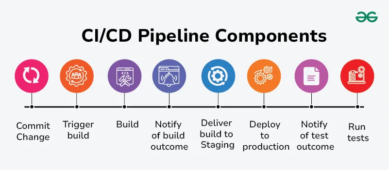

# CI/CD Pipeline

[TOC]

CI/CD stands for continuous integration and continuous deployment (or continuous delivery) and is an essential practice in modern software development. It focuses on automating and streamlining the process of integrating code changes, testing, and deploying software.

## Continuous Integration(CI)

Continuous Integration(CI) means developers frequently merge small code changes into a shared repository instead of doing large merges later.

Types Of CI Tests:

- Unit Tests
- Integration Tests

### How CI Works

Each push automatically triggers:

- Application build
- Automated tests(unit + integration)

### Main Goal of CI

- Massive conflicts
- Hidden bugs
- Long debugging cycle

## Continuous Delivery(CD)

Continuous Delivery(CD) extends continuous integration by automating everything needed to prepare code for production release. Where CI stops after building & testing, CD starts and moves the validated artifact through preproduction environments.

### How CD Works

After CI passes, the pipeline automatically deploys the build to:

- Testing environment
- Staging environment

### Main Goal of CD

- Ensure there is always a production-ready build that has passed all automated checks.
- Enable releases at any time with confidence and stability.

## Continuous Deployment(CD)

Continuous Deployment(CD) is the highest level of automation in the CI/CD pipeline. It takes Continuous Delivery one step further by removing the final manual approval and automatically deploying every validated change straight to production.

### How CD Works

A code change passes all automated checks in:

- CI(build + unit test + integration tests)
- CD(E2E tests, performance tests, security tests)

## Components

1. Source
2. Build
3. Test
4. Deploy

## Challenges

- Complexity of Pipeline Configuration
- Integration Issues
- Slow Build/Test Execution
- Maintaining Pipeline Reliability
- Security Concerns
- Scaling Challenges
- Lack of Testing Coverage

## References

[1] [CI/CD Pipeline - System Design](https://www.geeksforgeeks.org/system-design/cicd-pipeline-system-design/)