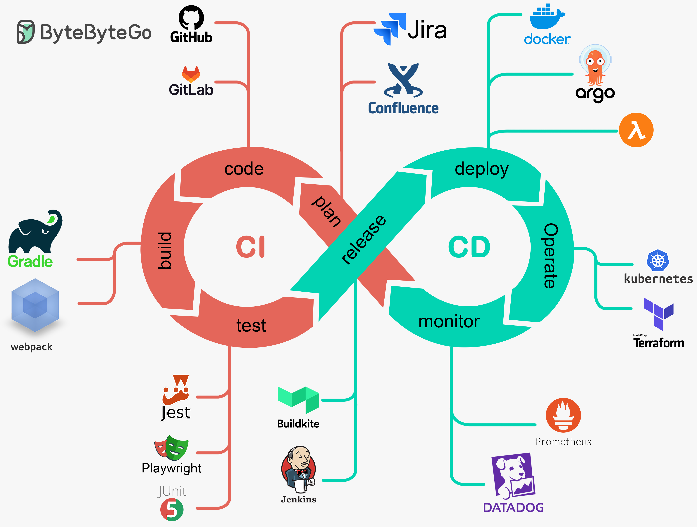
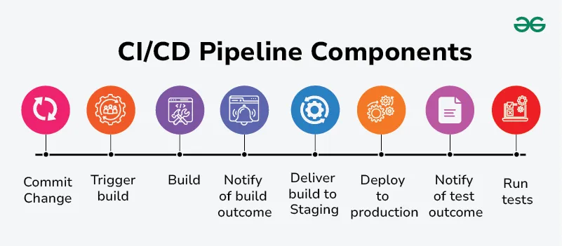
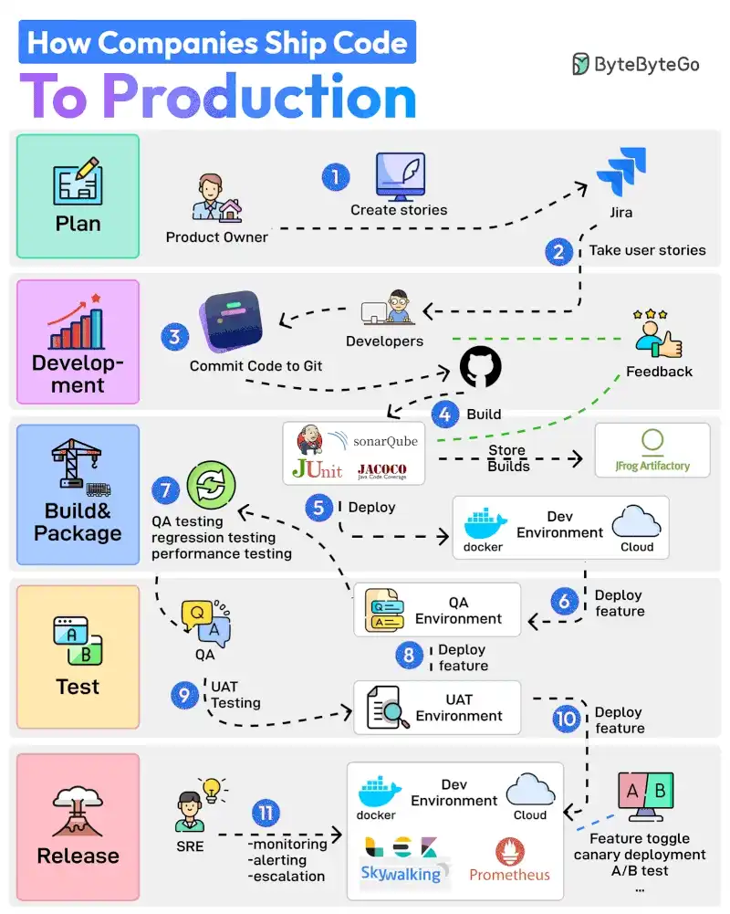
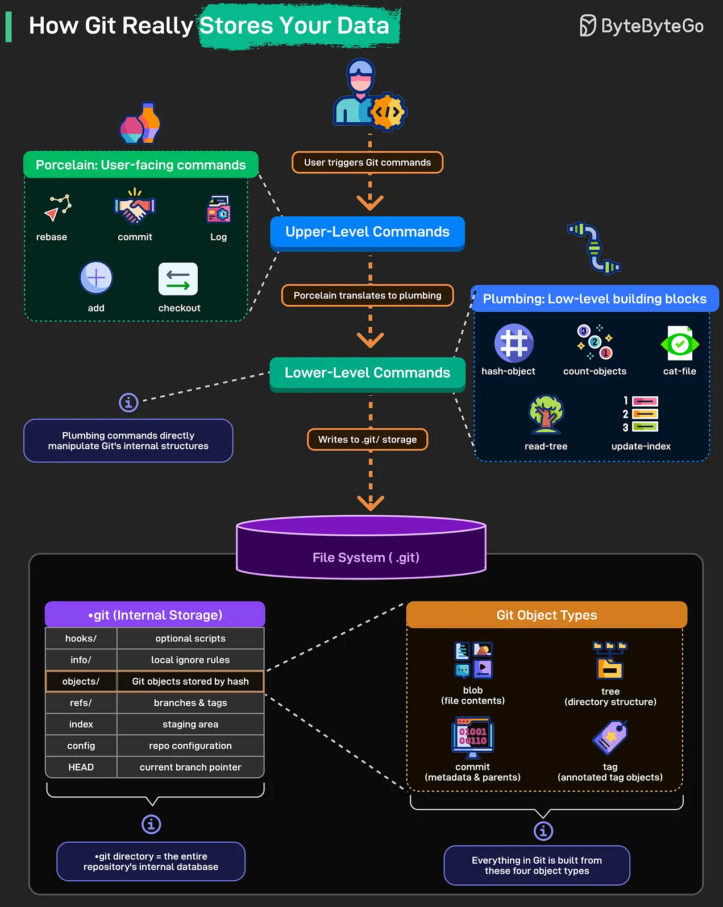
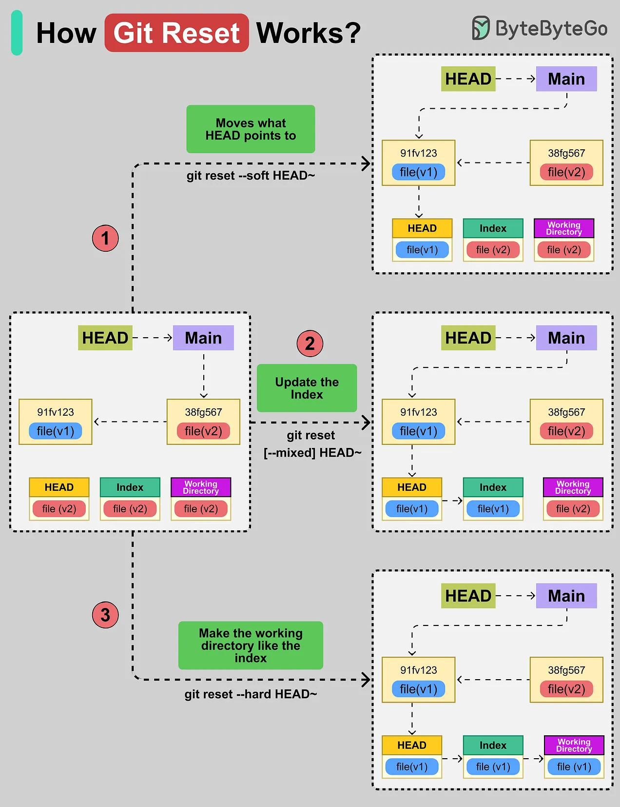

# CI/CD Pipeline

[TOC]

CI/CD stands for continuous integration and continuous deployment (or continuous delivery) and is an essential practice in modern software development. It focuses on automating and streamlining the process of integrating code changes, testing, and deploying software.

## CI/CD

### Continuous Integration(CI)

Continuous Integration(CI) means developers frequently merge small code changes into a shared repository instead of doing large merges later.

Types Of CI Tests:

- Unit Tests
- Integration Tests

#### How CI Works

Each push automatically triggers:

- Application build
- Automated tests(unit + integration)

#### Main Goal of CI

- Massive conflicts
- Hidden bugs
- Long debugging cycle

### Continuous Delivery(CD)

Continuous Delivery(CD) extends continuous integration by automating everything needed to prepare code for production release. Where CI stops after building & testing, CD starts and moves the validated artifact through preproduction environments.

#### How CD Works

After CI passes, the pipeline automatically deploys the build to:

- Testing environment
- Staging environment

#### Main Goal of CD

- Ensure there is always a production-ready build that has passed all automated checks.
- Enable releases at any time with confidence and stability.

### Continuous Deployment(CD)

Continuous Deployment(CD) is the highest level of automation in the CI/CD pipeline. It takes Continuous Delivery one step further by removing the final manual approval and automatically deploying every validated change straight to production.

#### How CD Works

A code change passes all automated checks in:

- CI(build + unit test + integration tests)
- CD(E2E tests, performance tests, security tests)

### Components

1. Source
2. Build
3. Test
4. Deploy

### Challenges

- Complexity of Pipeline Configuration
- Integration Issues
- Slow Build/Test Execution
- Maintaining Pipeline Reliability
- Security Concerns
- Scaling Challenges
- Lack of Testing Coverage

---

## Ship Code To Production

---

## Git

### Git Storage

Git has two layers:

1. Porcelain (user-facing commands): add, commit, checkout, rebase, etc.
2. Plumbing (low-level building blocks): hash-object, cat-file, read-tree, update-index, and more.

When you trigger a Git command:

1. Your porcelain command is translated by Git
2. It calls lower-level plumbing operations
3. Plumbing writes directly into the .git directory (Git’s entire internal database)

Inside the .git directory: Git stores everything it needs to reconstruct your repo.

- `objects/`: all file content and metadata stored by hash
- `refs/`: branches and tags
- `index` : staging area
- `config`: repo configuration
- `HEAD`: current branch pointer

The .git folder is your repository. If you delete it, the project loses its entire history.

Everything in Git is built from just four objects:

- `blob`: file contents
- `tree`: directories
- `commit`: metadata + parents
- `tag`: annotated reference

### Git Reset

Git Reset moves your current git branch (HEAD) to a different commit and can make the index and working directory match it.

### Git Fetch vs Git Pull

| Git Fetch                                                    | Git Pull                                                     |
| ------------------------------------------------------------ | ------------------------------------------------------------ |
| Used to fetch all changes from the remote repository to the local repository without merging into the current working directory | Brings the copy of all the changes from a remote repository and merges them into the current working directory |
| Repository data is updated in the `.git` directory           | The working directory is updated directly                    |
| Review of commits and changes can be done                    | Updates the changes to the local repository immediately      |

### Git Merge vs Git Rebase

| Git Merge                                                    | Git Rebase                                                   |
| ------------------------------------------------------------ | ------------------------------------------------------------ |
| Git Merge merges two branches to create a "feature" branch.  | Git Rebase rebases the feature branch to add the feature branch to the main branch. |
| Git Merge is comparatively easy.                             | Git Rebase is comparatively harder.                          |
| Git Merge safeguards history.                                | Git Rebase doesn't safeguard history.                        |
| Git Merge is more suitable for projects with the less active main branch. | Git Rebase is suitable for projects with frequently active main branches. |

---

## Jekins

TODO

---

## References

[1] [CI/CD Pipeline - System Design](https://www.geeksforgeeks.org/system-design/cicd-pipeline-system-design/)

[2] [DevOps Interview Questions and Answers](https://www.geeksforgeeks.org/devops/devops-interview-questions/)

[3] [A Crash Course in CI/CD](https://blog.bytebytego.com/p/a-crash-course-in-cicd)

[4] [How Git Really Stores Your Data](https://blog.bytebytego.com/p/ep200-http2-over-tcp-vs-http3-over)

[5] [How Git Reset Works?](https://blog.bytebytego.com/p/ep182-cookies-vs-sessions)

[6] [How Do Companies Ship Code to Production?](https://blog.bytebytego.com/p/ep166-what-is-event-sourcing)