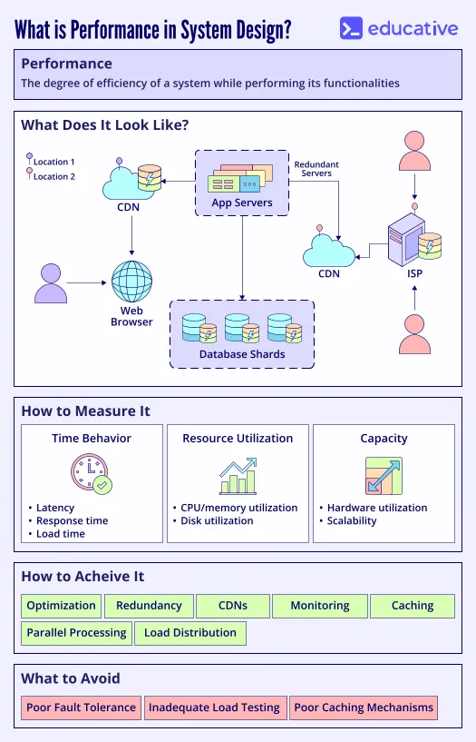
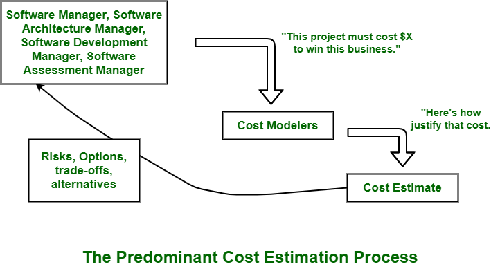

# Cost Estimation

[TOC]

Software Cost Estimation is a systematic process used to forecast the amount of effort (person-hours or person-months), duration(calendar time), and financial cost required to develop, deploy, and maintain a software product.

## Purpose

- Project Planning and Scheduling
- Tracking Progress
- Optimizing Resource Usage
- Support for Contract Discussions
- Better Team Communication
- Time and Effort Management

## Key Components

- Project Size
- Project Complexity
- Technology and Tools
- Risk and Uncertainty
- Development Duration
- Team Size and Skill Level

## Common Cost Estimation Techniques

| Technique               | Description                                                |
| ----------------------- | ---------------------------------------------------------- |
| Expert Judgment         | Based on experience and intuition of experts.              |
| Analogous Estimation    | Based on costs from previous similar projects.             |
| Top-Down Estimation     | Estimate the total cost, then divide among components.     |
| Bottom-Up Estimation    | Estimate cost for each module and sum up.                  |
| COCOMO model            | A mathematical model using inputs like LOC and complexity. |
| Function Point Analysis | Measures software by functionality delivered to the user.  |

## Steps

1. Initial Assessment by Project Leaders
2. Risk and Trade-off Analysis
3. Cost Modeling Initiation
4. Development of the Cost Estimate
5. Justification and Documentation

## Balancing Cost and Performance

Higher performance usually increases cost, so the goal is to achieve the required performance at the lowest possible cost.

### Benefits

Here are why balancing cost and performance important:

- Saving Money
- Using Resources Wisely
- Planning for Growth
- Beating the Competition
- Reducing Risks

### Factors

Several factors influence the cost and performance of a system:

1. Scope and Complexity
2. Technology and Tools
3. Requirements and Specifications
4. Scalability and Flexibility
5. Resource Allocation
6. Quality and Reliability

### Trade-Offs Between Cost and Performance Impact Architectural Decisions

Trade-offs between cost and performance profoundly influence architectural decisions in system design. Here's how:

1. Choice of Components
2. Scalability and Flexibility
3. Architectural Patterns and Design Principles
4. Cloud and Infrastructure Choices
5. Trade-offs in Reliability and Resilience

### Challenge

1. Unclear Requirements
2. Complexity
3. Limited Resources
4. Technological Constraints

### Best Practice

- Set Clear Objectives
- Prioritize Requirements
- Iterative Design Process
- Use Cost-Performance Analysis
- Modularity and Reusability

## Reference

[1] [Software Cost Estimation](https://www.geeksforgeeks.org/software-engineering/software-cost-estimation/)

[2] [Cost Vs Performance](https://www.geeksforgeeks.org/system-design/cost-vs-performance/)

[3] [Top 8 Educative Courses for System Design and API Design Interview in 2025](https://medium.com/javarevisited/top-6-system-design-and-api-design-interview-courses-from-educative-io-e9c149039410)