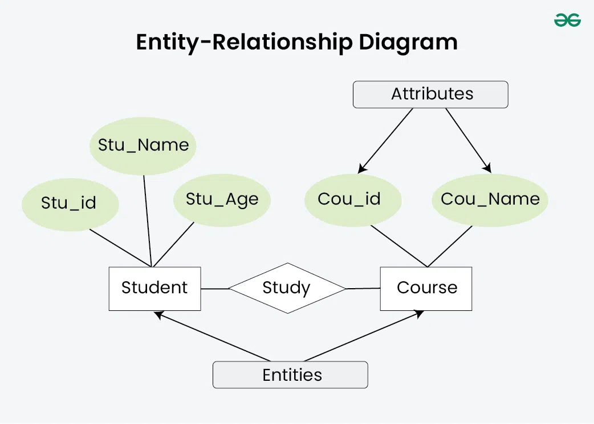
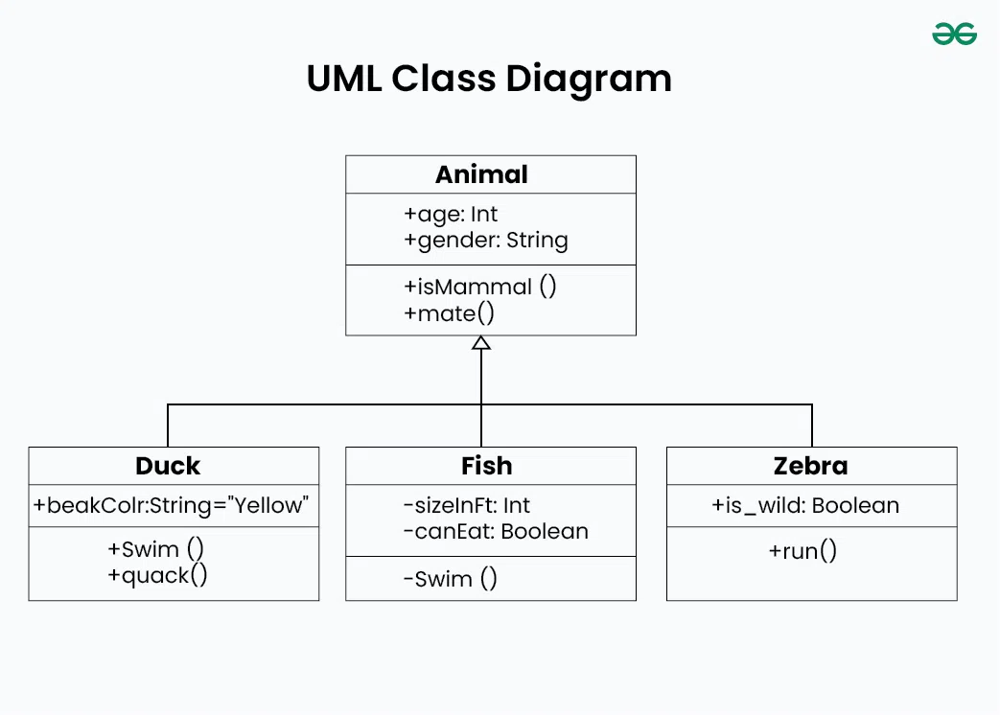
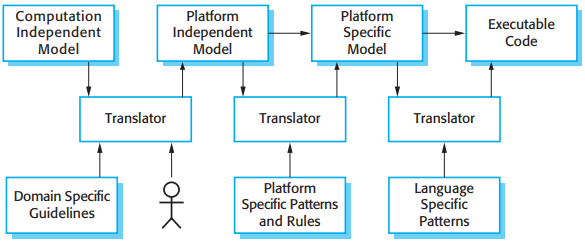

# Data Modeling

[TOC]

Importance of Data Modeling in System Design:

- Clarity and Consistency;
- Efficiency;
- Scalability;
- Data Integrity;
- Alignment with Business Requirements;
- Design Guidance.

## Types

Data models are classified into various types based on their level of abstraction, scope, and the modeling techniques used:

### Conceptual Data Model

It is a high-level, abstract representation of the entities, relationships, and attributes in a system, independent of any specific implementation details.

### Logical Data Model

It is a detailed representation of the data structures, relationships, and constraints within a system, specifying how data will be organized and stored in a database.

### Physical Data Model

It is a concrete representation of the database schema, specifying the physical storage structures, file organization, indexing mechanisms, and other implementation details.

### Hierarchical Data Model

Organizes data in a hierarchical structure, where each data element has a parent-child relationship with other elements, forming a tree-like hierarchy.

### Object-Oriented Data Model

It represents data using object-oriented concepts such as classes, objects, inheritance, encapsulation, and polymorphism.

## Notation

The data modeling notation is basically the graphical representation of data models.

### Entity-Relationship Diagrams(ERDs)

ERDs employ entities, attributes, and relationships as visual tools for portraying how the physical structure of a data model consists of its essential elements and their interconnections.

### Unified Modeling Language(UML) Class Diagrams

UML, class diagrams is another notation which is used in data modeling, especially the object-oriented design, to depict the classes, attributes, methods, and the which goes on between the objects:

- Association
- Composition and Aggregation
- Inheritance

#### Executable UML

To create an executable sub-set of UML, the number of model types has therefore been dramatically reduced to three key model types:

1. Domain models identify the principal concerns in the system. These are defined using UML class diagrams that include objects, attributes, and associations.
2. Class models, in which classes are defined, along with their attributes and operations.
3. State models, in which a state diagram is associated with each class and is used to describe the lifecycle of the class.

## Behavioral Models

Behavioral models are models of the dynamic behavior of the system as it is executing. They show what happens or what is supposed to happen when a system responds to a stimulus from its environment. You can think of these stimuli as being of two types:

1. `Data` Some data arrives that has to be processed by the system.
2. `Events` Some event happens that triggers system processing. Events may have associated data but this is not always the case.

## Model-driven Architecture

The MDA(model-driven architecture) method recommends that three types of abstract system models should be produced:

1. A computation-independent model (CIM) that models the important domain abstractions used in the system.
2. A platform-independent model (PIM) that models the operation of the system without reference to its implementation.
3. Platform-specific models (PSM) which are transformations of the platform-independent model, with a separate PSM for each application platform.

*Multiple platform-specific models*

## Reference

[1] Ian Sommerville. SOFTWARE ENGINEERING . 9th Edition

[2] [Data Modeling in System Design](https://www.geeksforgeeks.org/system-design/data-modeling-in-system-design/)