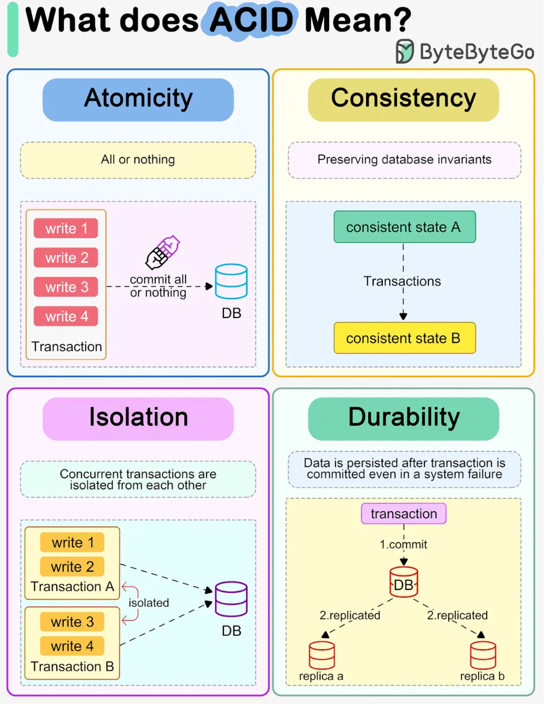
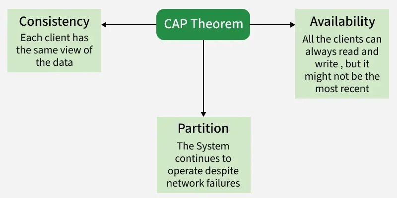
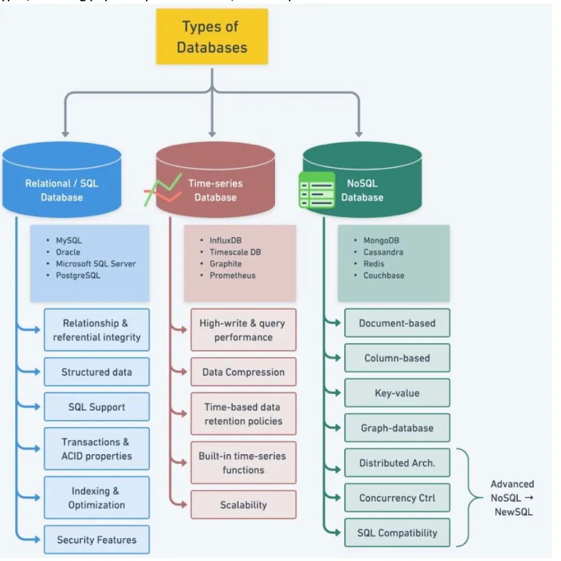
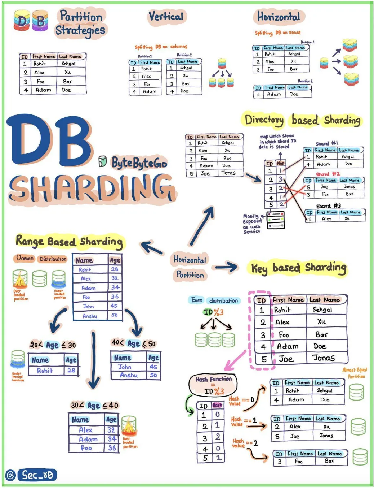
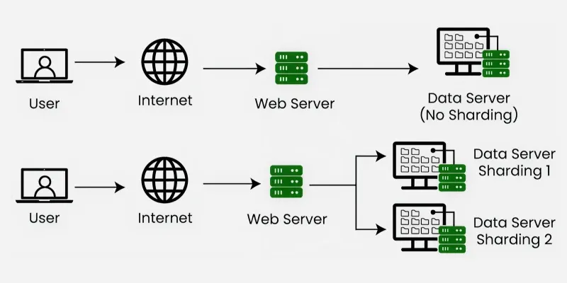
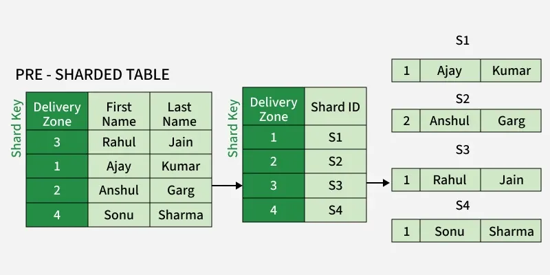
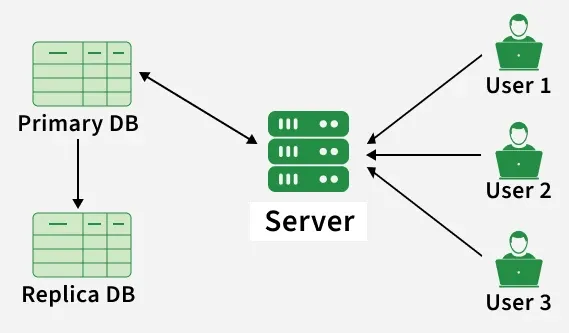
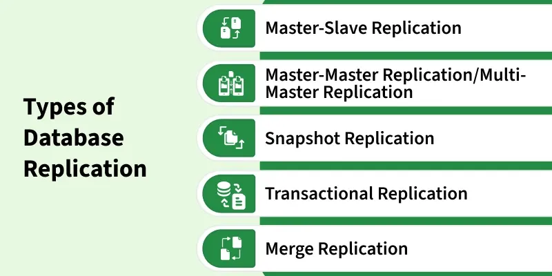
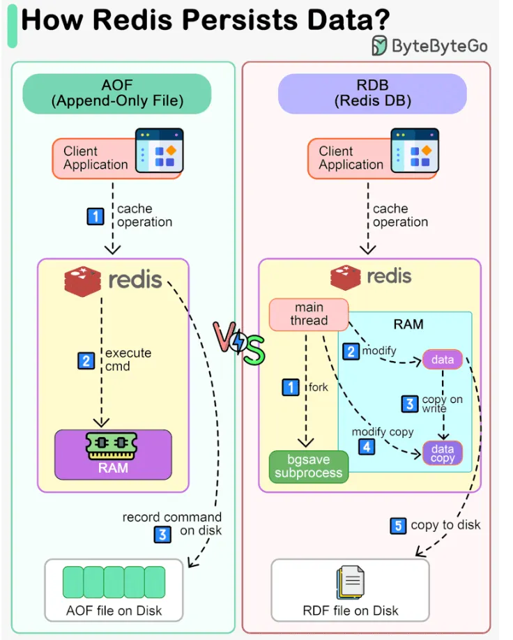
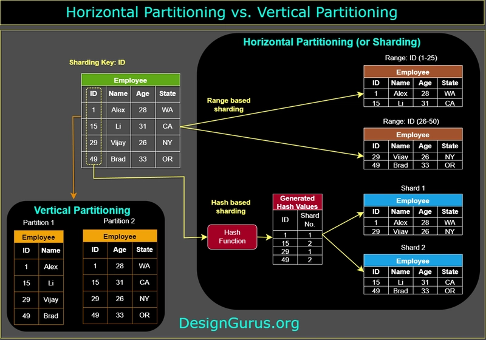

[中文版](db_zh.md) | English

# Database Design

[TOC]


## ACID




## CAP Theorem In Database Designing



According to the CAP theorem, only two of the three desirable characteristics consistency, availability, and partition tolerance can be shared or present in a networked shared-data system or distributed system.

### CP Database

A CP database prioritizes Consistency and Partition Tolerance from the CAP theorem, it sacrifices Availability, meaning the system might not respond during network issues to maintain data accuracy.

### AP Database

An AP database is a type of database that prioritizes Availability and Partition Tolerance from the CAP theorem, it sacrifices Consistency, meaning different nodes might have slightly different data from a short time.

### CA Database

A CA database is a type of database that prioritizes Consistency and Availability from the CAP theorem, it sacrifices Partition Tolerance meaning that if there is a network issue, the database might stop functioning rather than returning inconsistent or unavailable data.

---


## Types



Types of Databases in System Design:

- Relational Databases
- NoSQL Databases
- NewSQL Databases
- Time-Series Databases
- Object-Oriented Databases

### Relational vs Non-Relational Databases

Here are a few key factors to consider when choosing the right database:

| Factor                          | Relational Databases                                         | Non-Relational Databases                                     |
| ------------------------------- | ------------------------------------------------------------ | ------------------------------------------------------------ |
| Data Structure                  | If your data is structured, and you need to handle complex relationships. | If your data is unstructured or semi-structured.             |
| Scalability Needs               | Typically scale vertically(adding more power to a single server). | Of ten scale horizontally(adding more servers to distribute the load). |
| Consistency vs Availability     | If your application requires strong consistency.             | If your application needs to be highly available and can tolerate some inconsistency for a short time. |
| Transaction Support             | If you need ACID properties(Atomicity, Consistency, Isolation, Durability) for transaction. | If your system can work without strict transaction guarantees. |
| Development Speed & Flexibility | If you need a stable, structured design.                     | If your project evolve rapidly or need to handle changing types of data. |

---


## Data Sharding And Partitioning



### Data Sharding



Database Sharding is especially useful when a database becomes too large to fit on a single machine or when the traffic load is too high for one server to handle. It helps distribute the load across multiple server.

#### Key Based Sharding


Key-Based Sharding uses a hash function on a shard key. The generated hash value decides which shard will store the data.

Advantages:

- Key-based sharding assigns each key to a specific shard, ensuring uniform and consistent data distribution.
- It can be optimized to efficiently handle queries over consecutive key ranges.

Disadvantages:

- Uneven data distribution can occur if the sharding key isn't well-distributed.
- Scalability may be limited when certain keys receive heavy traffic or data is skewed.
- Choosing the right sharding key is crucial for effective sharding.

#### Horizontal or Range Based Sharding


In Horizontal or Range Based Sharding, we divide the data by separating it into different parts based on the range of a specific value within each record.

Advantages:

- Scalability: Horizontal or range-based sharding allows for seamless scalability by distributing data across multiple shards, accommodating growing datasets.
- Improved Performance: Data distribution among shards enhances query performance through parallelization, ensuring faster operations with smaller subsets of data handled by each shard.

Disadvantages:

- Complex Querying Across Shards: Coordinating queries involving multiple shards can be challenging.
- Uneven Data Distribution: Poorly managed data distribution may lead to uneven workloads among shards.

#### Vertical Sharding


In Vertical Sharding, we split the entire column from the table and we put those columns into new distinct tables. Data is totally independent of one partition to the other ones. Also, each partition holds both distinct rows and columns. We can split different features of an entity in different shards on different machines.

Advantages:

- Query Performance: Vertical sharding can improve query performance by allowing each shard to focus on a specific subset of columns. This specialization enhances the efficiency of queries that involve only a subset of the available columns.
- Simplified Queries: Queries that require a specific set of columns can be simplified, as they only need to interact with the shard containing the relevant columns.

Disadvantages:

- Potential for Hotspots: Certain shards may become hotspots if they contain highly accessed columns, leading to uneven distribution of workloads.
- Challenges in Schema Changes: Making changes to the schema, such as adding or removing columns, may be more challenging in a vertically sharded system. Changes can impact multiple shards and require careful coordination.

#### Directory-Based Sharding



In Directory-Based Sharding, we create and maintain a lookup service or lookup table for the original database. Basically we use a shard key for lookup table and we do mapping for each entity that exists in the database. This way we keep track of which database shards hold which data.

Advantages:

- Flexible Data Distribution: Directory-based sharding allows for flexible data distribution, where the central directory can dynamically manage and update the mapping of data to shard locations.
- Efficient Query Routing: Queries can be efficiently routed to the appropriate shard using the information stored in the directory. This results in improved query performance.
- Dynamic Scalability: The system can dynamically scale by adding or removing shards without requiring changes to the application logic.

Disadvantages:

- Centralized Point of Failure: The central directory represents a single point of failure. If the directory becomes unavailable or experiences issues, it can disrupt the entire system, impacting data access and query routing.
- Increased Latency: Query routing through a central directory introduces an additional layer, potentially leading to increased latency compared to other sharding strategies.

### Data Partitioning

Partitioning helps improve query performance by limiting the amount of data the system has to process for specific queries. It also makes it easier to manage large datasets.

---


## Database Replication

Database replication in system design means creating and maintaining multiple copies of the same database on different servers. If one database server fails, another replica can continue serving requests, ensuring the system stays online.

Database replication is important for several reasons:

- High Availability
- Disaster Recovery
- Load Balancer/Load Balancing
- Fault Tolerance
- Scalability
- Data Locality

### Working of Database Replication

Here are the steps explaining how database replication works:



1. Identify the Primary Database(Source);
2. Set up Replica Databases(Targets);
3. Data changes captured;
4. Transmit changes to replicas;
5. Apply changes on replicas;
6. Monitor and maintain synchronization;
7. Read or write operations.

### Types of Database Replication



- Master-Slave Replication
- Master-Master Replication/Multi-Master Replication
- Snapshot Replication
- Transactional Replication
- Merge Replication

### Strategies for Database Replication

Some common database replication strategies include the following:

- Full Replication
- Partial Replication
- Selective Replication
- Sharding
- Hybrid Replication

### Configurations of Database Replication

To accomplish particular objectives related to data consistency, availability, and performance, database replication can be set up and run in a variety of ways:

- Synchronous Replication Configuration
- Asynchronous Replication Configuration
- Semi-synchronous Replication Configuration

---


## Database Persists

### Redis



---


## Database Normalization And Denormalization

TODO

---


## General Cache System

### Cache System Evaluation Metrics

- Strong Consistency
  1. Any read can always get the latest written data (eventual consistency)
  2. All processes in the system see operations in the same order as a global clock
- Weak Consistency
  1. After data is updated, it is acceptable if subsequent accesses can only see part of the update or none at all
- Concurrency
  1. Concurrent read/write on a single table/database
  2. Concurrent read/write on multiple tables/databases

### Data Consistency Solutions

#### Solution 1: Delete Cache First, Then Update Database


- Write Operation
  1. Delete cache data first
  2. Update database data to avoid dirty data
  3. Asynchronously refresh data back to cache

- Read Operation
  1. Read cache data
  2. If cache miss, read from database
  3. Asynchronously refresh data back to cache

Advantages:

1. The whole process is very simple, suitable for low concurrency scenarios

Disadvantages:

1. Insufficient disaster recovery
   What if deleting the cache fails in step 1 of writing? If you continue, the cache may always have stale data.

2. Concurrency issues
   - Write-Write Concurrency
     If multiple services update the database at the same time, operation order cannot be guaranteed, leading to overwrites
   - Read-Write Concurrency
     If consumer A reads and consumer B writes at the same time, the process is as follows:
     1. B deletes cache data v1
     2. A reads cache, cache miss
     3. A reads database, gets v1
     4. B updates database data to v2
     5. B writes v2 to cache
     6. A writes v1 to cache
        Now, A's "dirty data" overwrites B's updated cache, so cache is still v1. This solution cannot guarantee eventual consistency.

     Diagram:

     ```sequence
     Title: Read-Write Concurrency Exception
     B->Cache: 1. Delete cache data v1
     A->Cache: 2. Read cache data
     Cache-->A: Cache miss
     A->DB: Read database data
     DB-->A: Return data v1
     B->DB: Update database data to v2
     B->Cache: Update cache data to v2
     A->Cache: Update cache data to v1
     ```

Summary:

Use case: Scenarios with low concurrency and low consistency requirements

Because the cache refresh strategy may fail, and after failure the cache may always be in an incorrect state, this solution cannot guarantee eventual consistency or safe concurrent read/write.

#### Solution 2: Delete Cache First, Then Update Database, with Binlog Mechanism


- Write Operation
  1. Delete cache data
  2. Update database
  3. Listen to database binlog to find data to refresh
  4. Read database data
  5. Write data to cache
- Read Operation
  1. Read cache data
  2. If cache miss, read from database
  3. Asynchronously refresh data back to cache

Advantages:

1. If step 4 or 5 of writing fails, you can replay logs and retry
2. Whether or not step 1 succeeds, the cache will be refreshed later

Disadvantages:

1. Concurrency issues
   Ineffective when cache is empty:
   - When reading, cache data is already invalid, and an update happens
   - When updating, cache data is already invalid, and another update happens

Summary:

Use case: Simple business, low read/write QPS

Binlog is used to refresh cache, and its natural ordering is advantageous for synchronization. But when binlogs from different rows, tables, or databases are consumed simultaneously, binlog is not strictly sequential.

Examples:
- [Alibaba open source: canal](https://github.com/alibaba/canal)
- [LinkedIn open source: databus](https://github.com/linkedin/databus)

#### Solution 3: Add MQ Serialization Mechanism on Top of Solution 2


- Write Operation
  1. Delete cache first
  2. Update database
  3. Listen to database binlog, analyze which data needs to be refreshed
  4. Push data identifier to MQ
  5. Consume data identifier from MQ, read data from database
  6. Update cache
- Read Operation
  1. Read cache first
  2. If cache miss, read from database
  3. Push data identifier to MQ
  4. Consume data identifier from MQ, read data from database
  5. Update cache

Advantages:

1. Complete disaster recovery
   - Step 1 delete cache fails: will be overwritten later
   - Step 4 write to MQ fails: Databus or Canal will retry
   - Step 5 or 6 fails: MQ supports re-consume
   - Step 3 of read, write to MQ fails: does not affect cache, next time will still read database

2. Serialization
   With MQ, read and write operations are serialized, so no concurrency issues

Disadvantages:

1. Step 5 of writing always reads database, increasing DB load (but only one extra read per write, not a big problem)

#### Solution 4: Add Marking Mechanism on Top of Solution 3


- Write Operation
  1. Mark the data to be modified as "being modified" with a valid time; if marking fails, abandon this modification
  2. Update database
  3. Delete cache
  4. Listen to database binlog, analyze which data needs to be refreshed
  5. Push data identifier to MQ
  6. Consume data identifier from MQ, read data from database
  7. Update cache
- Read Operation
  1. Check data mark; if marked, read database directly and finish
  2. If not marked, read cache first
  3. If cache miss, read from database
  4. Push data identifier to MQ
  5. Consume data identifier from MQ, read data from database
  6. Update cache

### Cache System Components

- Redis
- ...

### Common Cache System Issues

#### Cache Penetration

If neither cache nor database has the data, but users keep sending requests, every request hits the database, overwhelming it

Solutions:

1. Business layer validation
   Check user requests and block invalid ones
2. For data not found, set value as NULL in cache with a short expiration
3. Bloom filter
   Use Bloom filter to check if data exists before querying

#### Cache Breakdown

When a hot key in cache expires, a large number of requests come in, all hitting the database and overwhelming it

Solutions:

1. Set hot data to never expire
   For frequently read data, set it to never expire
2. Periodically update expiration
   Before expiration, refresh the expiration (keep-alive)
3. Mutex lock
   Use a value in cache as a lock; set to 1/true when locked, 0/false when released (remember to set expiration to avoid deadlock); to modify DB, must acquire the lock first

#### Cache Avalanche

When a large amount of cached data expires or cache crashes, a flood of requests hit the database, overwhelming it

Solutions:

1. Stagger data expiration times; don't let all expire at once
2. Data preheating: pre-cache data before a large number of requests arrive
3. Ensure high cache availability, use clustering

---


## Summary

### Horizontal Partitioning vs Vertical Partitioning



| Feature                  | Vertical Partitioning                                        | Horizontal Partitioning                                      |
| ------------------------ | ------------------------------------------------------------ | ------------------------------------------------------------ |
| Definition               | Dividing a table into smaller tables based on columns.       | Dividing a table into smaller tables based on rows(usually ranges of rows). |
| Purpose                  | Reduce the number of columns in a table to improve query performance and reduce I/O. | Divide a table into smaller tables to manage large volumes of data efficiently. |
| Data distribution        | Columns with related data are placed together in the same table. | Rows with related data(typically based on a range or a condition) are placed together in the same table. |
| Query performance        | Improves query performance when queries only involve specific columns that are part of a partition. | Improves query performance when queries primarily access a subset of rows in a large table. |
| Maintenance and indexing | Easier to manage and index specific columns based on their characteristics and access patterns. | Each partition can be indexed independently, making indexing more efficient. |
| Joins                    | May require joins to combine data from multiple partitions when querying. | Joins between partitions are typically not needed, as they contain disjoint sets of data. |
| Data integrity           | Ensuring data consistency across partitions can be challenging. | Easier to maintain data integrity, as each partition contains a self-contained subset of data. |
| Use cases                | Commonly used for tables with a wide range of columns, where not all columns are frequently accessed together. | Commonly used for tables with a large number of rows, where data can be grouped based on some criteria(e.g., data ranges). |


---


## References

[1] [Database Replication in System Design](https://www.geeksforgeeks.org/system-design/database-replication-and-their-types-in-system-design/)

[2] [Introduction to Database Normalization](https://www.geeksforgeeks.org/dbms/introduction-of-database-normalization/)

[3] [Denormalization in Databases](https://www.geeksforgeeks.org/dbms/denormalization-in-databases/)

[4] [Top 50 System Design Interview Questions for 2026](https://dev.to/somadevtoo/top-50-system-design-interview-questions-for-2024-5dbk)

[5] [System Design CheatSheet for Interview](https://medium.com/javarevisited/system-design-cheatsheet-4607e716db5a)
