[中文版](db_zh.md) | English

# Database Design

[TOC]

## ACID

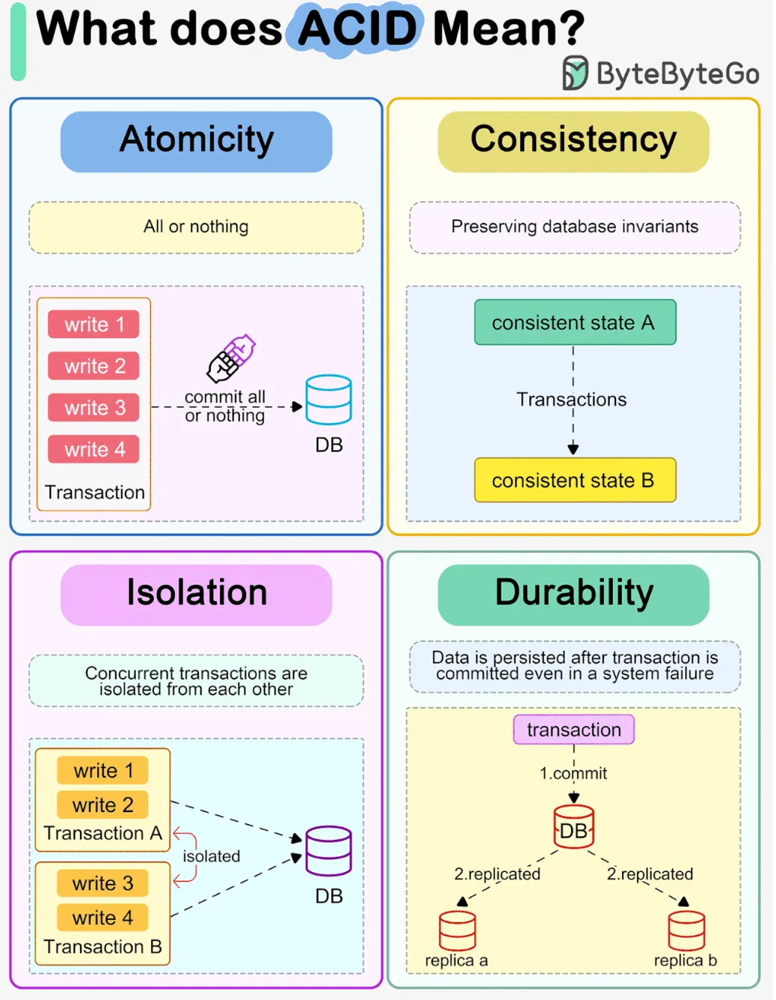

---

## CAP Theorem In Database Designing

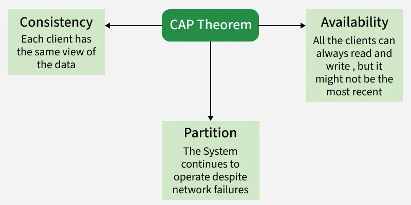

- Consistency

  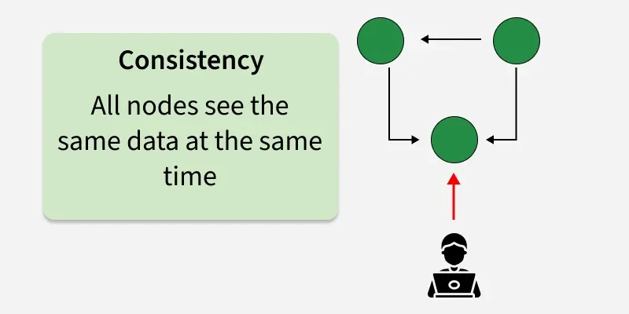

  Consistency defines that all clients see the same data simultaneously, no matter which node they connect to in a distributed system. For eventual consistency, the guarantees are a bit loose. Eventual consistency guarantee means client will eventually see the same data on all the nodes at some point of time in the future.

- Availability

  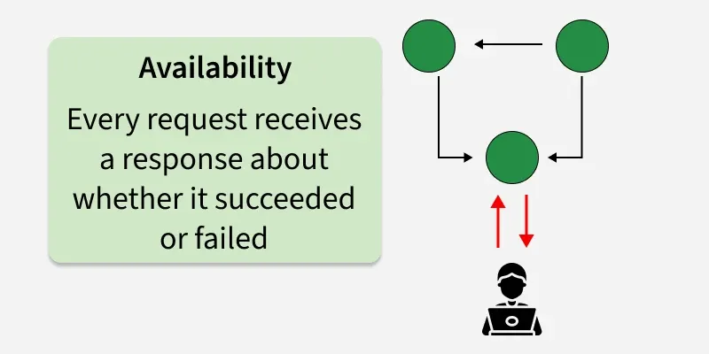

  Availability defines that all non-failing nodes in a distributed system return a response for all read and write requests in a bounded amount of time, even if one or more other nodes are down.

- Partition Tolerance

  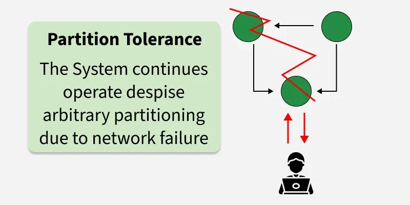

  Partition Tolerance defines that the system continues to operate despite arbitrary message loss or failure in parts of the system. Distributed systems guaranteeing partition tolerance can gracefully recover from partitions once the partition heals.

According to the CAP theorem, only two of the three desirable characteristics, consistency, availability, and partition tolerance, can be shared or present in a networked shared-data system or distributed system.

### CP Database

A CP database prioritizes Consistency and Partition Tolerance from the CAP theorem; it sacrifices Availability, meaning the system might not respond during network issues to maintain data accuracy.

### AP Database

An AP database is a type of database that prioritizes Availability and Partition Tolerance from the CAP theorem; it sacrifices Consistency, meaning different nodes might have slightly different data for a short time.

### CA Database

A CA database is a type of database that prioritizes Consistency and Availability from the CAP theorem; it sacrifices Partition Tolerance, meaning that if there is a network issue, the database might stop functioning rather than returning inconsistent or unavailable data.

---

## Database Types

- Relational Databases (SQL)

  Relational databases in system design are structured storage systems that organize data into tables, each with predefined columns and rows. They ensure data integrity and facilitate efficient querying through Structured Query Language (SQL).

- Non-Relational Databases (NoSQL)

  NoSQL databases handle large volumes of unstructured or semi-structured data with high scalability and flexibility. They support distributed systems and are ideal for modern, high-performance applications.

- NewSQL Databases

  NewSQL databases combine the benefits of traditional relational databases (ACID transactions and strong consistency) with the scalability and performance of NoSQL systems. They emerged to overcome the limitations of traditional databases in handling modern big data and distributed computing needs.

- Time-Series Databases

  Time series databases are specialized databases optimized for storing and querying time-stamped data points or measurements. They excel at handling large volumes of sequential data generated over time, such as sensor data, financial market data, IoT telemetry, and log data from applications or systems.

- Object-Oriented Databases

  Object-oriented databases (OODBs) are databases that store data in the form of objects, akin to object-oriented programming concepts. Unlike relational databases that store data in tables, OODBs directly store complex data structures as objects, along with their attributes and methods.

### MongoDB

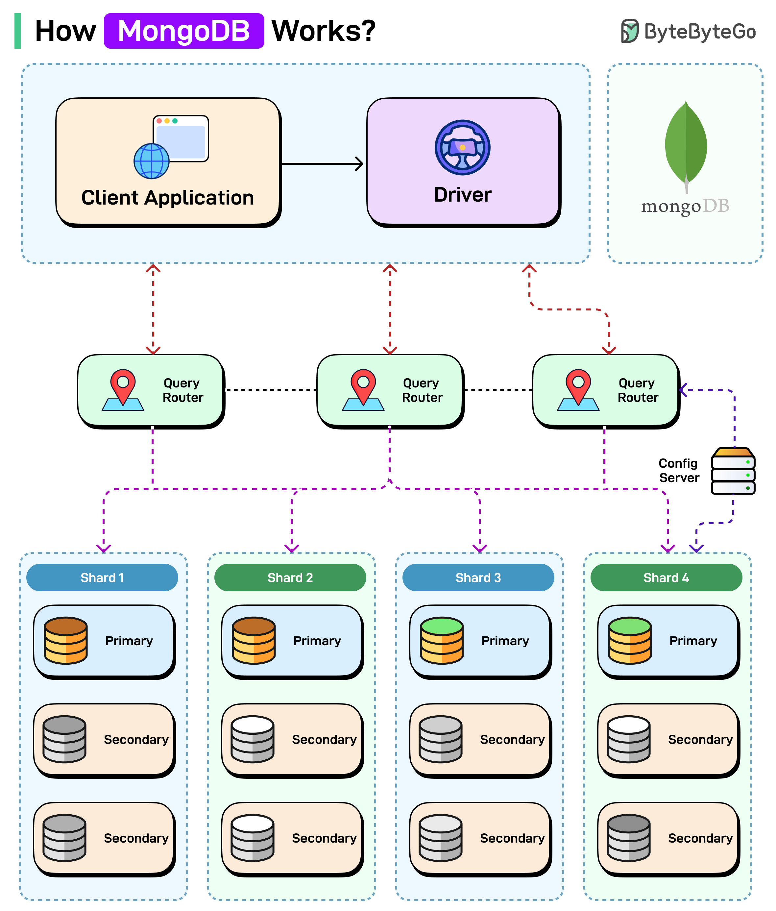

MongoDB is a popular NoSQL database designed for flexibility, scalability, and high performance. It stores data in a JSON-like format (BSON) and supports horizontal scaling through sharding and replication.

MongoDB uses a form of Eventual Consistency called "Eventual Consistency with Immediate Consistency for most reads." This means that while MongoDB does not guarantee immediate consistency for all reads, it does guarantee that after a write operation, the data will eventually be consistent across all replicas.

### PostgreSQL

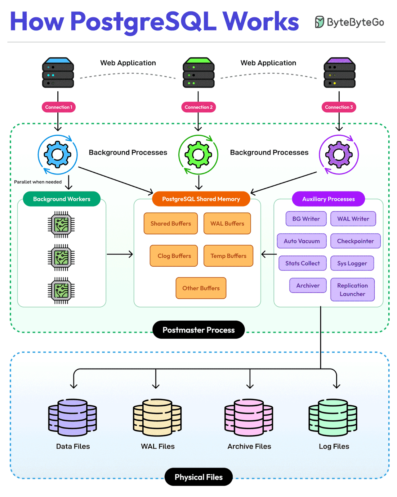

The key points about PostgreSQL’s Architecture are as follows:

1. PostgreSQL supports concurrent client connections independently. Each client connection to PostgreSQL creates a dedicated server process.
2. The Postmaster Process is the main supervisor that manages all other PostgreSQL processes. It controls the entire database instance.
3. Background workers run parallel processes when needed to handle specialized tasks.
4. PostgreSQL shared memory is a central memory area containing multiple buffers such as Shared, WAL, Clog, and Temporary buffers. All components communicate through this shared memory.
5. PostgreSQL also has several auxiliary processes such as:
   - BG Writer: Manages background writing
   - WAL Writer: Handles write-ahead logging
   - Auto Vacuum: Maintains database cleanliness
   - Checkpointer: Ensures data consistency
   - Stats Collector: Gathers statistics
   - System Logger: Manages Logging
   - Archiver: Handles archiving
   - Replication launcher: Manages replication
6. PostgreSQL has different types of physical files for varied needs such as:
   - Data Files: Stores actual database data
   - WAL Files: Write-ahead log storage
   - Archive Files: Backup and recovery data
   - Log Files: System and error logs

### Redis

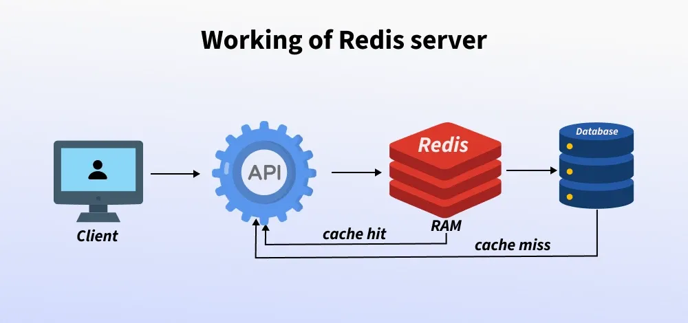

1. Request Handling

   When a client sends a request, it is first routed through the API Gateway. The API Gateway checks Redis (cache) to see if the requested data is already available.

2. Cache Hit

   If the data is found in Redis, it is immediately returned to the client. This avoids querying the main database and significantly improves response time.

3. Cache Miss

   If the data is not present in Redis, the request is forwarded to the main database. The database processes the request and returns the required data to the application.

4. Cache Update

   After fetching data from the database, it is stored in Redis for future use. This ensures that subsequent requests for the same data can be served faster.

5. Response to Client

   The final response is sent back to the client through the API Gateway. The data may come from either Redis (cache) or the main database depending on availability.

---

## Database Scaling

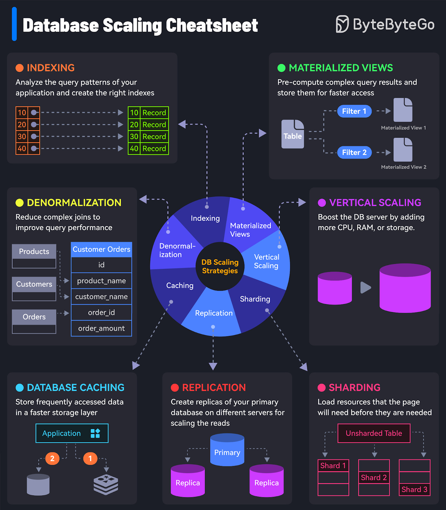

Database scaling is the process of adapting and expanding the database infrastructure to accommodate growth and maintain performance under increased load. It involves employing various techniques and strategies to distribute data efficiently, optimize query execution, and utilize hardware resources judiciously.

---

## Data Sharding And Partitioning

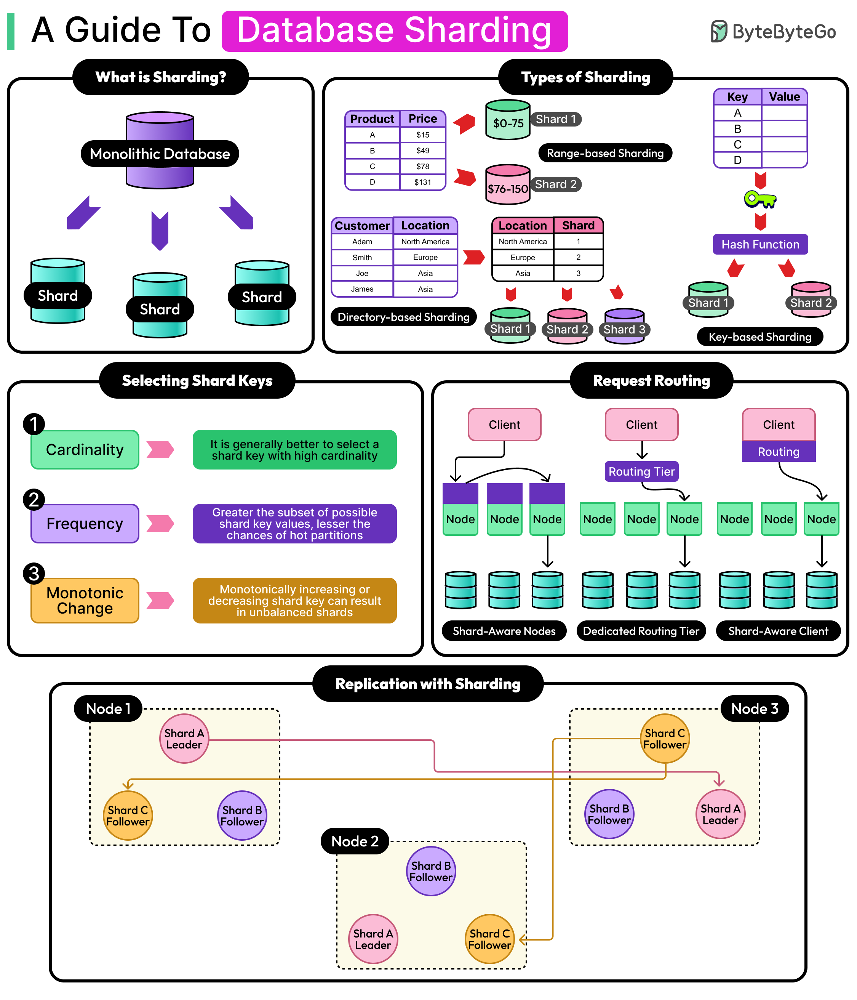

Sharding splits a large database into smaller, independent chunks called shards. Each shard handles a subset of the data, allowing traffic and storage to scale out across multiple machines instead of piling onto one.

But sharding is a major shift with real consequences. Application logic often needs to adapt. Query patterns change, and joins become harder. Transactions span physical boundaries. There’s overhead in managing routing, rebalancing, and failover.

### Data Sharding

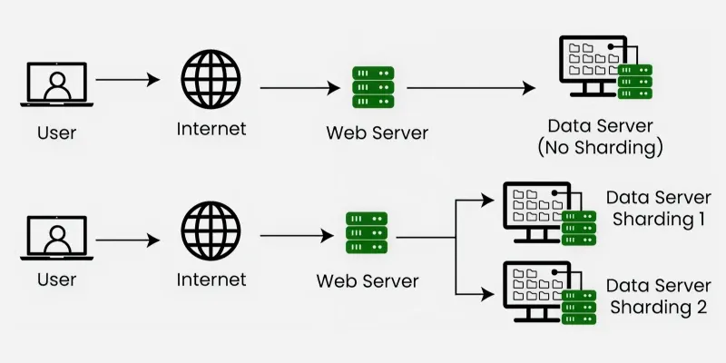

Database Sharding is especially useful when a database becomes too large to fit on a single machine or when the traffic load is too high for one server to handle. It helps distribute the load across multiple servers.

#### Key-Based Sharding

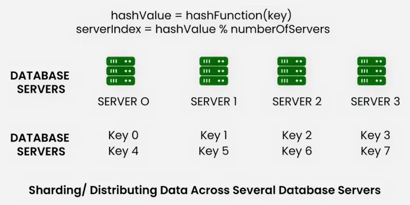

Key-Based Sharding uses a hash function on a shard key. The generated hash value decides which shard will store the data.

Advantages:

- Key-based sharding assigns each key to a specific shard, ensuring uniform and consistent data distribution.
- It can be optimized to efficiently handle queries over consecutive key ranges.

Disadvantages:

- Uneven data distribution can occur if the sharding key isn't well-distributed.
- Scalability may be limited when certain keys receive heavy traffic or data is skewed.
- Choosing the right sharding key is crucial for effective sharding.

#### Horizontal or Range-Based Sharding

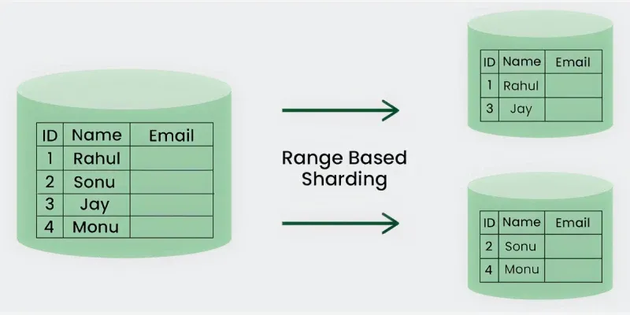

In Horizontal or Range-Based Sharding, we divide the data by separating it into different parts based on the range of a specific value within each record.

Advantages:

- Scalability: Horizontal or range-based sharding allows for seamless scalability by distributing data across multiple shards, accommodating growing datasets.
- Improved Performance: Data distribution among shards enhances query performance through parallelization, ensuring faster operations with smaller subsets of data handled by each shard.

Disadvantages:

- Complex Querying Across Shards: Coordinating queries involving multiple shards can be challenging.
- Uneven Data Distribution: Poorly managed data distribution may lead to uneven workloads among shards.

#### Vertical Sharding

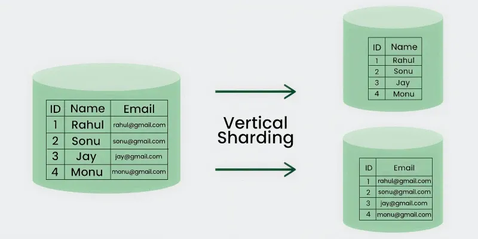

In Vertical Sharding, we split the entire column from the table and we put those columns into new distinct tables. Data is totally independent of one partition to the other ones. Also, each partition holds both distinct rows and columns. We can split different features of an entity in different shards on different machines.

Advantages:

- Query Performance: Vertical sharding can improve query performance by allowing each shard to focus on a specific subset of columns. This specialization enhances the efficiency of queries that involve only a subset of the available columns.
- Simplified Queries: Queries that require a specific set of columns can be simplified, as they only need to interact with the shard containing the relevant columns.

Disadvantages:

- Potential for Hotspots: Certain shards may become hotspots if they contain highly accessed columns, leading to uneven distribution of workloads.
- Challenges in Schema Changes: Making changes to the schema, such as adding or removing columns, may be more challenging in a vertically sharded system. Changes can impact multiple shards and require careful coordination.

#### Directory-Based Sharding

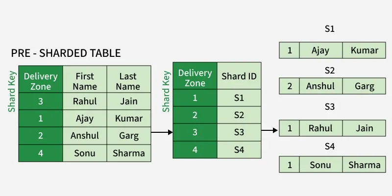

In Directory-Based Sharding, we create and maintain a lookup service or lookup table for the original database. Basically we use a shard key for lookup table and we do mapping for each entity that exists in the database. This way we keep track of which database shards hold which data.

Advantages:

- Flexible Data Distribution: Directory-based sharding allows for flexible data distribution, where the central directory can dynamically manage and update the mapping of data to shard locations.
- Efficient Query Routing: Queries can be efficiently routed to the appropriate shard using the information stored in the directory. This results in improved query performance.
- Dynamic Scalability: The system can dynamically scale by adding or removing shards without requiring changes to the application logic.

Disadvantages:

- Centralized Point of Failure: The central directory represents a single point of failure. If the directory becomes unavailable or experiences issues, it can disrupt the entire system, impacting data access and query routing.
- Increased Latency: Query routing through a central directory introduces an additional layer, potentially leading to increased latency compared to other sharding strategies.

### Data Partitioning

Partitioning helps improve query performance by limiting the amount of data the system has to process for specific queries. It also makes it easier to manage large datasets.

#### Horizontal Partitioning

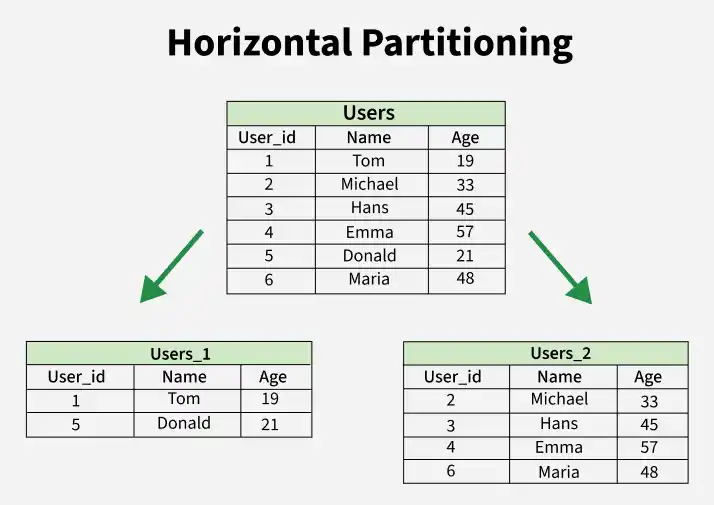

Horizontal Partitioning divides data by rows, but all partitions may still exist on the same server. When these horizontal partitions are placed across multiple servers, the approach is called [Sharding](#Data Sharding).

Advantages:

- Scalability: Allows parallel processing of large datasets across multiple nodes.
- Load Balancing: Distributes workload evenly, reducing system bottlenecks.
- Fault Tolerance: Each partition works independently, improving reliability during failures.

Disadvantages:

- Complex Joins: Joins across multiple partitions can be slower and harder to manage.
- Data Skew: Uneven data distribution may cause certain partitions to handle more load than others.

#### Vertical Partitioning

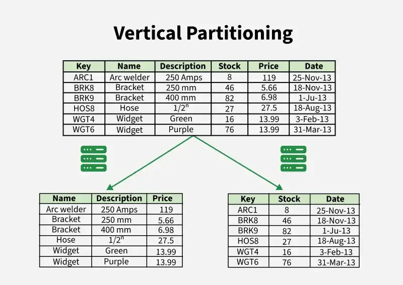

Vertical partitioning divides a dataset based on columns (attributes) instead of rows. Each partition contains only a subset of columns for all rows, depending on access patterns. It is useful when different columns are accessed more frequently or independently.

Advantage:

- Better Query Performance: Reduces data read by isolating frequently accessed columns.
- Efficient Retrieval: Fetches only needed columns, saving I/O and storage.
- Easier Schema Changes: Simplifies adding or removing columns.

Disadvantages:

- Query Complexity: Queries may need to access multiple partitions.
- Slower Joins: Combining data from different partitions adds overhead.
- Limited Scalability: Not ideal for datasets with rapidly growing columns.

#### Key-Based Partitioning

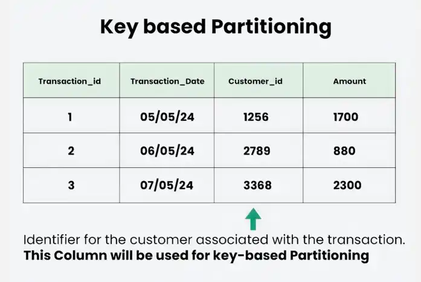

Divides data based on a specific key or attribute, with each partition holding all data related to that key. Common in distributed systems for uniform data distribution and efficient key-based lookups.

Advantages:

- Even Distribution: Stores data with the same key together for efficient lookups.
- Scalability: Enables parallel processing across partitions.
- Load Balancing: Distributes workload to avoid performance bottlenecks.

Disadvantages:

- Data Skew: Uneven key access can create hotspots.
- Limited Flexibility: Less efficient for range or multi-key queries.
- Partition Overhead: Requires careful management as data or key patterns evolve.

#### Range Partitioning

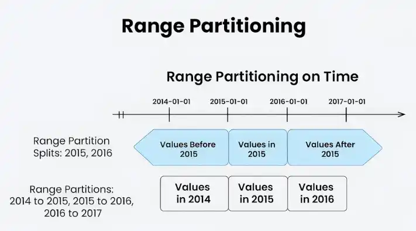

The dataset is divided using range partitioning based on a preset range of values. For example, if your dataset has timestamps, you can divide it according to a specific time range. Range partitioning might be useful when you have data with natural ordering and wish to distribute it evenly based on the range of values.

Advantage:

- Natural Ordering: Ideal for data with an inherent range-based structure.
- Efficient Range Queries: Quickly locates data within specified value ranges.
- Simplified Query Planning: System easily identifies relevant partitions for range conditions.

Disadvantage:

- Data Skew: Uneven data across ranges can affect performance.
- Growth Management: Adding or adjusting ranges requires ongoing maintenance.
- Complex Joins: Joins and non-contiguous range queries can be slower and harder to manage.

#### Hash-Based Partitioning

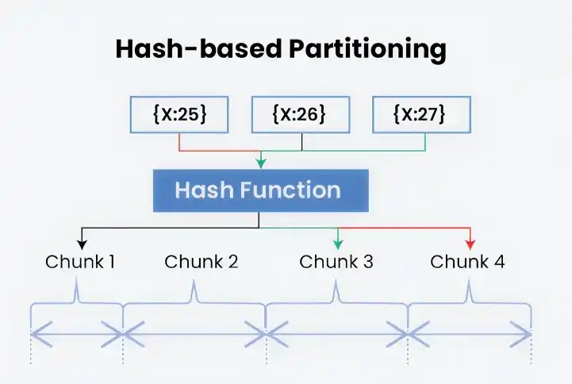

Hash partitioning uses a hash function to map data into different partitions. The hash value determines which partition the data belongs to, enabling even distribution and faster lookup. It helps with load balancing by spreading data randomly across partitions and improves data retrieval performance by reducing hotspots.

Advantage:

- Even Distribution: Randomized hashing spreads data uniformly across partitions.
- Scalability: Supports parallel processing across multiple nodes.
- Simplicity: Easy to implement and doesn’t rely on data order.

Disadvantage:

- Inefficient Lookups: Poor performance for key-based or range queries.
- Possible Imbalances: Hashing may not always ensure perfect load distribution.
- Maintenance Overhead: Scaling may require repartitioning and rehashing data.

#### Round-Robin Partitioning

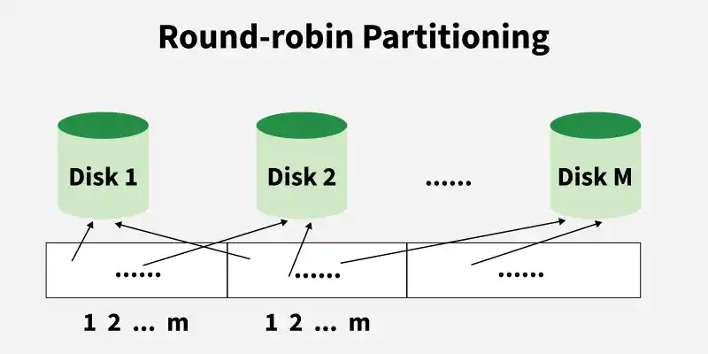

Data is cyclically and equally distributed among partitions in round-robin partitioning. Regardless of the properties of the data, each split is sequentially assigned the next accessible data item. Implementing round-robin partitioning is simple and can offer a minimal degree of load balancing.

Advantage:

- Even Data Distribution: Ensures near-uniform distribution of records across partitions.
- Simple Implementation: Very easy to implement; no hashing or key logic required.
- Good Load Balancing: Works well for write-heavy workloads and parallel processing.

Disadvantage:

- Inefficient Lookups: Poor performance for key-based or range queries.
- No Data Locality: Related records may be spread across different partitions.
- Limited Query Optimization: Not suitable for analytical queries that depend on grouping or ranges.

---

## Database Transaction

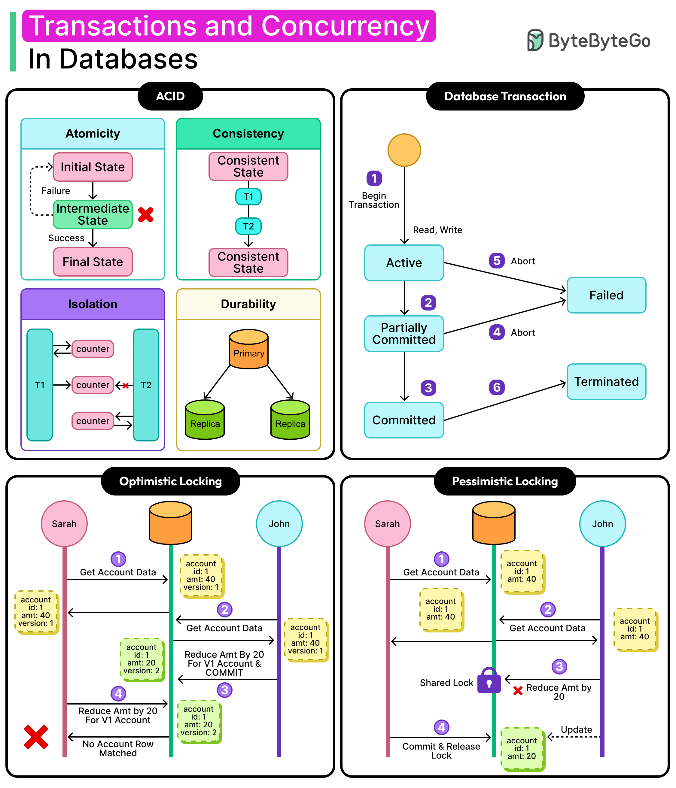

A database transaction wraps a series of actions into an all-or-nothing unit. Either the entire thing commits and becomes visible to the world, or none of it does. In other words, the goal is to have no half-finished orders, no inconsistent account balances, and no phantom bookings.

---

## Database Replication

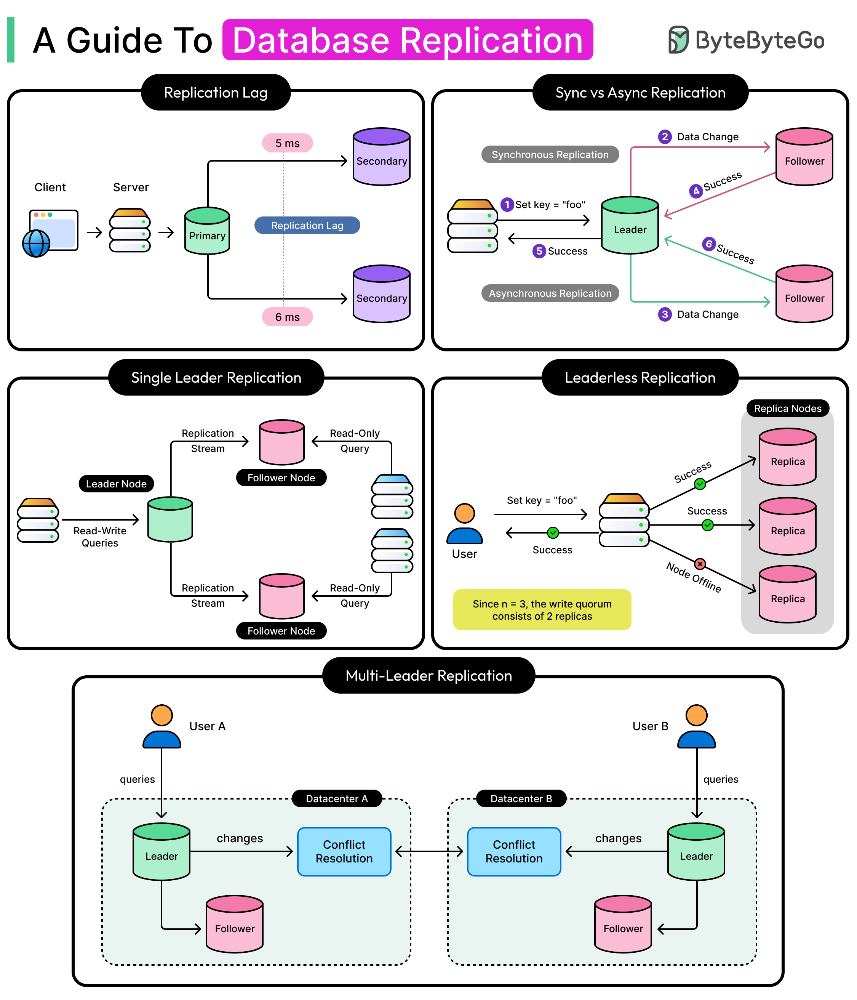

Database replication in system design means creating and maintaining multiple copies of the same database on different servers. If one database server fails, another replica can continue serving requests, ensuring the system stays online.

Database replication is important for several reasons:

- High Availability
- Disaster Recovery
- Load Balancer/Load Balancing
- Fault Tolerance
- Scalability
- Data Locality

### Working of Database Replication

Here are the steps explaining how database replication works:

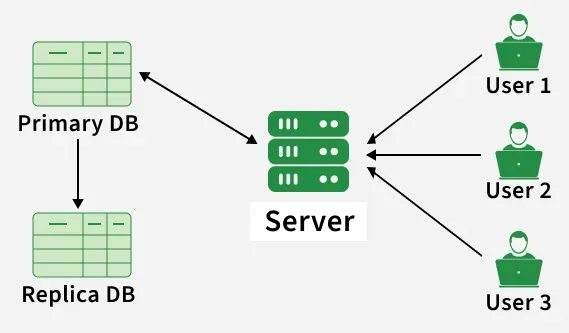

1. Identify the Primary Database(Source)

   A primary (master) database is selected as the main source where all data changes originate.

2. Set up Replica Databases(Targets)

   One or more replica databases are configured to receive data from the primary database.

3. Data changes captured

   All inserts, updates, and deletes are recorded using logs or change data capture mechanisms.

4. Transmit changes to replicas

   Captured changes are sent to replica databases either in real-time or at scheduled intervals.

5. Apply changes on replicas

   Replica databases apply the received updates to stay synchronized with the primary database.

6. Monitor and maintain synchronization

   The system continuously checks replication status and resolves delays or synchronization issues.

7. Read or write operations

   Read operations are distributed across replicas, while write operations typically go to the primary database (depending on the model).

### Types of Database Replication

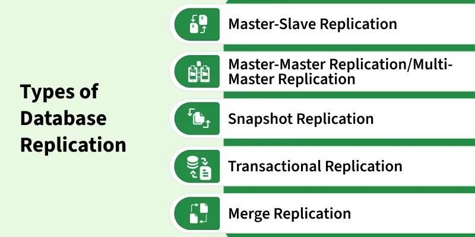

- Master-Slave Replication

  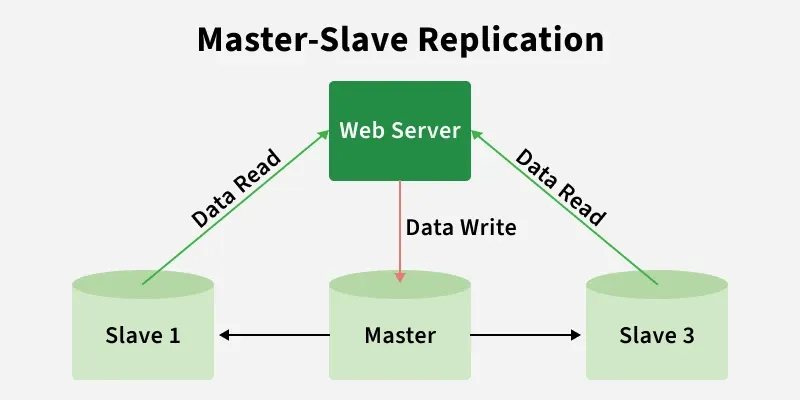

  In this replication model, one database acts as the primary server while others maintain copies of its data.

- Master-Master Replication/Multi-Master Replication

  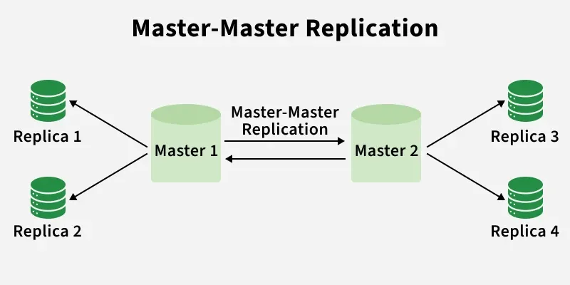

  In this setup, multiple databases act as masters and can accept both read and write operations.

- Snapshot Replication

  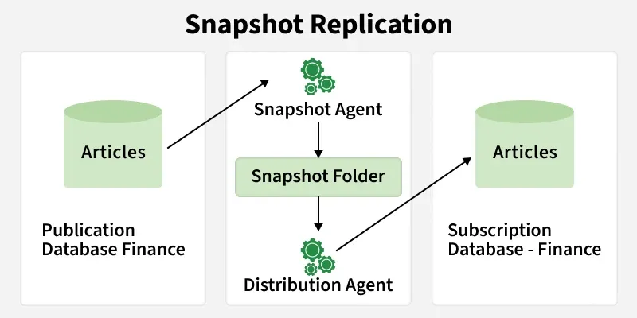

  This method replicates the entire database by taking a snapshot at a specific point in time.

- Transactional Replication

  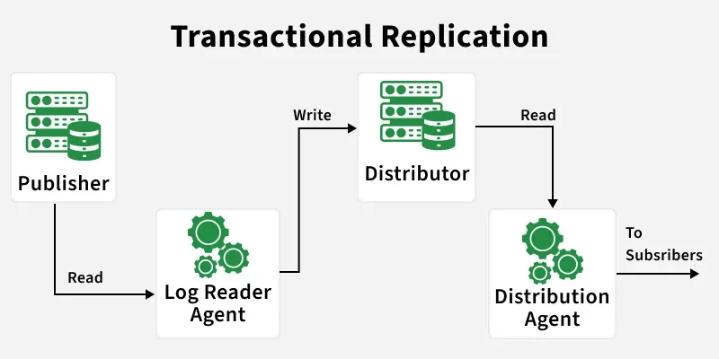

  Transactional replication synchronizes databases by replicating changes as they occur.

- Merge Replication

  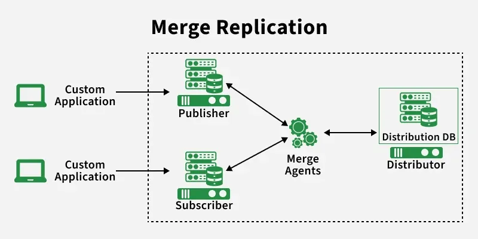
  
  Merge replication allows multiple databases to update data independently and later synchronize the changes.

| Database Replication | Pros                                                         | Cons                                                         |
| -------------------- | ------------------------------------------------------------ | ------------------------------------------------------------ |
| Master-Slave         | + High Availability + Scalability + Data Consistency   | - Replication Lag - Single Point of Failure - Limited Write Scalability |
| Master-Master        | + Improved Write Scalability + High Availability          | - Complexity - Conflict Resolution                        |
| Snapshot             | + Easy Implementation + Offline Access + Data Protection | - Data Consistency - Storage Requirements                 |
| Transactional        | + Real-Time Updates + Disaster Recovery + Data Distribution | - Configuration - Overhead                                |
| Merge                | + Offline Updates + Two-way Synchronization + Flexibility | - Complexity - Performance - Data Consistency          |

### Strategies for Database Replication

Some common database replication strategies include the following:

- Full Replication

  Also referred to as full database replication, this is a technique in which the whole database is replicated to one or more destination servers. All the tables, rows, and columns in the database are copied to the destination servers. The replicas thus obtain an exact copy of the original database.

- Partial Replication

  This method involves not replicating the entire database, but merely a subset of it, such as particular tables, rows, or columns. This method can be useful when only specific data has to be reproduced for reporting, analysis, or other reasons, and it enables a more effective use of resources.

- Selective Replication

  It is a database replication strategy that involves replicating data based on predefined criteria or conditions. Unlike full replication, which replicates the entire database, or partial replication, which replicates a subset of the database, selective replication allows for more granular control over which data is replicated.

- Sharding

  It is a database scaling technique that involves partitioning data across multiple database instances (shards) based on a key. This approach allows for distributing the workload and data storage across multiple servers, improving scalability and performance.

- Hybrid Replication

  It is a database replication strategy that combines multiple replication techniques to achieve specific goals. This approach allows for the customization of replication methods based on the requirements of different parts of the database or application.

### Configurations of Database Replication

To accomplish particular objectives related to data consistency, availability, and performance, database replication can be set up and run in a variety of ways:

- Synchronous Replication Configuration
- Asynchronous Replication Configuration
- Semi-synchronous Replication Configuration

---

## Database Persists

### Redis Persists

`Redis (Remote Dictionary Server)` is an in-memory database that stores data in RAM instead of disk, making it extremely fast. It is mainly used to cache frequently used data and reduce the load on the main database, which improves system performance and response time.

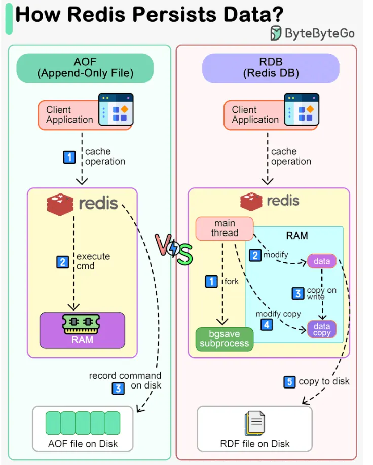

**Notice: Redis does not natively support [Eventual Consistency](system_metrics.md) as a built-in feature. Instead, Redis focuses on providing high-performance, in-memory data storage with strong consistency guarantees. When data is written to Redis, it is immediately available for reading, and all subsequent reads will reflect the latest written value.**

---

## Database Normalization And Denormalization

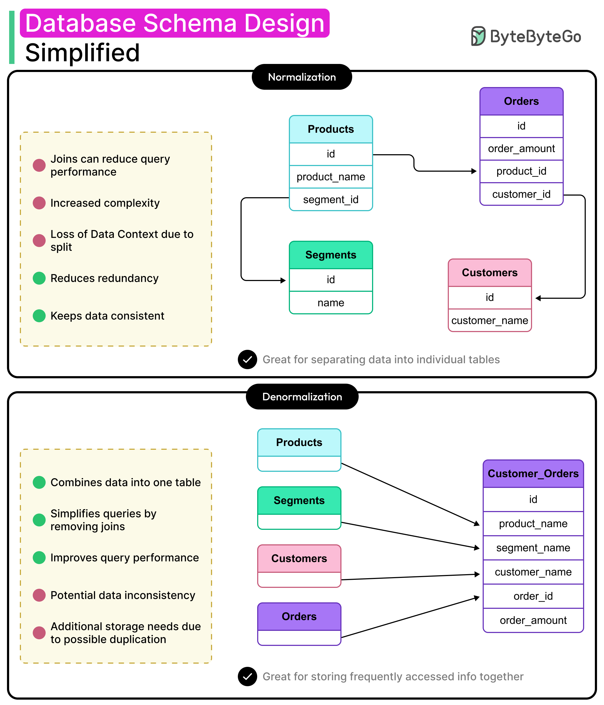

Normalization is used for reduce or removing the redundancy which means there will be no duplicate data or entries in the same table and also optimizes for data integrity and efficient storage

Denormalization is used for add the redundancy into normalized table so that enhance the functionality and minimize the running time of database queries (like joins operation ) and optimizes for performance and query simplicity. In a system that demands scalability, like that of any major tech company, we almost always use elements of both normalized and denormalized databases.

### Normalization

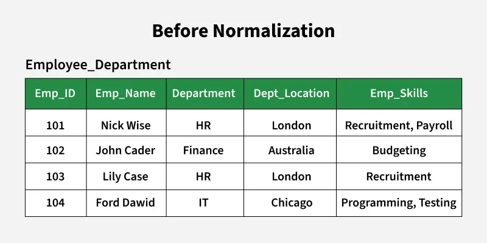

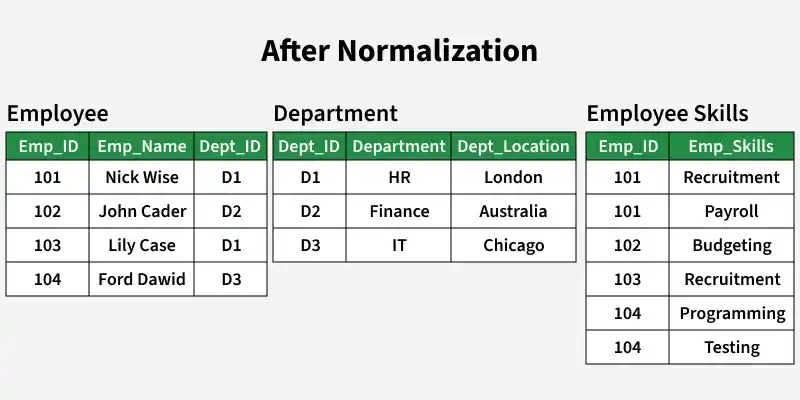

Normalization is an important process in database design that helps improve the database's efficiency, consistency, and accuracy. It makes it easier to manage and maintain the data and ensures that the database is adaptable to changing business needs.

Normal Forms in DBMS:

| **Normal Forms**                  | **Description of Normal Forms**                              |
| :-------------------------------- | :----------------------------------------------------------- |
| **First Normal Form (1NF)**       | A relation is in first normal form if every attribute in that relation is a single-valued attribute. |
| **Second Normal Form (2NF)**      | A relation that is in First Normal Form and every non-primary-key attribute is fully functionally dependent on the primary key, then the relation is in Second Normal Form (2NF). |
| **Third Normal Form (3NF)**       | A relation is in the third normal form, if there is no transitive dependency for non-prime attributes and it is in the second normal form. A relation is in 3NF if at least one of the following conditions holds in every non-trivial function dependency X –> Y.X is a super key.Y is a prime attribute (each element of Y is part of some candidate key). |
| **Boyce-Codd Normal Form (BCNF)** | For BCNF the relation should satisfy the below conditionsThe relation should be in the 3rd Normal Form. X should be a super-key for every functional dependency (FD) X−>Y in a given relation. |
| **Fourth Normal Form (4NF)**      | A relation R is in 4NF if and only if the following conditions are satisfied: It should be in the Boyce-Codd Normal Form (BCNF). The table should not have any Multi-valued Dependency. |
| **Fifth Normal Form (5NF)**       | A relation R is in 5NF if and only if it satisfies the following conditions:R should be already in 4NF. It cannot be further non loss decomposed (join dependency) |

### Denormalization

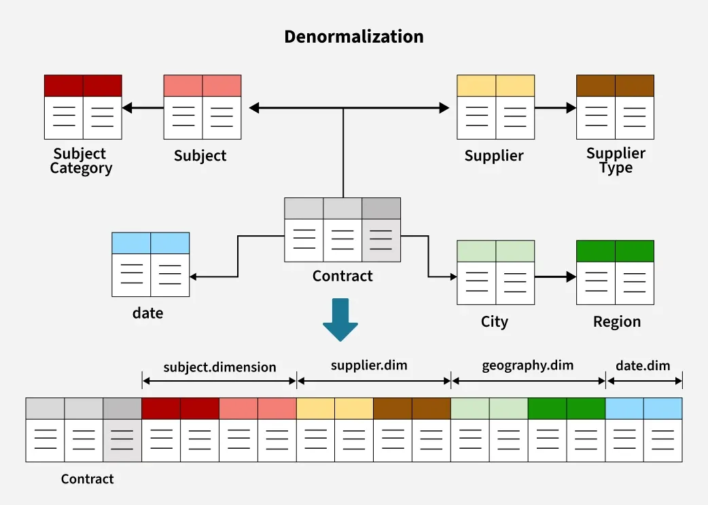

Denormalization is a database optimization technique where redundant data is intentionally added to one or more tables to reduce the need for complex joins and improve query performance. It is not the opposite of normalization, but rather an optimization applied after normalization.

---

## Database Cluster

TODO

---

## Database CQRS (Command Query Responsibility Segregation)

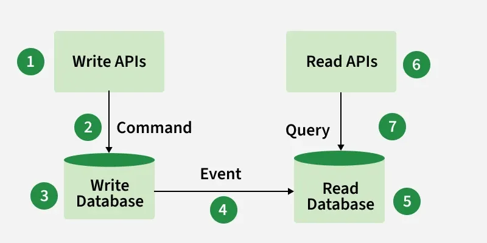

Command Query Responsibility Segregation (CQRS) is an architectural pattern that improves scalability and performance by separating read and write operations into distinct models. Instead of using a single model to both retrieve and modify data, CQRS divides responsibilities into two parts:

- Commands, which handle state-changing operations such as insert, update, and delete.
- Queries, which retrieve data without modifying the system state.

### Database CQRS Architecture

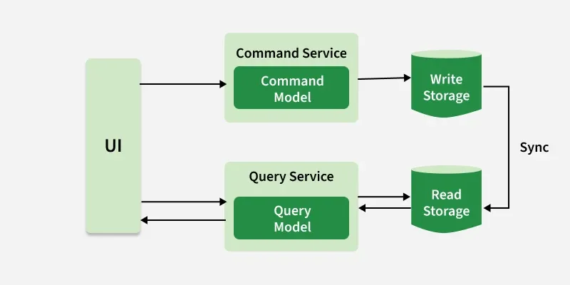

### Database Synchronization in CQRS

Synchronizing databases in a system that follows the CQRS pattern can be challenging due to the separation of the write and read sides of the application.

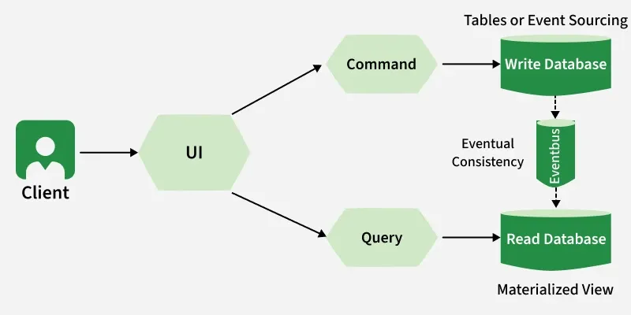

1. Write to the Command Database

   When you make changes (create, update, delete), they are first saved in the command database. This database is optimized for handling write operations.

2. Generate Events

   After the write operation is successful, the system generates events that describe what changed (like "Order Created" or "User Updated"). These events serve as notifications about the updates.

3. Update the Query Database

   The read database, optimized for fast queries, listens for these events and applies the changes to its own copy of the data. This way, the query database gets updated with the latest information.

4. Eventual Consistency

   The key idea is that the query database doesn’t have to update immediately. There can be a slight delay, but eventually, both databases will sync, ensuring consistency over time.

---

## Database Consistency

TODO

---

## Database Selection

Choosing the right database depends on the needs of your application. Here are a few key factors to consider when making this decision:

1. Data Structure

   Defines how data is organized, stored, and managed within the database system.

   - Relational Databases (SQL)

     Best for structured data with clearly defined tables and relationships.

   - Non-Relational Databases (NoSQL)

     Suitable for unstructured or semi-structured data with flexible formats.

2. Scalability Needs

   Determines how well a database can handle growing data and increasing user traffic.

   - Relational Databases

     Usually, scale vertically by increasing the resources of a single server.

   - Non-Relational Databases

     Commonly scale horizontally by adding more servers to distribute the workload.

3. Consistency vs Availability

   Represents the balance between maintaining strict data accuracy and ensuring continuous system availability.

   - Relational Databases

     Preferred when applications require strong consistency and accurate transactions.

   - Non-Relational Databases

     Better suited for systems needing high availability, even with temporary data inconsistency.

4. Transaction Support

   Refers to how reliably a database processes and maintains data during operations.

   - Relational Databases

     Support ACID properties, ensuring reliable and consistent transactions.

   - Non-Relational Databases

     Often prioritize speed and flexibility over strict transactional guarantees.

5. Development Speed & Flexibility

   Indicates how easily the database can adapt to changing application requirements.

   - Relational Databases

     Suitable when the data structure is stable and well-defined.

   - Non-Relational Databases

     Ideal for rapidly evolving applications with frequently changing data structures.

---

## Example 1: OpenAI With PostgresSQL

### Single-Primary Architecture

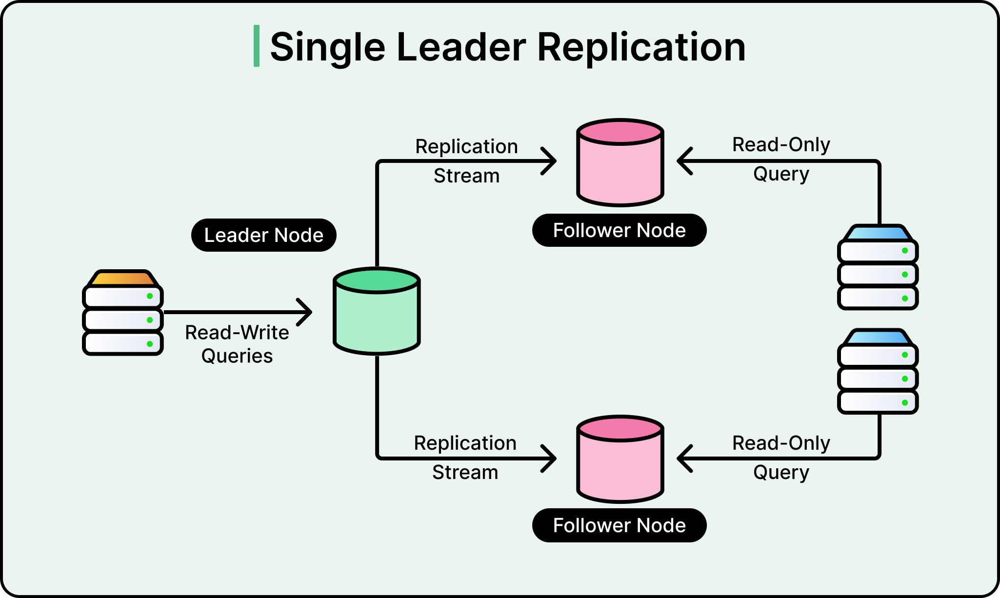

### Minimizing Primary Database Load

The primary database represents the system’s most critical bottleneck. OpenAI implemented multiple strategies to reduce pressure on this single writer:

- Offloading Read Traffic.
- Migrating Write-Heavy Workloads.
- Application-Level Write Optimization.

### Query and Connection Optimization

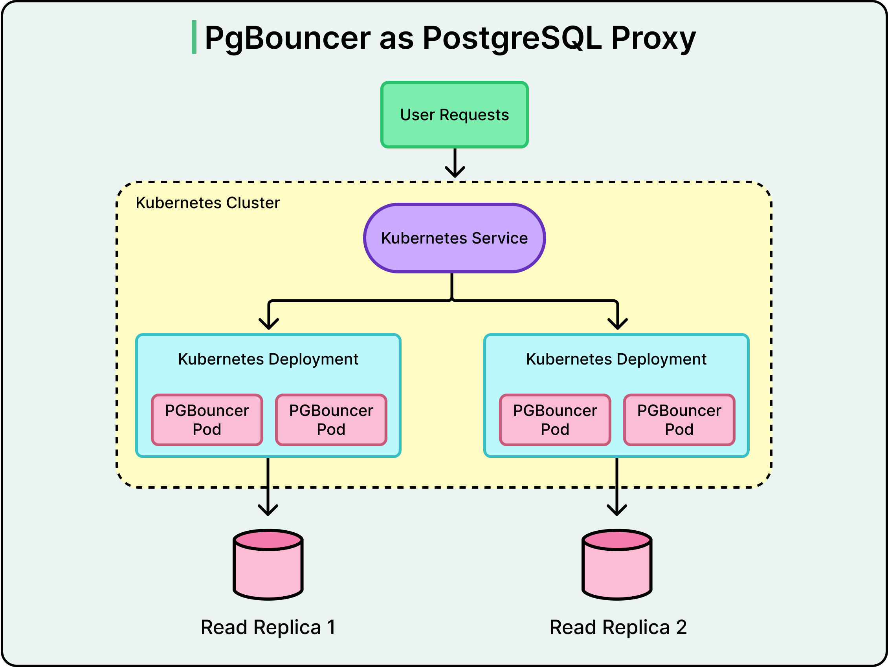

### Preventing Cascading Failures

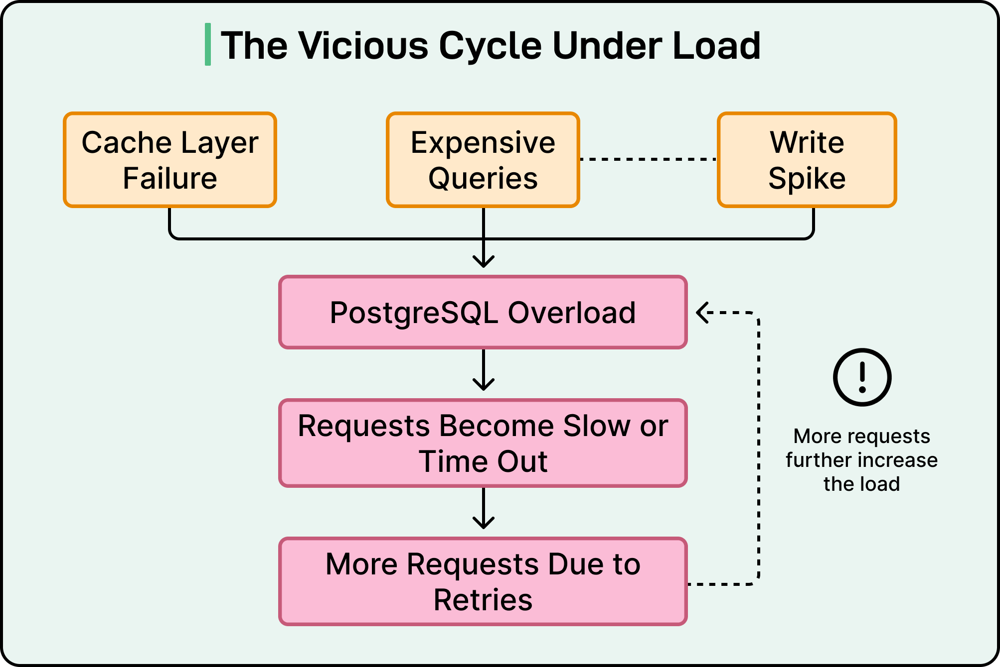

---

## Example 2: Facebook’s Database Handling Billions of Messages

### Cassandra

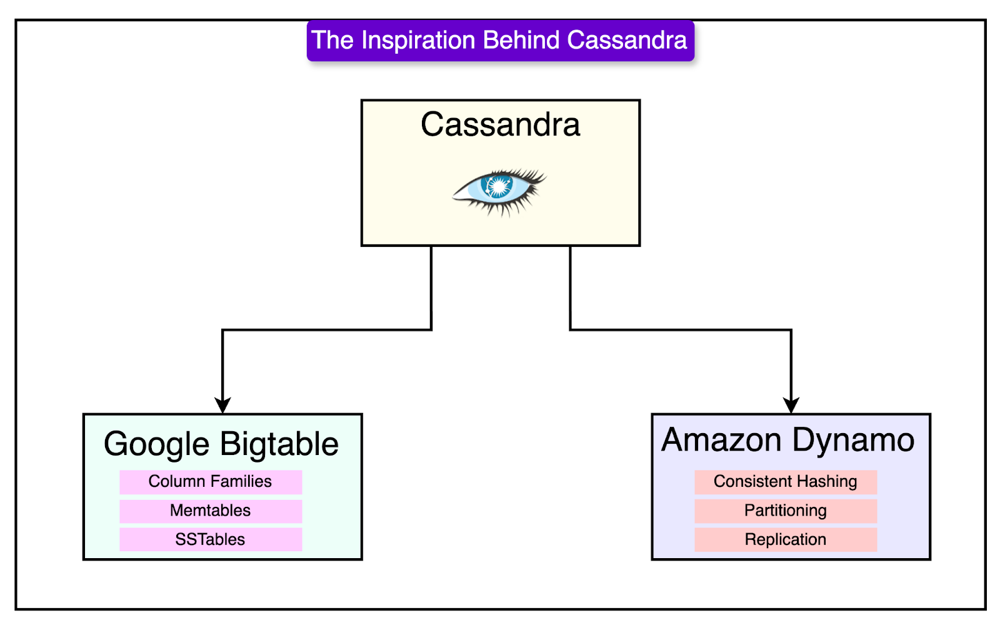

By combining the best parts of these two systems, Facebook created Apache Cassandra®, which became a decentralized, highly scalable, and fault-tolerant database.

### Cassandra Data Model

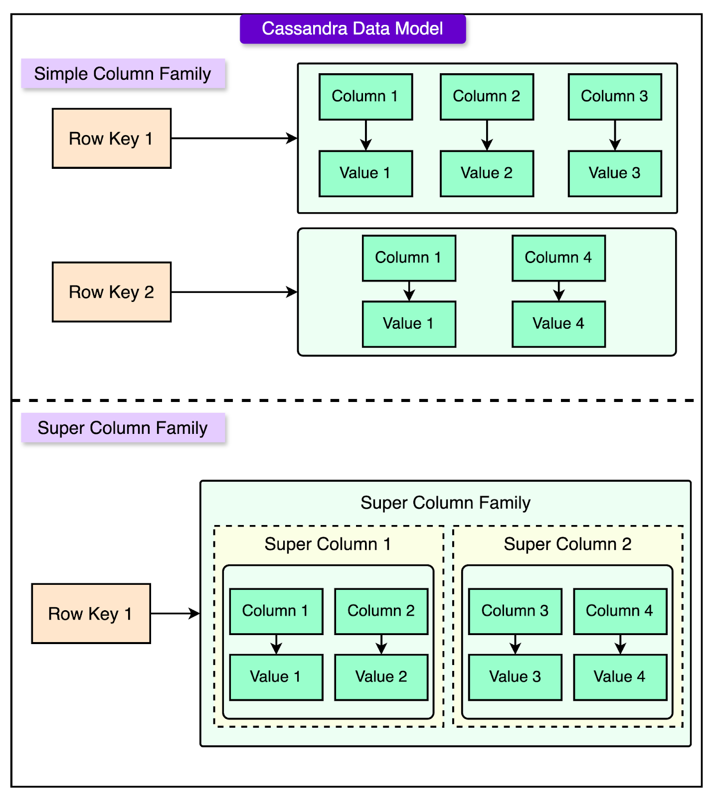

Apache Cassandra®’s data model is like a multi-dimensional map (or dictionary), where each piece of data is indexed by a row key. This means that instead of rigidly defining tables and columns in advance, data can be stored in a way that best suits the needs of the application.

The data is organized into column families that are of two types:

- Simple Column Family
- Super Column Family

### Cassandra Consistent Hashing

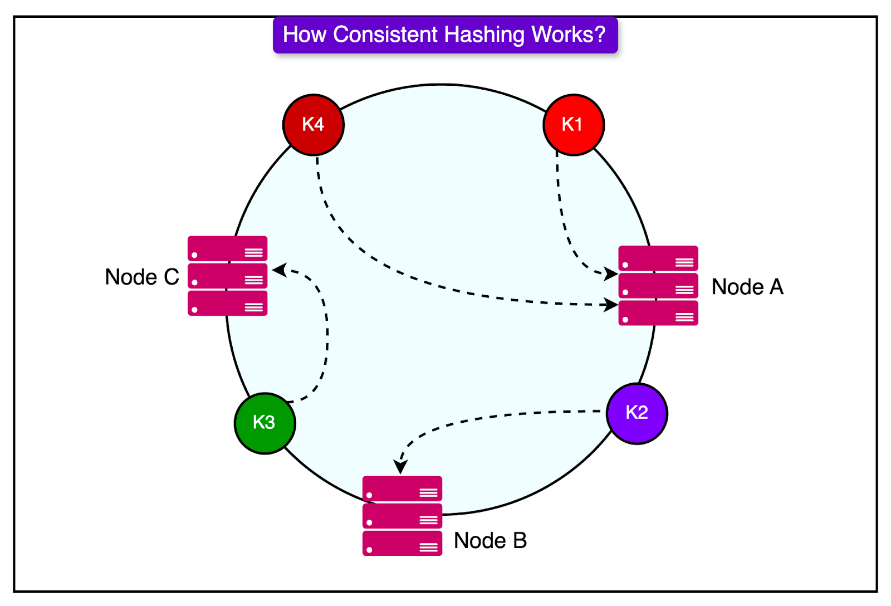

There is no master node, meaning any node can handle read and write requests. Since all nodes are equal, there is no single point of failure. If a node fails, other nodes in the system can continue handling requests without disruption.

### Cassandra Query

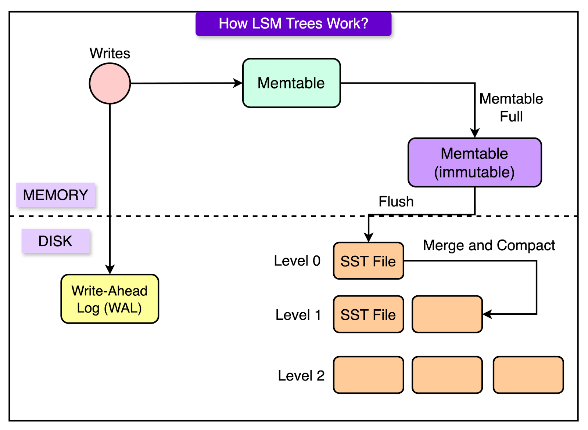

Instead of storing data like traditional relational databases, which write changes immediately to disk, Apache Cassandra® follows a log-structured storage model that optimizes speed and reliability.

### Cassandra Write

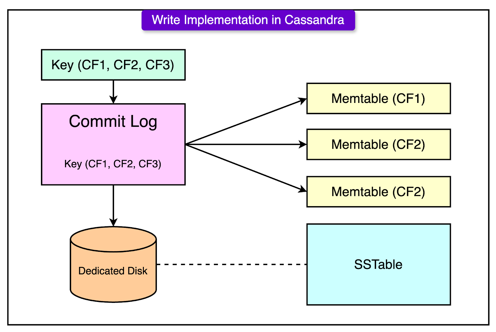

This write process is efficient because, unlike traditional databases that modify data in place (causing random disk writes), Apache Cassandra® writes data sequentially, which is much faster and more efficient.

### Cassandra Search

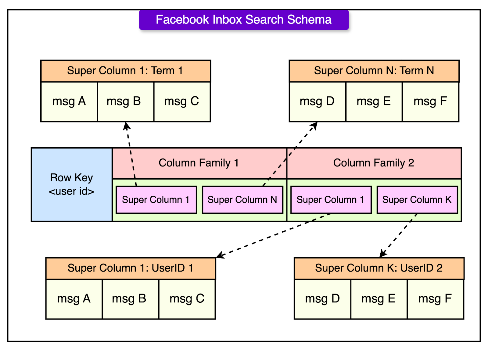

One of the biggest challenges in Facebook’s messaging system was ensuring low-latency searches across a massive dataset. Apache Cassandra®’s highly optimized architecture allowed it to achieve impressive performance:

- Minimum Latency
- Median Latency
- Maximum Latency

---

## Summary

### CAP vs PACELC

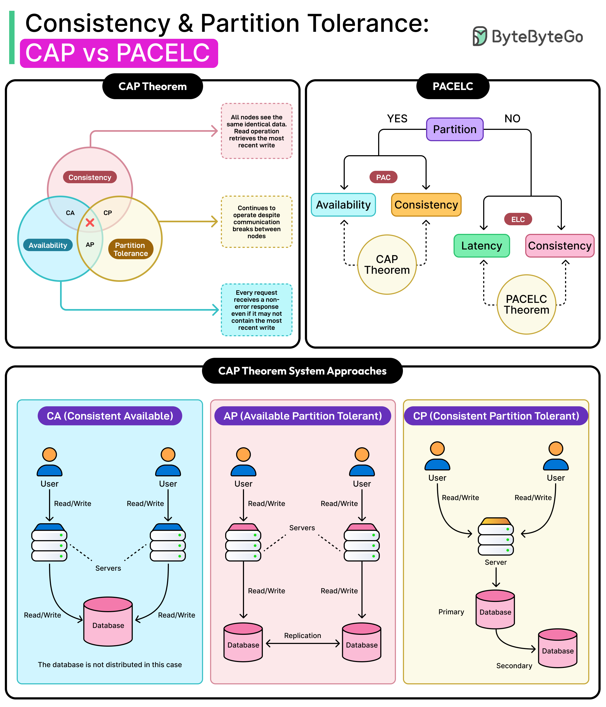

CAP explains why databases must choose between staying available and staying consistent in the presence of network partitions. PACELC extends that reasoning to the normal case: even without failure, databases still trade latency for consistency.

### Horizontal Partitioning vs Vertical Partitioning

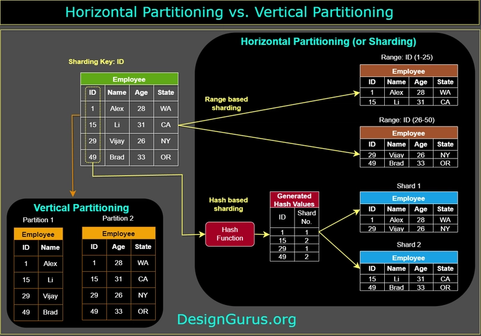

| Feature                  | Vertical Partitioning                                        | Horizontal Partitioning                                      |
| ------------------------ | ------------------------------------------------------------ | ------------------------------------------------------------ |
| Definition               | Dividing a table into smaller tables based on columns.       | Dividing a table into smaller tables based on rows(usually ranges of rows). |
| Purpose                  | Reduce the number of columns in a table to improve query performance and reduce I/O. | Divide a table into smaller tables to manage large volumes of data efficiently. |
| Data distribution        | Columns with related data are placed together in the same table. | Rows with related data(typically based on a range or a condition) are placed together in the same table. |
| Query performance        | Improves query performance when queries only involve specific columns that are part of a partition. | Improves query performance when queries primarily access a subset of rows in a large table. |
| Maintenance and indexing | Easier to manage and index specific columns based on their characteristics and access patterns. | Each partition can be indexed independently, making indexing more efficient. |
| Joins                    | May require joins to combine data from multiple partitions when querying. | Joins between partitions are typically not needed, as they contain disjoint sets of data. |
| Data integrity           | Ensuring data consistency across partitions can be challenging. | Easier to maintain data integrity, as each partition contains a self-contained subset of data. |
| Use cases                | Commonly used for tables with a wide range of columns, where not all columns are frequently accessed together. | Commonly used for tables with a large number of rows, where data can be grouped based on some criteria(e.g., data ranges). |

### Redis vs Memcached

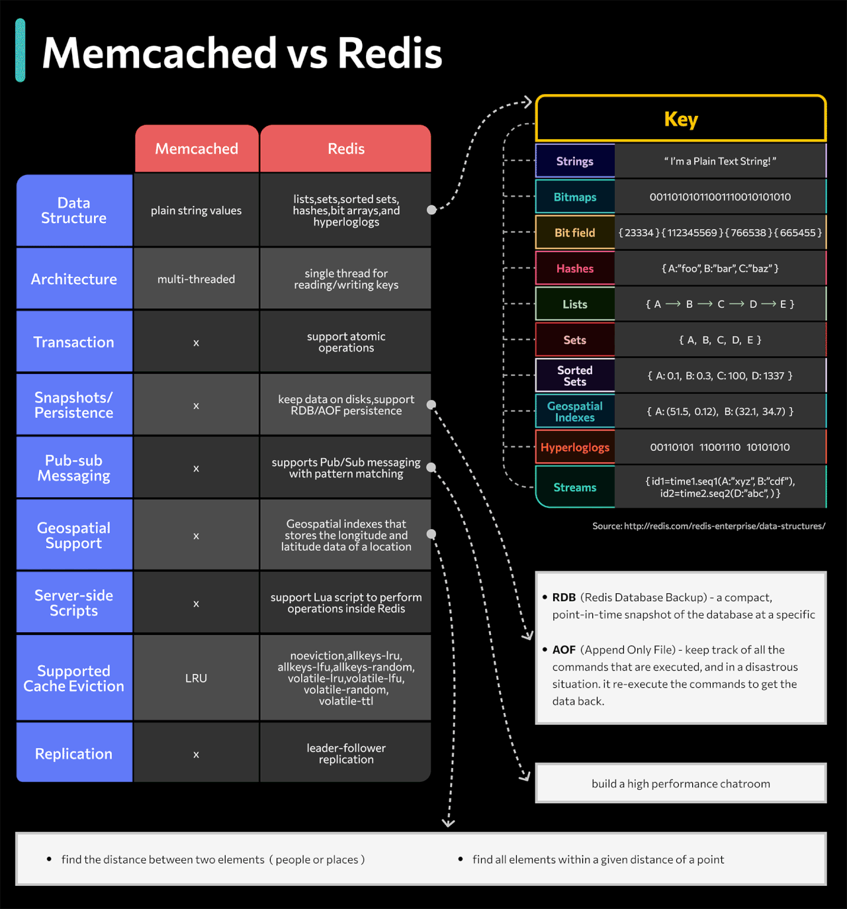

### Redis vs MongoDB

|                         **MongoDB**                          |                          **Redis**                           |
| :----------------------------------------------------------: | :----------------------------------------------------------: |
|                Document-based NoSQL database                 |               In-memory key-value store, NoSQL               |
|          Stores data as BSON documents (JSON-like)           | Stores data as key-value pairs, strings, sets, lists, hashes, etc. |
|                Disk-based, persistent storage                | Primarily in-memory, but can persist data to disk (RDB, AOF) |
|        Slower compared to in-memory stores like Redis        |           Extremely fast due to in-memory storage            |
|         Built-in persistence with automatic backups          |     Optional persistence with RDB snapshots or AOF logs      |
| Supports complex querying with rich operators like $gt, $lt, $regex, etc. |  Limited querying capabilities (basic key-value operations)  |
| Ideal for large datasets, complex queries, and rich document structures | Ideal for caching, real-time analytics, messaging, and high-speed applications |
|  More complex to manage and scale due to its rich features   | Simple to use, mainly for high-speed, low-latency use cases  |

### Relational (SQL) vs Non-Relational Databases (NoSQL)

| Factor                          | Relational Databases                                         | Non-Relational Databases                                     |
| ------------------------------- | ------------------------------------------------------------ | ------------------------------------------------------------ |
| Data Structure                  | If your data is structured, and you need to handle complex relationships. | If your data is unstructured or semi-structured.             |
| Scalability Needs               | Typically scale vertically(adding more power to a single server). | Of ten scale horizontally(adding more servers to distribute the load). |
| Consistency vs Availability     | If your application requires strong consistency.             | If your application needs to be highly available and can tolerate some inconsistency for a short time. |
| Transaction Support             | If you need ACID properties(Atomicity, Consistency, Isolation, Durability) for transaction. | If your system can work without strict transaction guarantees. |
| Development Speed & Flexibility | If you need a stable, structured design.                     | If your project evolve rapidly or need to handle changing types of data. |

### Comparison of Different Databases

|    **Database Type**    |              **Performance**               |            **Scalability**            |                **Consistency**                 |         **Availability**          |
| :---------------------: | :----------------------------------------: | :-----------------------------------: | :--------------------------------------------: | :-------------------------------: |
| **Relational (RDBMS)**  |    High performance for complex queries    | Vertical scaling (limited horizontal) |           Strong consistency (ACID)            | High availability with clustering |
|   **NoSQL Document**    | High performance for read/write operations |      High horizontal scalability      |         Eventual consistency (tunable)         |         High availability         |
|   **NoSQL Key-Value**   |    Extremely fast for simple read/write    |      High horizontal scalability      |              Eventual consistency              |         High availability         |
| **NoSQL Column-Family** |    High performance for large datasets     |      High horizontal scalability      |              Tunable consistency               |         High availability         |
|     **NoSQL Graph**     | High performance for relationship queries  |    Scales well with relationships     |               Strong consistency               |         High availability         |
|       **NewSQL**        |   High performance with ACID properties    |      High horizontal scalability      |           Strong consistency (ACID)            | High availability with clustering |
|     **Time-Series**     |   Optimized for time-series data queries   |      High horizontal scalability      |              Tunable consistency               |         High availability         |
|   **Object-Oriented**   |  High performance for object manipulation  |         Moderate scalability          | Strong consistency (depends on implementation) |       Moderate availability       |

### File vs Database Storage Systems

|                   **File Storage System**                    |                 **Database Storage System**                  |
| :----------------------------------------------------------: | :----------------------------------------------------------: |
| Data is stored as individual files within folders or directories. | Data is organized in structured formats such as tables with rows and columns. |
| Does not provide built-in support for relationships between files. | Supports relationships between data using keys, constraints, and joins. |
| Does not support advanced querying; files must be accessed and processed manually. |    Supports complex queries using languages such as SQL.     |
| Limited scalability and usually suitable for smaller datasets. | Highly scalable and designed to handle large volumes of data. |
|      Simple to implement and manage with minimal setup.      | Requires proper schema design, configuration, and management. |
| Best suited for storing documents, images, videos, or log files. | Ideal for transactional systems and applications requiring structured data management. |

### Best Practices For CQRS Pattern

Below are some of the best practices for implementing CQRS pattern:

- Separate Read and Write Models Carefully

  Clearly divide the system into models for reading data (queries) and writing data (commands). This separation helps keep each model simple and optimized for its specific task.

- Use Asynchronous Communication When Needed

  Since commands and queries are separated, consider using asynchronous messaging for commands. This helps the system stay responsive and handle high traffic efficiently, even if some operations take longer.

- Keep Commands and Queries as Simple as Possible

  Design commands to focus only on changing data (like “CreateOrder” or “UpdateUser”) and queries only on retrieving data (like “GetOrderDetails”). Avoid mixing read and write logic in either part to keep things clean and maintainable.

- Embrace Event Sourcing for Data Consistency

  Event sourcing can be paired with CQRS to keep a record of all changes. Each change is saved as an event, and the current state is rebuilt from these events. This can make it easier to track history, recover data, or audit changes.

- Consider the Complexity of Your System

  CQRS adds some complexity, so it’s best suited for systems with high read and write demands or complex business rules. For simpler systems, CQRS might be overkill and add unnecessary development overhead.

---

## References

[1] [Database Replication in System Design](https://www.geeksforgeeks.org/system-design/database-replication-and-their-types-in-system-design/)

[2] [Introduction to Database Normalization](https://www.geeksforgeeks.org/dbms/introduction-of-database-normalization/)

[3] [Denormalization in Databases](https://www.geeksforgeeks.org/dbms/denormalization-in-databases/)

[4] [Top 50 System Design Interview Questions for 2026](https://dev.to/somadevtoo/top-50-system-design-interview-questions-for-2024-5dbk)

[5] [System Design CheatSheet for Interview](https://medium.com/javarevisited/system-design-cheatsheet-4607e716db5a)

[6] [How OpenAI Scaled to 800 Million Users With Postgres](https://blog.bytebytego.com/p/how-openai-scaled-to-800-million)

[7] [EP155: The Shopify Tech Stack](https://blog.bytebytego.com/p/ep155-the-shopify-tech-stack)

[8] [A Guide to Database Replication: Key Concepts and Strategies](https://blog.bytebytego.com/p/a-guide-to-database-replication-key)

[9] [Facebook’s Database Handling Billions of Messages (Apache Cassandra® Deep Dive)](https://blog.bytebytego.com/p/facebooks-database-handling-billions)

[10] [A Crash Course in Database Scaling Strategies](https://blog.bytebytego.com/p/a-crash-course-in-database-scaling)

[11] [Consistency and Partition Tolerance: Understanding CAP vs PACELC](https://blog.bytebytego.com/p/consistency-and-partition-tolerance)

[12] [A Guide to Database Sharding](https://blog.bytebytego.com/p/must-know-message-broker-patterns-4c4)

[13] [How MongoDB Works?](https://blog.bytebytego.com/p/ep170-best-ways-to-test-system-functionality)

[14] [PostgreSQL 101: The Everything Database](https://blog.bytebytego.com/p/ep150-12-algorithms-for-system-design)

[15] [Database Schema Design Simplified: Normalization vs Denormalization](https://blog.bytebytego.com/p/database-schema-design-simplified)

[16] [A Guide to Database Transactions: From ACID to Concurrency Control](https://blog.bytebytego.com/p/a-guide-to-database-transactions)

[17] [Database Design - System Design](https://www.geeksforgeeks.org/system-design/complete-reference-to-databases-in-designing-systems/)

[18] [CQRS - Command Query Responsibility Segregation Design Pattern](https://www.geeksforgeeks.org/system-design/cqrs-command-query-responsibility-segregation/)

[19] [Types of Databases in System Design](https://www.geeksforgeeks.org/system-design/types-of-databases-in-system-design/)

[20] [File and Database Storage Systems in System Design](https://www.geeksforgeeks.org/system-design/file-and-database-storage-systems-in-system-design/)

[21] [Database Replication in System Design](https://www.geeksforgeeks.org/system-design/database-replication-and-their-types-in-system-design/)

[22] [Data Partitioning Techniques in System Design](https://www.geeksforgeeks.org/system-design/data-partitioning-techniques/)

[23] [Redis Introduction](https://www.geeksforgeeks.org/system-design/introduction-to-redis-server/)

[24] [Denormalization in Databases](https://www.geeksforgeeks.org/dbms/denormalization-in-databases/)

[25] [Types of Database Replication](https://www.geeksforgeeks.org/system-design/types-of-database-replication-system-design/)

[26] [CAP Theorem in System Design](https://www.geeksforgeeks.org/system-design/cap-theorem-in-system-design/)

[27] [Does Redis have Eventual Consistency?](https://www.geeksforgeeks.org/system-design/does-redis-have-eventual-consistency/)

[28] [Does MongoDB use Eventual Consistency?](https://www.geeksforgeeks.org/system-design/does-mongodb-use-eventual-consistency/)
