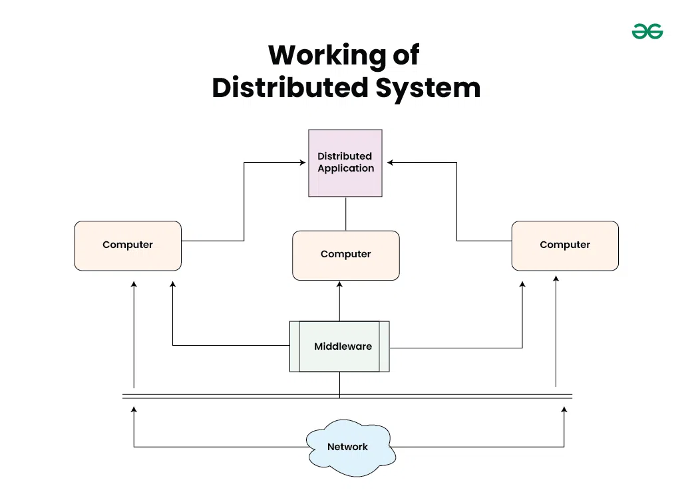
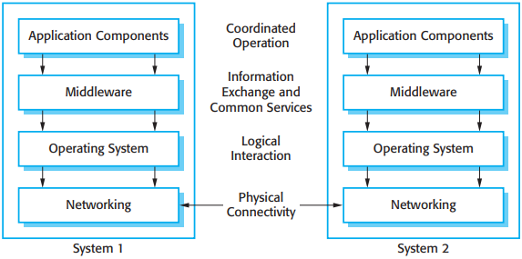
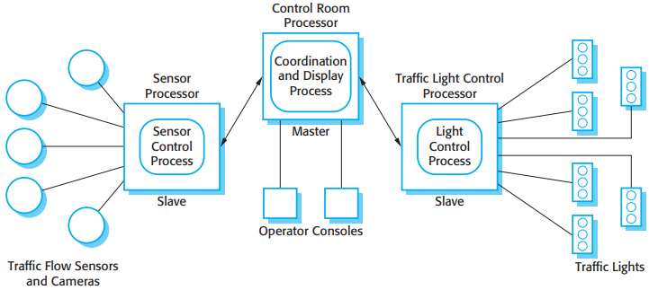
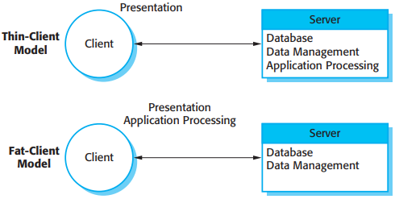
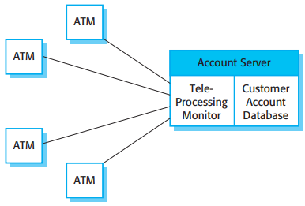
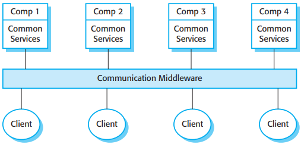
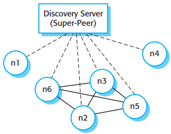

# Distributed System Design

[TOC]

## Distributed systems issues

Some of the most important design issues that have to be considered in distributed system engineering are:

1. Transparency.
2. Openness.
3. Scalability.
4. Security.
5. Quality of service.
6. Failure management.

The scalability of a system reflects its ability to deliver a high quality of service as demands on the system increase. Neuman (1994) identifies three dimensions of scalability:

1. Size.
2. Distribution.
3. Manageability.

The types of attacks that a distributed system must defend itself against are the following:

1. Interception.
2. Interruption.
3. Modification.
4. Fabrication.

The quality of service (QoS) offered by a distributed system reflects the system's ability to deliver its services dependably and with a response time and throughput that is acceptable to its users.

### Models of interaction

There are two fundamental types of interaction that may take place between the computers in a distributed computing system:

- procedural interaction.
- message-based interaction.

### Middleware

*Middleware in a distributed system*

In a distributed system, middleware normally provides two distinct types of support:

1. Interaction support, where the middleware coordinates interactions between different components in the system.
2. The provision of common services, where the middleware provides reusable implementations of services that may be required by several components in the distributed system.

## Architectural patterns for distributed systems

### Master-slave architectures

*A traffic management system with a master-slave architecture*

### Two-tier client-server architectures

*Thin-and fat-client architectural models*

### multi-tier client-server architectures

*Three-tier architecture for an Internet banking system*

### Distributed component architectures

*A distributed component architecture*

The benefits of using a distributed component model for implementing distributed systems are the following:

1. It allows the system designer to delay decisions on where and how services should be provided.
2. It is a very open system architecture that allows new resources to be added as required.
3. The system is flexible and scalable.
4. It is possible to reconfigure the system dynamically with components migrating across the network as required.

Distributed component architectures suffer from two major disadvantages:

1. They are more complex to design than client-server systems.
2. Standardized middleware for distributed component systems has never been accepted by the community.

### Peer-to-peer architectures

![p2p_arch])(res/p2p_arch.png)

*A decentralized p2p architecture*

*A semi-centralized p2p architecture*

It is appropriate to use a peer-to-peer architectural model for a system in two circumstances:

1. Where the system is computationally intensive and it is possible to separate the processing required into a large number of independent computations.
2. Where the system primarily involves the exchange of information between individual computers on a network and there is no need for this information to be centrally stored or managed.

## Consensus Algorithms

- Crash Fault Tolerant(CFT) Algorithms:
  - Paxos (for more detail, see:[doc/DCS/CONSENSUS/paxos.md](https://github.com/hanjingo/doc/blob/master/DCS/CONSENSUS/paxos.md))
  - Raft (for more detail, see:[doc/DCS/CONSENSUS/raft.md](https://github.com/hanjingo/doc/blob/master/DCS/CONSENSUS/raft.md))
- Byzantine Fault Tolerant(BFT) Algorithms:
  - Practical Byzantine Fault Tolerance(PBFT) (for more detail, see:[doc/DCS/CONSENSUS/pbft.md](https://github.com/hanjingo/doc/blob/master/DCS/CONSENSUS/pbft.md))
  - Tendermint
- Proof-Based Algorithms:
  - Proof of Work(PoW) (for more detail, see:[doc/DCS/CONSENSUS/pow.md](https://github.com/hanjingo/doc/blob/master/DCS/CONSENSUS/pow.md))
  - Proof of Stake(PoS) (for more detail, see:[doc/DCS/CONSENSUS/pos.md](https://github.com/hanjingo/doc/blob/master/DCS/CONSENSUS/pos.md))
  - Delegate Proof of Stake(DPoS) (for more detail, see:[doc/DCS/CONSENSUS/dpos.md](https://github.com/hanjingo/doc/blob/master/DCS/CONSENSUS/dpos.md))
- Leader-Based Algorithms:
  - Viewstamped Replication(VR)
  - Multi-Paxos
- Voting-Based Algorithm
  - Quorum-Based Algorithms
  - Federated Byzantine Agreement(FBA)

For more information, see: [hanjingo/dcs](https://github.com/hanjingo/doc/blob/master/DCS/README.md)

## Distributed Locking

TODO

## Summary

### Advantage

- Resource Sharing
- Multiple Independent Nodes
- Transparency
- Scalability
- Reliability and Fault Tolerance
- Performance

### Disadvantage

- Complexity
- Security Challenges
- Network Dependency
- Data Consistency Issues
- Higher Cost
- Troubleshooting Difficulties

### Use Case

1. Online Banking Systems
2. E-Commerce Platforms
3. Social Media Platforms
4. Online Gaming Systems
5. ...

## Reference

[1] George Coulouris; Jean Dolimore; Tim Kindberg; Gordon Blair . DISTRIBUTED SYSTEMS: Concepts and Design . 5ED

[2] [Introduction to Distributed System](https://www.geeksforgeeks.org/computer-networks/what-is-a-distributed-system/)

[3] [How to do distributed locking](https://martin.kleppmann.com/2016/02/08/how-to-do-distributed-locking.html)

[4] [Is Redlock safe?](https://antirez.com/news/101)