# Distributed System Design

[TOC]

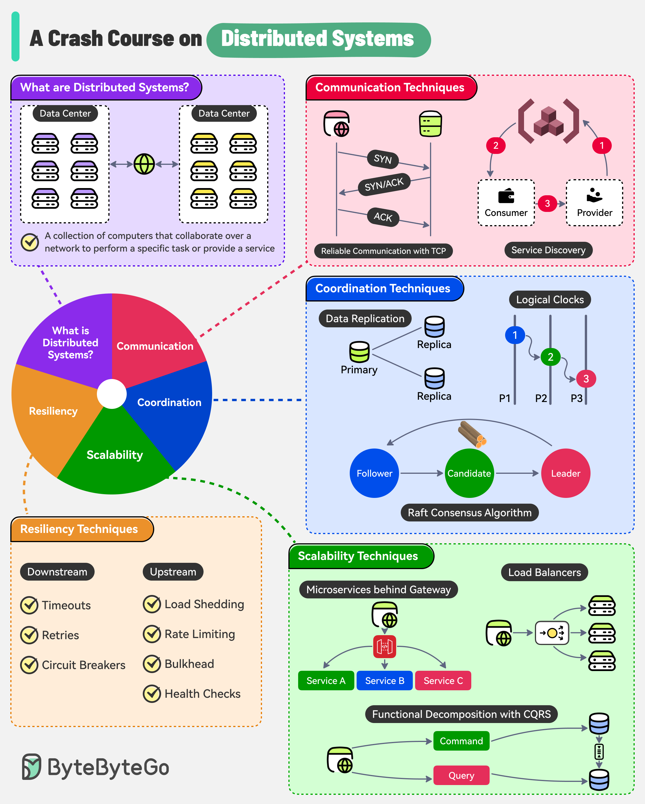

## Distributed systems issues

Some of the most important design issues that have to be considered in distributed system engineering are:

1. Transparency.
2. Openness.
3. Scalability.
4. Security.
5. Quality of service.
6. Failure management.

The scalability of a system reflects its ability to deliver a high quality of service as demands on the system increase. Neuman (1994) identifies three dimensions of scalability:

1. Size.
2. Distribution.
3. Manageability.

The types of attacks that a distributed system must defend itself against are the following:

1. Interception.
2. Interruption.
3. Modification.
4. Fabrication.

The quality of service (QoS) offered by a distributed system reflects the system's ability to deliver its services dependably and with a response time and throughput that is acceptable to its users.

Advantages:

- Resource Sharing
- Multiple Independent Nodes
- Transparency
- Scalability
- Reliability and Fault Tolerance
- Performance

Disadvantages:

- Complexity
- Security Challenges
- Network Dependency
- Data Consistency Issues
- Higher Cost
- Troubleshooting Difficulties

Use Case:

1. Online Banking Systems
2. E-Commerce Platforms
3. Social Media Platforms
4. Online Gaming Systems
5. ...

### Latency and Partition Tolerance

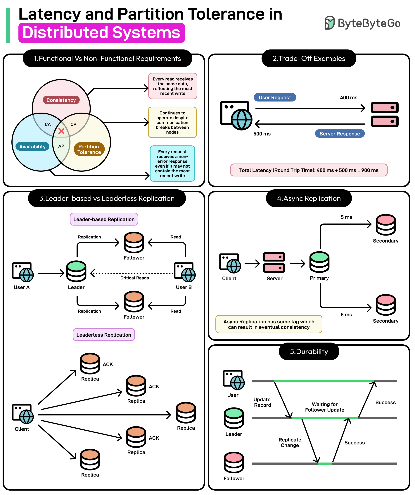

Latency, or the delay in communication between nodes, can degrade user experience and complicate real-time processing. Partition tolerance, the capacity of a system to continue operating despite communication breakdowns among nodes, highlights the trade-offs between maintaining availability and ensuring data consistency. 

### Fundamental

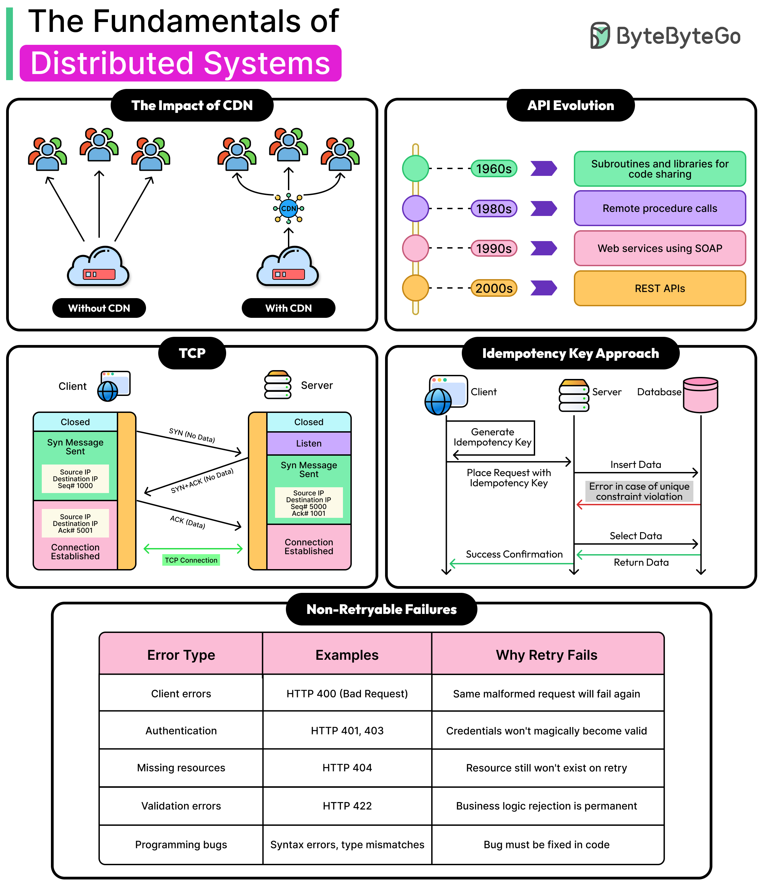

The fundamental challenge that makes distributed systems different is partial failure. In single-computer programs, everything typically crashes together. In distributed systems, some components can fail while others continue operating.

### Workflow

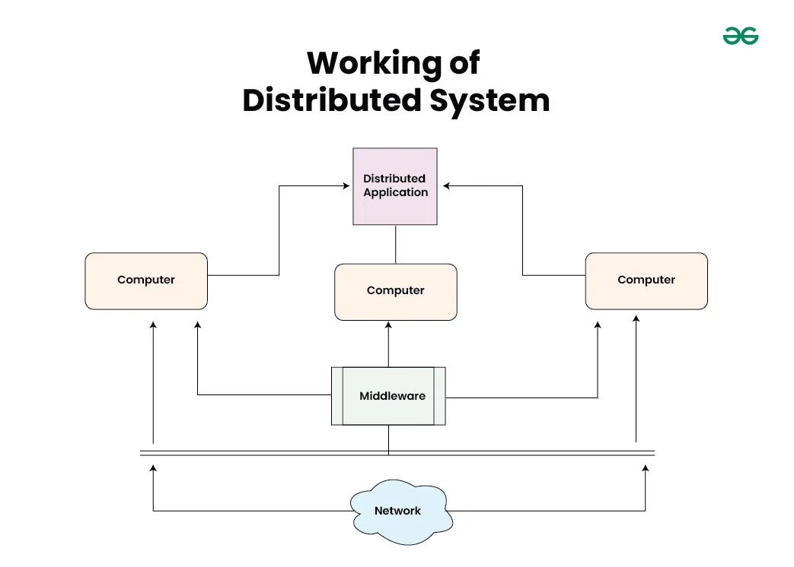

A distributed system works by dividing tasks among multiple nodes, which communicate and coordinate over a network to achieve a common goal.

### Models of interaction

There are two fundamental types of interaction that may take place between the computers in a distributed computing system:

- procedural interaction.
- message-based interaction.

### Middleware

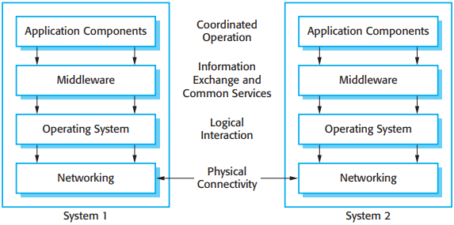

*Middleware in a distributed system*

In a distributed system, middleware normally provides two distinct types of support:

1. Interaction support, where the middleware coordinates interactions between different components in the system.
2. The provision of common services, where the middleware provides reusable implementations of services that may be required by several components in the distributed system.

### Leader Election Algorithms

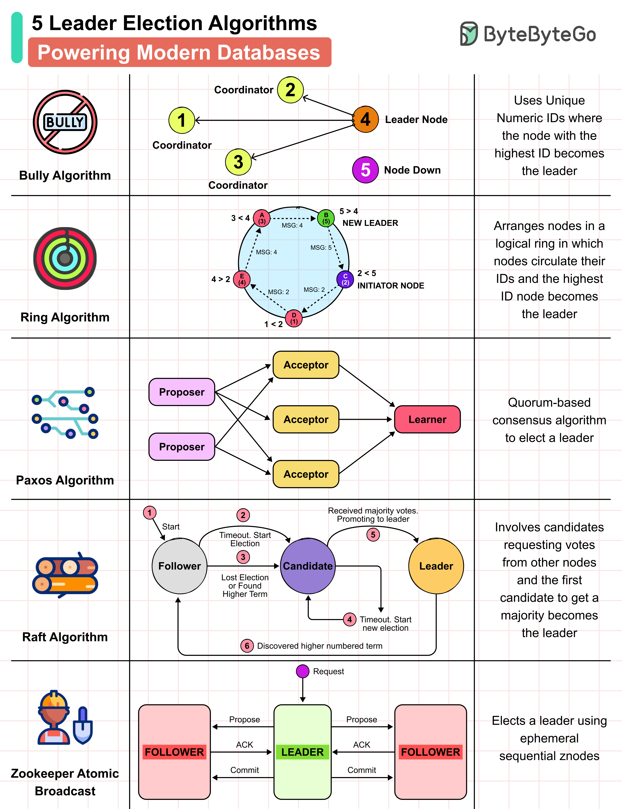

Leader Election Algorithms are important in distributed systems to manage tasks, maintain consistency, and make decisions.

### Service Discovery

### Retry Pattern

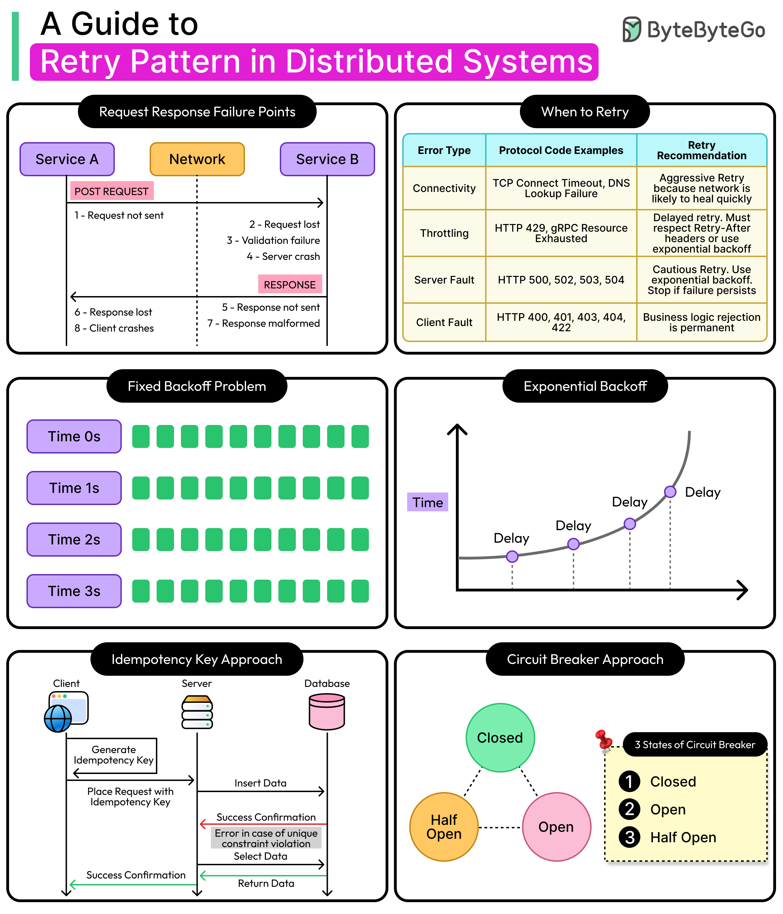

## Types of Distributed Systems

### Client-Server Systems

A client-server system is a distributed system where a central server provides services and multiple clients request those services over a network.

### Peer-to-Peer (P2P) Systems

A peer-to-peer system is a distributed system where all nodes are equal and can act as both client and server without a central authority.

### Clustered Systems

A clustered system is a group of closely connected computers that work together as a single system to improve performance and reliability.

### Cloud-Based Distributed Systems

A cloud-based distributed system uses cloud infrastructure where computing resources are distributed across multiple data centers and accessed over the internet.

## Architectural patterns for distributed systems

### Master-slave architectures

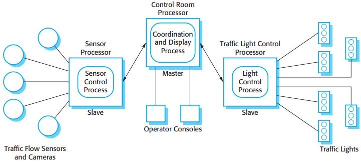

*A traffic management system with a master-slave architecture*

### Two-tier client-server architectures

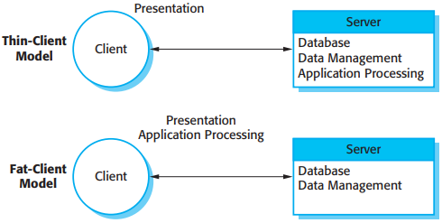

*Thin-and fat-client architectural models*

### multi-tier client-server architectures

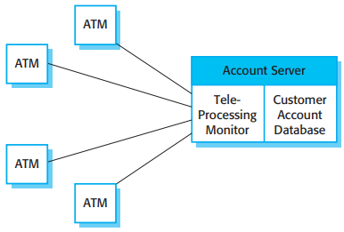

*Three-tier architecture for an Internet banking system*

### Distributed component architectures

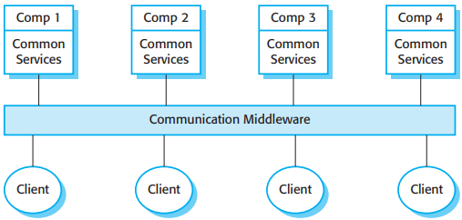

*A distributed component architecture*

The benefits of using a distributed component model for implementing distributed systems are the following:

1. It allows the system designer to delay decisions on where and how services should be provided.
2. It is a very open system architecture that allows new resources to be added as required.
3. The system is flexible and scalable.
4. It is possible to reconfigure the system dynamically with components migrating across the network as required.

Distributed component architectures suffer from two major disadvantages:

1. They are more complex to design than client-server systems.
2. Standardized middleware for distributed component systems has never been accepted by the community.

### Peer-to-peer architectures

![p2p_arch])(res/p2p_arch.png)

*A decentralized p2p architecture*

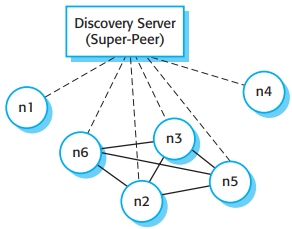

*A semi-centralized p2p architecture*

It is appropriate to use a peer-to-peer architectural model for a system in two circumstances:

1. Where the system is computationally intensive, it is possible to separate the processing required into a large number of independent computations.
2. Where the system primarily involves the exchange of information between individual computers on a network, and there is no need for this information to be centrally stored or managed.

## Consensus Algorithms

- Crash Fault Tolerant(CFT) Algorithms:
  - Paxos (for more detail, see: [doc/DCS/CONSENSUS/paxos.md](https://github.com/hanjingo/doc/blob/master/DCS/CONSENSUS/paxos.md))
  - Raft (for more detail, see: [doc/DCS/CONSENSUS/raft.md](https://github.com/hanjingo/doc/blob/master/DCS/CONSENSUS/raft.md))
- Byzantine Fault Tolerant(BFT) Algorithms:
  - Practical Byzantine Fault Tolerance(PBFT) (for more detail, see: [doc/DCS/CONSENSUS/pbft.md](https://github.com/hanjingo/doc/blob/master/DCS/CONSENSUS/pbft.md))
  - Tendermint
- Proof-Based Algorithms:
  - Proof of Work(PoW) (for more detail, see: [doc/DCS/CONSENSUS/pow.md](https://github.com/hanjingo/doc/blob/master/DCS/CONSENSUS/pow.md))
  - Proof of Stake(PoS) (for more detail, see: [doc/DCS/CONSENSUS/pos.md](https://github.com/hanjingo/doc/blob/master/DCS/CONSENSUS/pos.md))
  - Delegate Proof of Stake(DPoS) (for more detail, see: [doc/DCS/CONSENSUS/dpos.md](https://github.com/hanjingo/doc/blob/master/DCS/CONSENSUS/dpos.md))
- Leader-Based Algorithms:
  - Viewstamped Replication(VR)
  - Multi-Paxos
- Voting-Based Algorithm
  - Quorum-Based Algorithms
  - Federated Byzantine Agreement(FBA)

For more information, see: [hanjingo/dcs](https://github.com/hanjingo/doc/blob/master/DCS/README.md)

### Paxos

The Paxos algorithm is a consensus algorithm designed to achieve agreement among a group of distributed or decentralized processes in a network, even if some of those processes are unreliable. The Paxos algorithm, devised by Leslie Lamport, is a protocol for achieving consensus in a network of unreliable processors (distributed systems). 

Below are the fundamentals of Paxos:

- Roles
- Pahses
- [Quorum](#Quorum)
- Fault Tolerance

### Raft

Raft is a consensus algorithm designed to be easier to understand and implement than Paxos. It works by electing a leader among the nodes to manage log replication and ensure consistency. Raft breaks down consensus into three main sub-problems: leader election, log replication, and safety.

### Practical Byzantine Fault Tolerance (PBFT)

PBFT is designed to handle Byzantine faults, where nodes may fail or act maliciously. It ensures consensus as long as less than one-third of the nodes are faulty. PBFT operates in three phases: pre-prepare, prepare, and commit. In the pre-prepare phase, the leader proposes a value.

### Proof of Work (PoW)

PoW is a consensus mechanism used primarily in cryptocurrencies like Bitcoin.

### Proof of Stake (PoS)

PoS is a more energy-efficient consensus algorithm where validators are chosen based on the number of tokens they hold and are willing to stake as collateral. Validators create and propose new blocks, and their stake incentivizes them to act honestly.

## Distributed Tracing

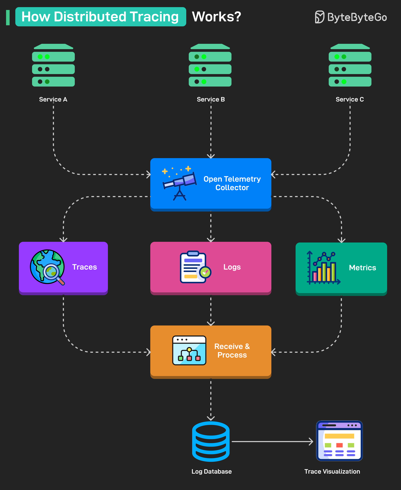

Distributed Tracing is a powerful monitoring technique that provides visibility into how requests flow through complex distributed systems, such as microservice architectures. By capturing and visualizing the journey of each request across multiple services, it helps developers and operators identify performance bottlenecks, latency issues, and system errors effectively.

### Types of Distributed Tracing

Distributed tracing helps teams monitor and analyze applications by tracking how requests flow and perform across systems. The main types include:

- Code Tracing

  Tracks the flow of source code during a specific function to identify logical issues or errors.

- Program Tracing

  Examines instruction addresses and memory variables during execution to detect deep performance issues.

- End-to-End Tracing

  Follows data as it moves across multiple services to understand transformations and dependencies.

### Vector Clocks

Vector clocks are a mechanism used in distributed systems to track the causality and ordering of events across multiple nodes or processes. Each process in the system maintains a vector of logical clocks, with each element in the vector representing the state of that process's clock. When events occur, these clocks are incremented, and the vectors are exchanged and updated during communication between processes.

Vector clocks have several important use cases in distributed systems, particularly in scenarios where tracking the order of events and understanding causality is critical. Here are some key use cases:

- Vector clocks are used in distributed databases such as Cassandra or Amazon DynamoDB to settle disputes that arise when several data replicas are updated separately.
- Several people can edit the same document at once using collaborative editing programs like Google Docs.
- In event-driven systems, like distributed logging or monitoring systems, where the sequence of occurrences is important.
- Knowing the sequence in which various nodes operate is crucial for debugging or monitoring distributed systems.
- Several clients may read and edit files simultaneously in distributed file systems such as the Hadoop Distributed File System (HDFS) or Google File System (GFS).

### Distributed Tracing Tools

These tools help developers monitor complex distributed systems by tracking requests across services and improving performance visibility.

- Jaeger

  An open-source, end-to-end distributed tracing tool which is originally created by Uber. It offers tools for trace collection, storage and analysis/visualization.

- Zipkin

  An open-source distributed system for trace whose main function is to provide support in the collection of timing data required in…

- OpenTelemetry

  A set of tools, APIs and SDK for attach trace, metrics data generation, log data collection and exporting for analysis.

- AWS X-Ray

  A tool provided by Amazon Web Services, which is in charge of distributed tracing and diagnosis of program performance and dependencies.

- Datadog APM

  An application performance monitoring tool with Distributed Tracing Functionality, that delivers holistic information about the operations of an application.

## Quorum

Quorum, within distributed systems, denotes the minimum number of nodes or processes required to reach a consensus on a specific action or decision to validate it. This consensus is essential for maintaining system coherence and ensuring effective operation, even in the presence of failures or network partitions.

### Read Quorum

It is a number of nodes that must agree on the reading process for it to be valid.

### Write Quorum

A group of nodes in a distributed system that all have to agree on a write action for it to be valid is called a "write quorum.

### Membership Quorum

Membership Quorum refers to the minimum number of nodes that must be present and operational for the system to consider itself healthy and operational. This is important for ensuring that the system can continue to function even if some nodes fail.

### Configuration Quorum

Configuration Quorum refers to the minimum number of nodes that must agree on changes to the system's configuration, such as adding or removing nodes. This helps prevent conflicts and ensures that configuration changes are applied consistently across the system, and regulates modifications to system configuration parameters, requiring consensus among nodes for configuration changes.

## Distributed System Usage

### Distributed Caching

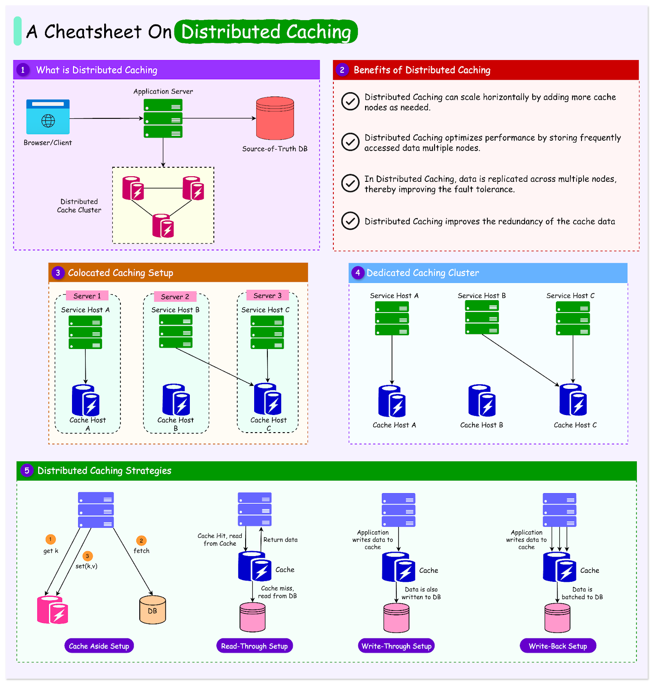

Distributed caching involves spreading the cached data across multiple servers or nodes, allowing the cache to scale horizontally to handle large-scale applications. With a distributed cache, data is stored across multiple locations, meaning a single-node failure doesn’t compromise the entire cache, and the system can continue to serve requests seamlessly. 

### Distributed Locking

TODO

### Distributed Counter

### Netflix Implement

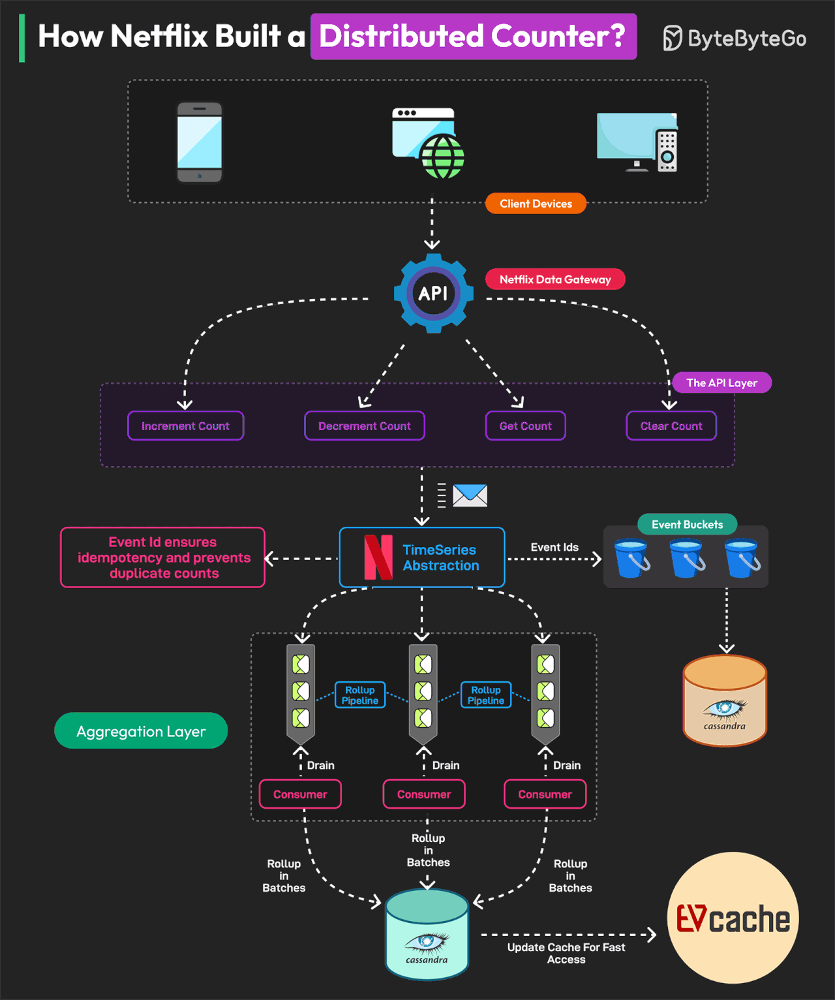

## Summary

### Paxos vs Raft Algorithm

|        **Aspect**        |                          **Paxos**                          |                           **Raft**                           |
| :----------------------: | :---------------------------------------------------------: | :----------------------------------------------------------: |
|  **Design Philosophy**   |         Theoretical robustness, minimalistic design         |          Understandability, ease of implementation           |
|        **Roles**         |               Proposers, Acceptors, Learners                |                Leader, Followers, Candidates                 |
|   **Leader Election**    | Not a primary focus, can have multiple concurrent proposers | Well-defined leader election process, ensures a single leader |
|        **Phases**        |               Prepare, Promise, Accept, Learn               |         Leader Election, Log Replication, Commitment         |
| **Communication Rounds** |             Multiple rounds, higher complexity              |          Streamlined, fewer rounds, simpler process          |
|   **Fault Tolerance**    |              High, tolerates (N-1)/2 failures               |               Similar fault tolerance as Paxos               |
|     **Performance**      |    Potential overhead from multiple rounds and conflicts    |   Generally more efficient due to single leader management   |

### Comparison of Different Consensus Algorithms

|      **Algorithm**       |                       **Description**                        |      **Fault Tolerance**       |           **Use Cases**            |                 **Benefits**                  |                   **Challenges**                    |
| :----------------------: | :----------------------------------------------------------: | :----------------------------: | :--------------------------------: | :-------------------------------------------: | :-------------------------------------------------: |
|        **Paxos**         | Achieves consensus despite network delays and node failures. |   Crash Fault Tolerant (CFT)   | Google’s Chubby, Microsoft’s Azure |    Robust and proven; high fault tolerance    |         Complex to understand and implement         |
|         **Raft**         |         Leader-based log replication for consensus.          |   Crash Fault Tolerant (CFT)   |     etcd, Consul, CockroachDB      | Easier to understand and implement than Paxos |          Leader election can cause delays           |
|         **PBFT**         |    Handles Byzantine faults with supermajority agreement.    | Byzantine Fault Tolerant (BFT) |    Hyperledger Fabric, Zilliqa     |    High security, handles arbitrary faults    | Requires high message overhead; limited scalability |
| **Proof of Work (PoW)**  | Miners solve cryptographic puzzles to validate transactions. | Byzantine Fault Tolerant (BFT) |         Bitcoin, Litecoin          |         Highly secure; decentralized          |   High energy consumption; slow transaction times   |
| **Proof of Stake (PoS)** | Validators are chosen based on stake to propose new blocks.  | Byzantine Fault Tolerant (BFT) |       Ethereum 2.0, Cardano        |          Energy efficient; scalable           |                                                     |

## Reference

[1] George Coulouris; Jean Dolimore; Tim Kindberg; Gordon Blair . DISTRIBUTED SYSTEMS: Concepts and Design . 5ED

[2] [Introduction to Distributed System](https://www.geeksforgeeks.org/computer-networks/what-is-a-distributed-system/)

[3] [How to do distributed locking](https://martin.kleppmann.com/2016/02/08/how-to-do-distributed-locking.html)

[4] [Is Redlock safe?](https://antirez.com/news/101)

[5] [EP157: How to Learn Backend Development?](https://blog.bytebytego.com/p/ep157-how-to-learn-backend-development)

[6] [5 Leader Election Algorithms Powering Modern Databases](https://blog.bytebytego.com/p/ep197-12-architectural-concepts-developers)

[7] [The Must-Know Fundamentals of Distributed Systems](https://blog.bytebytego.com/p/the-must-know-fundamentals-of-distributed)

[8] [Service Discovery 101: The Phonebook for Distributed Systems](https://blog.bytebytego.com/p/service-discovery-101-the-phonebook)

[9] [A Guide to Retry Pattern in Distributed Systems](https://blog.bytebytego.com/p/a-guide-to-retry-pattern-in-distributed)

[10] [Distributed Caching: The Secret to High-Performance Applications](https://blog.bytebytego.com/p/distributed-caching-the-secret-to)

[11] [Dark Side of Distributed Systems: Latency and Partition Tolerance](https://blog.bytebytego.com/p/dark-side-of-distributed-systems)

[12] [A Crash Course on Distributed Systems](https://blog.bytebytego.com/p/a-crash-course-on-distributed-systems)

[13] [How Distributed Tracing Works at the High Level?](https://blog.bytebytego.com/i/190028819/how-distributed-tracing-works-at-the-high-level)

[14] [Vector Clocks in Distributed Systems](https://www.geeksforgeeks.org/computer-networks/vector-clocks-in-distributed-systems/)

[15] [Paxos Algorithm in Distributed System](https://www.geeksforgeeks.org/operating-systems/paxos-algorithm-in-distributed-system/)

[16] [Quorum in System Design](https://www.geeksforgeeks.org/system-design/quorum-in-system-design/)

[17] [Consensus Algorithms in Distributed System](https://www.geeksforgeeks.org/operating-systems/consensus-algorithms-in-distributed-system/)

[18] [Distributed Tracing - System Design](https://www.geeksforgeeks.org/system-design/distributed-tracing-system-design/)