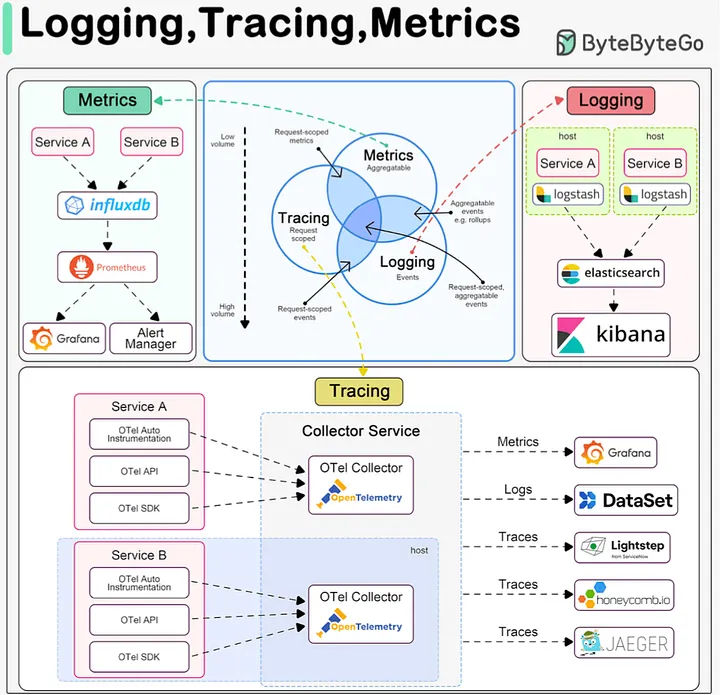
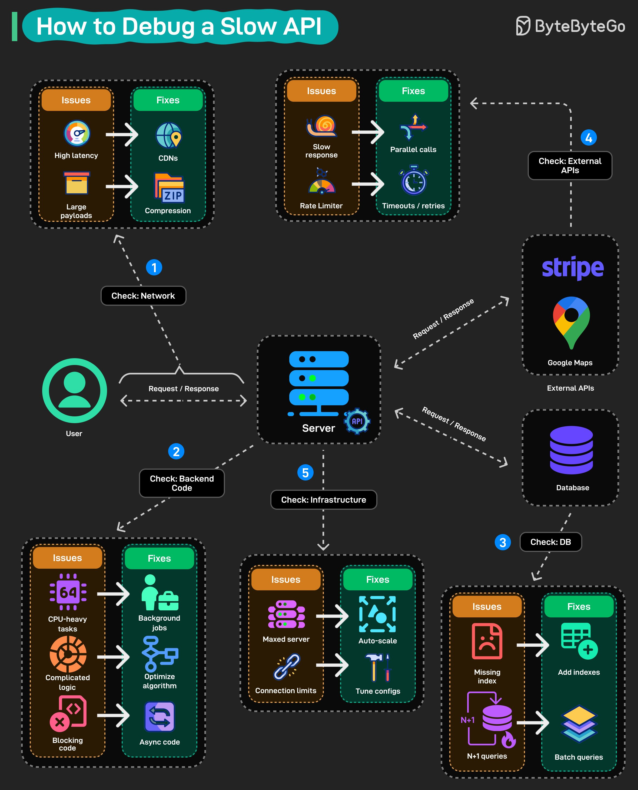
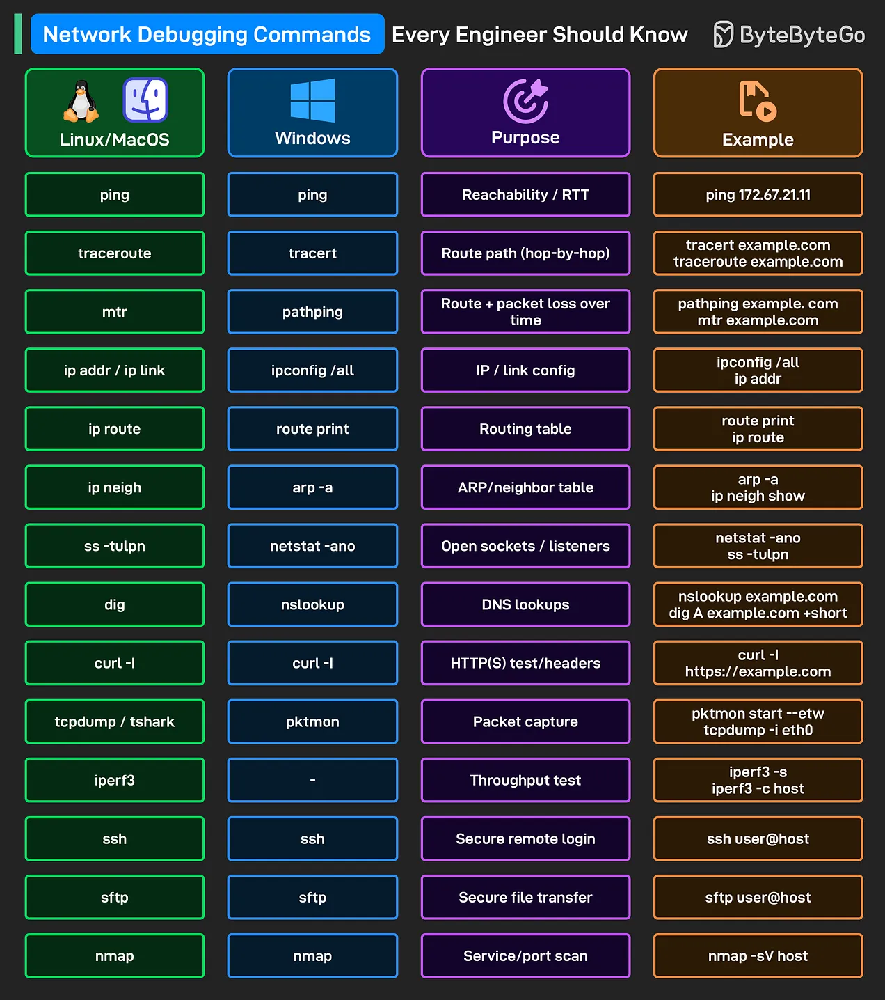

# Debug

[TOC]

## Logging And Tracing

## Debug Slow API

## Network Debugging CMD

# Reference

[1] [System Design CheatSheet for Interview](https://medium.com/javarevisited/system-design-cheatsheet-4607e716db5a)

[2] [EP186: Latency vs. Throughput](https://blog.bytebytego.com/p/ep186-latency-vs-throughput)

[3] [Network Debugging Commands Every Engineer Should Know](https://blog.bytebytego.com/p/ep194-evolution-of-http)