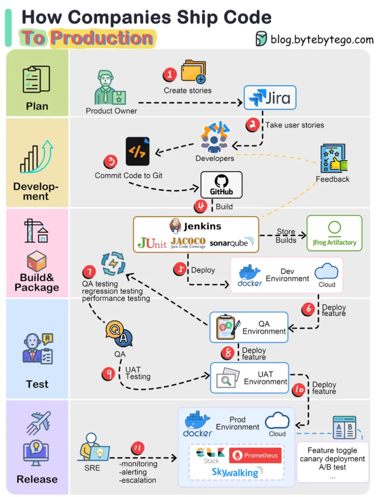
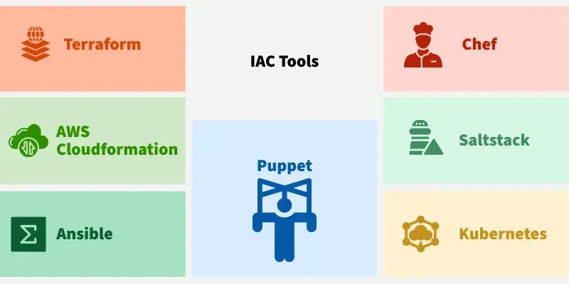
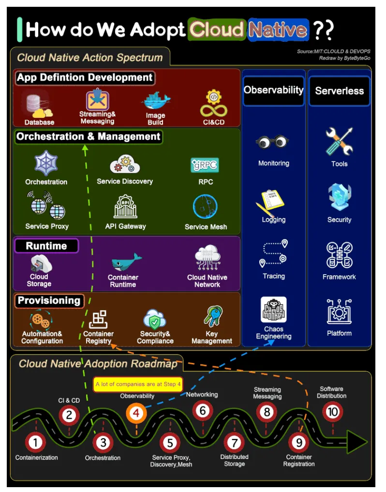
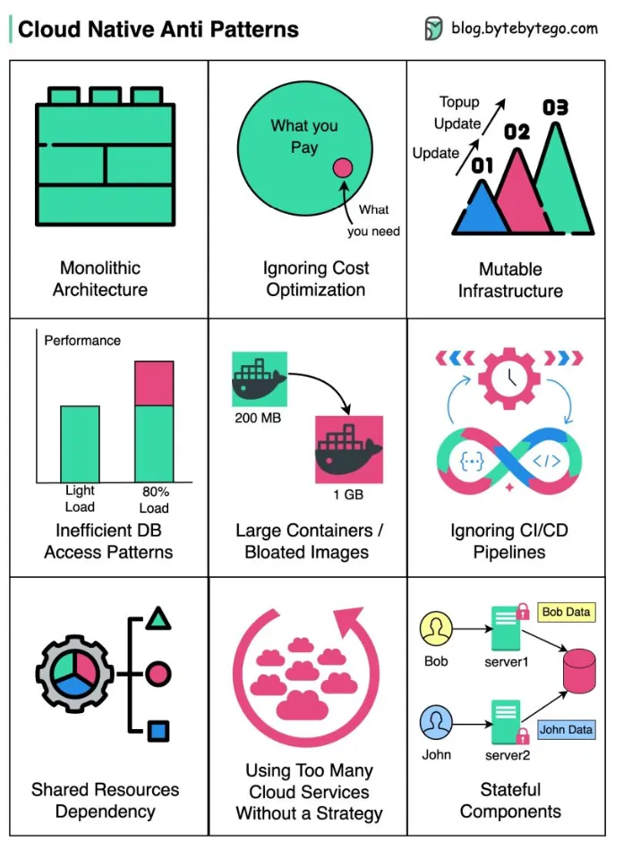
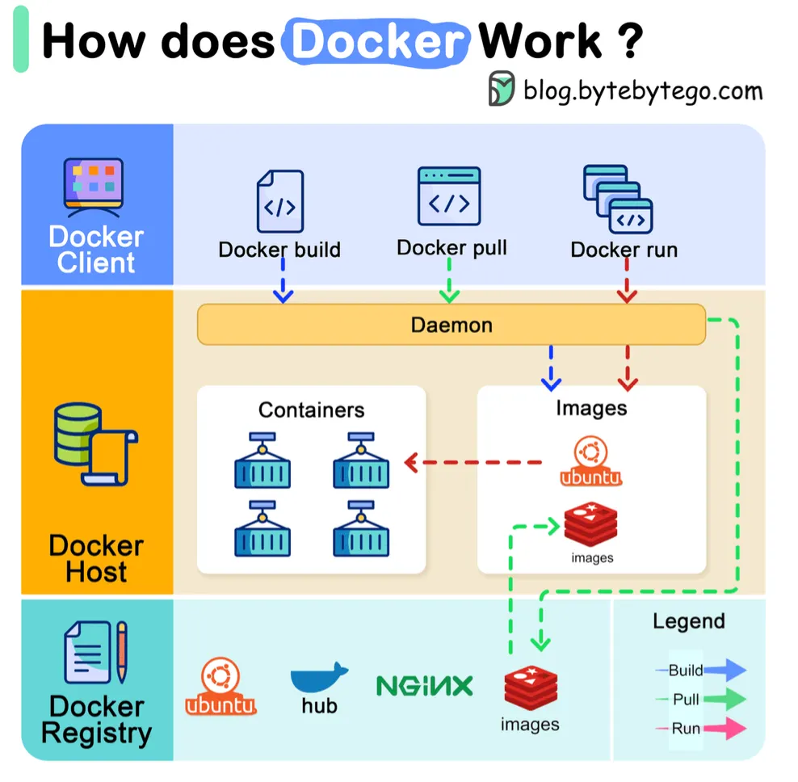
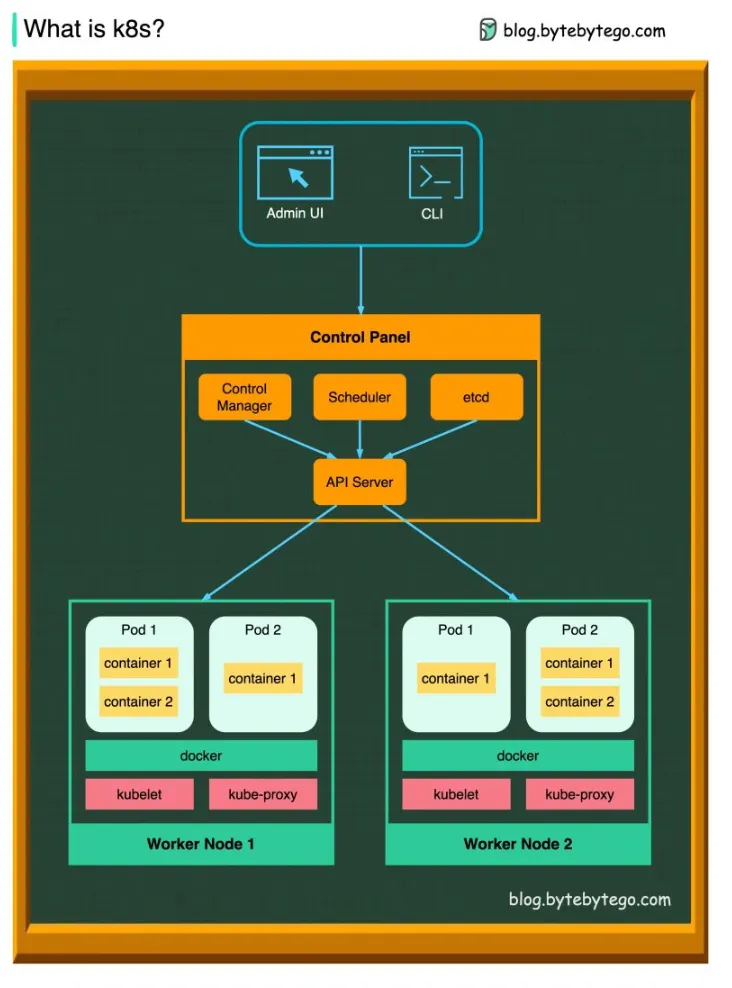
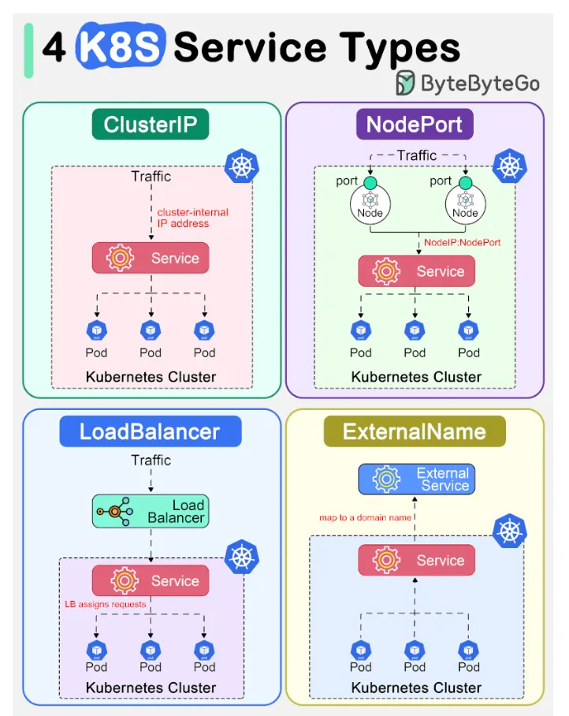
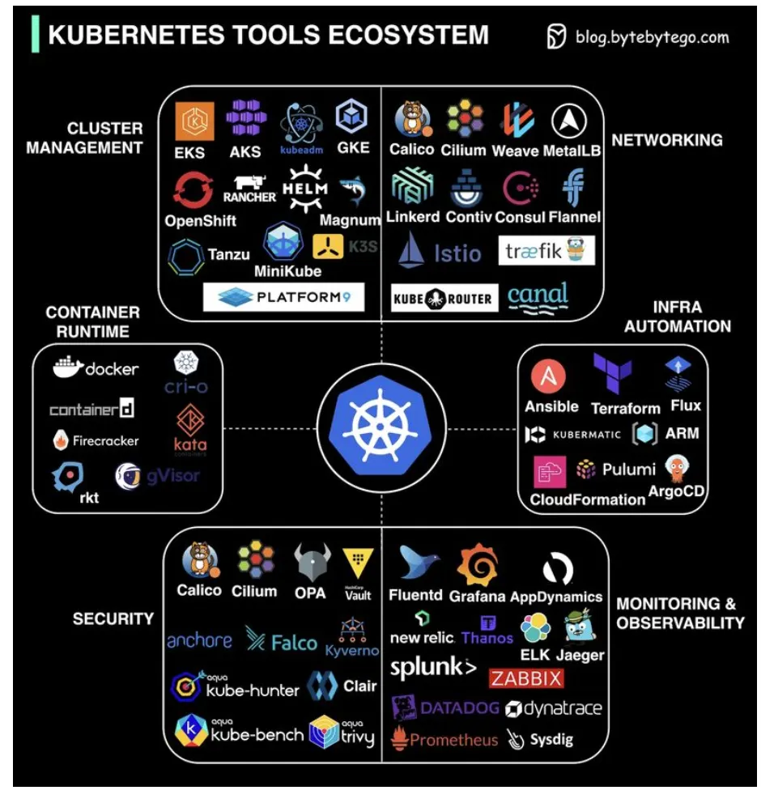
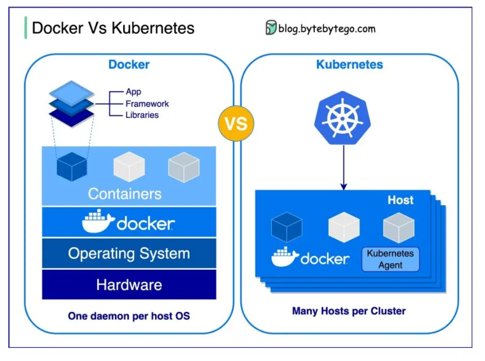
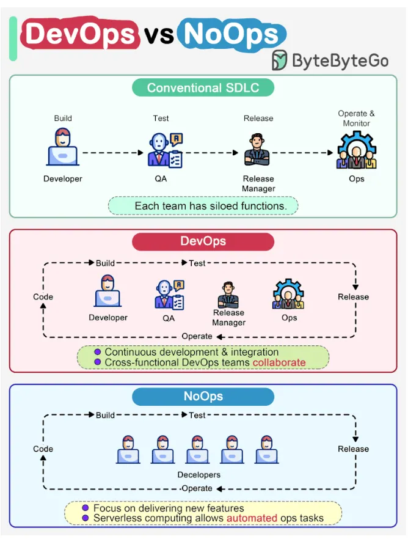

# DevOps

[TOC]

## DevOps

### KPI

Here are three key DevOps KPIs:

1. Deployment Frequency (DF)
2. Mean Time to Recovery (MTTR)
3. Change Failure Rate (CFR)

### Infrastructure as Code(IaC)

Infrastructure as Code(IaC) is a method of managing and provisioning IT infrastructure using code, rather than manual configuration.

Benefit:

- Consistency: Same configuration every time, reducing errors.
- Automation: Fast setup and tear-down of environments.
- Scalability: Easily scale infrastructure up or down with code.
- Versioning: Track and roll back changes using Git or other version control.

## Cloud Native

### Cloud Native Anti Patterns

## Docker

## Kubernetes

### Service Type

### Tools Ecosystem

## Summary

### Docker vs K8s

### DevOps vs NoOps

## Reference

[1] [System Design CheatSheet for Interview](https://medium.com/javarevisited/system-design-cheatsheet-4607e716db5a)