# DevOps

[TOC]

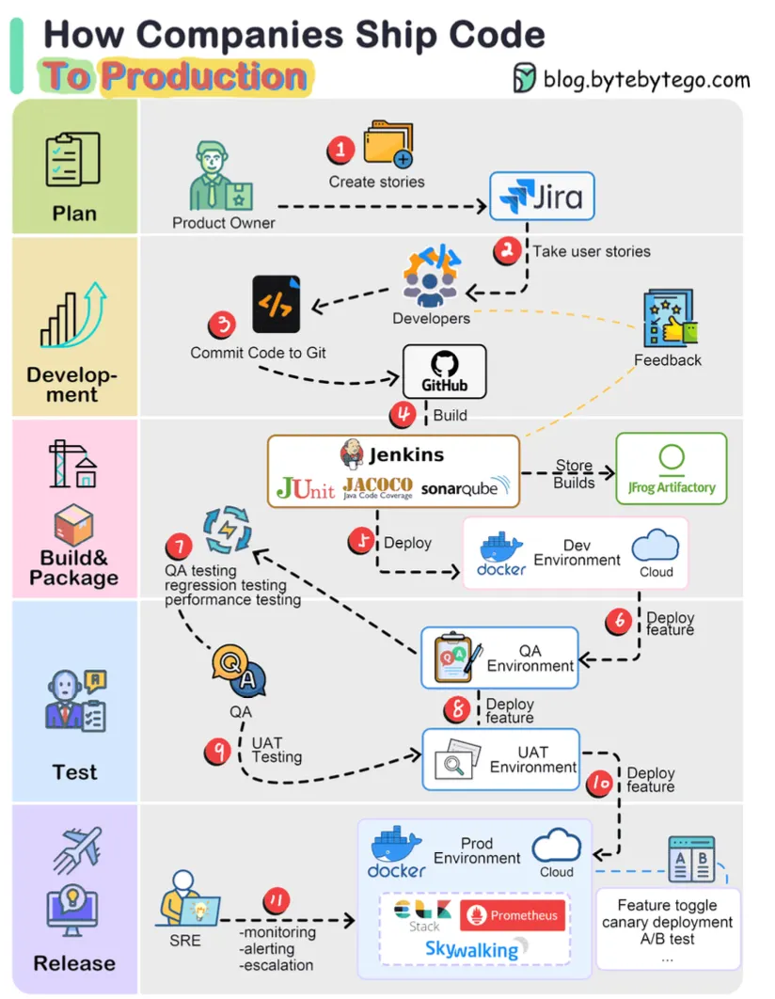

## DevOps

### KPI

Here are three key DevOps KPIs:

1. Deployment Frequency (DF)
2. Mean Time to Recovery (MTTR)
3. Change Failure Rate (CFR)

### Infrastructure as Code(IaC)

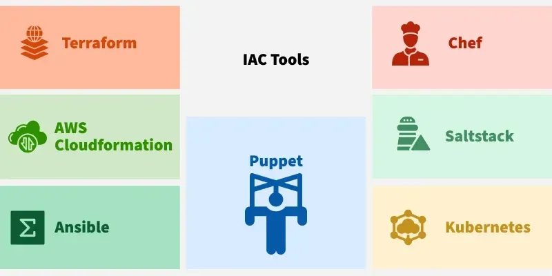

Infrastructure as Code(IaC) is a method of managing and provisioning IT infrastructure using code, rather than manual configuration.

Benefit:

- Consistency: Same configuration every time, reducing errors.
- Automation: Fast setup and tear-down of environments.
- Scalability: Easily scale infrastructure up or down with code.
- Versioning: Track and roll back changes using Git or other version control.

## Cloud Native

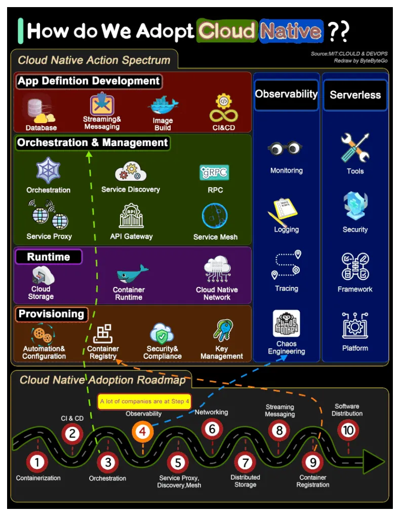

### Cloud Native Anti Patterns

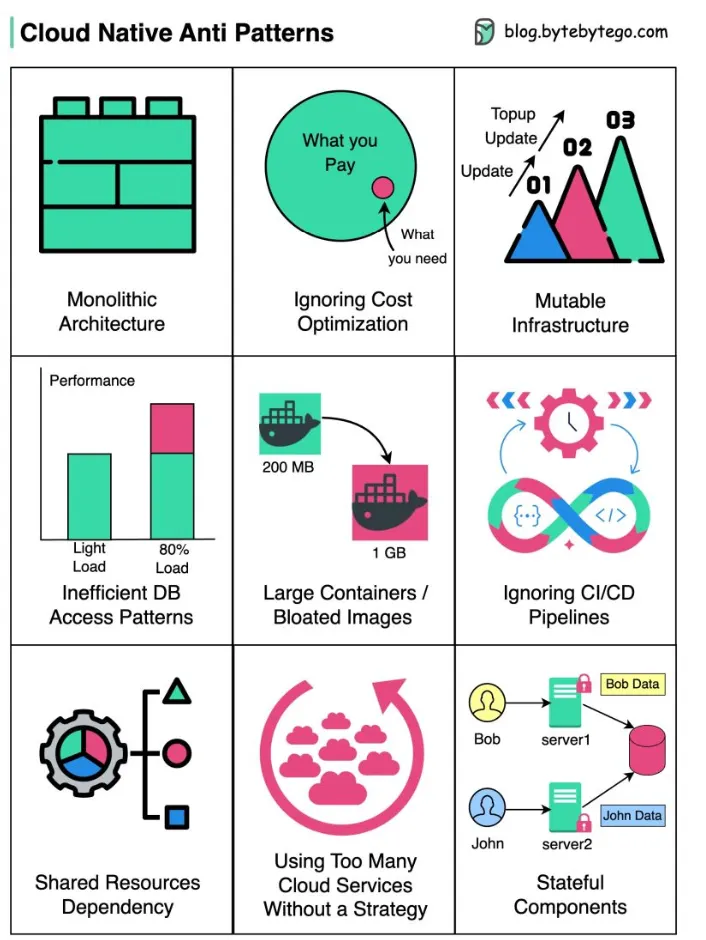

## Docker

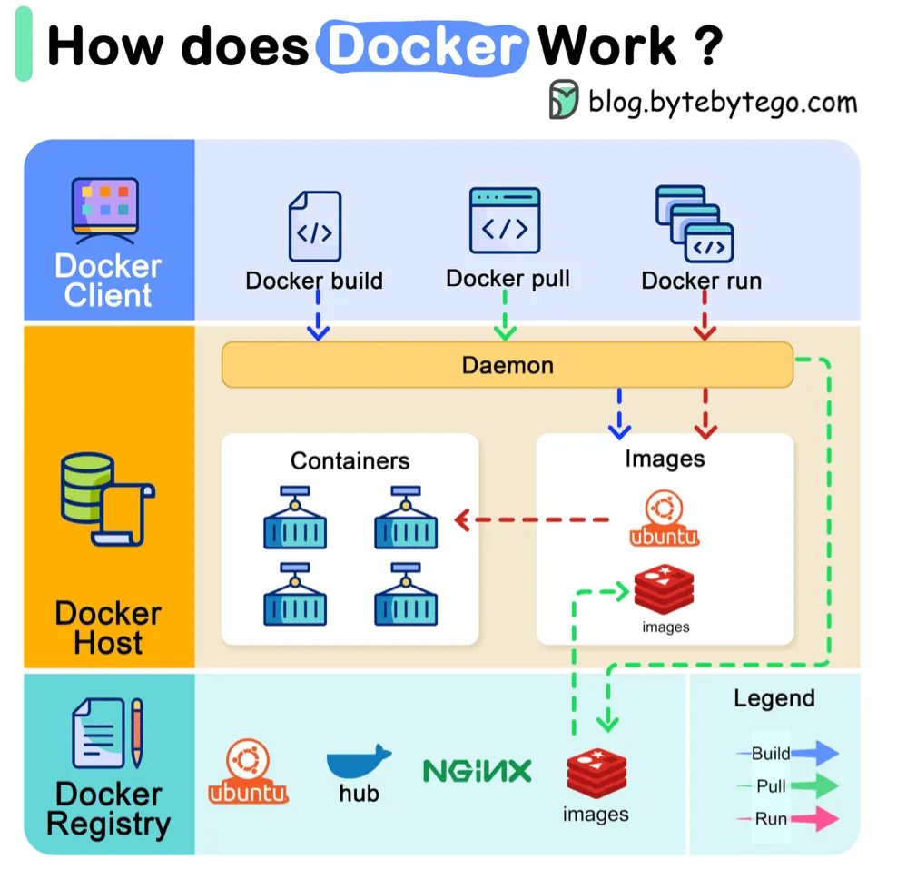

## Kubernetes

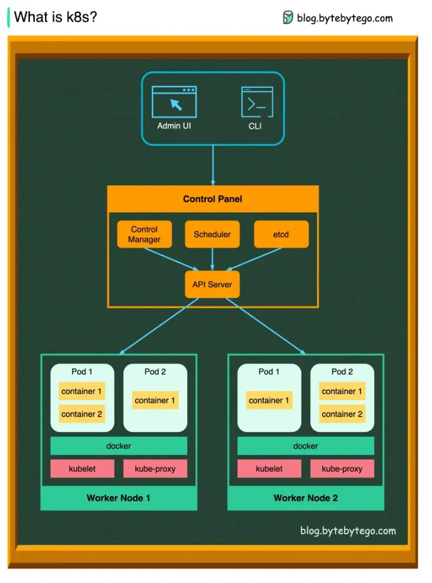

### Service Type

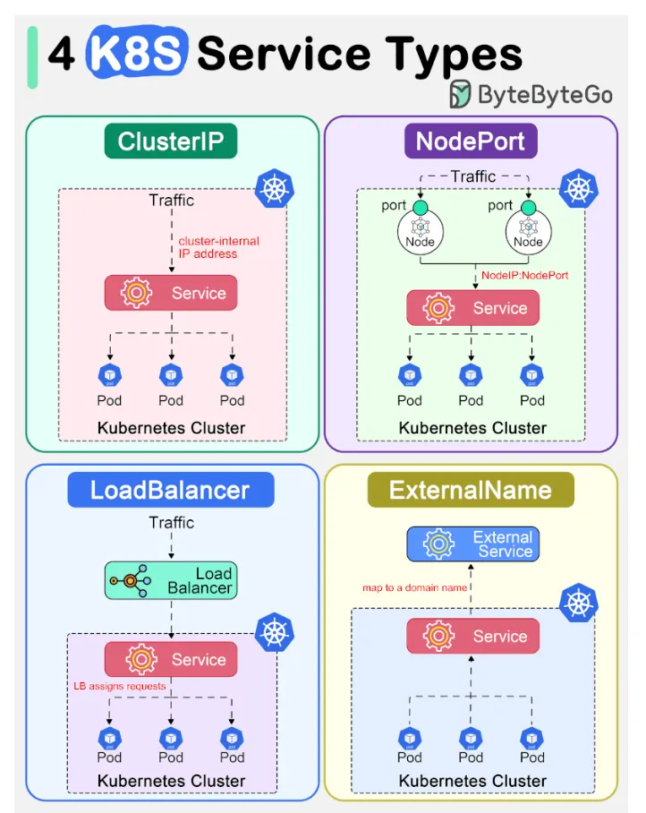

### Tools Ecosystem

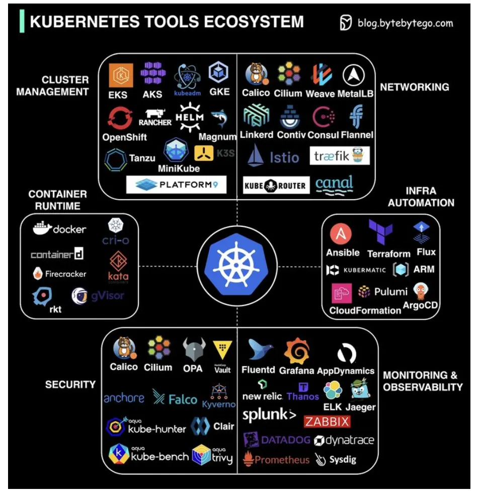

### Control Plane

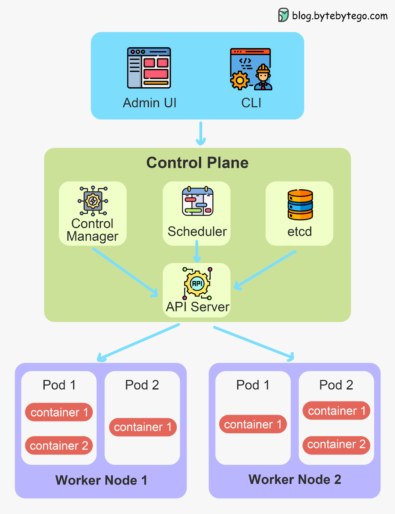

### Kubernetes Pod

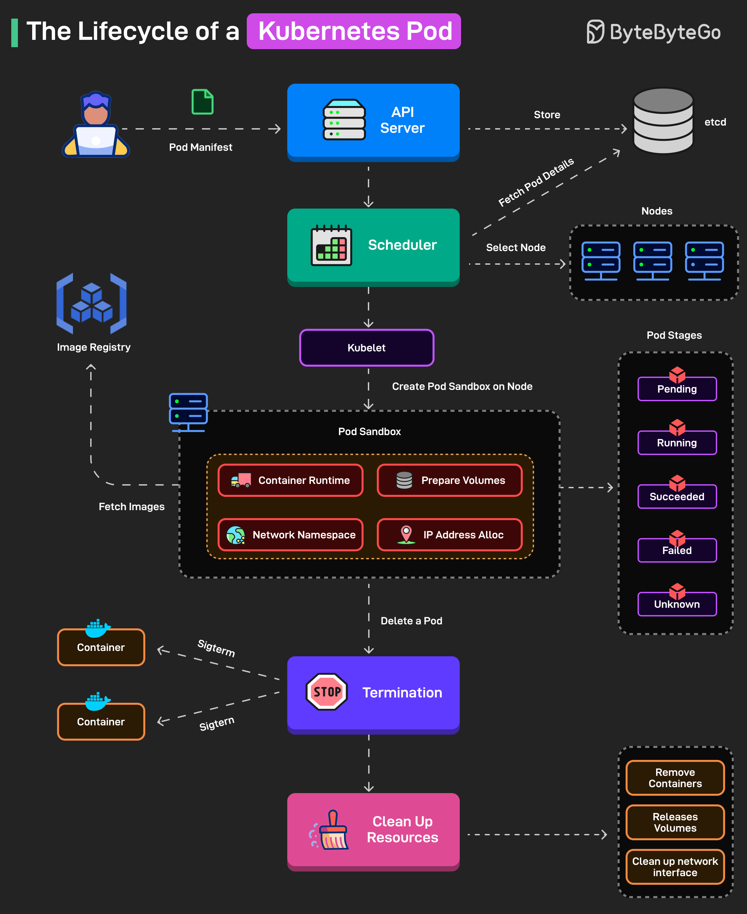

## Summary

### Docker vs K8s

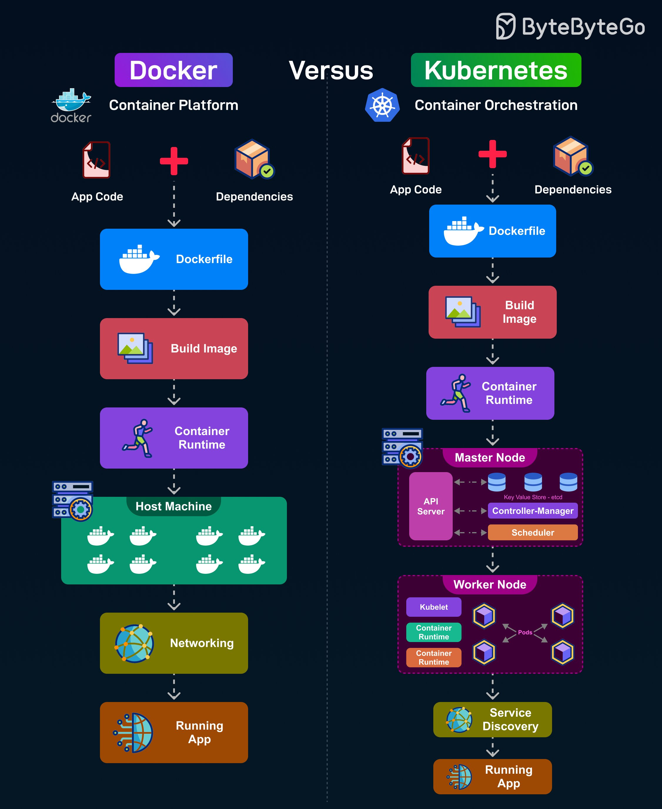

### DevOps vs NoOps

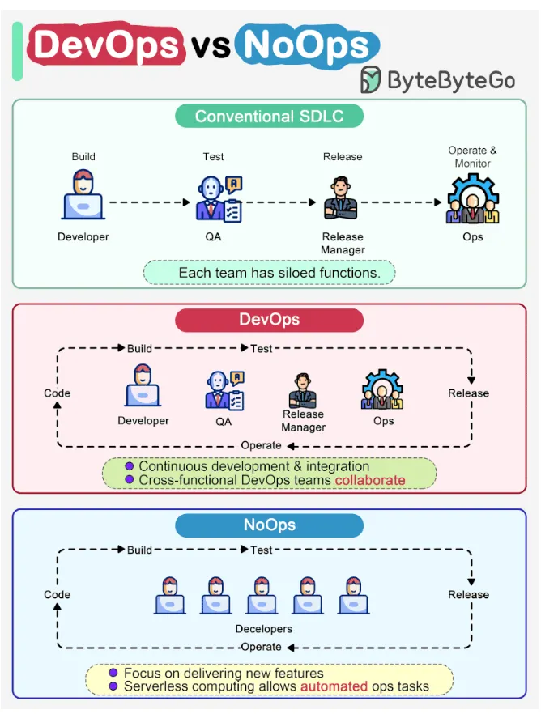

### Virtualization vs Containerization

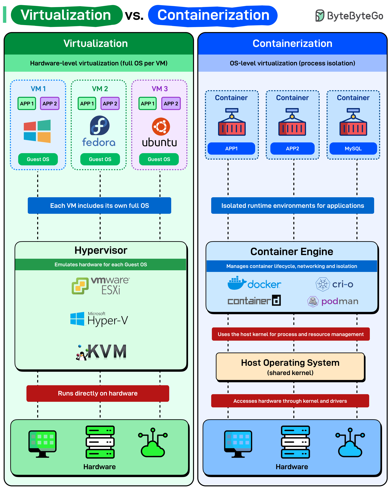

## Reference

[1] [System Design CheatSheet for Interview](https://medium.com/javarevisited/system-design-cheatsheet-4607e716db5a)

[2] [A Crash Course in Kubernetes](https://blog.bytebytego.com/p/a-crash-course-in-kubernetes)

[3] [EP191: Virtualization vs. Containerization](https://blog.bytebytego.com/p/ep191-virtualization-vs-containerization)

[4] [EP178: The Lifecycle of a Kubernetes Pod](https://blog.bytebytego.com/p/ep178-the-lifecycle-of-a-kubernetes)