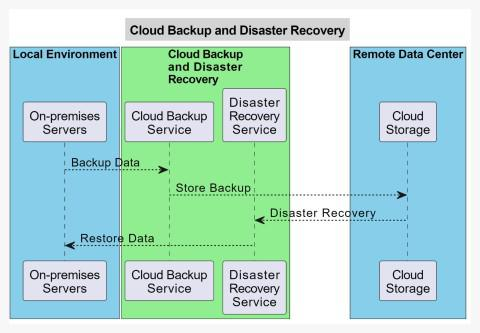

# Disaster Recovery

[TOC]

## Steps

## Advantage

- Data Protection and Redundancy
- Scalability
- Cost-Efficiency
- Accessibility And Flexibility
- Automated Backup And Recovery
- Disaster Recovery Capabilities

## Disadvantages

- Internet Dependency
- Data Security
- Vendor Reliability
- Data Transfer Speed
- Loss Of Control
- Rising Costs

## Reference

[1] [What is Data Backup and Disaster Recovery?](https://www.geeksforgeeks.org/cloud-computing/what-is-data-backup-and-disaster-recovery/)