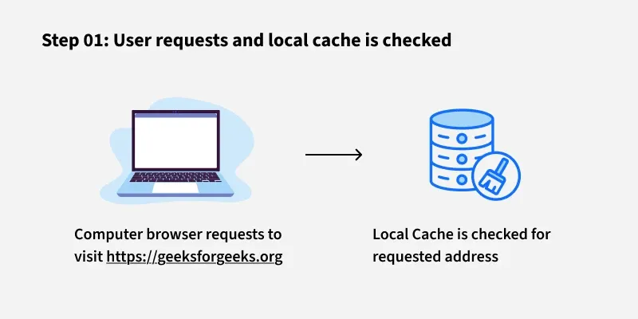
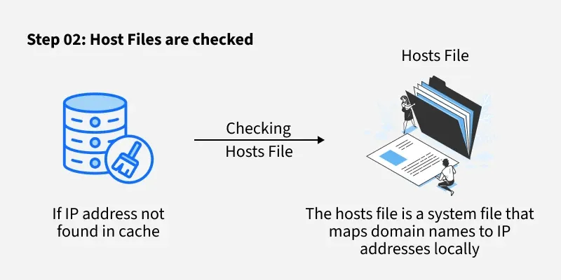
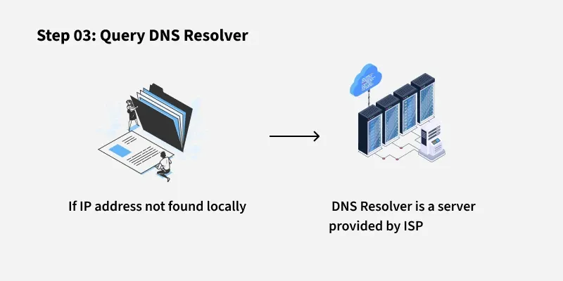
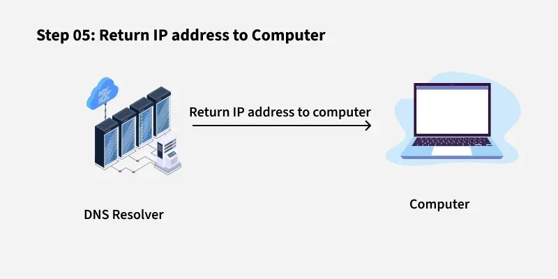
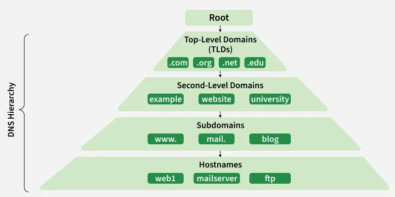
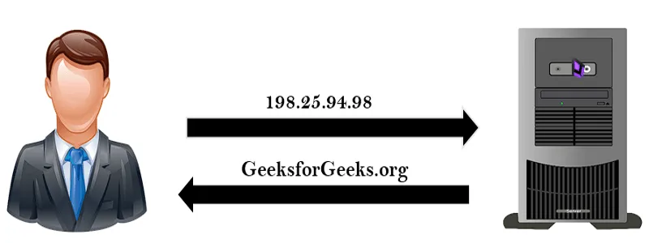
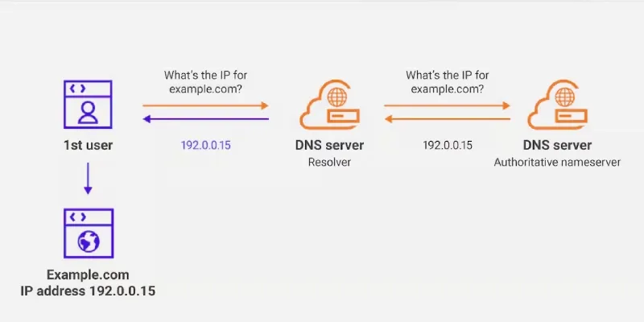
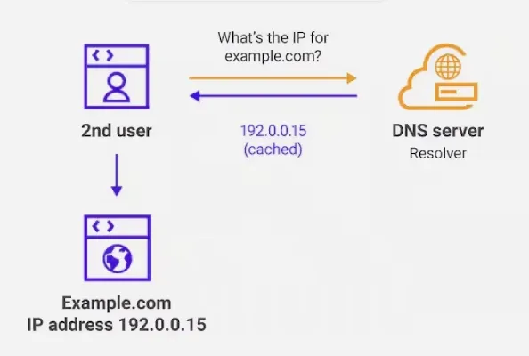
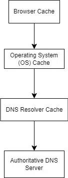
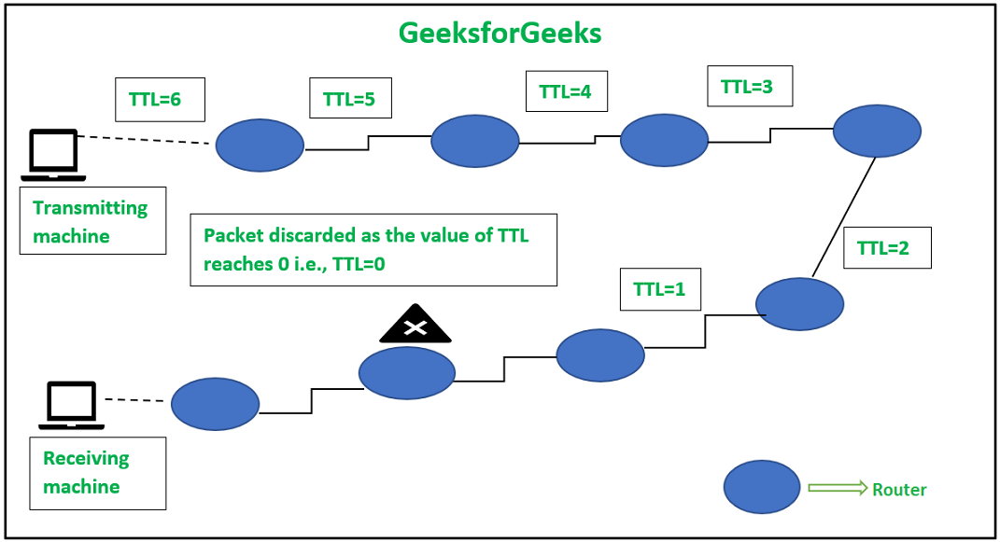

# Domain Name System(DNS)

[TOC]

The Domain Name System(DNS) is a hierarchical and distributed naming system that translates human-readable domain names into IP addresses, enabling users to access websites easily.

## Working of DNS

The DNS process can be broken down into several steps:

1. User Input
2. Local Cache Check
3. DNS Resolver Query
4. Root DNS Server
5. TLD Server
6. Authoritative DNS Server
7. Final Response

## Structure

DNS operates through a hierarchical structure, ensuring scalability and reliability across the global internet infrastructure.

## Domains

### Types Of Domains

DNS helps manage a wide variety of domain types to organize teh vast number of websites on the internet:

- Generic Domains
- Country Code Domains
- Inverse Domains

### Domain Name Server

The client machine sends a request to the local name server, which, if the root does not find the address in its database, send a request to the root name server, which in turn, will route the query to a top-level domain(TLD) or authoritative name server.

## Lookup

DNS Lookup, also called DNS Resolution, is the process of translating a human-readable domain name into its corresponding IP address. The process involves:

- DNS Resolver
- Recursive Query
- Iterative Query
- Non-Recursive Query

### Reverse DNS Lookup

Reverse DNS Lookup is the process of mapping an IP address back to its corresponding domain name. This is teh ooopsite of teh typical DNS lookup, where a domain name is resolved to an IP address. Reverse DNS is commonly used for:

- Network Diagnostics
- Email Security

## Types Of DNS Queries

## Types Of DNS Records

DNS records are essential for defining how domain names are used and how services are configured. Here are some of the most commonly used DNS record types:

- A Record
- CNAME Record
- MX Record
- TXT Record

## DNS Caching

DNS caching is a temporary storage system that keeps records of recent domain name lookups like `google.com <-> 172.217.0.46` to speed up future requests. Instead of querying a DNS server every time you visit a website, your computer or network checks the cache first, reducing load times and improving efficiency.

1. First Request
2. Cache Storage
3. Subsequent Requests

### DNS Cache Hierarchy

DNS caching occurs at multiple levels, forming a hierarchical structure that optimizes performance.

### Types of DNS Caching

- Browser-Level DNS Caching
- Operating System(OS) - Level DNS Caching
- Router-Level DNS Caching
- DNS Resolver (ISP/Third-Party DNS Server) Caching
- Recursive Resolver Caching
- Authoritative DNS Server Caching
- Content Delivery Network(CDN) Caching
- Host File Caching

### TTL(Time to Live)

Time to Live dictates how long DNS record should be stored in the cache memory before it is considered outdated and must be discarded or refreshed. TTL is measured in seconds.

The usage of TTL in computing applications lies in the performance improvement and management of data caching. It also finds its use in **Content Delivery Network(CDN) caching** and **Domain Name System (DNS) caching**.

Importance of TTL in DNS Caching:

- It reduces the time taken for DNS lookups.
- It ensures timely updates to DNS records.
- It prevents outdated data issues while maintaining speed.

### Flush DNS Cache

- Browser-level DNS Cache Flush
- Operating System-Level DNS Cache Flush

### Best Practices For DNS Caching

- Set Appropriate TTL Values.
- Regular Cache Flushing.
- Use Reliable DNS Servers.

## References

[1] [Domain Name System (DNS)](https://www.geeksforgeeks.org/computer-networks/domain-name-system-dns-in-application-layer/)

[2] [What is DNS Caching](https://www.geeksforgeeks.org/computer-networks/what-is-dns-caching/)