# Domain Name System (DNS)

[TOC]

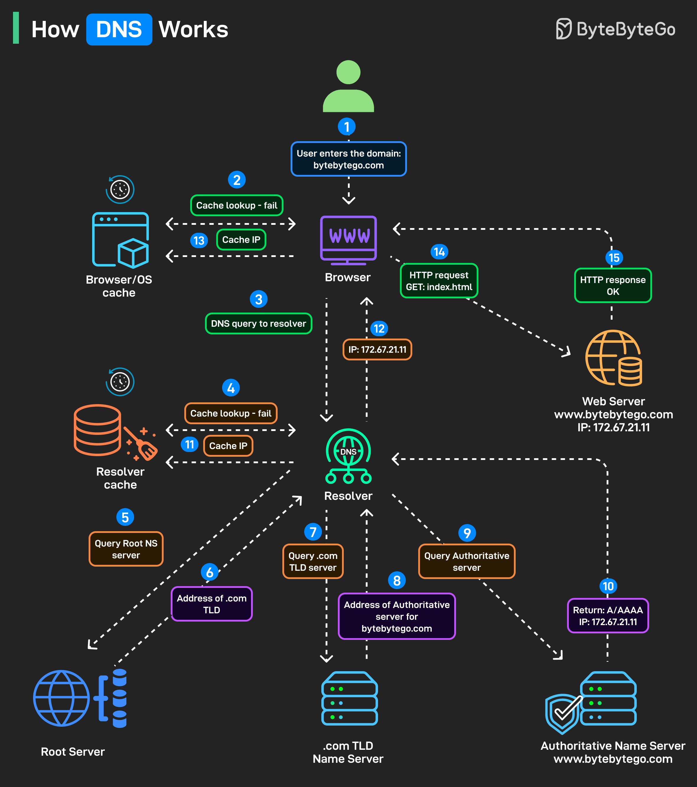

The Domain Name System(DNS) is a hierarchical and distributed naming system that translates human-readable domain names into IP addresses, enabling users to access websites easily.

## Working of DNS

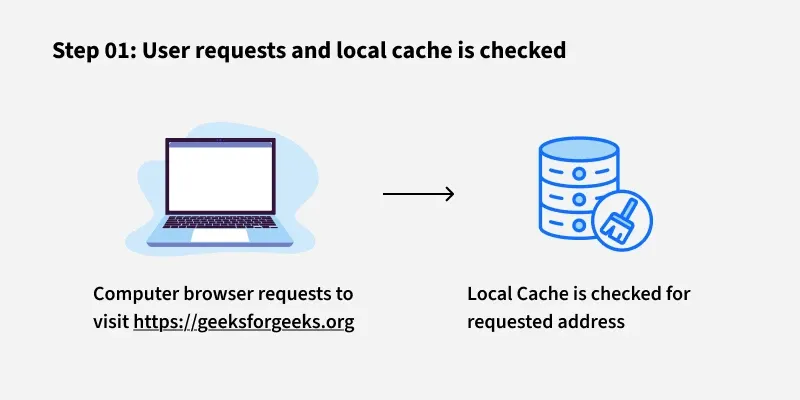

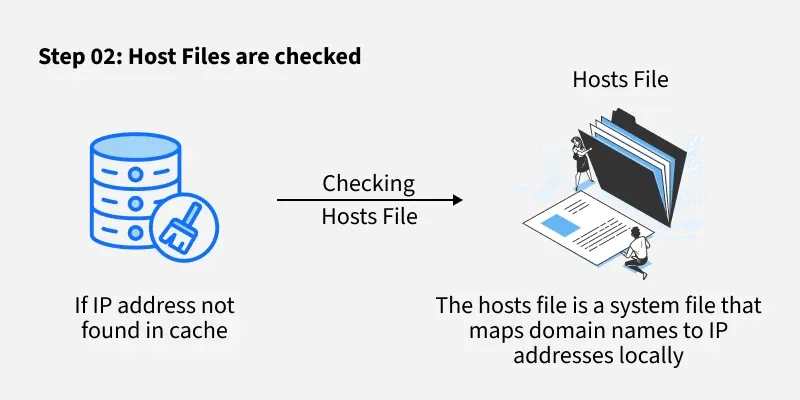

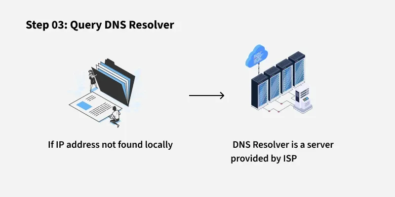

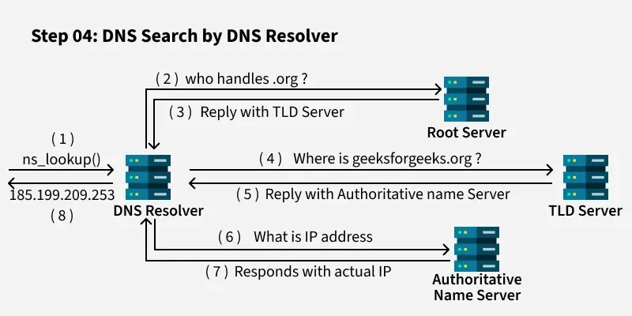

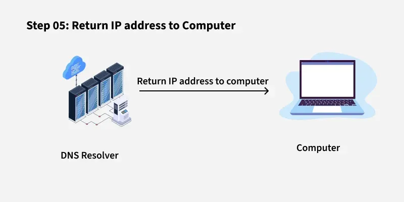

The DNS process can be broken down into several steps:

1. User Input
2. Local Cache Check
3. DNS Resolver Query
4. Root DNS Server
5. TLD Server
6. Authoritative DNS Server
7. Final Response

## Structure

DNS operates through a hierarchical structure, ensuring scalability and reliability across the global internet infrastructure.

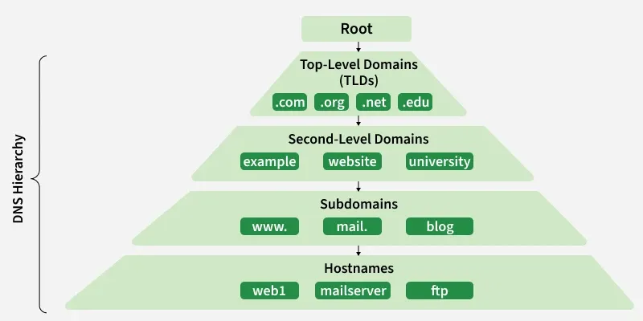

## Domains

### Types Of Domains

DNS helps manage a wide variety of domain types to organize the vast number of websites on the internet:

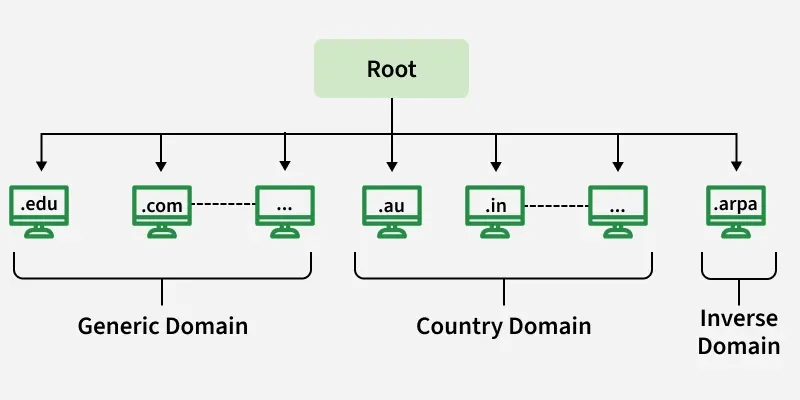

- Generic Domains (gTLDs)

  These domains are used for general purposes and are not tied to any country.

- Country Code Domains (ccTLDs)

  These domains represent specific countries or geographic regions.

- Inverse Domains

  These domains are used to map IP addresses back to domain names.

### Domain Name Server

The client machine sends a request to the local name server, which, if the root does not find the address in its database, sends a request to the root name server, which, in turn, will route the query to a top-level domain(TLD) or authoritative name server.

## Lookup

DNS Lookup, also called DNS Resolution, is the process of translating a human-readable domain name into its corresponding IP address. The process involves:

- DNS Resolver

  Starts the DNS lookup process and acts as an intermediary between client and DNS servers.

- Recursive Query

  A query where the resolver fetches the complete answer on behalf of the client.

- Iterative Query

  A query where the server provides the best information it has or a referral.

- Non-Recursive Query

  A query where the answer is already available in cache or authoritative server.

### Reverse DNS Lookup

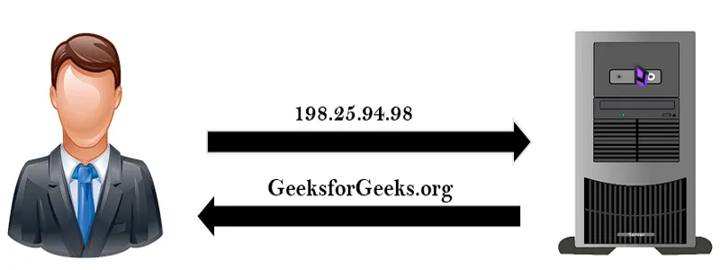

Reverse DNS Lookup is the process of mapping an IP address back to its corresponding domain name. This is teh ooopsite of teh typical DNS lookup, where a domain name is resolved to an IP address. Reverse DNS is commonly used for:

- Network Diagnostics
- Email Security

## Types Of DNS Queries

## Types Of DNS Records

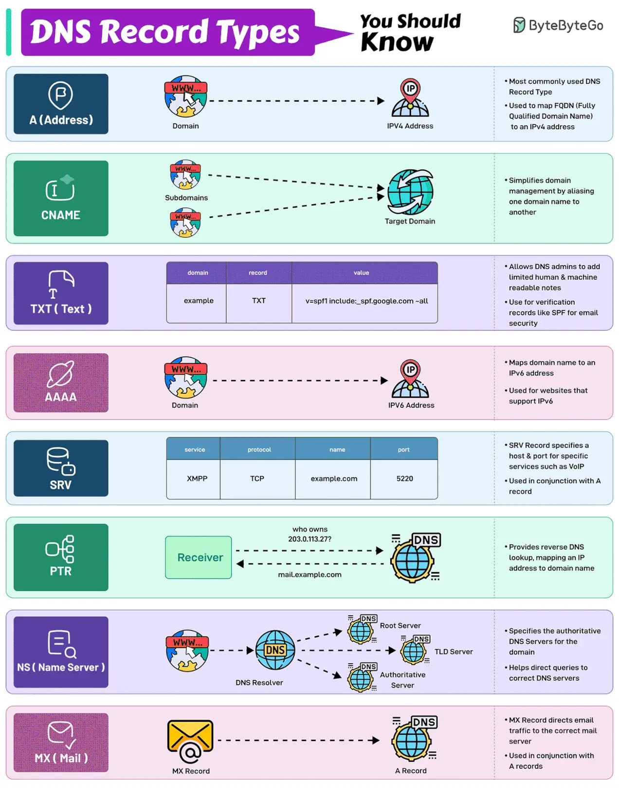

DNS records are essential for defining how domain names are used and how services are configured. Here are some of the most commonly used DNS record types:

- A Record
- CNAME Record
- MX Record
- TXT Record

## DNS Caching

DNS caching is a temporary storage system that keeps records of recent domain name lookups like `google.com <-> 172.217.0.46,` to speed up future requests. Instead of querying a DNS server every time you visit a website, your computer or network checks the cache first, reducing load times and improving efficiency.

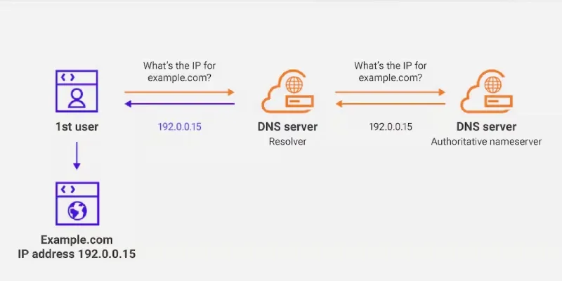

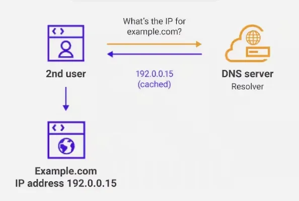

1. First Request

   When you visit a website (e.g., example.com), your system queries a DNS server for its IP address.

2. Cache Storage

   The IP address is saved locally—on your device, router, or ISP’s servers—for a set duration defined by TTL (Time to Live).

3. Subsequent Requests

   Future visits to example.com use the cached IP, skipping the DNS lookup and making the connection faster.

### DNS Cache Hierarchy

DNS caching occurs at multiple levels, forming a hierarchical structure that optimizes performance.

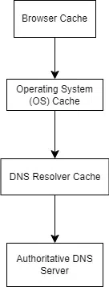

### Types of DNS Caching

- Browser-Level DNS Caching
- Operating System(OS) - Level DNS Caching
- Router-Level DNS Caching
- DNS Resolver (ISP/Third-Party DNS Server) Caching
- Recursive Resolver Caching
- Authoritative DNS Server Caching
- Content Delivery Network(CDN) Caching
- Host File Caching

### Layers of DNS Caching

DNS caching occurs at different layers in the system to improve performance and reduce repeated DNS lookups.

- Router-Level DNS Caching

  Routers cache DNS queries locally for connected devices, reducing external DNS requests and improving network efficiency.

- DNS Resolver (ISP/Third-Party) Caching

  DNS resolvers cache responses for multiple users, reducing the need to query authoritative servers repeatedly and improving resolution speed.

- Content Delivery Network (CDN) Caching

  CDNs cache content and help route users to the nearest server, reducing latency and improving load times.

- Host File Caching

  The hosts file acts as a manual override, allowing systems to resolve domain names before making any DNS query.

### TTL (Time to Live)

Time to Live dictates how long a DNS record should be stored in the cache memory before it is considered outdated and must be discarded or refreshed. TTL is measured in seconds.

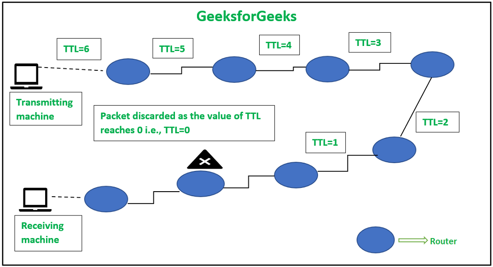

The usage of TTL in computing applications lies in the performance improvement and management of data caching. It also finds its use in **Content Delivery Network(CDN) caching** and **Domain Name System (DNS) caching**.

Importance of TTL in DNS Caching:

- It reduces the time taken for DNS lookups.
- It ensures timely updates to DNS records.
- It prevents outdated data issues while maintaining speed.

### Flush DNS Cache

- Browser-level DNS Cache Flush
- Operating System-Level DNS Cache Flush

### Best Practices For DNS Caching

- Set Appropriate TTL Values.
- Regular Cache Flushing.
- Use Reliable DNS Servers.

## References

[1] [Domain Name System (DNS)](https://www.geeksforgeeks.org/computer-networks/domain-name-system-dns-in-application-layer/)

[2] [What is DNS Caching](https://www.geeksforgeeks.org/computer-networks/what-is-dns-caching/)

[3] [EP143: DNS Record Types You Should Know](https://blog.bytebytego.com/p/ep143-dns-record-types-you-should)

[4] [How DNS Works](https://blog.bytebytego.com/p/ep193-database-types-you-should-know)

[5] [DNS Caching](https://www.geeksforgeeks.org/computer-networks/what-is-dns-caching/)