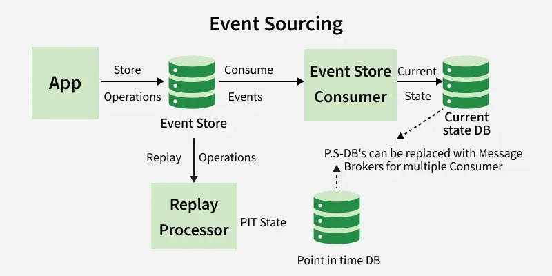
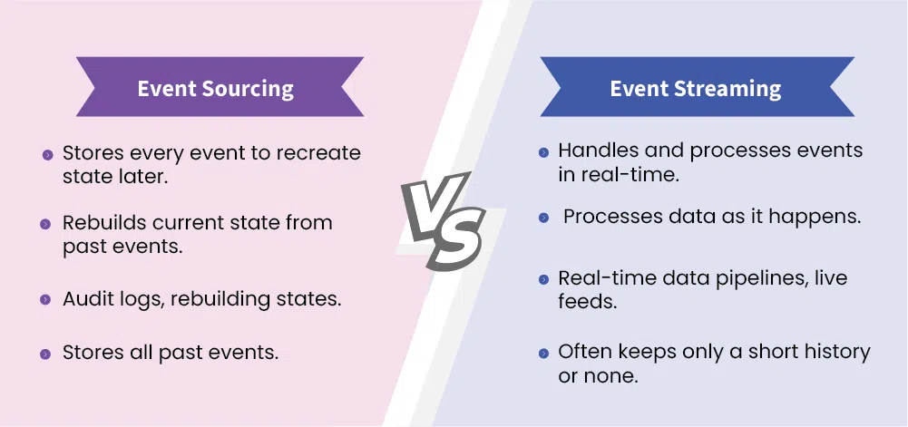

# Event

[TOC]

## Event Sourcing Pattern

Event Sourcing is a software architectural pattern used to model the state of an application by capturing all changes as a series of immutable events. Instead of storing just the current state of an object or entity, Event Sourcing persists in each state change as a distinct event. This approach allows for a complete history of changes to be maintained, enabling better traceability, auditing, and debugging.

### Advantage

- You have a full history of everything that happened in the system.
- You can easily fix mistakes by reprocessing events.
- It is easy to see how the current state was reached.

### Disadvantage

- It is managing events can become complex over time.
- It stores every event and can use a lot of space.
- Rebuilding the current state from many events can take time.

### Challenges

While Event Sourcing offers various benefits, it also presents several challenges:

- Events may take on a different structure as the system develops.
- It can be difficult to properly store and retrieve huge amounts of events, particularly in situations with high throughput or lengthy event histories.
- Various components of the system may see state changes at various times due to eventual consistency, which is usually the outcome of event sourcing.

### Practice

Use Event Sourcing Pattern when:

- It's good for apps with complicated rules that need to keep track of how things change over time.
- It helps when you need a complete history of changes for legal reasons or audits.
- Useful for systems that need to save old data, like financial information.
- Helps your app bounce back quickly from problems by rep.
- Laying past events.
- Works well in systems with separate parts that need to communicate without being tightly linked.

Event Sourcing may not be the best choice in these situations:

- If the system only needs to maintain the latest state and does not require a full history or audit trail, Event Sourcing adds unnecessary complexity.
- Since every change is stored as a separate event, frequent updates can significantly increase storage requirements over time.
- Ensuring consistency across multiple events--especially in distributed systems--can be difficult and requires careful coordination.
- Rebuilding state by replaying events can impact performance in applications where fast data retrieval and low latency are essential.

## Event Streaming

Event Streaming is a data processing paradigm that focuses on the continuous flow of events in real-time between systems or applications. It enables the collection, processing, and analysis of data as it is generated, allowing organizations to react to changes and insights immediately. Event Streaming is particularly useful in scenarios where timely data is critical for decision-making, analytics, or system integration.

### Advantages

- Events are handled as they happen, leading to fast reactions.
- It works well even when there are lots of events coming in quickly.
- Different parts of a system can work alone by read to the events they need.

### Disadvantages

- Ready event streaming can be complicated.
- There is a risk of losing events if the system is not set up correctly.
- Keeping everything in sync can be difficult if not handled properly.

## Summary

### Event Sourcing VS Event Streaming

| Feature          | Event Sourcing                             | Event Streaming                                 |
| ---------------- | ------------------------------------------ | ----------------------------------------------- |
| Main Purpose     | Stores every event to recreate state later | Handles and processes events in real-time       |
| Data Handling    | Rebuilds current state from past events    | Processes data as it happens                    |
| Use Cases        | Audit logs, rebuilding states              | Real-time data pipelines, live feeds            |
| Storage          | Stores all past events                     | Often keeps only a short history or none        |
| Complexity       | More complex to manage long-term           | Can be complex to set up and maintain           |
| Processing Speed | Slower due to replaying events             | Faster as it processes events live              |
| Error Handling   | Easier to fix issues by replaying events   | More difficult if an event is lost in real-time |

## References

[1] [Event-Driven Architecture(EDA)](https://www.geeksforgeeks.org/system-design/event-driven-architecture-system-design/)

