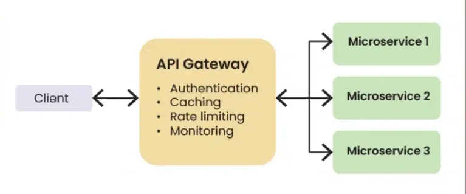
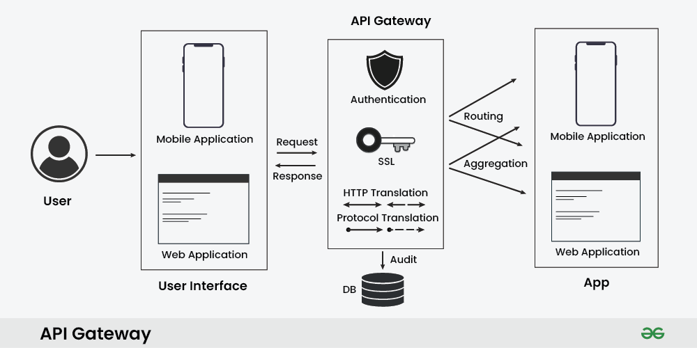
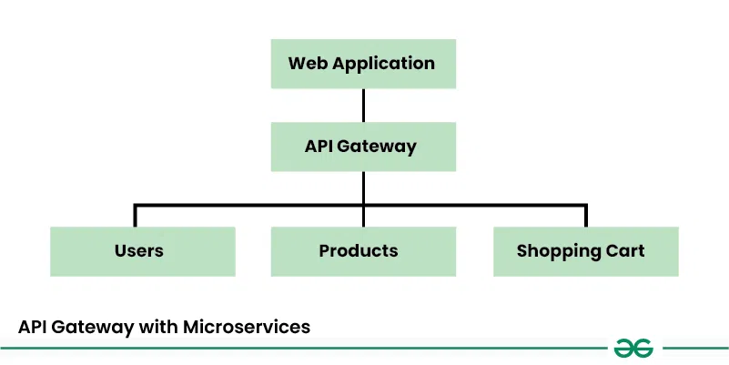
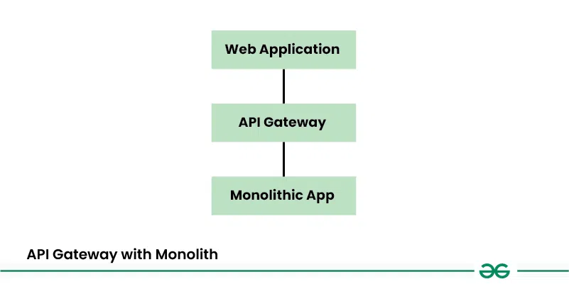

# Gateway

[TOC]

## API Gateway

An API Gateway is a key component in system design, particularly in microservices architectures and modern web applications. It serves as a centralized entry point for managing and routing requests from clients to the appropriate microservices or backend services within a system.

### Methods Of Authentication

- API Keys
- OAuth
- JWT(JSON Web Tokens)
- LDAP(Lightweight Directory Access Protocol)

### Work Flow

- Routing

  Directs client requests to the appropriate service based on URL, method, or headers.

- Protocol Translation

  Converts requests between protocols (e.g., HTTP -> gRPC/WebSocket).

- Request Aggregation

  Combines multiple backend class into one to reduce round trips.

- Authentication & Authorization

  Verifies client identity and access permissions.

- Rate Limiting & Throttling

  Controls request rates to prevent abuse and ensure resource balance.

- Load Balancing

  Distributes requests across service instances for scalability and availability.

- Caching

  Stores backend responses to speed up repeated requests.

- Monitoring & Logging

  Tracks metrics and logs for performance and usage insights.

### API Gateway with Microservices

- The web application communicates with the API Gateway.
- The API Gateway routes requests to the appropriate microservices.
- It handles authentication, rate limiting, caching, and other functions.
- Error responses are also standardized by the API Gateway.

### API Gateway with Monolith

- The web application communicates with the API Gateway.
- The API Gateway simplifies client interactions and provides security and caching and other features.
- It also manages API versioning and error handling.

### Advantage

- Centralized Entry Point
- Routing & Load Balancing
- Authentication & Authorization
- Request & Response Transformation

## Reference

[1] [What is API Gateway?](https://www.geeksforgeeks.org/system-design/what-is-api-gateway-system-design/)