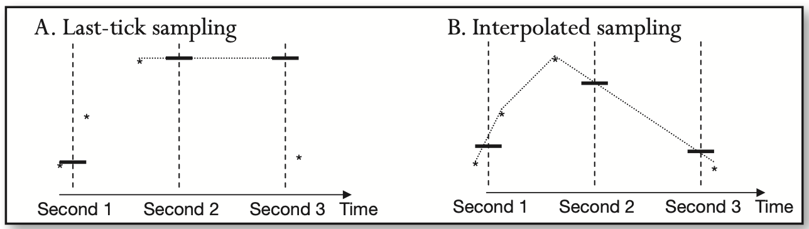
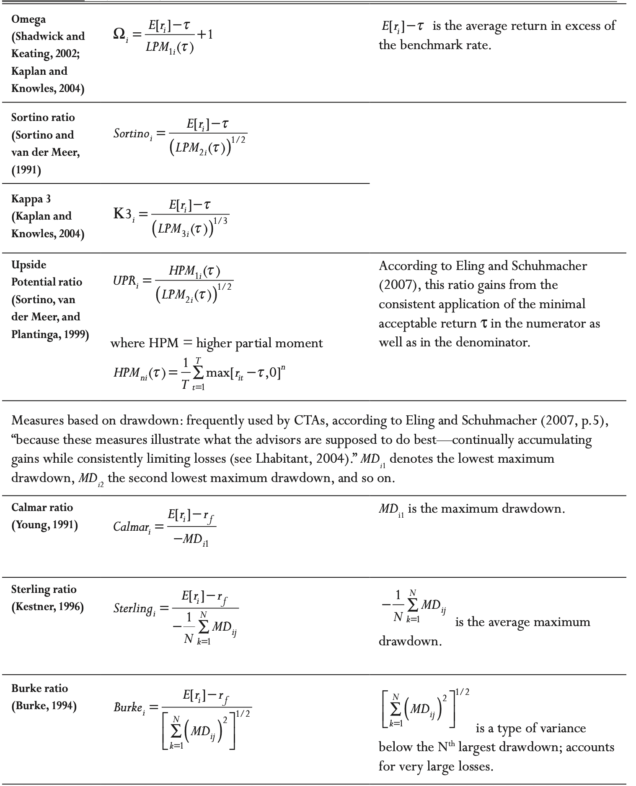
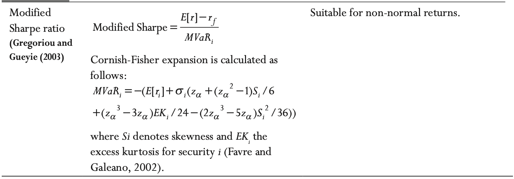

[中文版](hft_zh.md) | English

# High Frequency Trading

[TOC]

High-frequency trading is a form of automated trading that employs:

- Algorithms for decision making, order initiation, generation, routing, or execution, for each individual transaction without human direction;
- Low-latency technology that is designed to minimize response times, including proximity and co-location services;
- High-speed connections to markets for order entry; and
- High message rates (orders, quotes or cancellations).

## Why HFT

The advantages of high-frequency trading in the developing electronic markets are two-fold:

- First-to-market high-frequency traders in the newly electronic markets are likely to capture significant premiums on their speculative activity simply because of the lack of competition.
- In the long term, none of the markets is a zero-sum game. The diverse nature of market participants ensures that all players are able to extract value according to their own metrics.

At the heart of a successful investment management to HFT lie three P's:

- Precision

  precision of mathematical metrics, refers to the exactitude required to quickly and reliably separate winning strategies from the losing ones.

- Productivity

  productivity of the investment process.

- Performance

  It is particularly relevant to high-frequency systems.

## Define

- Orders to buy or sell a security at the best available price when the order is placed are known as **market orders**. Orders to buy or sell a security at a particular price are known as **limit orders**.
- **midquote**: the simple average of the latest bid and ask quotes.
- The during models working with fixed price are known as **price processes**; the during models estimating variation in duration of fixed volume increments are known as **volume processes**.

## HFT Data

High-frequency data, also known as `tick data`, are records of live market activity. Most limit and market orders are placed in so-called "lot sizes": increments of a certain number of units, known as a lot.

| Property of HFT Data                                   | Description                                                  | Pros                                                         | Cons                                                         |
| ------------------------------------------------------ | ------------------------------------------------------------ | ------------------------------------------------------------ | ------------------------------------------------------------ |
| Voluminous                                             | Each day of high-frequency data contains the number of observations equivalent to 30 years of daily data. | Large numbers of observations carry lots of information      | High-frequency data are difficult to handle manually         |
| Subject to bid-ask bounce                              | Unlike traditional data based on just closing prices, tick data carry additional supply-and-demand information in the form of bid and ask prices and offering sizes. | Bid and ask quotes can carry valuable information about impending market moves, which can be harnessed to the researcher's advantage. | Bid and ask quotes are separated by a spread. Continuous movement from bid to ask and back introduces a jump process, difficult to deal with through many conventional models. |
| Not normally or lognormally distributed                | Returns computed from tick are not normal or lognormal.      | Many tradable models are still to be discovered.             | Traditional asset pricing models assuming lognormality of prices do not apply. |
| Irregularly spaced in time                             | Arrivals of tick data are asynchronous.                      | Durations between data arrival carry information.            | Most traditional models require regularly spaced data; need to convert high-frequency data to some regular intervals, or "bars" of data. Converted data are often sparse (populated with zero returns), once again making traditional econometric inferences difficult. |
| Do not include buy or sell trade direction information | Level 1 and Level 2 data do not include information on whether the trade was a result of a market buy or a market sell order. | Data are leaner without trade direction information; trade information is more difficult for bystanders to extract. | The information on whether a trade is buyer initiated or seller initiated is a desired input in many models. |

### bid-ask spread

Future realizations of the bid-ask spread can be estimated using the model suggested by Roll(1984), where the price of an asset at time $t$, $P_t$, is assumed to equal an unobservable fundamental value, $m_t$, offset by a value equal to half of the bid-ask spread, $s$. The price offset is positive when the next market order is a buy, and negative when the trade is a sell, as shown in the equation:
$$
P_t = m_t + \frac{s}{2}I_t
$$
, where:
$$
I_t = 
\begin{cases}
1, &\text{market buy at ask}\\
-1, &\text{market sell at bid}
\end{cases}
$$
, If either a buy or sell order can arrive next with equal probability, then $E[I_t] = 0$, and $E[\Delta_{p_t}] = 0$, absent changes in the fundamental asset value, $m_t$. The covariance of subsequent price changes, however, is different from 0:
$$
cov[\Delta_{P_t}, \Delta_{P_{t + 1}}] = E[\Delta_{P_t} \Delta_{P_{t + 1}}] = -\frac{s^2}{4}
$$
, As a result, the future expected spread can be estimated as follows:
$$
E[s] = 2 \sqrt{-cov[\Delta_{P_t}, \Delta_{P_{t + 1}}]} \text{ whenever } cov[\Delta_{P_t}, \Delta_{P_{t + 1}}] < 0
$$

### midquote 

The midquote is used to approximate the price level at which the market is theoretically willing to trade if buyers and sellers agreed to meet each other halfway on the price spectrum. Mathematically, the midquote can be expressed as follows:
$$
\hat{q}_{t_m}^m = \frac{1}{2} \left( q_{t_a}^a + q_{t_b}^b \right), where t_m =
\begin{cases}
t_a, &\text{if } t_a \geq t_b\\
t_b, &\text{otherwise }
\end{cases}
$$
, The later condition for $t_m$ reflects the continuous updating of the mid-quote estimate: $\hat{q}_{t_m}^m$ is updated whenever the latest bets bid, $q_{t_b}^{b}$, or best ask quote, $q_{t_a}^{a}$, arrives, at $t_b$ or $t_a$ respectively.

### weighing the latest best bid and best ask quotes

Another way to sample tick quotes into a cohesive data series is by weighing the latest best bid and best ask quotes by their accompanying order sizes:
$$
\widetilde{q_t}^{s} = \frac{q_{t_b}^{b} s_{t_a}^{a} + q_{t_a}^{a} s_{t_b}^{b}}{s_{t_a}^{a} + s_{t_b}^{b}}
$$
, where $q_{t_b}^{b}$ and $S_{t_b}^{b}$ is the best bid quote and the best bid available size recorded at time $t_b$ (when $q_{t_b}^{b}$ became the best bid), and $q_{t_a}^{a}$ and $S_{t_a}^{a}$ is the best bid quote and the best bid available size recorded at time $t_a$​.

### linear time-weighted interpolation between adjacent quotes.

Dacorogna et al. (2001) propose a potentially more precise way to sample quotes: linear time-weighted interpolation between adjacent quotes. At the core of the interpolation technique is an assumption that at any given time, unobserved quotes lie on a straight line that connects two neighboring observed quotes.

Date-Sampling Methodologies:

, Mathematically, the two sampling methods can be expressed as follows:

- Quote sampling using closing prices:
  $$
  \hat{q_t} = q_t, last
  $$

- Quote sampling using linear interpolation:
  $$
  \hat{q_t} = q_{t, last} + (q_{t, next} - q_{t, last}) \frac{t - t_{last}}{t_{next} - t_{last}}
  $$

, where $\hat{q_t}$ is the resulting sampled quote, $t$ is the desired sampling time(start of a new minute, for example), $t_{last}$ is the timestamp of the last observed quote prior to the sampling time $t$, $q_{t, last}$ is the value of the last quote prior to the sampling time $t$, $t_{next}$ is the timestamp of the first observed quote after the sampling time $t$, and $q_{t, next}$ is the value of the first quote after the sampling time $t$.

### duration model

Duration models are used to estimate the factors affecting the time between any two sequential ticks. Such models are known as quote processes and trade processes, respectively. Duration models are also used to measure the time elapsed between price changes of a prespecified size, as well as the time interval between predetermined trade volume increments. The models working with fixed price are known as `price processes`; the models estimating variation in duration of fixed volume increments are known as `volume processes`.

Durations are often modeled using Poisson processes that assume that sequential events, like quote arrivals, occur independently of one another. The number of arrivals between any two time points $t$ and $(t + \tau)$ is assumed to have a Poisson distribution. In a Poisson process, $\lambda$ arrivals occur per unit time. In other words, the arrivals occur at an average rate of $(1/\lambda)$. The average arrival rate may be assumed to hold constant, or it may vary with time. If the average arrival rate is constant, the probability of observing exactly $K$ arrivals between times $t$ and $(t + \tau)$ is:
$$
P[(N(t + \tau) - N(t)) = k] = \frac{1}{k!}e^{-\lambda \tau} (\lambda \tau)^{k}, k = 0, 1, 2, ...
$$
The time interval between subsequent price changes of a specified magnitude is known as `price duration`. Price duration has been shown to decrease with increases in volatility. Similarly, the time interval between subsequent volume changes of a prespecified size is known as the `volume duration`. Volume duration has been shown to decrease with increases in liquidity.

### buy or sell order

Neither Level 1 nor Level 2 tick data contains identifiers specifying whether a given recorded trade was a result of a market buy order or a market sell order. To overcome this challenge, four methodologies have been proposed to estimate whether a trade was a buy or a sell from Level 1 data:

- Tick rule

  According to the tick rule, the classification of a trade is performed by comparing the price of the trade to the price of the preceding trade; no bid or offer quote information is taken into account. Each trade is then classified into one of the four categories:

  1. `Uptick`, if the trade price is higher than the price of the previous trade.
  2. `Downtick`, if the trade price is lower than the price of the previous trade.
  3. `Zero-uptick`, if the price has not moved, but the last recorded move was an uptick.
  4. `Zero-downtick`, if the price has not moved, but the last recorded move was a downtick.

- Quote rule

- Lee-Ready rule

  The so-called Lee-Ready rule classifies trades first using the quote rule. The trades occurring at the midpoint between the prevailing bid and ask quotes are not classified under the quote rule, and are subsequently classified using the tick rule.

- Bulk volume classification

  The rule, named `bulk volume classification`, works as follows: for every unit of time or volume (a "volume bar", say every 100 shares traded), BVC assigns the probability of the observed volume being a buy as follows:
  $$
  Pr(V_{\tau} = B) = Z(\frac{p_{\tau} - p_{\tau - 1}}{\sigma \Delta P})
  $$
  , where:

  - $V_{\tau}$ is the total volume observed during time or volume interval $\tau$.
  - $p_{\tau} - p_{\tau - 1}$ is the price difference observed between the two subsequent time or volume bars, $\tau - 1$ and $\tau$.
  - $\sigma \Delta P$ is the standard deviation of sequential time or volume-clock-based price changes.
  - $Z$ is the PDF of a standard normal distribution.

  , The buyer-initiated trade volume can then be estimated as:
  $$
  V_{\tau}^{B} = V_{\tau} Z (\frac{p_{\tau} - p_{\tau - 1}}{\sigma \Delta p})
  $$
  , According to the BVC, the probability of a specific volume being generated by a market sell order then becomes:
  $$
  Pr(V_{\tau} = S) = 1 - Pr(V_{\tau} = B) = 1 - Z(\frac{p_{\tau} - p_{\tau - 1}}{\sigma \Delta p})
  $$
  , And the respective size of the seller-initiated volume is then:
  $$
  V_{\tau}^{S} = V_{\tau}(1 - Z(\frac{p_{\tau} - p_{\tau - 1}}{\sigma \Delta p}))
  $$

## Costs

Costs known prior to trading activity are referred to as `transparent` or `explicit`, and costs that have to be estimated are known as `latent` or `implicit`.

Transparent execution costs are generally known ahead of trading; they comprise:

- Broker Commissions.
- Exchange Fees
- Taxes

At the tick level of data, transparent costs are being increasingly dominated by implicit costs of the opportunity cost of investment:

- Bid-Ask Spreads

  The bid-ask spread is the difference between the best ask and the best bid at any given point in time, and represents the cost of instantaneous liquidation of a trading position. The spread can also be seen as the premium paid by traders desiring immediate execution via market orders.

- Slippage or Latency Costs

  `slippage` is the adverse change in the market price of the traded security that occurs from the time an investment decision is made until the time the trade is executed.

  In reality, slippage is not solely dependent on the speed of trading activity. Instead, slippage is also a direct frunction of the:

  1. Liquidity available in the market
  2. The number of market orders that have arrived to consume that liquidity.

  Stoikov and Rolf (2012) define cost of latency as the expected value of dollar-denominated savings resulting from executing with slow and fast (low-latency) infrastructures:
  $$
  COL = E[S_{t + 1} - S_{t}]
  $$
  , where $S_{t + 1}$ is the price obtained at time $t$ with latency $1$ and $S_t$ is the price obtained on the same financial instrument at the same time $t$ when latency $1$ approaches zero.

- Price Appreciation and Timing Risk Costs

  The price appreciation cost refers to the forecasted loss of investment value during the execution of a large position. The timing cost refers to random, unforecasted price movement ahead of execution of a child order.

- Opportunity Costs

  The opportunity cost is the cost associated with inability to complete an order.

- Market Impact Costs

  Market impact cost measures the adverse change in the market price following an order.

### Leverage of HFT

When the Sharpe ratio increases, the expected return in the numerator and the volatility in the denominator of the ratio increase proportionally by the amount of leverage, $L$:
$$
Sr^{HFT} = \frac{E[R_{annualized}]}{\sigma[R_{annualized}]} = \frac{E[R_{annualized}] \times L}{\sigma[R_{annualized}] \times L}
$$
, The expected return of the high-frequency operation must take into account the costs of doing business, so the Sharpe ratio of an HFT business is adjusted for expenses:
$$
SR^{\text{HFT Ops}} = \frac{E[R_{annualized}] \times L \times (Capital) - (\text{Annualized Expenses})}{\sigma[R_{annualized}] \times L \times (Capital)}
$$
, or, using daily data, and assuming 250 trading days per year:
$$
SR^{\text{HFT Ops}} = \frac{E[R_{daily}]\times L \times (Capital) - (\text{Daily Expenses})}{\sigma[R_{daily}] \times L \times (Capital)} \sqrt{250}
$$
, Expressions in above equations have to be positive for a profitable business, yet the leverage value $L$ cannot be increased infinitely.

### Market Impact

The phenomenon of real-life price changes following news and orders is known as `market impact`(MI). MI can be attributed to several factors, including:

- In the trading world with heterogeneous traders possessing different beliefs and information, MI is the negotiation or tatonnement process via which traders' information and beliefs are incorporated into the security prices.
- Both market and limit orders represent traders' commitments of money and reputation, and therefore form credible signals to other market participants who may choose to trade in the same direction.
- Every market buy (sell) order temporarily depletes liquidity supply on the ask (bid) side of the order book, driving the next market buy (sell) order to the matched against a higher (lower) best available limit order price.

For market orders, the MI appears strongly concave in the order size, and the signs of market orders are autocorrelated in time: market buy orders tend to follow other market buy orders, and vice versa. A model unifying the preceding facts expresses the MI function as follows (Eisler, Bouchaud, and Kockelkoren, 2009):
$$
P_t = \sum_{t^{*} < t}[G(t, t^{*}) \in t^{*} (v_{t^{*}})^{\theta} + n_{t^{*}}] + p_{\infty}
$$

- $v_{t^{*}}$ is the volume of the trade at time $t^{*}$.
- $\in_{t^{*}}$ is the sign of the trade at time $t^{*}$.
- $n_{t^{*}}$ is the independent noise term that models any price change not induced by news.
- $G(t, t^{*})$ is the propagator function, which describes, on average, how prices respond to a single trade over time; $G(t, t^{*})$ decays with time.

`The Estimation of Market Impact for an Order Arriving at an Exchange at Time $t*$`

The MI of an individual order recorded at time $t^{*}$ is then:
$$
MI_{t^{*}} = G(t, t^{*})\in_{t^{*}} (v_{t^{*}})^{\theta} + n_{t^{*}}
$$
The MI propagator function $G(t, t^{*})$ has to decay with time, and in a specific way, to satisfy the high autocorrelation of the direction of subsequent trades. If $G$ did not decay, price returns would be proportional to the signs of the trades and returns would be highly autocorrelated in time. According to Eisler, Bouchaud and Kockelkoren (2009), $G$ decays as follows:
$$
G(t, t^{*}) \sim |t - t^{*}|^{- \beta}
$$
, where $= \frac{1 - \gamma}{2}$, and $\gamma < 1$ is the decay parameter in the correlation of subsequent trade signs:
$$
C(1) = (\in_{t} \in_{t + 1}) \sim (1)^{-\gamma}
$$
, $G(t, t^{*})$ further has the following boundary properties:
$$
G(t \to t^*) = \frac{\partial p_t}{\partial \xi_t}
$$
, where $\xi = \in_{t} v_{t}^{\theta} \sim N(0, \sigma)$ is normally distributed with mean zero and standard deviation $\sigma$.

There are some empirical estimation of permanent market impact:

1. Basic Estimation Model

    Under the assumption of linear functional form, the permanent MI can be estimated using a linear regression with the following specification:
   $$
     \Delta P_{t, \tau} = \alpha_{\tau} + \beta_{\tau}V_{t} + \beta_{\tau - 1}V_{t + 1} + \cdots + \beta_{1}V_{t + \tau - 1} + \varepsilon_{t, \tau}
   $$
     , where $t$ is the time of the trade, $\tau$ is the number of posttrade ticks or time units in the event window at which the trade impact is measured, $V_t$ is the size of the trade observed at time $t$, and $\Delta P_{t, \tau}$ is the normalized price change from time $t$ to time $\tau$ and can be expressed as shown in equation:
   $$
     \Delta P_{t, \tau} = ln(P_{\tau} - ln(P_{t}))
   $$

2. Additional Explanatory Variables

   Commercial models for estimation of market impact often deploy additional explanatory variables, such as the observed spread, short-term volatility, and intertrade durations. To analyze the potential impact of these variables, one can extend the model of equation as follows:
   $$
     \Delta P_{t, \tau} = \alpha_{\tau} + \beta_{V, \tau}V_{t} + \beta_{\sigma, \tau}\hat{\sigma_{t}} + \beta_{S, \tau}\hat{S_t} + \beta_{T, \tau}\hat{T_t} + \varepsilon_{t, \tau}
   $$

     - $\Delta P_{t, \tau}$ represents the $\tau$-tick change in price
       $$
       \Delta P_{t, \tau} = ln(P_{\tau}) - ln(P_{t - \tau})
       $$

     - $V_t$ denotes the size of the trade recorded at $t$.

     - $\hat{\sigma_{t}}$ is the estimate of short-term volatility, and can be measured in several ways, as standard deviation, or as a long change of high and low prices during a predefined pretrade period beginning $\tau^{*}$ ticks before the trade tick $t$, as first suggested by Garman and Klass (1980):
       $$
       \sigma_{t} = ln(P_{High, [t - \tau^{*}, t - 1]}) - ln(P_{Low, [t - \tau^{*}, t - 1]})
       $$

     - $\hat{S_t}$ is the average spread observed during the $\tau^{*}$ ticks preceding each trade. In data containing quotes, the average spread is the mean difference between the best offer and the best bid:
       $$
       s_t = \frac{1}{\tau - 1} \sum_{j = t - \tau}^{t - 1} Ask_{j} - Bid_{j}
       $$

     - When quote data is unavailable, the average effective spread can still be estimated by assuming that sequential price changes occur at intervals equal to the effective spread. Such an assumption generally holds true whenever a buy follows a sell and vice versa, as the market buy is executed at the best ask, and the market sell hits the best bid. An approximation noted by Aldridge(2012c):
       $$
       s_t = \frac{1}{\tau - 1}\sum_{j = t - \tau}^{t - 1}|ln(P_j) - ln(P_{j - 1})|\text{ where } P_j \neq P_{j - 1}
       $$

     - Finally, $\hat{T_t}$ is the average clock time between every two subsequent trades:
       $$
       T_t = \frac{1}{\tau - 1} \sum_{j = t - \tau}^{t - 1}t_j - t_{j - 1}
       $$

## Order-Routing Algorithms

The order-routing algorithms target the following objectives:

- Minimize execution costs
- Obtain best price
- Maximize execution speed
- Maximize trading size
- Minimize trade footprint

### Minimize Execution Costs

Trading costs comprise several major components:

- Broker commissions, both fixed and variable
- Exchange fees
- Taxes
- Bid-ask spread
- Slippage
- Opportunity cost
- Market impact

### Obtain Best Price

The core principle of the best price trading is "buy low, sell high." Due to the natural price moves, the direction of the price can be difficult to predict, and advanced short-term forecasting models are required for this purpose.

### Maximize Execution Speed

The underlying rationale for selection of the exchange is this: place limit orders wherever the limit orders are fewest, and place market orders wherever the limit orders are most numerous. Such a process ensures that the orders have the highest probability of fast execution. The process is known as the minimal impact algorithm.

### Minimize Footprint

Every order is a credible signal as it reveals the trader's true beliefs, committed to the trader's capital. As a result, every order carries information about the current views of the trader.

### Maximize Trading Size

Most researchers develop execution algorithms in the following sequence:

1. Researchers explore published and not-yet-published academic research in the area of optimal execution algorithm design and implementation.
2. The researchers model the algorithm in econometric languages such as MatLab or R and, as a result, transition their code to faster programming languages like C++ or optimized Java.
3. The algorithm is tested on historical tick data utilizing assumptions and predictions about price movement generated by the algorithm, own orders.
4. If the previous step results in a satisfactory execution schedule and price, cost, and risk outcome, the algorithm is moved into production, where it is enabled to communicate in real time using quote-receiving and sending languages such as FIX, ITCH, OUCH, FAST, and the like.

### TWAP

TWAP attempts to conceal the order flow by breaking a large order into equally sized parcels, which are then sent out at equally spaced time intervals. Mathematically, TWAP executes a fixed portion 1/T of the order every predetermined unit of time. The resulting TWAP price is the arithmetic average of prices sampled at the regular unit time intervals:
$$
TWAP = \frac{1}{T} \sum_{1}^{T}Pt
$$
The TWAP algorithm is illustrated in the above Figure. When a trader chooses to execute a large order of size $S$ using TWAP, the trader also needs to decide on the total number $N$ of child orders or slices to execute, and the total execution time $T$. Next, an order slice of size $S/N$ is sent to the market every $T/N$ seconds, until the entire order of size $S$ is processed. The total number of slices $N$ and the execution time $T$ are best determined using characteristics specific to the traded security.

### VWAP

The VWAP algorithm is currently one of the most popular execution methodologies. The principle of VWAP is straightforward: break up a large order in such a way that VWAP child orders are larger when the trading volume is higher, and child orders are smaller when trading volume is lower. Higher trading volume is likely to provide larger pool of matching orders and result in faster and more cost-effective execution.

The above figure diagrams the VWAP algorithm:
$$
s_{t} = S \frac{\overline{V_{t}}}{\sum_{\tau \in T}\overline{V_{\tau}}}
$$
The resulting benchmark VWAP price can be determined as follows:
$$
VWAP = \frac{\sum_{\tau \in T} \overline{V_{\tau}}P_{\tau}}{\sum_{\tau \in T}\overline{V_{\tau}}}
$$
 The previous period's trading volume used in calculation of POV child order should exclude the volume generated by the POV trader himself:
$$
S_{POV,t} = (V_{t - 1} - S_{POV, t - 1})(POV)
$$

## Issues with Basic Models 

The key concept in Fourier analysis is Fourier transform, a mathematical construct connecting time and frequency domains. Continuous (as opposed to digital) forms of the Fourier transform are specified as follows:
$$
f(x) = \int_{-\infty}^{\infty}F(k)e^{2 \pi ikx} dk \\
F(k) = \int_{-\infty}^{\infty}f(x)e^{-2 \pi ikx} dx
$$
, where $x$ represents a time-based variable, and $F(k)$ is a frequency-domain function.

### When Price Follows Geometric Brownian Motion

Most security pricing models assume that prices follow geometric Brownian motion with price increments $dS_{t}$ exhibiting dependency on the contemporary price level $S_{t}$, as well as incurring drift $\mu$:
$$
dS_{t} = \mu S_{t}dt + \sigma S_{t} d Z_{t}
$$
The vanilla execution cost function, not incorporating any risk optimization measures, can then be specified as follows (see Forsyth et al., 2011):
$$
C = \eta \int_{0}^{T}v_{t}^{2}dt + \lambda \sigma \int_{0}^{T}S_{t}^{2} x_{t}^{2} dt
$$
, where, as before, the optimal rate of execution is $v_{t} = -\frac{\partial X_{t}}{\partial t}$. Under the assumption of geometric Brownian motion, the costs and the resulting optimal solution of the cost minimization problem are dependent on the price of the price path. However, as Forsyth et al. (2011) show, many strategies lead to almost identical outcome.

Euler-Lagrange equations produce the following closed-form solution for optimal cost-minimizing trading strategy:
$$
x_{t}^{*} = \frac{T - t}{T}[X - \frac{\lambda T}{4} \int_{0}^{t}S_{u}du]
$$
, The resulting expected minimal cost, $E[C_{min}(x^{*})] = E[\int_{0}^{T}((v_{t}^{*})^{2} + \lambda x_{t}^{*}S_{t})dt]$ becomes:
$$
E[C_{min}(x^{*})] = \frac{X^{2}}{T} + \frac{\lambda T X S_{0}}{2} - \frac{\lambda^{2}}{8\sigma^{6}} S_{0}^{2} \left(e^{\sigma^{2}T} - 1 - \sigma^{2}T - \frac{\sigma^{4}T^{2}}{4}\right)
$$
, See Forsyth et al. (2011) for derivation.

### When Price Follows a Generalized Market Impact-Based Function

While most now-traditional asset-pricing models, such as Black-Sholes, assume Geometric Brownian motion as the model accurately describing the evolution of security prices, a new breed of models proposes to model short-term price changes closer to their empirical roots. In such models, the price level at time $t$ is expected to evolve as follows (see Gatheral, 2011):
$$
S_{t} = S_{0} + \text{impact of prior trading} + risk(noise)
$$
, where the risk or noise component is the price-level independent $\int_{0}^{t}\sigma dZ_{s}$. The impact of prior trading is quantified using the execution strategy $X$ trading rate dynamics $u_{t} \equiv - \frac{dx}{dt}$ and the function measuring resiliency of the order book $h(E_{t})$. The expected execution cost can next be expressed as:
$$
E[C] = \frac{1}{2} \int_{0}^{T} \int_{0}^{t}h(E_{s})dX_{s}dX_{t}
$$
, To minimize expected cost $E[C]$, one is required to solve the following equation:
$$
\frac{\partial}{\partial_t} \frac{\partial E[C]}{\partial_{u_t}} = 0
$$
, which can be interpreted as follows: the optimal value of cost requires cost invariance with trading rate. Since the cost is directly dependent on volume impact $E_{t}$, the optimality condition requires that volume impact stays constant:
$$
E_{t} = const
$$

## Performance Attribution

Performance attribution is a useful measure of strategy returns for the following reasons:

- The technique may accurately capture investment styles of black-box strategies in addition to the details reported by the designer of the strategy.
- Performance attribution is a measure of the true added value of the strategy and lends itself to easy comparison with other strategies.
- Near-term persistence of trending factors allows forecasting of strategy performance based on performance attribution.

Performance attribution equation:
$$
R_{it} = \alpha_{i} + \sum_{k}b_{ik}F_{kt} + u_{it}
$$

- $b_k$ measures the performance of the strategy that can be attributed to factor $k$;
- $\alpha_{i}$ measures the strategy's persistent ability to generate abnormal returns;
- $u_{it}$ measures the strategy's idiosyncratic return in period $t$.

The higher the Sharpe ratio, the shorter the strategy evaluation period needed to ascertain the validity of the Sharpe ratio.

Algebraically, the maximum size of a limit order (capacity) $S$ deployed by a high-frequency strategy can be expressed as follows:
$$
\text{max S s.t.} \sum_{t}[SQ_{t}(1 + MI_{t - 1})P_{t}Pr_{t}(Execution) - C_{t}] \geq 0 \text{ and } \sum_{t}Q_{t} = 0
$$

- $S$ is the size of each order in the strategy, assuming the strategy can be executed using trades of equal size $S$.
- $Q_{t}$ is the direction of the order placed at time $t: Q_{t} = 1$ when the order is a buy, and $Q_{t} = -1$ when the order is a sell.
- $MI_{t - 1}$ is the market impact generated by the previous order placed by the HFT strategy, and impacting the market conditions at time $t$; only the market impact that has not fully decayed by time $t$ needs to be considered.
- $P_{t}$ is the price of the order or, in case of a market order, the price obtained upon execution.
- $Pr_{t} (Execution)$ is the probability that the order placed at time $t$ will be executed; this probability can be assumed to be 1 for market orders.
- $C_{t}$ is the cost of execution of the order placed at time $t$.

The transmission speed of communication messages depends on several factors:

- Size of message.
- Connection bandwidth.
- TCP/IP and UDP "window" sizes, specifying how many bytes market participants are willing to send and receive at a message "slice".

### Return

Return can be expressed as a dollar difference in prices but is most often considered as a percentage change in value. The resulting dimensionless measure is independent of the price level of the financial instrument under consideration and allows easy cross-strategy and cross-asset comparison of performance:
$$
R_{t1} = \frac{P_{t1}}{P_{t0}} - 1
$$
, An equivalent log return metric is shown in the equation:
$$
r_{t1} = ln(P_{t1}) - ln(P_{t0})
$$

*Illustration of a Simple Return*

### Volatility

Volatility of returns measures how much the return moves up and down around its average value. The movement of returns, often known as `dispersion`, is often taken as a measure of risk.

1. Simple standard deviation of returns:
   $$
   \hat{\sigma_{t}}^{2} = \frac{1}{N}\sum_{i = 1}^{N}(R_{t - i} - \overline{R_{t}})^{2}
   $$
   , where $\overline{R_{t}}$ is a simple average of $N$ observations preceding time $t$.

2. Weighted average deviation, emphasizing later observations, is also used often:
   $$
   \hat{\sigma_{t}}^{2} = \frac{\sum_{i = 1}^{N} w_i (R_{t - i} - \overline{R_t})^{2}}{\sum_{i = 1}^{N}w_i}
   $$
   , where $\overline{R} = \frac{\sum_{i = 1}^{N} w_i R_{t - i}}{\sum_{i = 1}^{N}W_i}$, and $w_i$ is the "data importance" weight corresponding to each individual returns $R$. All $w_i$ are often chosen to add up to 1 and to increase toward the most current observation:
   $$
   \sum_{i = 1}^{N}w_i = 1 \\
   w_i > w_{i + 1} > w_{i + 2} > \cdots > w_{i + N}
   $$

3. Average of open, high, low, and close prices is another metric of volatility:
   $$
   \hat{\sigma_{t}} = \frac{P_{t - N} + max(P_{\tau \in t - N, t - 1}) + min(P_{\tau \in t - N, t - 1}) + P_{t - 1}}{4}
   $$

4. High minus low recorded during a specific period of time is useful in analyses where many lagged variables are present:
   $$
   \hat{\sigma_{t}} = max(P_{\tau \in t - N, t - 1}) - min(P_{\tau \in t - N, t - 1})
   $$

5. Average square returns recorded over a certain period of time is yet another metric of volatility. This one has been shown to work particularly well with applications like generalized autoregressive conditional heteroskedasticity
   $$
   \hat{\sigma_{t}}^{2} = \frac{1}{N} \sum_{i = 1}^{N}(R_{t - i})^{2}
   $$

*example of a low volatility market condition*

*Example of a High-Volatility Condition*

### Drawdown

Drawdown is measure of historical loss. It is recorded as a maximum loss relative to the highest previous value, the latter often referred to as the `water mark`.

The global maximum measured on the past data at any point in time is known as `high water mark`. A drawdown is then the lowest return in between two successive high water marks. The lowest drawdown is known as the maximum drawdown:
$$
max\ Drawdown = max_{\tau} P_{t \in \tau} - min_{\tau} P_{t_2 \in \tau} | \forall_{t_1} < t_2
$$

*Maximum Drawdown Computation, Scenario 1*

### Win Ratio

Win ratio explains what portion of the trades, trading days or trading months ended profitably:
$$
\text{WinRatio} = \frac{\text{\#Trading Periods}|_{Gain > 0}}{\text{Total\#Trading Periods}}
$$
, Win ratios help compare the accuracy of predictive signals of strategies: better forecasts result in higher win ratios.

### Average Gain/Loss

Average gain and average loss are two metrics, statistically closely related to maximum drawdown.

Formally, for the strategy to deliver positive performance, the following inequality must hold:
$$
E[R] \geq (WinRatio) * E[Gain] + (1 - WinRatio) * E[Loss]
$$

### Correlation

Correlation measures co-movement of strategy returns with those of another strategy or financial instrument:
$$
\rho_{1,2} = \sum_{t}(R_{1,t} - E[R_1])(R_{2,t} - E[R_2])
$$
The `asymmetric` or `tail correlation` that can be computed by dividing the data sample into points when price returns of one of the instruments measured are positive and negative:
$$
\rho_{1,2} | R_1 > 0 = \sum_{t}(R_{1,t} - E[R_1])(R_{2,t} - E[R_2]) |_{R_1 > 0} \\
\rho_{1,2} | R_1 < 0 = \sum_{t}(R_{1,t} - E[R_1])(R_{2,t} - E[R_2]) |_{R_1 < 0}
$$

### Alpha and Beta

At its most basic level, alpha measures the return achieved by the strategy abstracted of any influences by the reference portfolio or the broader markets, measured by, say, the S&P 500 index.

Alpha reflects the performance of the strategy that is independent of the prevailing market conditions.

Beta is a multiplier that measures exactly how the strategy responds to the current market trends.

Alpha and beta are estimated using a linear regression (OLS):
$$
R_{i,t} = \alpha_{i} + \beta_{i}R_{p,t} + \varepsilon_{i,t}
$$
, where $R_{i,t}$ is the return on a high-frequency strategy $i$ observerd over a unit of time $t$, $R_{p,t}$ is the return on the reference portfolio observed over the same period of time, $\alpha_{i}$ and $\beta_{i}$ are the parameters to be estimated, and $\varepsilon_{i,t}$ is the "statistical estimation error" sepcific to each observation when above equation is applied to data. By the assumptions of the model of above equation, the errors $\varepsilon_{i,t}$ average to zero.

### Skewness and Kurtosis

Skewness and kurtosis are additional parameters used to describe the distribution of returns of the strategy. `Skewness` sescribes the tendency of the strategy to deliver positive or negative returns. Positive skewness of a return distribution implies that the strategy is more likey to post positive returns than negative returns.

*Skewness Values and Their Meaning in Distribution of Returns*

`Kurtosis` measures the likelihood of extreme occurrences, that is, of severely positive and serverely negative returns relative to normal returns. When kurtosis is high, extreme returns are likely. When kurtosis is low, extreme returns are unlikely.

*Kurtosis Values and Their Meaning in Distribution of Returns*

### Comparative Ratios

Performance Measure Summary:

## Arbitrage Strategies

Summary of Fundamental Arbitrage Strategies by Asset Class Presented in This Section:

| Asset Class      | Fundamental Arbitrage Strategy              |
| ---------------- | ------------------------------------------- |
| Equities         | Pairs trading                               |
| Equities         | Different equity classes of the same issuer |
| Equities         | Risk arbitrage                              |
| Equities         | Liquidity rbitragea                         |
| Foreign exchange | Triangular arbitrage                        |
| Foreign exchange | Uncovered interest parity (UIP) arbitrage   |
| Indices and ETFs | Index composition arbitrage                 |
| Options          | Volatility curve arbitrage                  |
| Cross-asset      | Futures basis trading                       |
| Cross-asset      | Futures/ETF arbitrage                       |

### Pairs Trading

A relationship based on price levels $S_{i,t}$ and $S_{j,t}$ for any two instruments $i$ and $j$ can be arrived at through the following procedure:

1. Identify the universe of liquid financial instruments: instruments that trade at least once within the desired trading frequency unit.

2. Measure the difference between prices of every two securities, $i$ and $j$, identified in step (1) across time $t$:
   $$
   \Delta S_{ij,t} = S_{i,t} - S_{j,t}, t \in [1, T]
   $$
   , where $T$ is a sufficiently large number of daily observations.

3. For each pair of securities, select the ones with the most stable relationship security pairs that move together. To do this, Gatev, Goetzmann and Rouwenhorst (1999) perform a simple minimization of the historical differences in returns between every two liquid securities:
   $$
   min_{i,j} \sum_{t = 1}^{T} (\Delta S_{ij,t})^{2}
   $$

4. Estimate basic distributional properties of the difference as follows. Mean or average of the difference:
   $$
   E[\Delta S_{t}] = \frac{1}{T} \sum_{t = 1}^{T} \Delta S_{t}
   $$
   , Standard deviation:
   $$
   \sigma [\Delta S_{t}] = \frac{1}{T - 1} \sum_{t = 1}^{T}(\Delta S_{t} - E[\Delta S_{t}])^{2}
   $$

5. Monitor and act upon differences in security prices:

   At a particular time $\tau$, if:
   $$
   \Delta S_{\tau} = S_{i,\tau} - S_{j,\tau} > E[\Delta S_{\tau}] + 2\sigma[\Delta S_{\tau}]
   $$
   sell security $i$ and buy security $j$. However, if:
   $$
   \Delta S_{\tau} = S_{i,\tau} - S_{j,\tau} < E[\Delta S_{\tau}] - 2\sigma[\Delta S_{\tau}]
   $$
   buy security $i$ and sell security $j$.

6. Once the gap in security prices reverses to achieve a desirable gain, close out the positions. If the prices move against the predicted direction, activate stop loss.

### Arbitraging Different Equity Classes of the Same Issuer

It is reasonable to expect stocks corresponding to two common equity classes issued by the same company to be trading within a relatively constant price range from each other.

A typical trade may work as follows: if the price range widens to more than two standard deviations of the average daily range without a sufficiently good reason, it may be a fair bet that the range will narrow within the following few hours.

The dual-class share strategy suffers from two main shortcomings and may not work for funds with substantial assets under management (AUM):

1. The number of public companies that have dual share classes trading in the open markets in severely limited, restricting the applicability of the strategy.
2. The daily volume for the less liquid share class is often small, further restricting the capacity of the strategy.

### Risk Arbitrage

The `capital asset pricing model` (CAPM) is based on the idea that returns on all securities are influenced by the broad market returns. The degree of the co-movement that a particular security may experience with the market is different for each individual security and can vary through time.

The CAPM equation is specified as follows:
$$
r_{i,t} - r_{f,t} = \alpha_{i} + \beta_{i}(r_{M,t} - r_{f,t}) + \varepsilon_{t}
$$

- $r_{i,t}$ is the return on security $i$ at time $t$.
- $r_{M,t}$ is the return on a broad market index achieved in time period $t$.
- $r_{f,t}$ is the risk-free interest rate, such as Fed Funds rate, valid in time period $t$.

, The equation can be estimated using ordinary least squares (OLS) regression. The resulting parameter estimates, $\hat{\alpha}$ and $\hat{\beta}$, measure the abnormal return that is intrinsic to the security $(\hat{\alpha})$ and the security's comovement with the market ($\hat{\beta}$).

Once the point estimates for alphas and betas of the two securities are produced, along with standard deviations of those point estimates, the statistical significance of the difference in alphas and betas is then determined using the difference in the means test, described here for betas only:
$$
\Delta \hat{\beta} = \hat{\beta_{i}} - \hat{\beta_{j}} \\
\hat{\sigma_{\Delta \beta}} = \sqrt{\frac{\sigma_{\beta_{i}}^{2}}{n_{i}} + \frac{\sigma_{\beta_{j}}^{2}}{n_{j}}}
$$
, where $n_{i}$ and $n_{j}$ are the numbers of observations used in the estimation of the above equation for security $i$ and security $j$, respectively.

The standard $t$-ratio statistic is then determined as follows:
$$
\text{Student} t_{\beta} = \frac{\Delta \hat{\beta}}{\hat{\sigma}_{\Delta \beta}}
$$
, the difference test for alphas follows the same procedure as the one outlined for betas in above equations.

As with other $t$-test estimations, betas can be deemed to be statistically similar if the $t$ statistic falls within one standard deviation interval:
$$
t_{\beta} \in [\Delta \hat{\beta} - \hat{\sigma}_{\Delta \beta}, \Delta \hat{\beta} + \hat{\sigma}_{\Delta \beta}]
$$
At the same time, the difference in alphas has to be both economically and statistically significant. The difference in alphas has to exceed trading costs, $TC$, and the $t$-ratio has to indicate a solid statistical significance, with 95 percent typically considered the minimum:
$$
\Delta \hat{\alpha} > TC \\
|t_{\alpha}| > [\Delta \hat{\alpha} + 2\hat{\sigma}_{\Delta \alpha}]
$$
Once a pair of securities satisfying above equations is identified, the traer goes long in the security with the higher alpha and shorts the security with the lower alpha. The position is held for the predetermined horizon used in the forecast.

### Liquidity Arbitrage

Pastor and Stambaugh (2003) find that in equities, stocks whose returns have higher exposure to variability in the market-wide liquidity indeed deliver higher returns than stocks that are insulated from the market-wide liquidity. To measure sensitivity of stock $i$ to market liquidity, Pastor and Stambaugh (2003) devise a metric $\gamma$ that is estimated in the following OLS specification:
$$
r_{i, t+1}^{e} = \theta + \beta_{r_{i,t}} + \gamma sign(r_{i,t}^{e}).v_{i,t} + \tau_{t + 1}
$$

- $r_{i,t}$ is the return on stock $i$ at time $t$.
- $v_{i,t}$ is the dollar volume for stock $i$ at time $t$.
- $r_{i.t}^{e}$ is the return on stock $i$ at time $t$ in excess of the market return at time $t$: $r_{i,t}^{e} = r_{i,t} - r_{m,t}$.

, The sign of the excess return $r_{i,t}^{e}$ proxies for the direction of the order flow at time $t$; when stock returns are positive, it is reasonable to assume that the number of buy orders in the market outweighs the number of sell orders, and vice versa. The prior time-period return $r_{i,t}$ is included to capture the first-order auto-correlation effects shown to be persistent in the return time series of most financial securities.

### Large-to-Small Information Spillovers

Small stocks are known to react to news significantly more slowly than large stocks. Lo and MacKinlay (1990), for example, found that returns on smaller stocks follow returns on large stocks.

The market features of small stocks make the stocks illiquid and highly inefficient, enabling profitable trading.

### Foreign Exhange

Triangular arbitrage exploits temporary deviations from fair prices in three foreign exchange crosses.

### Uncovered Interest Parity Arbitrage

Chaboud and Wright (2005) find that the UIP best predicts changes in foreign exchange rates at high frequencies and daily rates when thecomputation is run between 4:00 p.m.ET and 9:00 p.m.ET. The UIP is specified as follows:
$$
1 + i_{t} = (1 + i_{t}^{*})\frac{E_{t}[S_{t + 1}]}{S_{t}}
$$

- $i_{t}$ is the one-period interest rate on the domestic currency deposits.
- $i_{t}^{*}$ is the one-period interest rate on deposits denominated in a foreign currency.
- $S_{t}$ is the spot foreign exchange price of one unit of foreign currency in units of domestic currency.

### Indices and ETFs

Alexander (1999) shows that cointegration-based index arbitrage strategies deliver consistent positive returns and sets forth a cointegration-based portfolio management technique step by step:

1. A portfolio manager selects or is assigned a benchmark.

2. The manager next determinies which countries lead EAFE by running the error-correcting model (ECM) with log(EAFE) as a dependent variable and log prices of constituent indices in local currencies as independent (explanatory) variables:
   $$
   EAFE_{t} = \alpha + \beta_{1 x_{1,t}} + ... + \beta_{n X_{n,t}} + \varepsilon_{t}
   $$
   , where the statistically significant $\beta_{1} ... \beta{n}$ coefficients indicate optimal allocations pertaining to their respective country indices $X_1 ... X_n$, and $\alpha$ represents the expected outperformance of the EAFE benchmark if the residual from the cointegrating regression is stationary. $\beta_{1} ... \beta_{n}$ can be constrained in estimation, depending on ivestor preferences.

### Basis Trading

Futures are financial instruments of choice in many cross-market stat-arb models. Futures prices are liner functions of the underlying asset and are easy to model:
$$
F_{t} = S_{t} exp[r_{t}(T - t)]
$$

- $F_t$ is the price of a futures contract at time $t$.
- $S_t$ is the price of the underlying asset also at time $t$.
- $T$ is the time the futures contract expires.
- $r_t$ is the interest rate at time $t$. For foreign exchange futures, $r_t$ is the differential between domestic and foreign interest rates.

### Futures/ETF Arbitrage

In response to macroeconomic news announcements, futures markets have been shown to adjust more quickly than spot markets.

### Cointegration of Various Financial Instruments/Asset Classes

Stat-arb models can also be built on two or more financial instruments, potentially from drastically different asset classes. Often, such multi-instrument multiasset models are developed using cointegration. `Cointegration` refers to a condition whereby prices of two or more financial instruments move in tandem according to a simple specification, parameterized on historical data. A two-instrument cointegration model can be specified as follows:
$$
P_{1,t} = \alpha + \beta P_{2,t} + \varepsilon_{t}
$$

- $P_{1,t}$ is the price of the first financial instrument.
- $P_{2,t}$ is the price of the second financial instrument under consideration.
- $\alpha$ and $\beta$ are coefficients in a simple OLS regression.

To further fine-tune statistical dependencies between any two securities, a stat-arb researcher may include lagged realizations of price changes in a vector-autoregressive framework to detect stat-arb relationships several time periods ahead of trading time:
$$
P_{1,t} = \alpha + \beta_{0}p_{2,t} + \beta_{1}(p_{2,t} - p_{2,t - 1}) + \beta_{2}(p_{2,t - 1} - p_{2, t - 2}) + ... + \beta_{k}(p_{2, t - k + 1} - p_{2, t - k}) + \varepsilon_{t} \\
p_{2,t} = \gamma + \delta_{0}p_{1,t} + \delta_{1}(p_{1,t} - p_{1,t - 1}) + \delta_{2}(p_{1,t - 1} - p_{1,t - 2}) + ... + \delta_{k}(p_{1,t - k + 1} - p_{1, t - k}) + w_{t}
$$
Another common way to enhance performance of stat-arb models is to extend the regression of above equation with additional financial instruments:
$$
p_{1,t} = \alpha + \beta p_{2,t} + \gamma p_{3,t} + ... + \delta p_{n,t} + \varepsilon_{t}
$$

## Event Arbitrage Strategie

Most event arbitrage strategies follow a three-stage development process:

1. For each event type, identify dates and times of past events in historical data.
2. Compute historical price changes at desired frequencies pertaining to securities of interest and surrounding the events identified in step 1.
3. Estimate expected price responses based on historical price behavior surrounding past events.

### Forecasting Methodologies

Development of forecasts involves event studies on very specific trading data surrounding event announcements of interest. Event studies measure the quantitative impact of announcements on the returns surrounding the news event and are usually conducted as follows:

1. The announcement dates, times, and "surprise" changes are identified and recorded.

   The surprise component can be measured in two ways:

   - As the difference between the realized value and the prediction based on autoregressive analysis.
   - As the difference between the realized value and the analyst forecast consensus.

2. The returns corresponding to the times of interest surrounding the announcements are calculated for the securities under consideration.

3. The impact of the announcements is then estimated in a simple linear regression:
   $$
   R_{t} = \alpha + \beta \Delta X_{t} + \varepsilon_{t}
   $$

   - $R_{t}$ is the vector of returns surrounding the announcement for the security of interest arranged in the order of announcements.
   - $\Delta X_{t}$ is the vector of "surprise" changes in the announcements arranged in the order of announcements.
   - $\varepsilon_{t}$ is the idiosyncratic error pertaining to news announcements.
   - $\alpha$ is the estimated intercept of the regression that captures changes in returns due to factors other than announcement surprises.
   - $\beta$ measures the average impact of the announcement on the security under consideration.

Changes in equity prices are adjusted by changes in the overall market prices to account for the impact of broader market influences on equity values. The adjustment is often performed using the market model of Sharpe(1964):
$$
R_{t}^{a} = R_{t} - \hat{R_{t}}
$$
, where the "hat" notation expresses the average estimate and $\hat{R_{t}}$ is the expected equity return estimated over historical data using the market model:
$$
R_{t} = \alpha + \beta R_{m,t} \varepsilon_{t}
$$

### Corporate News

Corporate activity, such as earnings announcements, both quarterly and annual, significantly impacts equity prices of the firms releasing the announcements. Unexpectedly positive earnings typically lift equity prices, and unexpectedly negative earnings often depress corporate stock valuation.

Theoretically, equities are priced as present values of future cash flows of the company, discounted at the appropriate interest rate determined by the capital asset pricing model (CAPM), the arbitrage pricing theory of Ross(1977), or the investor-specific opportunity cost:
$$
\text{Equity price} = \sum_{t = 1}^{\infty} \frac{E[Earnings_{t}]}{(1 + R_{t})^{t}}
$$

- $E[Earnings_{t}]$ are the expected cash flows of the company at a future time $t$
- $R_{t}$ is the discount rate found appropriate for discounting time $t$ dividends to present.

### Industry News

Industry news consists mostly of legal and regulatory decisions along with announcements of new products. These announcements reverberate throughout the entire sector and tend to move all securities in that market in the same direction. Unlike macroeconomic news that is collected and disseminated in a systematic fashion, industry news usually emerges in an erratic fashion.

### Macroeconomic News

Macroeconomic decisions and some observations are made by government agencies on a predetermined schedule.

### Foreign Exchange Markets

Andersen et al. (2003) use the consensus forecasts compiled by the International Money Market Services (MMS) as the expected value for estimation of surprise component of news announcements. The authors then model the five-minute changes in spot foreign exchange rate $R_{t}$ as follows:
$$
R_{t} = \beta_{0} + \sum_{i=1}^{I}\beta_{i}R_{t-i} + \sum_{k=1}^{K} \sum_{j=0}^{J} \beta_{kj} S_{k, t - j} + \varepsilon_{t}, t = 1, ..., T
$$

- $R_{t - i}$ is $i$-period lagged value of the five-minute spot rate.
- $S_{k,t -j}$ is the surprise component of the $k^{th}$ fundamental variable lagged $j$ periods.
- $\varepsilon_{t}$ is the time-varying volatility that incorporates intraday seasonalities.

### Equity Markets

According to classical financial theory, changes in equity prices are due to two factors: changes in expected earnings fo publicly traded firms, and changes in the discount rates associated with those firms.

Ample empirical evidence shows that equity prices respond strongly to interest rate announcements and, in a less pronounced manner, to other macroeconomic news.

## Undesirable HFT Strategies

### Latency Arbitrage

Latency arbitrage is an example of a trading strategy that is based on taking advantage of high speeds.

### Spread Scalping

High-frequency `spread scalping` often refers to an automated market-making activity that some market participants think is simple: a continuous two-sided provision of liquidity that generates or "scalps" the spread value for the account of the HFT.

### Rebate Capture

Under this strategy, high-frequency traders are presumed to generate profit simply by arbitrage the costs and benefits of limit and market orders on various exchanges.

### Quote Matching

The strategy assumes that the high-frequency trader is capable of identifying which limit orders always move the markets in a certain direction in the short term, allowing the high-frequency trader to quickly take advantage of the move, reversing positions, and capturing the profit.

### Layering

In `layering`, a high-frequency trader enters limit orders at different price levels away from the market price, often to cancel the orders in the near future, and then to resubmit the orders again. The objectives of layering often confound casual observers, who in turn suspect wrongdoing.

### Ignitiong

In an `ignition` strategy, a high-frequency trader is thought to detect the location of long-term investors' stop-loss orders and match against them, or "ignite" them. Next, the strategy assumes that large stop-loss positions will have a substantial impact on the market, allowing the high-frequency trader to ride the market impact wave, swiftly closing out his positions, all the while capturing small gains at the expense of long-term investors' losses.

### Pinging/Sniping/Sniffing/Phishing

`Pinging, sniping, sniffing,` and `phishing` monikers typically refer to the same general type of strategy. The pinging strategy, much like the ignition strategy, identifies hidden pools of limit orders and matches against those orders, creating and riding temporary market impact for small gains.

### Quote Stuffing

quote-stuffing traders are thought to send in rapid orders and cancellations with the expressed purpose of slowing down other traders, and thus manipulating markets. Quote-stuffing traders are further thought to do so to delay other traders, ensure quote stuffers' priority access to the matching engine and the quote stream, and then effectively front-run other traders.

### Spoofing

In spoofing, the trader intentionally distorts the order book without execution; in the process, the trader changes other traders' inferences about available supply and demand, and resulting prices.

### Pump-and-Dump

In the high-frequency pump-and-dump, computer-assisted traders are thought to momentarily drive up or down the prices of securities, only to promptly reverse their positions and capitalize on false momentum at the expense of other traders.

Aldridge (2012e) formally describes pump-and-dump strategies using a measure of permanent market impact $f(V_{t})$ of a trade of size $V_{t}$ processed at time $t$, where $V_{t} > 0$ indicates a buyer-initiated trade and $V_{t} < 0$ describes a seller-initiated trade. If $f(V) > -f(-V)$, a trader could artificially pump and then dump by first buying and then selling at the same trade size $V$. Conversely, if $f(V) < -f(-V)$, the trader could manipulate the markets by first selling and then buying the securities back.

Denoting market impact function $f$, we obtain the following specification:
$$
f_{t + 1} = ln[P_{t + 1}] - ln[P_{t - 1}] \\
\vdots \\
f_{t + \tau} = ln[P_{t + \tau}] - ln[P_{t - 1}]
$$
To evaluate the feasibility of the pump and dump, we use a linear specification for the market impact as a function of trading volume, $V$, consistent with Breen, Hodrick, and Korajczyk (2002); Kissell and Glantz (2002); and Lillo, Farmer, and Mantegna (2003), following Huberman and Stanzl (2004) and Gatheral (2010):
$$
f_{t + \tau}(V_{t}) = \alpha_{\tau} + \beta_{\tau}V_{t} + \varepsilon_{t + \tau}
$$
, where $V_{t}$ is the size of trade executed at time $t$, $\beta_{\tau}$ is the trade size-dependent market impact, and $\alpha_{\tau}$ is the trade size-independent impact of each trade recorded at time $t$. If the high-frequency pump-and-dump is feasible, $\beta_{\tau}$ for buyer-initiated trades will be different from $-\beta_{\tau}$ estimated for seller-initiated trades. The null hypothesis, that pump-and-dump exists in trading activity of a financial instrument, can then be specified as follows:
$$
H_{0}:\beta_{\tau}|_{\text{buyer-initiated trades}} \neq -\beta_{\tau}|_{\text{seller-initiated trades}}
$$
, And the alternative hypothesis ruling out pump and dump can be specified as:
$$
H - A.:,,\beta - \tau.|\text{-buyer-initiated trades} = -,,\beta - \tau.|\text{-seller-initiated trades}
$$

### Machine Learning

Machine learning can be broken down into two major categories:

- supervised learning.

  Supervised learning is the iterative estimation of data relationships, whereby each subsequent iteration seeks to minimize the deviations from the previous analysis.

- unsupervised learning

  Unsupervised learning seeks to identify patterns in so-called unstructured data, devoid of any relationships. Techniques used to distill information under an unsupervised learning umbrella include identification of important signals by observing clustering of data points.

A supervised boosting algorithm works as follows: a dependent variable $Y$, for instance, a time series of returns on a particular financial instrument, is fitted with a function $G$, expressing dependence of $Y$ on returns of another financial instrument, $X$, and parameters $\theta$:
$$
Y_{t} = G(X_{t}, \theta) + \varepsilon_{t}
$$
, Next, the boosting error term is computed as follows:
$$
E = \sum W_{t} I_{st<>0}
$$
, where $I_{st <> 0}$ is the indicator function taking on value of 0 when $G(X_{t}, \theta)$ matches $Y_{t}$ precisely, and 1 when $\varepsilon_{t}$ is not equal to 0. The time series $w_{t}$ represents boosting weights assigned to each observation time, with all weights in the first iteration set to 1, and weights in later iterations recomputed according to the following calculation:
$$
w_{t}^{'} = w_{t} exp(\alpha_{t} I_{st <> 0})
$$
, where:
$$
\alpha = log[\frac{1 - s_t}{s_t}]
$$
This machine learning methodology ultimately produces a function $G(X_{t}, \theta)$ that closely fits $Y_{t}$.

## Market Making

Most high-frequency trading (HFT) systems are deployed to provide automated market-making services.

Automated market making provides several advantages to the market-making institution as well as other market participants:

- First, automated market makers stay on script. As a result, automated market makers reduce the incidence of market crashes and negative surprises for market maker's bottom line.
- Second, execution of automated market making is cost-efficient: once the human-intensive programming and testing stages are completed, automated market makers require little compensation.

The two broad functions of a market maker are therefore:

- Manage inventory to ensure sufficient profitability.
- Keep track and respond to information in order to avoid being "run over" or "picked over" by the markets.

### Fixed Offset

The smaller the offset of a limit order from the market price in a naive strategy, reallocation of the market maker's capital.

### Volatility-Dependent Offset

In high-volatility conditions, limit orders farther away from the market are likely to be hit, generating higher premium for market makers. In low-volatility conditions, however, limit orders may need to be placed closer to the market to be executed. A sample determination of volatility-dependent offset is shown in equation:
$$
\text{offset}_{t} = \text{round}(\frac{1}{T} \sum_{\tau = t - 1}^{t - T}(p_{\tau} - p_{\tau - 1})^{2})
$$

### Offset Is a Function of Order-Arrival Rate

Under the assumptions of exponentially distributed inter-arrival times, for example, the market orders arrive to "hit the bid" and to "lift the ask" with a certain average rate, $\mu$. The limit orders can be assumed to repopulate the top of the limit order book at an average rate $\lambda$. Probability of a top-of-the-book limit order being matched can then be expressed as a function of $\lambda = 1 / \lambda$, $\mu = 1 / \mu$ and a given interval of time, $\Delta t$:
$$
P(hit, \Delta t) = 1 - P(\text{not hit}, \Delta t) = 1 - exp(- \frac{\lambda}{\mu} \Delta t)
$$
, Parameters $\lambda$ and $\mu$ can be calibrated on recent tick data. Level I data can be used to calibrate parameters for minimal time intervals, $\Delta t = 1$. When the best bid moves up or the size at the best bid increases, a new limit buy order is assumed to have arrived. When the best ask moves up or the size at the best ask decreases, a market buy order is recorded.

Another analytical model for determining the optimal offset of limit orders is due to Foucault, Kadan, and Kandel (2005). This model explicitly suggests whether a trader should place a passive or an aggressive limit order, and how many ticks away from the market price the trader should place his limit order. The model makes the following key assumptions:

- All other execution parameters have been selected.
- All traders in the market are free to switch from passive to aggressive execution, and vice versa.

, The determining factor in whether or not a trader decides to place a passive or an aggressive order, is the so-called "reservation spread," defined as follows:
$$
j^{R} = ceiling[\frac{\delta}{\mu \Delta}]
$$

- $\delta$ is the market-maker's expected dollar-cost of execution that may incorporate expectations about market impact.
- $\Delta$ is the minimal tick size, say $\$0.01$ for equities.
- $\mu$ is the arrival rate of matching market orders per unit of time; with $1/\mu$ representing the average time between two sequential order arrivals. If the model is used to determine levels of aggressiveness of limit buy orders, $\mu$ is the rate of arrival of market sell orders, computed as a number of market sell orders recorded per unit of time. In Foucault et al. (2005), all orders, both market and limit, are assumed to be of the same size.

### Price Sensitivity to Block Transactions

When the Level 2 data are not available, the shape of the order book can still be estimated using techniques that hail from technical analysis, like support and resistance levels and moving averages.

Mathematically, support and resistance levels are determined as linear projections of recent price minima in case of support, and maxima in case of resistance. To determine the support level one minute ahead, the algorithm would compute minimum prices within the past minute and the prior minute, and then project the minima trend one minute ahead:
$$
SL_{t + 1} = min(P_{t}) + (min(P_{t}) - min(P_{t - 1}))
$$
, Similarly, resistance level can be computed as:
$$
RL_{t + 1} = max(P_{t}) + (max(P_{t}) - max(P_{t - 1}))
$$
, In addition to support and resistance levels, indicators based on moving averages help identify the skewness of the order book. When a short-run moving average rises above a long-run moving average, the buy-side liquidity pool in the limit order book moves closer to the market price.

### Price Change per Unit Volume

A modified Kyle's lambda proposed by Aldridge (2012d) works as follows:
$$
\Delta P_{t} = \alpha + \lambda(S_{t}^{b} - S_{t}^{a}) + \varepsilon_{t}
$$
, where $\Delta P_{t}$ is a change in prices on executed trades observed during predefined time period $t$, $S_{t}^{b}$ is the aggregate volume of trades executed at the best bid that was in force at the time each trade was processed during period $t$, and $S_{t}^{a}$ is the volume of trades matched at the best ask prevailing at trade time. The difference between $S_{t}^{b} - S_{t}^{a}$ can be interpreted as the net order flow imbalance observed during time period $t$: the volume executed at bid is likely to be generated by market sell orders, while the trades processed at ask are often a result of market buy orders.

### Technical Support and Resistance Levels

Absolute price change per unit volume traded is yet another measure of liquidity:
$$
\gamma_{t} = \frac{1}{D_{t}} \sum_{d=1}^{D_{t}} \frac{|r_{d,t}|}{v_{d,t}}
$$
, This metric is due to Amihud (2002) and is known as the illiquidity ratio.

## Risk Management

### Regulatory and Legal Risk

Regulatory and legal risk comprises the demands of new legislations that may affect the operation of HFT systems.

### Credit and Counterparty Risk

`Credit risk` specifies potential issues in a high-frequency trader's ability to secure leverage. Leverage refers to the trader's ability to borrow capital for his trading needs.

### Market Risk

The bulk of high-frequency market risk management focuses on the following four key aspects:

1. First order: Stop losses.

   Stop losses denote hard loss limits for each position and can be fixed or variable, absolute or trailing.

2. Second order: Volatility cutouts.

3. Third and fourth order: Short-term value-at-risk (VaR).

4. Higher order: Hedging with other instruments.

### Liquidity Risk

Bervas (2006) proposes the following measure of liquidity risk:
$$
VaR^{L} = VaR + \text{Liquidity Adjustment} = VaR - (\mu^{S} + z_{\alpha}\sigma^{S})
$$
, where VaR is the market risk value-at-risk discussed previously in this chapter, $\mu^{S}$ is the mean expected bid-ask spread, $\sigma^{S}$ is the standard deviation of the bid-ask spread, and $z_{\alpha}$ is the confidence coefficient corresponding to the desired $\alpha$-percent of the VaR estimation. Both $\mu^{S}$ and $\sigma^{S}$ can be estimated either from raw spread data or from the Roll (1984) model.

Using Kyle's $\lambda$ measure, the VaR liquidity adjustment can be similarly computed through estimation of the mean and standard deviation of the trade volume:
$$
VaR^{L} = VaR + \text{Liquidity Adjustment} = VaR - (\hat{\alpha} + \hat{\lambda}(\mu^{NVOL} + z_{\alpha}\sigma^{NVOL}))
$$
where $\hat{\alpha}$ and $\hat{\lambda}$ are estimated using OLS regression following Kyle(1985):
$$
\Delta P_{t} = \alpha + \lambda NVOL_{t} + \varepsilon_{t}
$$
$\Delta P_{t}$ is the change in market price due to the market impact of orders, and $NVOL_{t}$ is the difference between the buy and sell market depths in period $t$.

Hasbrouck (2005) finds that the Amihud (2002) illiquidity measure best indicates the impact of volume on prices. Similar to Kyle's $\lambda$ adjustment to VaR, the Amihud(2002) adjustment can be applied as follows:
$$
VaR^{L} = VaR + \text{Liquidity Adjustment} = VaR - (\mu^{\gamma} + z_{\alpha}\sigma^{\gamma})
$$
, where $\mu^{\gamma}$ and $\sigma^{\gamma}$ are the mean and standard deviation of the Amihud(2002) illiquidity measure $\gamma$, $\gamma_{t} = \frac{1}{D} \sum_{d = 1}^{D_{t}} \frac{|r_{d,t}|}{v_{d,t}}$, $D_{t}$ is the number of trades executed during time period $t$, $r_{d,t}$ is the relative price change following trade $d$ during trade period $t$, and $r_{d,t}$ is the trade quantity executed within trade $d$.

## System Design

*Typical High-Frequence*

## Referencer

[1] IRENE ALDRIDGE . High-Frequency Trading . 1Edition

[2] https://www.youtube.com/watch?v=iwRaNYa8yTw

