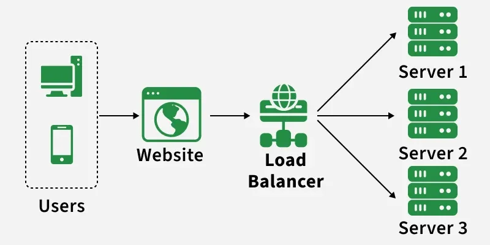
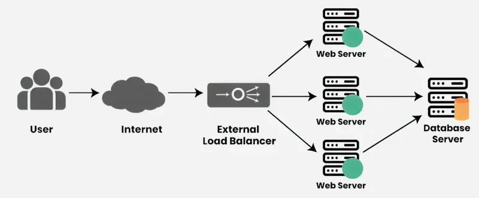

# Load Balancing

[TOC]

A load balancer is a networking device or software application that distributes and balances the incoming traffic among the servers to provide high availability, efficient utilization of servers and high performance.

## Working of a Load Balancer

A load balancer receives incoming requests, checks server health, and routes each request to the most suitable available server to ensure high availability and optimal performance.

- Receives Incoming Requests
- Checks Server Health
- Distributes Traffic
- Handles Server Failures
- Optimizes Performance

### Key Characteristics

- Traffic Distribution
- High Availability
- Scalability
- Optimization
- Health Monitoring
- SSL Termination

## Algorithms

### Static Load Balancing

Static load balancing assigns tasks to servers using predefined rules, without considering real-time system conditions.

- Workloads are allocated in a fixed and predetermined manner.
- Does not adapt to changes during runtime.

#### Round Robin Load Balancing Algorithm

Round Robin is a simple static load balancing technique that distributes incoming requests to servers in a fixed sequential or rotational order.

#### Weighted Round Robin Load Balancing Algorithm

Weighted Round Robin is a static load balancing technique similar to Round Robin, but it distributes requests based on assigned weight values that represent each server's capacity.

#### Source IP Hash Load Balancing Algorithm

The Source IP Hash Load Balancing Algorithm distributes incoming requests by computing a hash of the client's source IP address. This approach helps route request from the same client to the same backend server consistently.

### Dynamic Load Balancing

Dynamic load balancing makes real-time decisions to distribute incoming traffic or workloads across multiple servers based on current system conditions. It continuously adapts to changes such as server load, network traffic, and resource availability.

#### Least Connection Method Load Balancing Algorithm

The Least Connections algorithm is a dynamic load balancing technique that routes new requests to the server with the fewest active connections. It focuses on balancing workload by considering the current load on each server.

#### Least Response Time Method Load Balancing Algorithm

The least Response method is a dynamic load balancing approach that aims to minimize response times by directing new requests to the server with the quickest response time.

#### Resource-based Load Balancing Algorithm

Resource-Based Load Balancing assigns incoming requests to servers based on their current resource availability, such as CPU usage, memory, or bandwidth, ensuring efficient and balanced system performance.

### Static VS Dynamic Load Balancing

| Static                                        | Dynamic                                              |
| --------------------------------------------- | ---------------------------------------------------- |
| Uses predefined rules to distribute requests  | Makes decisions based on real-time system conditions |
| Does not adapt during runtime                 | Continuously adapts to changing server load          |
| Does not consider current server status       | Considers CPU usage, memory, or response time        |
| Simple and easy to implement                  | More complex due to monitoring overhead              |
| Suitable for predictable and stable workloads | Suitable for fluctuating an unpredictable workloads  |

## Stateless And Stateful Load Balancing

### Stateless Load Balancing

Stateless load balancing refers to the practice of distributing incoming requests to servers without considering the state or context of previous interactions.

Key Characteristics of Stateless Load Balancing include:

- Independence
- Scalability
- Simplicity

### Stateful Load Balancing

Stateful load balancing involves distributing requests based on the state or context of the ongoing session.

Key Characteristics of Stateful Load Balancing include:

- Session Affinity
- Consistency
- Complexity

### Stateless VS Stateful Load Balancing

| Feature           | Stateless Load Balancing                                     | Stateful Load Balancing                                      |
| ----------------- | ------------------------------------------------------------ | ------------------------------------------------------------ |
| Definition        | Distributes requests without maintaining any session information. | Maintains session information across multiple requests.      |
| Session Handling  | Does not retain information about client sessions.           | Retains and manages client session information.              |
| Load Distribution | Requests are distributed based on current load, without regard to previous interactions. | Requests are directed to the same server to maintain session continuity. |
| Scalability       | Generally more scalable due to lack of session management overhead. | May have limitations due to the need to track session state. |
| Fault Tolerance   | If a server fails, requests are redistributed without session loss. | Session loss can occur if a server fails and the session is not replicated. |
| Implementation    | Easier to implement as there is no need for session tracking. | More complex due to the need for session persistence or replication. |
| Use Cases         | Suitable for stateless applications, such as APIs or web services. | Ideal for applications requiring session persistence, like online shopping carts. |
| Performance       | Typically faster due to lower overhead.                      | May incur performance overhead due to session management.    |
| Consistency       | Each request is independent reducing the chance of state-related issues. | Ensures that all requests from a client are handled consistently. |

## Advantage And Disadvantage

### Advantage

- Load Balancing distributes the load evenly, which reduces stress on servers and speeds up response times.
- It automatically sends traffic from failing servers to working ones, reducing time when servers are down.
- It can easily handle more traffic by adding more servers as needed.
- Load balancing improves security by blocking bad traffic or attacks before they reach the servers.

### Disadvantage

- It needs careful setup and can be tricky to arrange.
- If the load balancer fails, it can stop access to all servers unless you have backup systems in place.
- Load balancing can cost more because you need extra tools and regular upkeep.
- Requires monitoring to make sure everything is working correctly and to fix problems quickly.

## Reference

[1] [Introduction to Load Balancer](https://www.geeksforgeeks.org/system-design/what-is-load-balancer-system-design/)