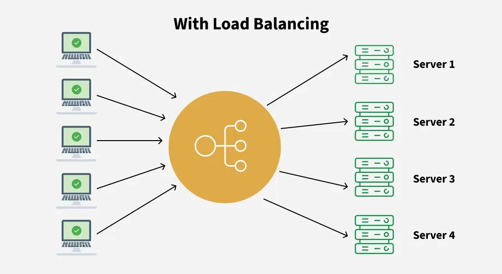
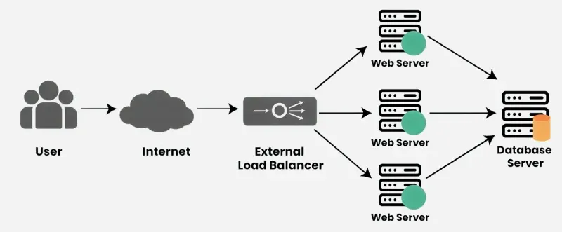
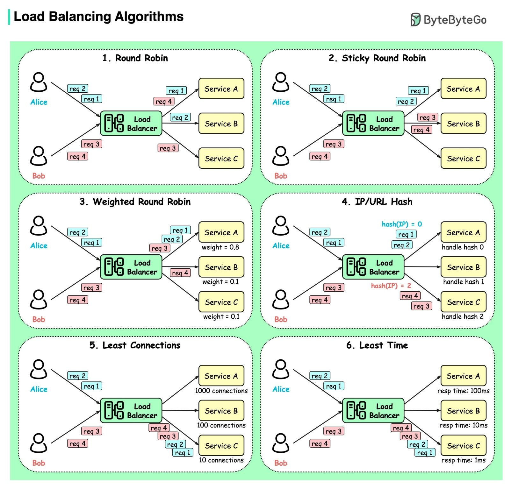
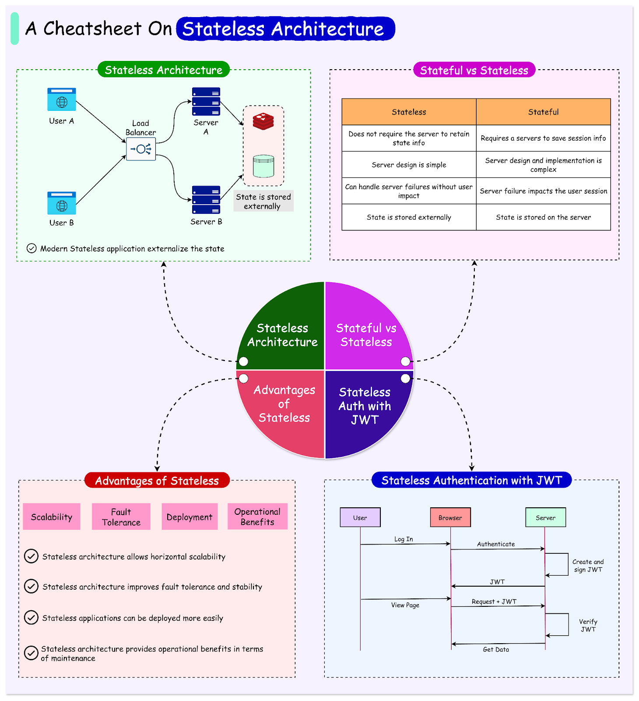
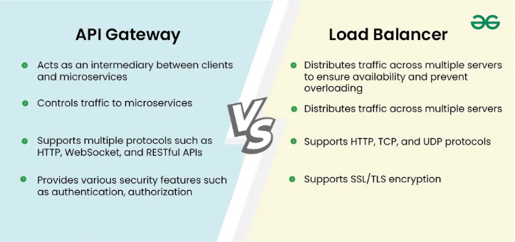

# Load Balancing

[TOC]

Load balancing is the process of distributing incoming network traffic across multiple servers to ensure no single server becomes overloaded. It helps improve application performance, reliability, and availability by efficiently utilizing server resources.

## Intro

Several problems will occur without the load balancer, these are:

- ***\*Single Point of Failure: I\****f the server goes down or something happens to the server the whole application will be interrupted and it will become unavailable for the users for a certain period. It will create a bad experience for users which is unacceptable for service providers.
- ***\*Overloaded Servers:\**** There will be a limitation on the number of requests that a web server can handle. If the business grows and the number of requests increases the server will be overloaded.
- ***\*Limited Scalability\****: Without a load balancer, adding more servers to share the traffic is complicated. All requests are stuck with one server and adding new servers won’t automatically solve the load issue.

Advantage:

- Load Balancing distributes the load evenly, which reduces stress on servers and speeds up response times.
- It automatically sends traffic from failing servers to working ones, reducing time when servers are down.
- It can easily handle more traffic by adding more servers as needed.
- Load balancing improves security by blocking bad traffic or attacks before they reach the servers.

Disadvantage:

- It needs careful setup and can be tricky to arrange.
- If the load balancer fails, it can stop access to all servers unless you have backup systems in place.
- Load balancing can cost more because you need extra tools and regular upkeep.
- Requires monitoring to make sure everything is working correctly and to fix problems quickly.

Challenge:

- Single Point of Failure
- Performance Bottleneck
- Configuration Complexity
- Security Risks
- Cost

## Load Balancer

A load balancer receives incoming requests, checks server health, and routes each request to the most suitable available server to ensure high availability and optimal performance.

Key Characteristics:

- Traffic Distribution
- High Availability
- Scalability
- Optimization
- Health Monitoring
- SSL Termination

### Load Balancer Workflow

1. Receives Incoming Requests

   When users try to access a website or application, their requests first go to the load balancer instead of directly to a server.

2. Checks Server Health

   The load balancer continuously monitors the status of all servers. It checks which servers are healthy and ready to handle requests.

3. Distributes Traffic

   Based on factors like server load, response time or proximity, the load balancer forwards each request to the most appropriate server. This helps avoid any server getting overloaded.

4. Handles Server Failures

   If a server goes down or becomes unresponsive, the load balancer automatically stops sending traffic to that server and redirects it to others that are still functioning properly.

5. Optimizes Performance

   By spreading traffic efficiently and using healthy servers, load balancers improve overall performance and reduce delays.

### Hardware Load Balancer

A hardware load balancer is a dedicated physical device used in large data centers to distribute traffic across multiple servers. It is designed for high performance and can handle a large volume of network requests efficiently.

### Software Load Balancer

A software load balancer runs as an application on a server and distributes traffic among backend servers. It is flexible, cost-effective, and widely used in modern web applications.

### Cloud Load Balancer

A cloud load balancer is a managed service provided by cloud platforms to automatically distribute incoming traffic across multiple cloud servers. It helps scale applications easily without managing the underlying infrastructure.

### Layer 4 (Transport Layer) Load Balancer

A Layer 4 load balancer operates at the transport layer of the OSI model and distributes traffic based on network information such as IP addresses and TCP/UDP port numbers. It does not inspect the actual content of the request, which makes it fast and efficient for handling large volumes of traffic.

### Layer 7 (Application Layer) Load Balancer

A Layer 7 load balancer operates at the application layer and distributes traffic based on application-level information such as HTTP headers, URLs, cookies, or request content. This allows more intelligent routing decisions based on the type of request.

## Algorithms

### Static Load Balancing

Static load balancing assigns tasks to servers using predefined rules, without considering real-time system conditions.

- Workloads are allocated in a fixed and predetermined manner.
- Does not adapt to changes during runtime.

#### Round Robin

Round Robin is a simple static load-balancing technique that distributes incoming requests to servers in a fixed sequential or rotational order.

#### Weighted Round Robin

Weighted Round Robin is a static load-balancing technique similar to Round Robin, but it distributes requests based on assigned weight values that represent each server's capacity.

#### Source IP Hash

The Source IP Hash Load Balancing Algorithm distributes incoming requests by computing a hash of the client's source IP address. This approach helps route request from the same client to the same backend server consistently.

### Dynamic Load Balancing

Dynamic load balancing makes real-time decisions to distribute incoming traffic or workloads across multiple servers based on current system conditions. It continuously adapts to changes such as server load, network traffic, and resource availability.

#### Least Connection Method

The Least Connections algorithm is a dynamic load balancing technique that routes new requests to the server with the fewest active connections. It focuses on balancing workload by considering the current load on each server.

#### Least Response Time Method

The least Response method is a dynamic load balancing approach that aims to minimize response times by directing new requests to the server with the quickest response time.

#### Resource-based

Resource-Based Load Balancing assigns incoming requests to servers based on their current resource availability, such as CPU usage, memory, or bandwidth, ensuring efficient and balanced system performance.

## Stateless And Stateful Load Balancing

### Stateless Load Balancing

Stateless load balancing refers to the practice of distributing incoming requests to servers without considering the state or context of previous interactions.

Key Characteristics of Stateless Load Balancing include:

- Independence
- Scalability
- Simplicity

### Stateful Load Balancing

Stateful load balancing involves distributing requests based on the state or context of the ongoing session.

Key Characteristics of Stateful Load Balancing include:

- Session Affinity
- Consistency
- Complexity

## Server Health Monitoring By Load Balancer

### Active Health Checks / Heartbeat monitoring

Ensures servers are online and responding before sending traffic to them.

- The load balancer periodically sends test requests (like HTTP, TCP, or ICMP pings) to servers to verify they are online and responding correctly.
- Heartbeat signals are lightweight messages sent at regular intervals to confirm server availability. If a heartbeat fails multiple times, the server is considered unhealthy.

### Passive Health Checks

Detects failing servers by monitoring real user traffic.

- The load balancer monitors real client traffic for errors or timeouts.
- If a server consistently fails to respond or returns errors, it is marked as down automatically without waiting for active tests.

### Automatic Failover and Recovery

Prevents downtime by rerouting traffic away from unhealthy servers.

- When a server is detected as down, the load balancer immediately stops sending traffic to it, preventing failed requests from reaching clients.
- Once the server recovers and passes health checks or heartbeat monitoring, it is automatically reinstated into the pool.
- This ensures seamless failover with minimal disruption to end users.

## Summary

### API Gateway vs Load Balancer

| Feature            | API Gateway                                                  | Load Balancer                                                |
| ------------------ | ------------------------------------------------------------ | ------------------------------------------------------------ |
| Function           | Acts as an intermediary between clients and microservices, enabling developers to create, manage, and secure APIs | Distributes traffic across multiple servers to ensure availability and prevent overloading |
| Traffic Management | Controls traffic to microservices                            | Distributes traffic across multiple servers                  |
| Protocol Support   | Supports multiple protocols such as HTTP, WebSocket, and RESTful APIs | Supports HTTP, TCP, and UDP protocols                        |
| Security           | Provides various security features such as authentication, authorization, and encryption | Supports SSL/TLS encryption                                  |
| Monitoring         | Provides in-depth insights into API usage, latency, and error rates | Provides basic monitoring of server health                   |
| Scalability        | Can horizontally scale to handle increasing traffic          | Can horizontally scale to handle increasing traffic          |
| Deployment         | Deployed as a separate service or hosted solution            | Deployed on premise or as a cloud service cost typically     |
| Cost               | Typically more expensive than a load balancer                | Typically less expensive than an API gateway                 |

### Load Balancing vs Other Concepts

| **Concept**         | **Purpose**                         | **Layer** | **Example**        |
| :------------------ | :---------------------------------- | :-------- | :----------------- |
| **Load Balancing**  | Distribute traffic across servers   | L4/L7     | Nginx, HAProxy     |
| **Reverse Proxy**   | Hide backend servers, add features  | L7        | Nginx, Apache      |
| **API Gateway**     | Manage APIs, auth, rate limiting    | L7        | Kong, Apigee       |
| **CDN**             | Cache static content geographically | Edge      | Cloudflare, Akamai |
| **DNS Round Robin** | Distribute at domain level          | DNS       | Route 53           |

### Stateless vs Stateful Load Balancing

| Feature           | Stateless Load Balancing                                     | Stateful Load Balancing                                      |
| ----------------- | ------------------------------------------------------------ | ------------------------------------------------------------ |
| Definition        | Distributes requests without maintaining any session information. | Maintains session information across multiple requests.      |
| Session Handling  | Does not retain information about client sessions.           | Retains and manages client session information.              |
| Load Distribution | Requests are distributed based on current load, without regard to previous interactions. | Requests are directed to the same server to maintain session continuity. |
| Scalability       | Generally more scalable due to lack of session management overhead. | May have limitations due to the need to track session state. |
| Fault Tolerance   | If a server fails, requests are redistributed without session loss. | Session loss can occur if a server fails and the session is not replicated. |
| Implementation    | Easier to implement as there is no need for session tracking. | More complex due to the need for session persistence or replication. |
| Use Cases         | Suitable for stateless applications, such as APIs or web services. | Ideal for applications requiring session persistence, like online shopping carts. |
| Performance       | Typically faster due to lower overhead.                      | May incur performance overhead due to session management.    |
| Consistency       | Each request is independent reducing the chance of state-related issues. | Ensures that all requests from a client are handled consistently. |

### Static vs Dynamic Load Balancing

| Static                                        | Dynamic                                              |
| --------------------------------------------- | ---------------------------------------------------- |
| Uses predefined rules to distribute requests  | Makes decisions based on real-time system conditions |
| Does not adapt during runtime                 | Continuously adapts to changing server load          |
| Does not consider current server status       | Considers CPU usage, memory, or response time        |
| Simple and easy to implement                  | More complex due to monitoring overhead              |
| Suitable for predictable and stable workloads | Suitable for fluctuating an unpredictable workloads  |

### Load Balancing vs Failover

|                      **Load Balancing**                      |                         **Failover**                         |
| :----------------------------------------------------------: | :----------------------------------------------------------: |
|     Distributes incoming traffic across multiple servers     | Switches to a backup server or system when the primary fails |
|  It's aims to optimize performance and resource utilization  | It's focuses on maintaining service availability during failures |
|   It Improves scalability by adding more servers as needed   |    It provides redundancy by having backup systems ready     |
| It is easily can lead to complex configuration and management | Generally simpler to implement but less about load distribution |
| Can create a single point of failure if the load balancer fails | Reduces downtime by switching to backup but can have some delay |
|             Needs regular checking and updating.             |   Involves maintaining backup systems, which can be costly   |
|         Helps balance load and avoid server overload         |  Ensures continuity but doesn't manage load across systems   |
|        Typically involves higher infrastructure costs        |     May cost extra to keep unused backup systems running     |

## Reference

[1] [Introduction to Load Balancer](https://www.geeksforgeeks.org/system-design/what-is-load-balancer-system-design/)

[2] [Load Balancer](https://www.geeksforgeeks.org/system-design/what-is-load-balancer-system-design/)

[3] [Differences between an API Gateway and a Load Balancer](https://www.geeksforgeeks.org/system-design/difference-between-an-api-gateway-and-a-load-balancer/)

[4] [Stateless Architecture: The Key to Building Scalable and Resilient Systems](https://blog.bytebytego.com/p/stateless-architecture-the-key-to)

[5] [Load Balancer](https://www.geeksforgeeks.org/system-design/what-is-load-balancer-system-design/)

[6] [Load Balancing Vs Failover](https://www.geeksforgeeks.org/system-design/load-balancing-vs-failover/)