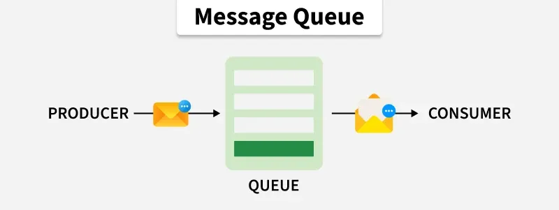
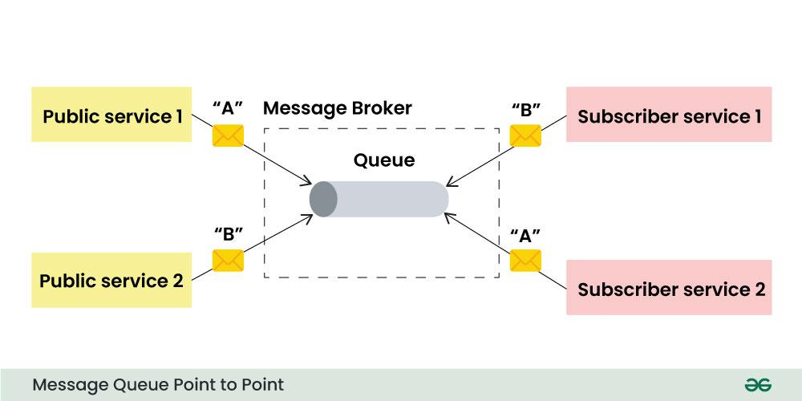
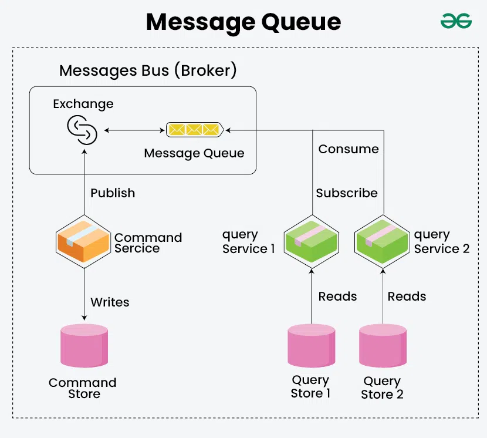
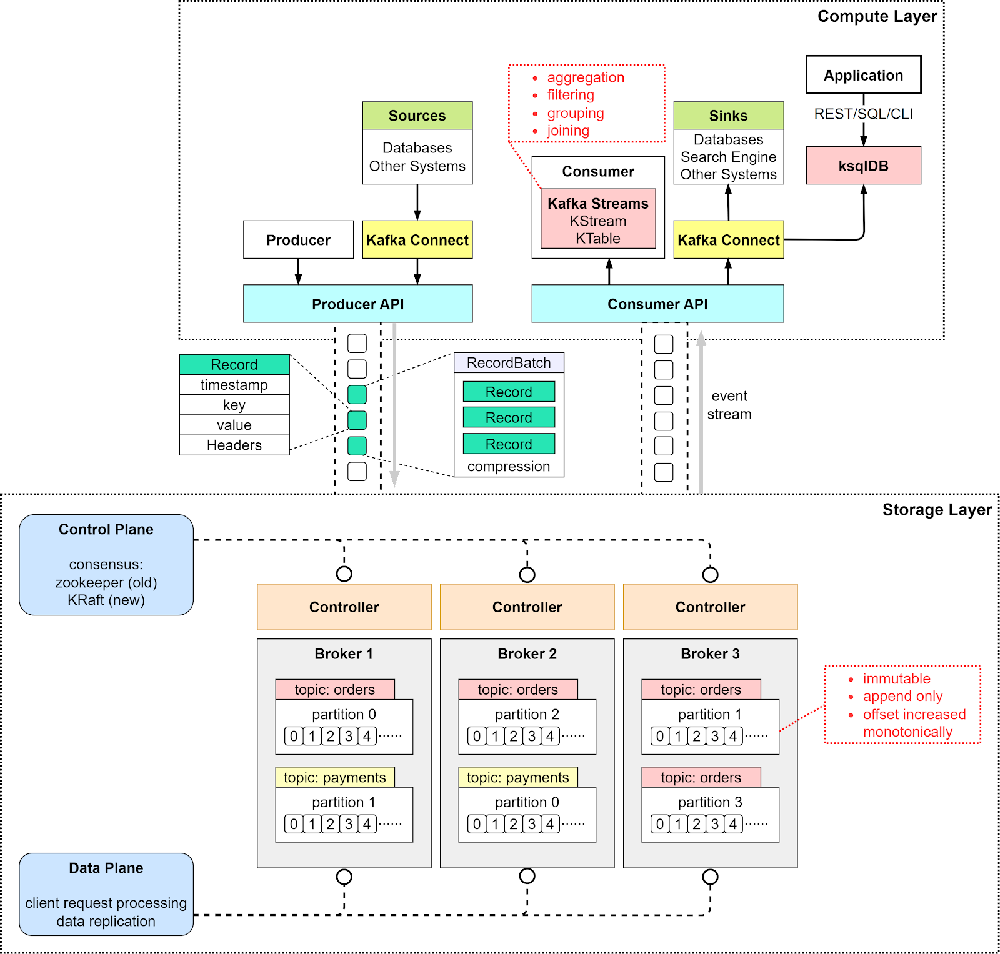
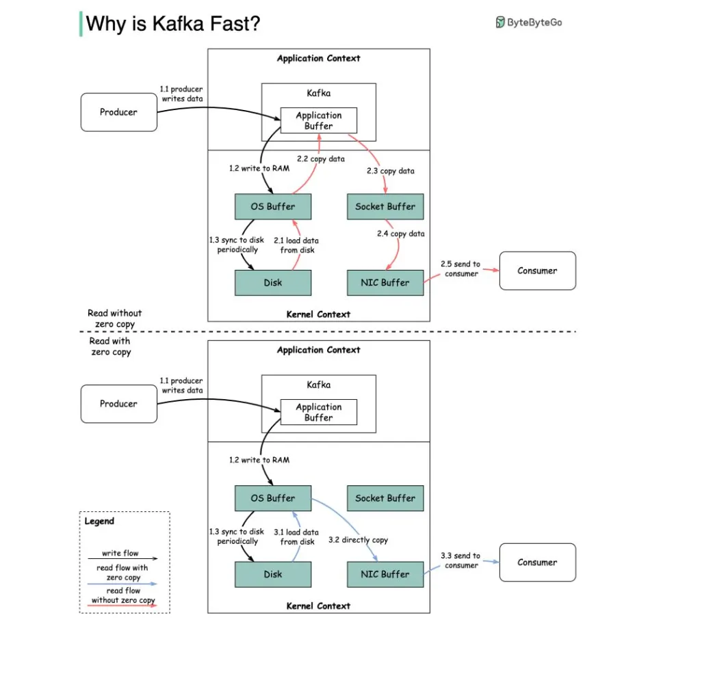
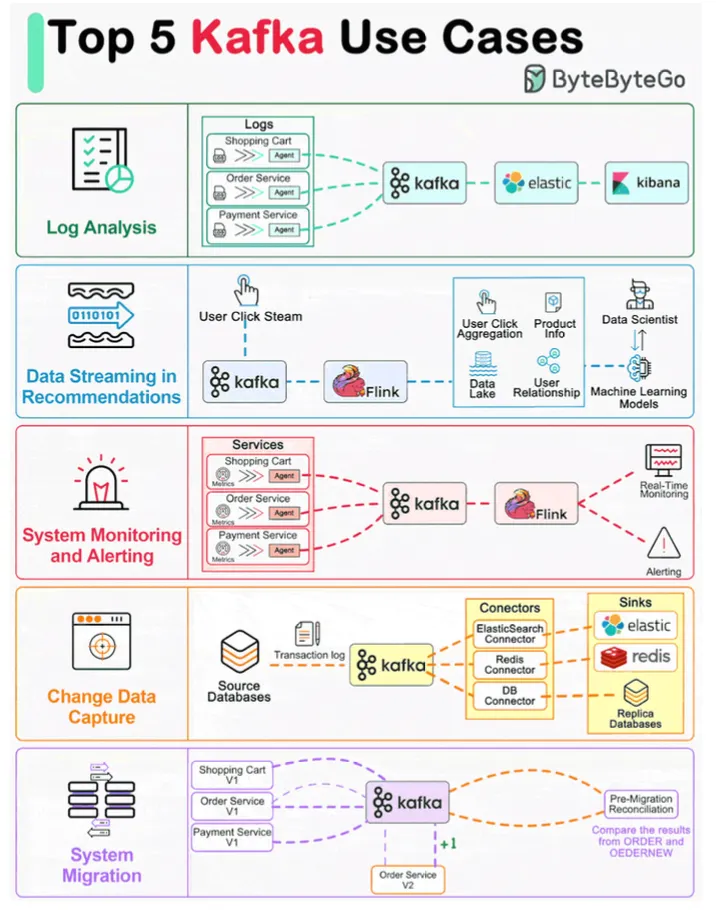
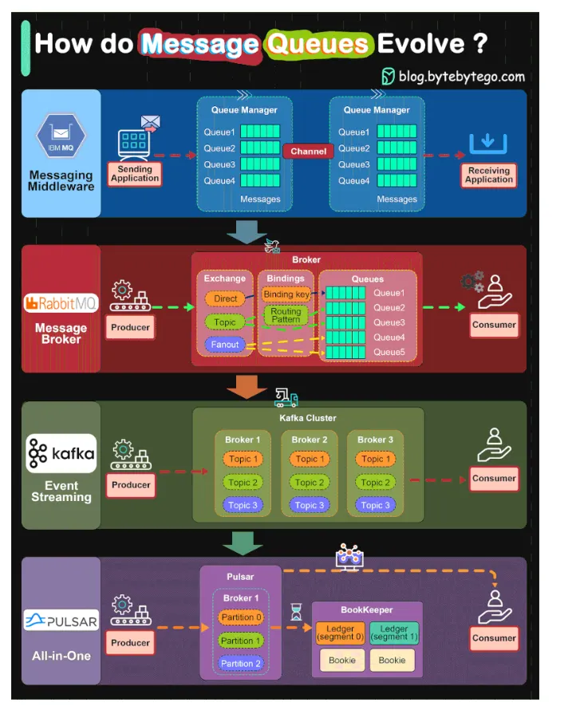

# Message Queues

[TOC]

Message queue enable asynchronous communication between system components, acting as buffers that decouple producers (senders) from consumers (receivers).

## MQ

### Components

- Message Producer

  Messages are created and sent to the message queue by the message producer.

- Message Queue

  Until the message consumers consume them, the messages are stored and managed by a data structure or service called the message queue.

- Message Consumer

  Messages in the message queue must be retrieved and processed by the message consumer.

- Message Broker(Optional)

  A message broker acts as an intermediary between producers and consumers, providing additional functionality like message routing, filtering, and message transformation.

### Types

#### Point-To-Point Message Queues

When a producer sends a message to a point-to-point queue, the message is stored in the queue until a consumer retrieves it. Once the message is retrieved by a consumer, it is removed from the queue and cannot be processed by any other consumer.

Point-to-point message queues can be used to implement a variety of patterns such as:

- Request-Response
- Work Queue
- Guaranteed Delivery

#### Publish-Subscribe Message Queues

When a producer publishes a message to publish/subscribe queue, the message is routed to all consumers that are subscribed to the queue. Consumers can subscribe to multiple queues, and they can also unsubscribe from queues at any time.

### Message

#### Structure

A typical message structure consists of two main parts:

- Headers: These contain metadata about the message, such as unique identifier, timestamp, message type, and routing information.
- Body: The body contains the actual message payload or content.

#### Routing

Message Routing involves determining how messages are directed to their intended recipients. The following methods can be employed:

- Topic-Based Routing
- Direct Routing
- Content-Based Routing

### Usage

## Kafka

### Why is Kafka Fast

How Kafka is built to be so fast:

1. Low-Latency I/O
2. Kafka Avoids the Seek Time
3. Zero Copy Principle
4. Optimal Data Structure
5. Horizontal Scaling
6. Compression & Batching of Data

### Usage

## ActiveMQ

TODO

## RabbitMQ

TODO

## Summary

### Message Queue Evolve

### Message Queue vs No Message Queue

### RabbitMQ vs Apache Kafka vs ActiveMQ

| Feature            | Apache Kafka                                   | RabbitMQ                                 | Apache ActiveMQ                |
| :----------------- | :--------------------------------------------- | :--------------------------------------- | :----------------------------- |
| **Architecture**   | **Distributed Log**                            | **Smart Broker**                         | **Traditional Broker**         |
| **Data Flow**      | **Pull-based** (Consumer pulls)                | **Push-based** (Broker pushes)           | **Push-based**                 |
| **Throughput**     | **Extremely High** (Millions/sec)              | High (Thousands/sec)                     | Medium (Thousands/sec)         |
| **Data Retention** | Persistent (keeps data for days/weeks)         | Transient (deletes after delivery)       | Optional persistence           |
| **Routing**        | Basic (Topic-based)                            | **Complex & Flexible**                   | Flexible (JMS standards)       |
| **Best Use Case**  | Log aggregation, Big Data, Real-time Analytics | Task queues, Microservices communication | Legacy Java enterprise systems |

## References

[1] [Message Queues - System Design](https://www.geeksforgeeks.org/system-design/message-queues-system-design/)

[2] [Why is Kafka so fast? How does it work?](https://blog.bytebytego.com/p/why-is-kafka-so-fast-how-does-it)

[3] [Why Apache Kafka is so Fast?](https://www.geeksforgeeks.org/blogs/why-apache-kafka-is-so-fast/)

[4] [Difference between RabbitMQ, Apache Kafka, and ActiveMQ](https://medium.com/javarevisited/difference-between-rabbitmq-apache-kafka-and-activemq-65e26b923114)
