# Message Queues

[TOC]

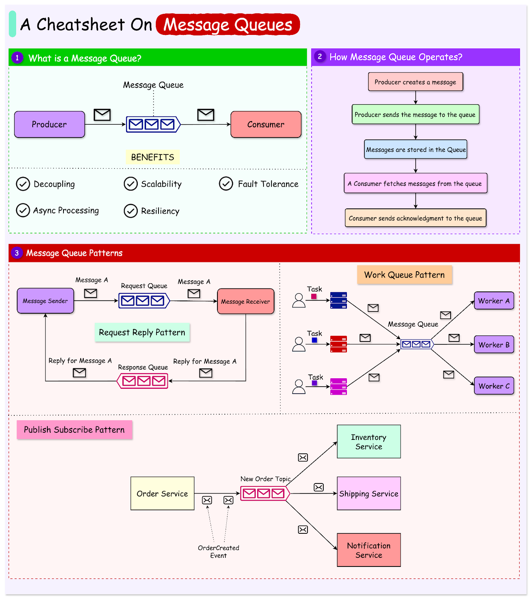

Message queues enable asynchronous communication between system components, acting as buffers that decouple producers (senders) from consumers (receivers).

## MQ

### Components

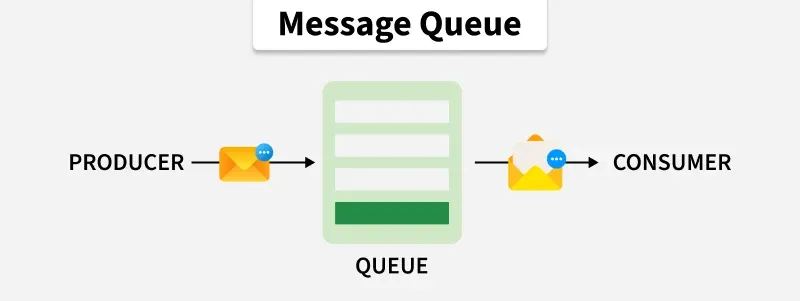

- Message Producer

  Messages are created and sent to the message queue by the message producer.

- Message Queue

  Until the message consumers consume them, the messages are stored and managed by a data structure or service called the message queue.

- Message Consumer

  Messages in the message queue must be retrieved and processed by the message consumer.

- Message Broker(Optional)

  A message broker acts as an intermediary between producers and consumers, providing additional functionality like message routing, filtering, and message transformation.

### Types

#### Point-To-Point Message Queues

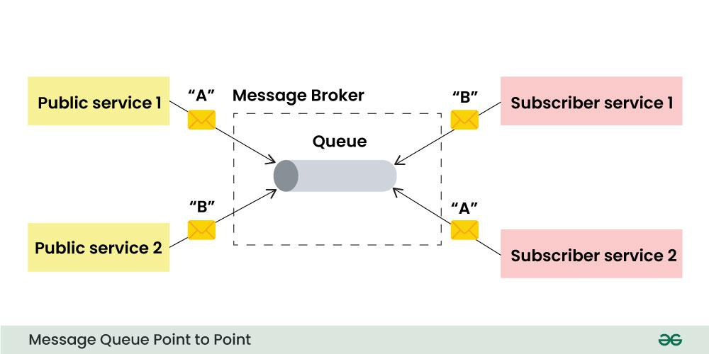

When a producer sends a message to a point-to-point queue, the message is stored in the queue until a consumer retrieves it. Once the message is retrieved by a consumer, it is removed from the queue and cannot be processed by any other consumer.

Point-to-point message queues can be used to implement a variety of patterns, such as:

- Request-Response

  A producer sends a request message to a queue, and a consumer retrieves the message and sends back a response message.

- Work Queue

  Producers send work items to a queue, and consumers retrieve the work items and process them.

- Guaranteed Delivery

  Producers send messages to a queue, and consumers can be configured retry retrieving messages until they are successfully processed.

#### Publish-Subscribe Message Queues

When a producer publishes a message to the publish/subscribe queue, the message is routed to all consumers that are subscribed to the queue. Consumers can subscribe to multiple queues, and they can also unsubscribe from queues at any time.

### Messaging Patterns

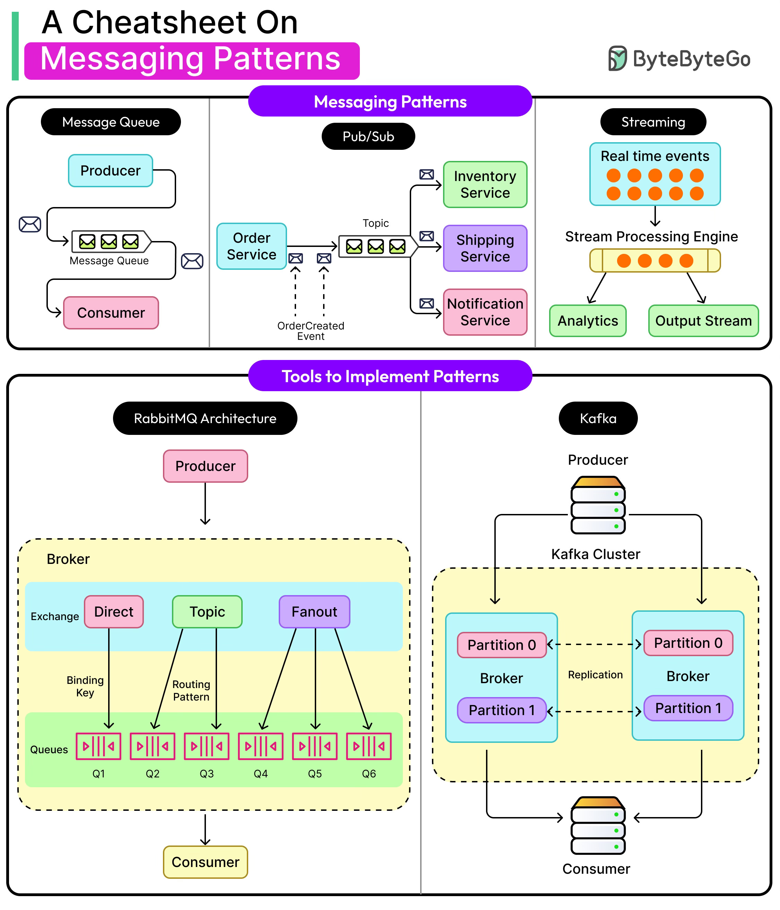

#### Structure

A typical message structure consists of two main parts:

- Headers: These contain metadata about the message, such as a unique identifier, timestamp, message type, and routing information.
- Body: The body contains the actual message payload or content.

#### Routing

Message Routing involves determining how messages are directed to their intended recipients. The following methods can be employed:

- Topic-Based Routing

  Messages are sent to topics or channels, and subscribers express interest in specific topics. Messages are delivered to all subscribers of a particular topic.

- Direct Routing

  Messages are sent directly to specific queues or consumers based on their addresses or routing keys.

- Content-Based Routing

  The routing decision is based on the content of the message. Filters or rules are defined to route messages that meet specific criteria.

### Dead Letter

Dead Letter Queues (DLQs) are a mechanism for handling messages that cannot be processed successfully. This includes:

- Messages with errors in their content or format.
- Messages that exceed their time-to-live (TTL) or delivery attempts.
- Messages that cannot be delivered to any consumer.

DLQs provide way to investigate and potentially reprocess failed messages while preventing them from blocking the system.

Message Prioritization is the process of assigning priority levels to messages to control their processing order. Prioritization criteria can include:

- Urgency: Messages with higher priority may need to processed before lower-priority messages.
- Message Content: Messages containing critical information or commands may receive higher priority.
- Business Rules: Custom business rules or algorithms may be used to determine message priority.

### Usage

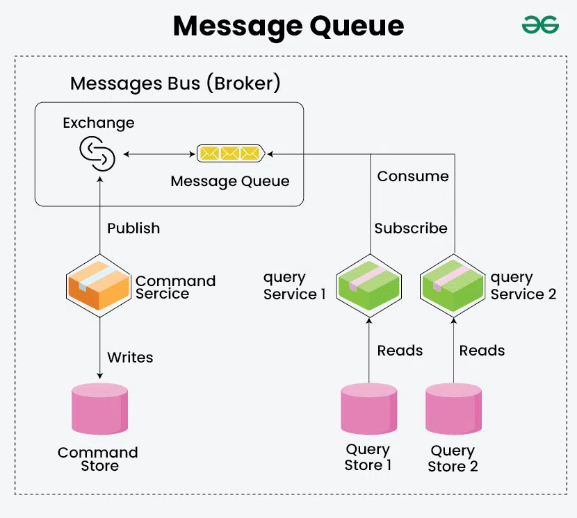

## Kafka

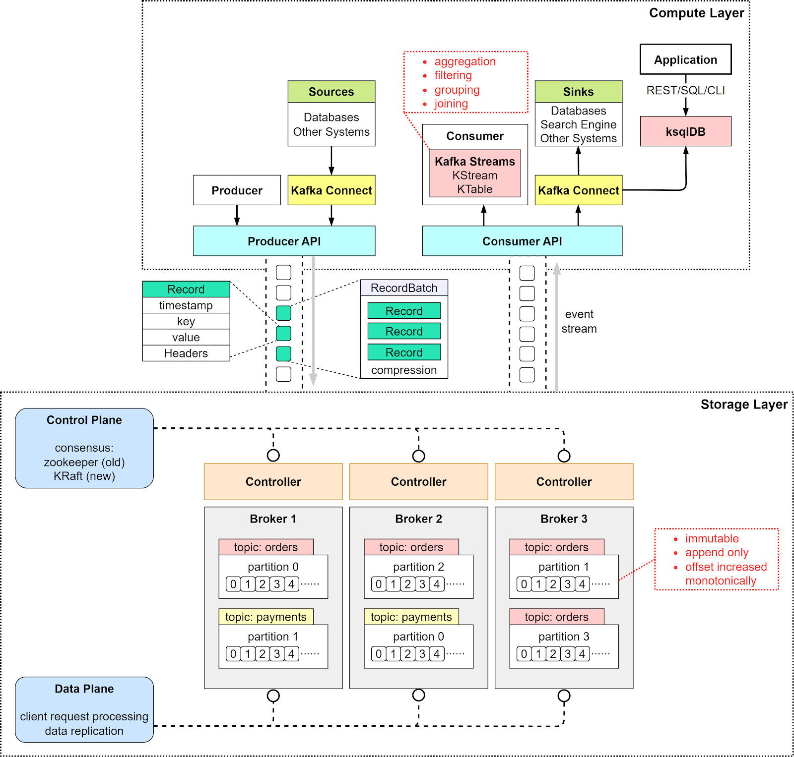

### Why is Kafka Fast

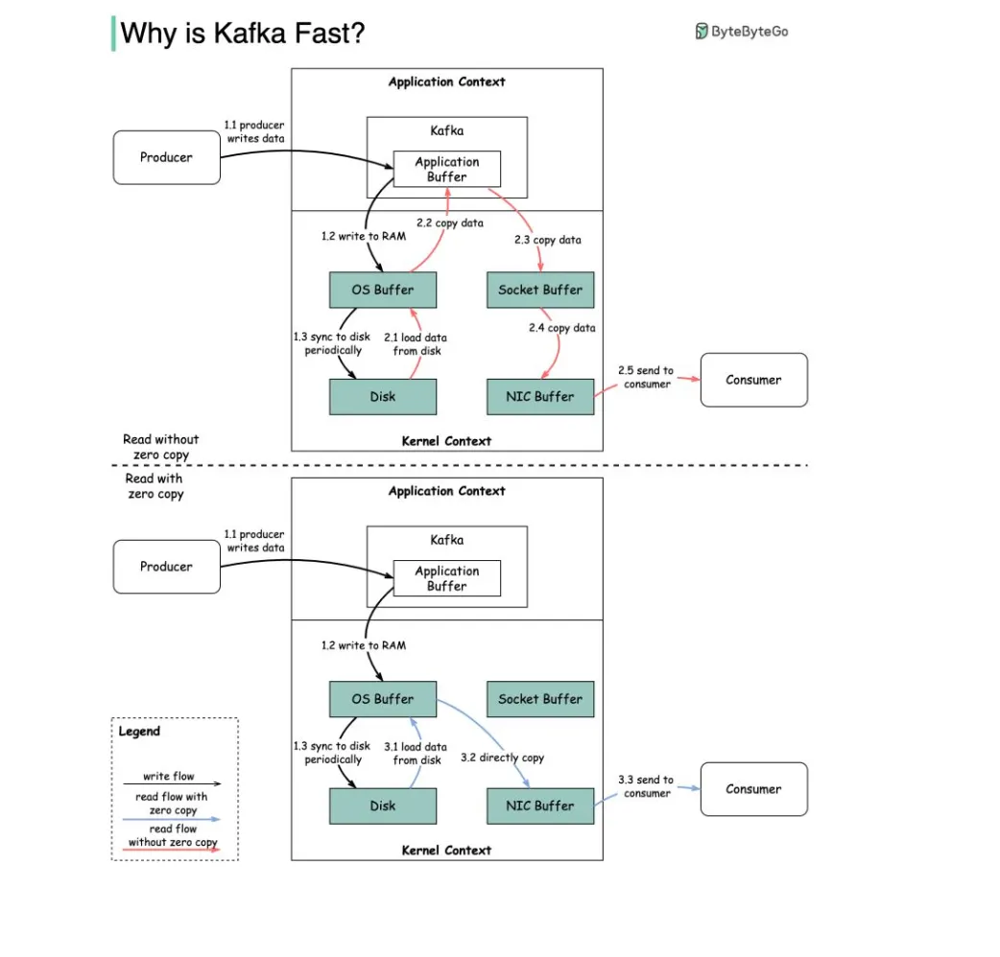

How Kafka is built to be so fast:

1. Low-Latency I/O
2. Kafka Avoids the Seek Time
3. Zero Copy Principle
4. Optimal Data Structure
5. Horizontal Scaling
6. Compression & Batching of Data

### Usage

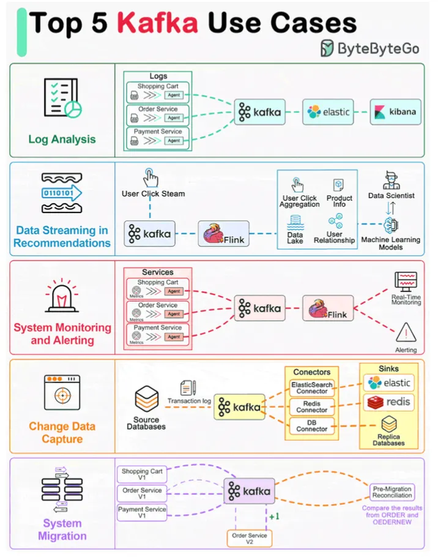

## ActiveMQ

TODO

## RabbitMQ

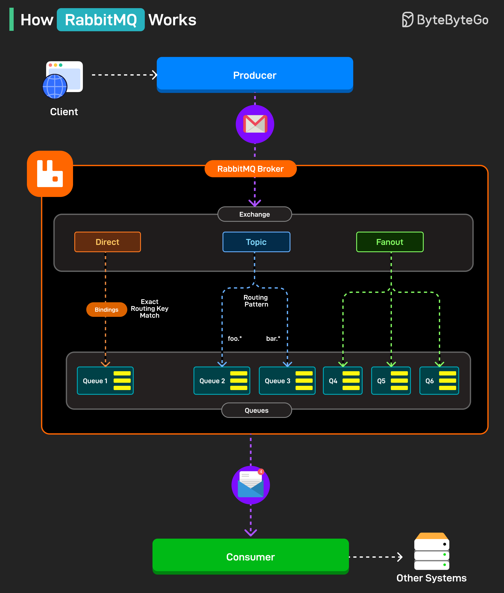

1. A producer (usually an application or service) sends messages to the RabbitMQ broker, which manages message routing and delivery.
2. Within the broker, messages are sent to an exchange, which determines how they should be routed based on the type of exchange: Direct, Topic, or Fanout.
3. Bindings connect exchanges to queues using a binding key, which defines the rules for routing messages (for example, exact match or pattern-based)
4. Direct exchanges route messages to queues that match the routing key exactly, as shown with Queue 1.
5. Topic exchanges use patterns to route messages to matching queues.
6. Fanout exchanges broadcast messages to all bound queues, regardless of routing keys.
7. Finally, messages are pulled from the queues by a consumer, which processes them and can pass the results to other systems.

## Summary

### Message Queue Evolve

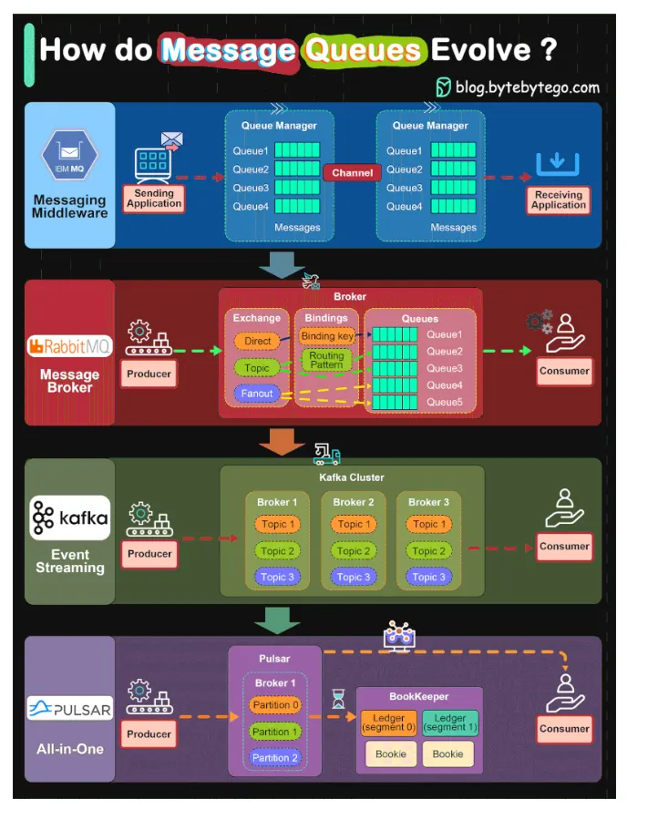

### Message Queue vs No Message Queue

### RabbitMQ vs Apache Kafka vs ActiveMQ

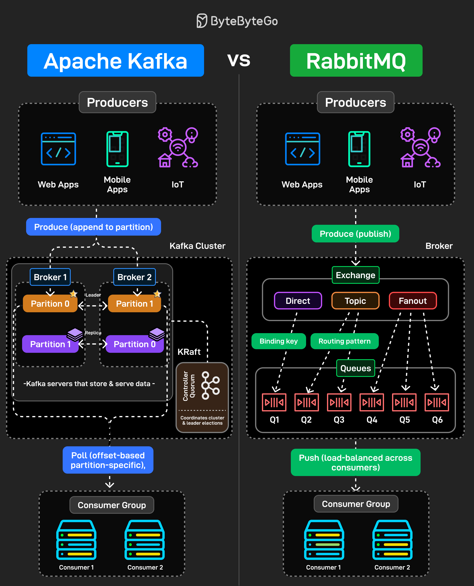

| Feature            | Apache Kafka                                   | RabbitMQ                                 | Apache ActiveMQ                |
| :----------------- | :--------------------------------------------- | :--------------------------------------- | :----------------------------- |
| **Architecture**   | **Distributed Log**                            | **Smart Broker**                         | **Traditional Broker**         |
| **Data Flow**      | **Pull-based** (Consumer pulls)                | **Push-based** (Broker pushes)           | **Push-based**                 |
| **Throughput**     | **Extremely High** (Millions/sec)              | High (Thousands/sec)                     | Medium (Thousands/sec)         |
| **Data Retention** | Persistent (keeps data for days/weeks)         | Transient (deletes after delivery)       | Optional persistence           |
| **Routing**        | Basic (Topic-based)                            | **Complex & Flexible**                   | Flexible (JMS standards)       |
| **Best Use Case**  | Log aggregation, Big Data, Real-time Analytics | Task queues, Microservices communication | Legacy Java enterprise systems |

## References

[1] [Message Queues - System Design](https://www.geeksforgeeks.org/system-design/message-queues-system-design/)

[2] [Why is Kafka so fast? How does it work?](https://blog.bytebytego.com/p/why-is-kafka-so-fast-how-does-it)

[3] [Why Apache Kafka is so Fast?](https://www.geeksforgeeks.org/blogs/why-apache-kafka-is-so-fast/)

[4] [Difference between RabbitMQ, Apache Kafka, and ActiveMQ](https://medium.com/javarevisited/difference-between-rabbitmq-apache-kafka-and-activemq-65e26b923114)

[5] [Understanding Message Queues](https://blog.bytebytego.com/p/understanding-message-queues)

[6] [Messaging Patterns Explained: Pub-Sub, Queues, and Event Streams](https://blog.bytebytego.com/p/messaging-patterns-explained-pub)

[7] [Apache Kafka vs. RabbitMQ](https://blog.bytebytego.com/p/ep193-database-types-you-should-know)

[8] [How RabbitMQ Works?](https://blog.bytebytego.com/i/166418419/how-rabbitmq-works)

[9] [Message Queues - System Design](https://www.geeksforgeeks.org/system-design/message-queues-system-design/)
