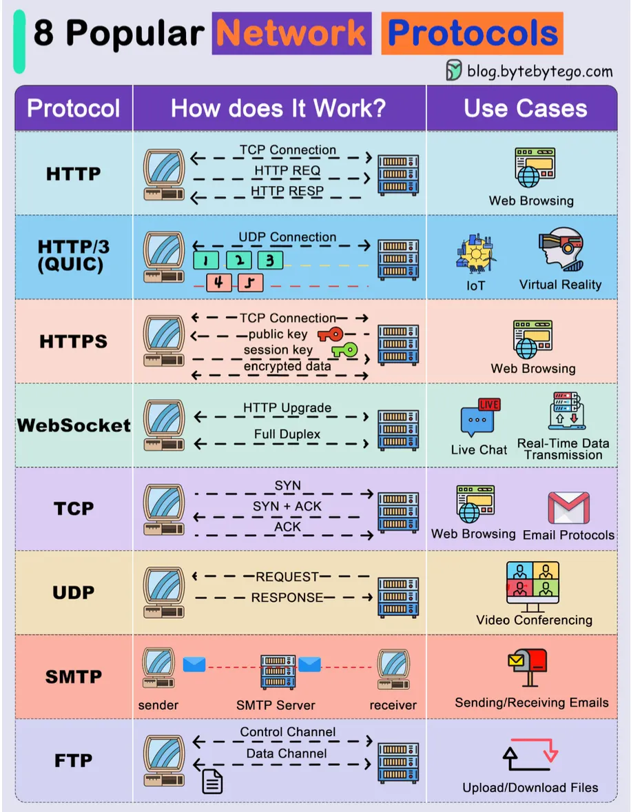
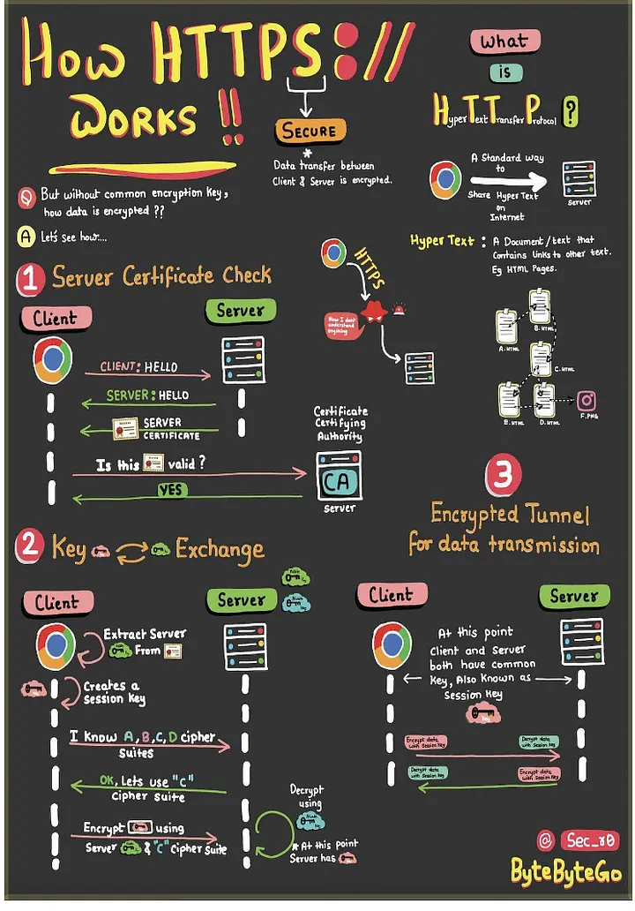
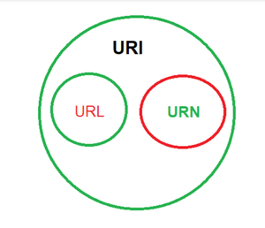
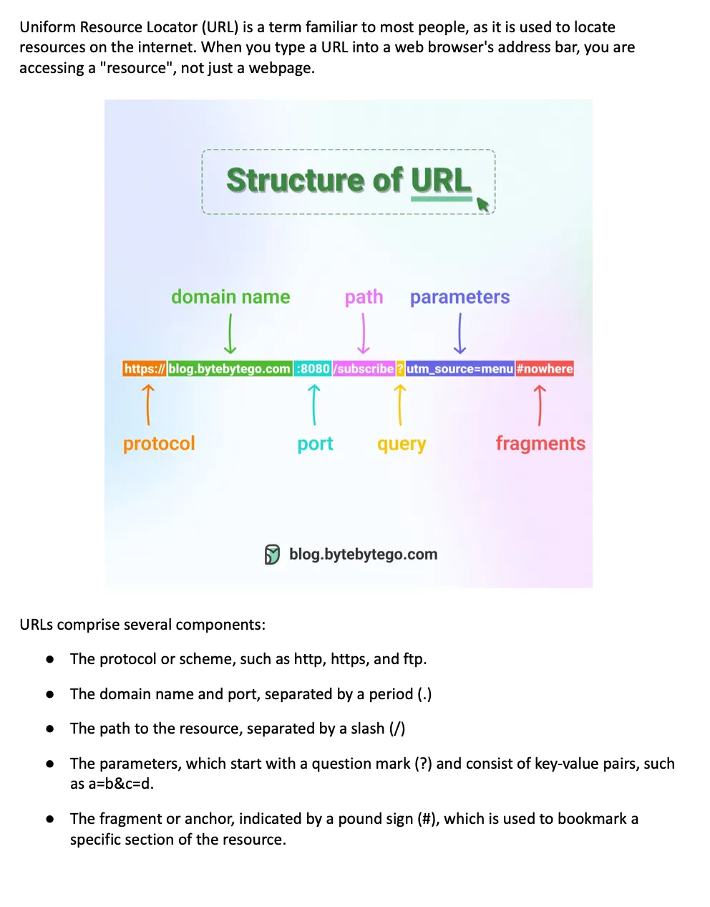
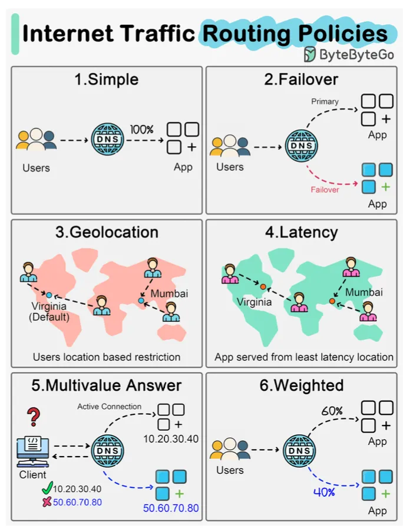
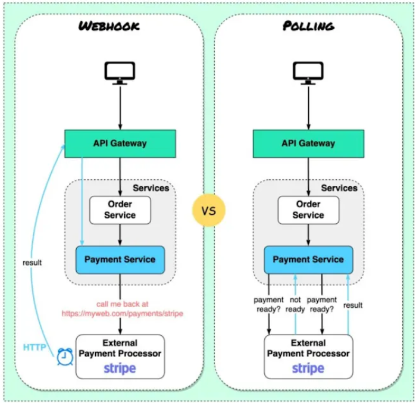
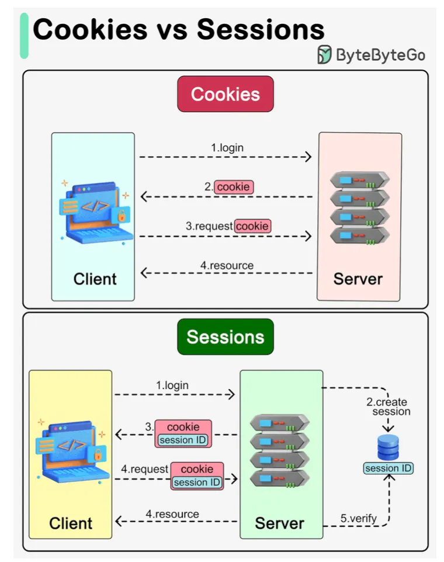
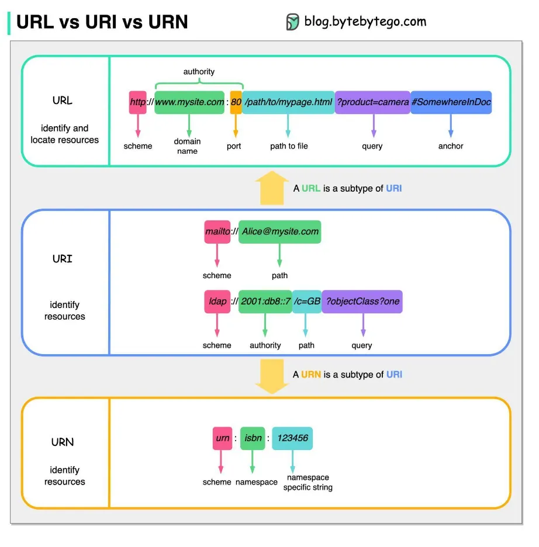

# Network

[TOC]

## Protocol

### TCP

- Establishes a connection before data transmission.
- Uses sequenced acknowledgments to ensure reliability.
- Provides error detection and flow control.
- Guarantees data delivery in the correct order.
- Used in email, FTP, web browsing, and streaming service.

### HTTP

- Works on a client-server model.
- Used for loading web pages in browers.
- Stateless protocol.
- Most data exchange on the web uses HTTP.
- Less secure unless used with HTTPS.

### HTTPS

- Uses SSL/TLS to secure data transmission.
- Protects user data from interception and tampering.
- Commonly used for secure web browsing.
- Ensures data confidentiality and integrity.
- Indicated by a padlock icon in web browsers.

### WebSocket

WebSocket keeps the connection open, allowing for real-time, two-way communication, making it great for things like live chats or online games where constant updates are needed.

### UDP

- Does not establish a connection before sending data.
- No error recovery, flow control, or reliability mechanisms.
- Faster than TCP due to minimal overhead.
- Suitable where speed is more important than accuracy.
- Used in video streaming, online gaming, multicasting, and broadcasting.

## IO

### Synchronous Communication

The pattern of communication known as "synchronous communication" occurs when services exchange requests and answers, typically waiting for a response before proceeding.

### Asynchronous Communication

Asynchronous communication refers to a communication pattern where services exchange messages or data without waiting for an immediate response.

## Polling

Polling simply means checking for new data over a fixed interval of time by making API calls at regular intervals to the server. It is used to get real-time updates in applications.

### Short Polling

In a short polling client requests data from the server and the server will return the response if it is available and if it is not available then it returns an empty response. This process will be repeated at regular intervals.

### Long Polling

In long polling, the client sends a request to the server and if the response is not available then the server will hold the request till the response gets available, after teh availability of the response, the server will send the response back. In simple words, the client will always be in the live connection to the server.

## URI

### URI

A uniform Resource Name, or URN, is a kind of URL. Any identifier that serves as a resource's unique identifier falls under this larger category.

### URL

A particular kind of Uniform Resource Identifier(URI) is a URL(Uniform Resource Locator), which describes the main access mechanism of a resource and offers a way to locate it.

### URN

TODO

## Routing

## Summary

### Synchronous vs Asynchronous Communication

The differences between Synchronous and Asynchronous Communication:

| Feature              | Synchronous Communication                                    | Asynchronous Communication                                   |
| -------------------- | ------------------------------------------------------------ | ------------------------------------------------------------ |
| Definition           | Real-time interaction where services wait for responses      | Communication where services send messages without waiting   |
| Waiting for Response | Services wait for responses before proceeding                | Services do not wait for responses and continue immediately  |
| Timing               | Requires services to be available at the same time           | Services can communicate at their convenience                |
| Flexibility          | Less flexible, as services need to be available simultaneously | More flexible, as services can communicate independently     |
| Complexity           | Generally simpler to implement and understand                | Can be more complex due to message buffering and error handling |
| Scalability          | Can be less scalable, as services may block while waiting    | More scalable, as services can handle multiple requests concurrently |
| Error Handling       | Easier to handle immediate failures                          | Errors may be more challenging to handle due to asynchronicity |
| Use Cases            | Suitable for real-time interactions and request-response patterns | Suitable for decoupling services and handling high loads     |

### Webhook vs API Polling

| Webhook                                                      | API Polling                                                 |
| ------------------------------------------------------------ | ----------------------------------------------------------- |
| Data is sent immediately when an event occurs.               | The client requests data at regular intervals.              |
| Uses less bandwidth since requests are made only when needed. | Uses more bandwidth due to constant polling for updates.    |
| Provides real-time updates.                                  | Updates may be delayed depending on the polling interval.   |
| More difficult to set up and configure.                      | Easier to implement and manage.                             |
| Less control over when data is received.                     | Full control over when to request data.                     |
| Can miss updates if the system is down.                      | Less likely to miss updates since the client is in control. |
| Ideal for infrequent updates or important events.            | Better suited for frequent or predictable updates.          |
| Reduced server load since requests are made only when needed. | Increased server load due to repeated requests.             |
| Harder to debug or trace issues.                             | Easier to monitor and debug.                                |

### Short Polling vs Long Polling

| Short Polling                                                | Long Polling                                                 |
| ------------------------------------------------------------ | ------------------------------------------------------------ |
| It is based on Timer. So, it is used for those applications that need to update data at a fixed interval of time. | It is based on getting the response. So, It is used for those applications that don't want empty responses. |
| Here, an empty response can be sent if a response is not available. | Here empty response can never be sent.                       |
| It is less preferred.                                        | It is more preferred, in comparison to Short Polling.        |
| It creates lots of traffic.                                  | It also creates traffic but less than short polling.         |

### HTTP vs HTTPS

| HTTP                                            | HTTPS                                                        |
| ----------------------------------------------- | ------------------------------------------------------------ |
| HTTP does not use data hashtags to secure data. | While HTTPS will have the data before sending it and return it to its original state on the receiver side. |
| In HTTP Data is transfer in plaintext.          | In HTTPS Data transfer in ciphertext.                        |
| HTTP does not require any certificates.         | HTTPS needs SSL Certificates.                                |
| HTTP does not improve search ranking.           | HTTPS helps to improve search ranking.                       |

### HTTP vs WebSocket

| WebSocket Connection                                         | HTTP Connection                                              |
| ------------------------------------------------------------ | ------------------------------------------------------------ |
| WebSocket is a bidirectional communication protocol that can send the data from the client to the server or from the server to the client by reusing the established connection channel. The connection is kept alive until terminated by either the client or the server. | The HTTP protocol is a unidirectional protocol that works on top of TCP protocol which is a connection-oriented transport layer protocol, we can create the connection by using HTTP request methods after getting the response HTTP connection get closed. |
| Almost all the real-time applications like(trading, monitoring, notification) services use WebSocket to receive the data on a single communication channel. | Simple RESTful application uses HTTP protocol which is stateless. |
| All the frequently updated applications used WebSocket because it is faster than HTTP Connection. | It is used when we do not want to retain a connection for a particular amount of time or reuse the connection for transmitting data; An HTTP connection is slower than WebSockets. |

### Cookie vs Session

### URL vs URI vs URN

## Reference

[1] [Communication Protocols in System Design](https://www.geeksforgeeks.org/system-design/communication-protocols-in-system-design/)

[2] [WebSocket and Its Difference from HTTP](https://www.geeksforgeeks.org/web-tech/what-is-web-socket-and-how-it-is-different-from-the-http/)

[3] [Types of Network Protocols and Their Uses](https://www.geeksforgeeks.org/computer-networks/types-of-network-protocols-and-their-uses/)