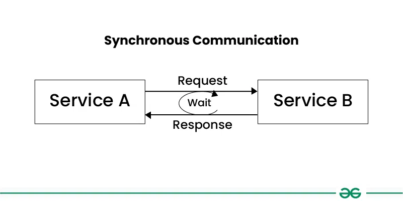
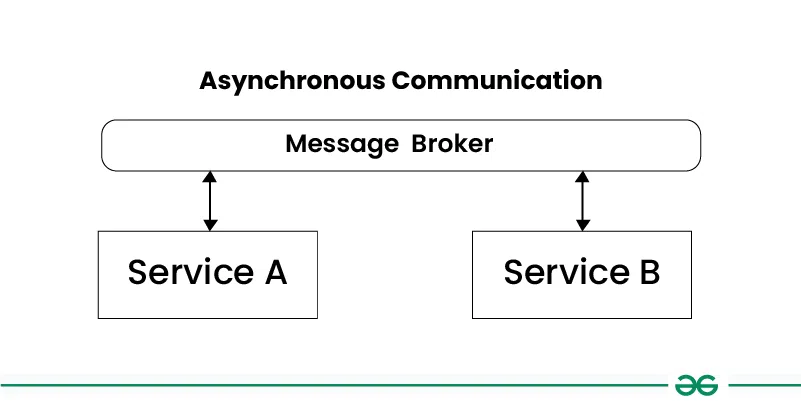
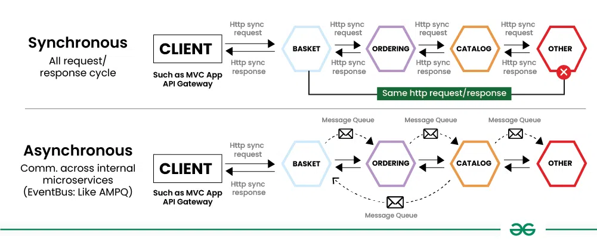
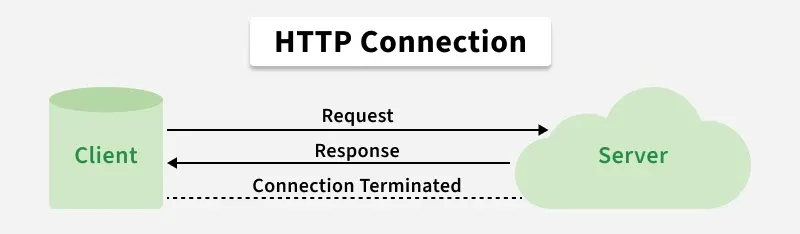
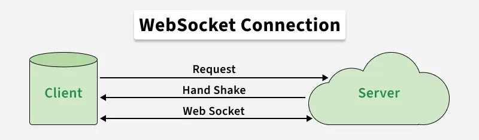
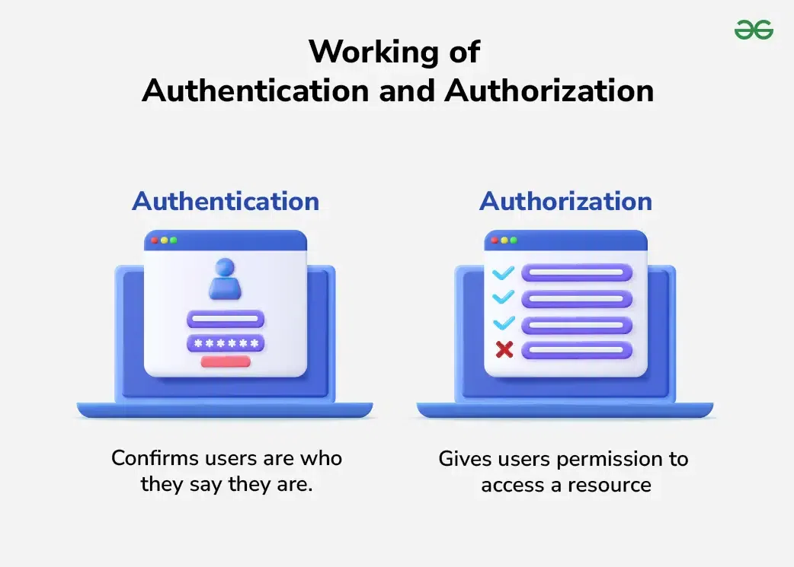
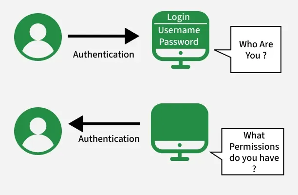

# Network

[TOC]

## Communication Protocol

### Synchronous Communication

The pattern of communication known as "synchronous communication" occurs when services exchange requests and answers, typically waiting for a response before proceeding.

### Asynchronous Communication

Asynchronous communication refers to a communication pattern where services exchange messages or data without waiting for an immediate response.

### Differences Between Synchronous and Asynchronous Communication

The differences between Synchronous and Asynchronous Communication:

| Feature              | Synchronous Communication                                    | Asynchronous Communication                                   |
| -------------------- | ------------------------------------------------------------ | ------------------------------------------------------------ |
| Definition           | Real-time interaction where services wait for responses      | Communication where services send messages without waiting   |
| Waiting for Response | Services wait for responses before proceeding                | Services do not wait for responses and continue immediately  |
| Timing               | Requires services to be available at the same time           | Services can communicate at their convenience                |
| Flexibility          | Less flexible, as services need to be available simultaneously | More flexible, as services can communicate independently     |
| Complexity           | Generally simpler to implement and understand                | Can be more complex due to message buffering and error handling |
| Scalability          | Can be less scalable, as services may block while waiting    | More scalable, as services can handle multiple requests concurrently |
| Error Handling       | Easier to handle immediate failures                          | Errors may be more challenging to handle due to asynchronicity |
| Use Cases            | Suitable for real-time interactions and request-response patterns | Suitable for decoupling services and handling high loads     |

## Polling

Polling simply means checking for new data over a fixed interval of time by making API calls at regular intervals to the server. It is used to get real-time updates in applications.

### Short Polling

In a short polling client requests data from the server and the server will return the response if it is available and if it is not available then it returns an empty response. This process will be repeated at regular intervals.

### Long Polling

In long polling, the client sends a request to the server and if the response is not available then the server will hold the request till the response gets available, after teh availability of the response, the server will send the response back. In simple words, the client will always be in the live connection to the server.

### Short Polling VS Long Polling

| Short Polling                                                | Long Polling                                                 |
| ------------------------------------------------------------ | ------------------------------------------------------------ |
| It is based on Timer. So, it is used for those applications that need to update data at a fixed interval of time. | It is based on getting the response. So, It is used for those applications that don't want empty responses. |
| Here, an empty response can be sent if a response is not available. | Here empty response can never be sent.                       |
| It is less preferred.                                        | It is more preferred, in comparison to Short Polling.        |
| It creates lots of traffic.                                  | It also creates traffic but less than short polling.         |

## WebSocket

WebSocket keeps the connection open, allowing for real-time, two-way communication, making it great for things like live chats or online games where constant updates are needed.

### HTTP VS WebSocket

| WebSocket Connection                                         | HTTP Connection                                              |
| ------------------------------------------------------------ | ------------------------------------------------------------ |
| WebSocket is a bidirectional communication protocol that can send the data from the client to the server or from the server to the client by reusing the established connection channel. The connection is kept alive until terminated by either the client or the server. | The HTTP protocol is a unidirectional protocol that works on top of TCP protocol which is a connection-oriented transport layer protocol, we can create the connection by using HTTP request methods after getting the response HTTP connection get closed. |
| Almost all the real-time applications like(trading, monitoring, notification) services use WebSocket to receive the data on a single communication channel. | Simple RESTful application uses HTTP protocol which is stateless. |
| All the frequently updated applications used WebSocket because it is faster than HTTP Connection. | It is used when we do not want to retain a connection for a particular amount of time or reuse the connection for transmitting data; An HTTP connection is slower than WebSockets. |

## Auth

- Authentication: Confirms the user's identity(proves who the user is).
- Authorization: Controls what the verified user is allowed to do(decides what they can access).

### Authentication

Authentication is the process of verifying the identity of a user or system. It ensures that the user is legitimate by validating credentials like passwords, OTPs, or biometrics.

### Authorization

Authorization determines the access rights and permissions of an authenticated user. It decides what resources the user can access and what actions they are allowed to perform.

### Difference Between Authentication And Authorization

| Authentication                                         | Authorization                                                |
| ------------------------------------------------------ | ------------------------------------------------------------ |
| Verifies who the user is                               | Determines what the user can access                          |
| Performed before authorization                         | Happens after authentication                                 |
| Requires login details(username, password, biometrics) | Requires user roles, privileges, or access levels            |
| Determines if the user is valid                        | Determines what permissions the valid user has               |
| Uses ID Tokens                                         | Uses Access Tokens                                           |
| Governed by OpenID Connect(OIDC)                       | Governed by OAuth 2.0                                        |
| Credentials can be changed by the user                 | Permissions can only be changed by the system owner          |
| Visible to the user(entering credentials)              | Not visible to the user(handled in the background)           |
| Examples: Password, OTP, fingerprint, face recognition | Examples: Admin rights, reqd/write access, role-based permissions |

## SSL And TLS

### Secure Socket Layer(SSL)

The Secure Socket Layer(SSL) is a cryptographic protocol designed to provide secure communication over a computer network.

### Transport Layer Security(TLS)

The Transport Layer Security(TLS) is the successor to SSL and is designed to provide improved security and efficiency. TLS was developed as an enhancement of SSL to the address various vulnerabilities and to the incorporate modern cryptographic techniques.

### Difference Between SSL and TLS

| SSL                                                          | TLS                                                          |
| ------------------------------------------------------------ | ------------------------------------------------------------ |
| SSL stands for Secure Socket Layer.                          | TLS stands for Transport Layer Security.                     |
| It supports the Fortezza algorithm.                          | It does not support the Fortezza algorithm.                  |
| It is the 3.0 version.                                       | It is the 1.0 version.                                       |
| In SSL(Secure Socket Layer), the Message digest is used to create a master secret. | In TLS(Transport Layer Security), a Pseudo-random function is used to create a master secret. |
| In SSL(Secure Socket Layer), the Message Authentication Code protocol is used. | In TLS(Transport Layer Security), Hashed message Authentication Code protocol is used. |
| It is more complex than TLS(Transport Layer Security).       | It is simple than SSL.                                       |
| It is less secured as compared to TLS(Transport Layer Security). | It provides high security.                                   |
| It is less reliable and slower.                              | It is highly reliable and upgraded. It provides less latency. |
| It has been depreciated.                                     | It is still widely used.                                     |
| It uses port to set up explicit connection.                  | It uses protocol to set up implicit connection.              |

## Reference

[1] [Communication Protocols in System Design](https://www.geeksforgeeks.org/system-design/communication-protocols-in-system-design/)

[2] [WebSocket and Its Difference from HTTP](https://www.geeksforgeeks.org/web-tech/what-is-web-socket-and-how-it-is-different-from-the-http/)