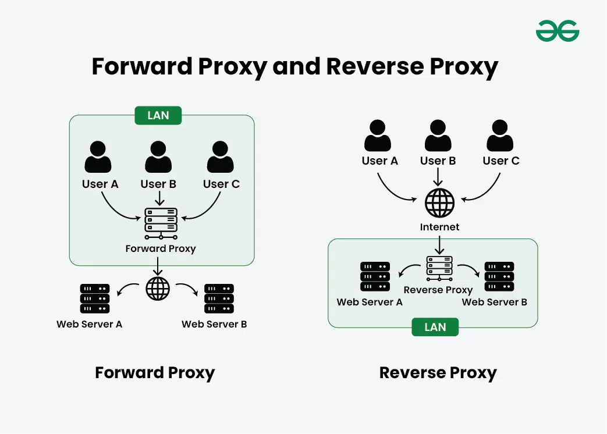
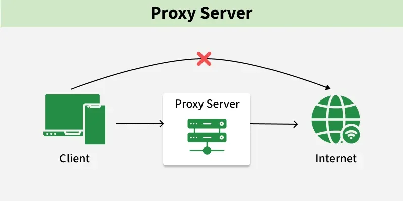
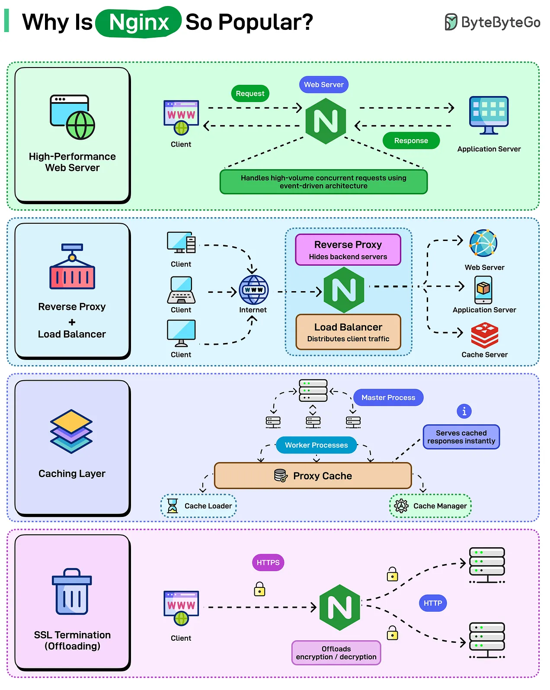
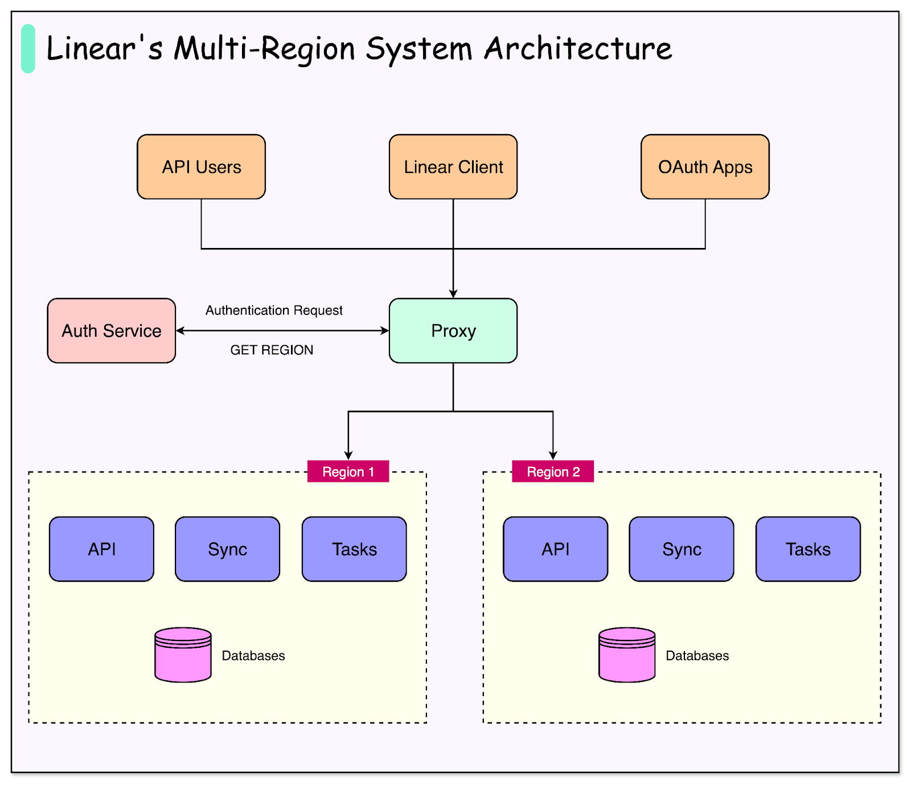
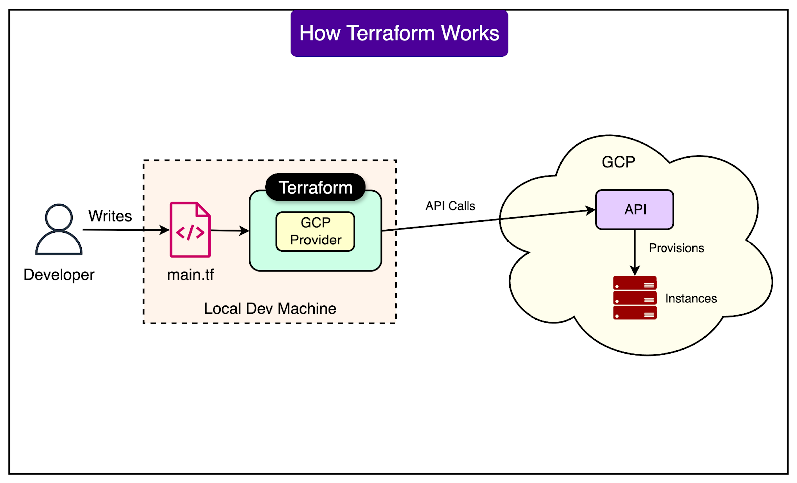
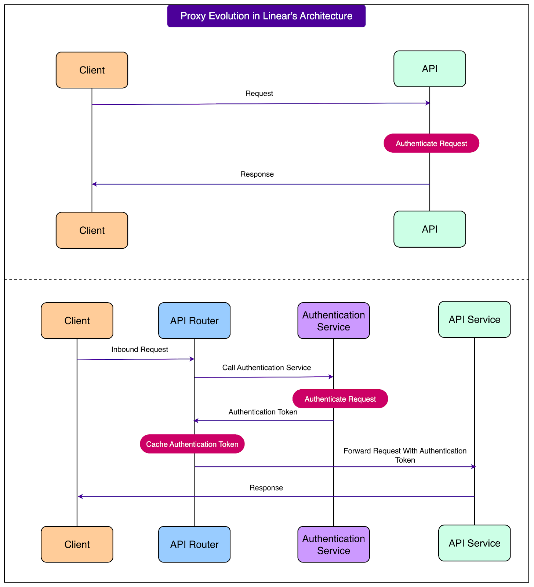
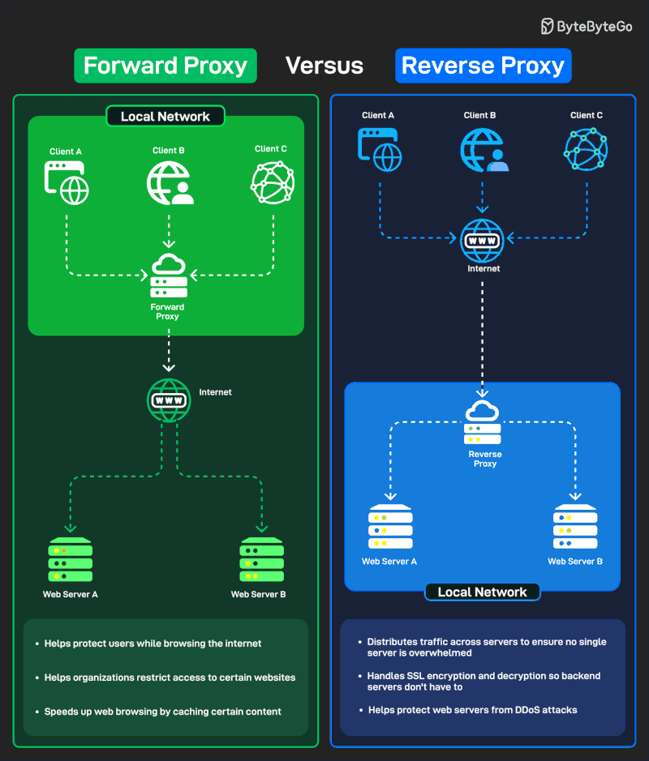

# Proxy

[TOC]

## Types of Proxies

- Forward Proxy

  Acts on behalf of the client to enhance privacy and control access.

- Reverse Proxy

  Acts on behalf of the server to optimize performance and security.

### Forward Proxy

A server that serves as an intermediary between your computer or other device and the internet is known as a forward proxy. Your request passes through the forward proxy before reaching the website when you attempt to view it. On your behalf, the proxy then submits the request to the website, receives the response, and sends it back to you.

Usage of Forward Proxy:

- Enhancing client anonymity.
- Accessing geo-blocked or restricted content.
- Content filtering and monitoring in organizations.
- Reducing bandwidth consumption through caching.
- Logging and tracking user activity for compliance.

### Reverse Proxy

A reverse proxy is a server that sits between clients (like web browsers) and another server, handling requests on behalf of that server. Instead of a client connecting directly to the main server, the reverse proxy intercepts requests and forwards them to the server.

Usage of Reverse Proxy:

- Load balancing across multiple web servers.
- Caching content to improve server performance.
- Protecting backend servers from direct exposure to the internet.
- SSL/TLS offloading to improve server efficiency.
- Mitigating DDoS attacks and enhancing security.

## Proxy Server

A proxy server acts as an intermediary between client devices and servers, facilitating communication through forwarding requests and responses. It intercepts traffic between the client and destination, offering several functionalities to enhance overall network performance, protection, and privacy.

### Purpose

- Content Filtering
- Privacy and Anonymity
- Security and Access Control
- Load Balancing
- Caching

### Types

- Forward proxy
- Reverse Proxy Server
- Web Proxy Server
- Public proxy

### Advantage And Disadvantage

The advantages of proxy servers:

- Enhanced Security
- Improved Performance
- Content Control
- Load Balancing

The disadvantages of proxy servers:

- Latency
- Configuration Complexity

## Nginx

Here’s what makes Nginx so popular:

- High-Performance Web Server
- Reverse Proxy & Load Balancer
- Caching Layer
- SSL Termination (Offloading)

## Linear's Multi-Region System

### Architecture

The multi-region architecture Linear implemented follows four strict requirements that shaped every technical decision in the system:

- Invisible to Users
- Developer Simplicity
- Feature Parity
- Full Regional Isolation

### Infrastructure as Code Transformation

### Request Routing Layer

## Summary

### Proxy Vs Reverse Proxy

| Forward Proxy                                                | Reverse Proxy                                                |
| ------------------------------------------------------------ | ------------------------------------------------------------ |
| Acts on behalf of the client to control access and enhance privacy. | Acts on behalf of the server to optimize performance and improve security. |
| Sits between the client and the internet.                    | Sits between the internet and the server.                    |
| The client is aware of the proxy and must configure it.      | The client is typically unaware of the proxy.                |
| The client needs to configure their device to use the proxy. | The server is configured to use the reverse proxy.           |
| Bypassing content filters, controlling access, and privacy enhancement. | Load balancing, caching, DDoS protection, SSL offloading.    |
| Intercepts requests from the client to the internet and forwards them. | Intercepts requests from the internet and forwards them to the appropriate server. |
| Can cache content on the client side to improve response times. | Can cache server responses to reduce load and speed up content delivery. |
| Does not typically handle SSL/TLS encryption.                | Can handle SSL/TLS offloading, easing encryptions/decryption tasks for the server. |

## References

[1] [Proxies in System Design](https://www.geeksforgeeks.org/system-design/network-protocols-and-proxies-in-system-design/)

[2] [Difference between Forward Proxy and Reverse Proxy](https://www.geeksforgeeks.org/system-design/difference-between-forward-proxy-and-reverse-proxy/)

[3] [System Design CheatSheet for Interview](https://medium.com/javarevisited/system-design-cheatsheet-4607e716db5a)

[4] [Difference between Forward Proxy and Reverse Proxy](https://www.geeksforgeeks.org/system-design/difference-between-forward-proxy-and-reverse-proxy/)

[5] [Why Is Nginx So Popular?](https://blog.bytebytego.com/p/ep194-evolution-of-http)

[6] [How Linear Implemented Multi-Region Support For Customers](https://blog.bytebytego.com/p/how-linear-implemented-multi-region)