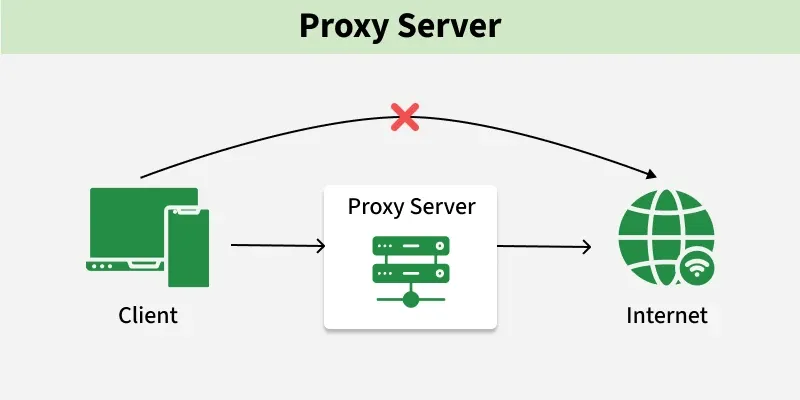
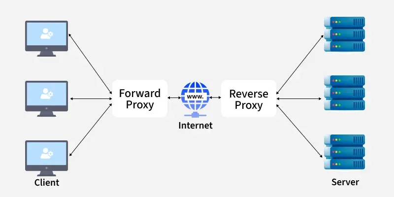

# Proxy Server

[TOC]

A proxy server acts as an intermediary between client devices and servers, facilitating communication through forwarding requests and responses. It intercepts traffic between client and destination, offering several functionalities to enhance overall network performance, protection, and privacy.

## Purpose

- Content Filtering
- Privacy and Anonymity
- Security and Access Control
- Load Balancing
- Caching

## Types

- Forward proxy
- Reverse Proxy Server
- Web Proxy Server
- Public proxy

## Advantage And Disadvantage

The advantages of proxy servers:

- Enhanced Security
- Improved Performance
- Content Control
- Load Balancing

The disadvantages of proxy servers:

- Latency
- Configuration Complexity

## Forward Proxy And Reverse Proxy

- Forward Proxy: Acts on behalf of the client to enhance privacy and control access.
- Reverse Proxy: Acts on behalf of the server to optimize performance and security.

### Forward Proxy

Usage of Forward Proxy:

- Enhancing client anonymity.
- Accessing geo-blocked or restricted content.
- Content filtering and monitoring in organizations.
- Reducing bandwidth consumption through caching.
- Logging and tracking user activity for compliance.

### Reverse Proxy

Usage of Reverse Proxy:

- Load balancing across multiple web servers.
- Caching content to improve server performance.
- Protecting backend servers from direct exposure to the internet.
- SSL/TLS offloading to improve server efficiency.
- Mitigating DDoS attacks and enhancing security.

## References

[1] [Proxies in System Design](https://www.geeksforgeeks.org/system-design/network-protocols-and-proxies-in-system-design/)

[2] [Difference between Forward Proxy and Reverse Proxy](https://www.geeksforgeeks.org/system-design/difference-between-forward-proxy-and-reverse-proxy/)