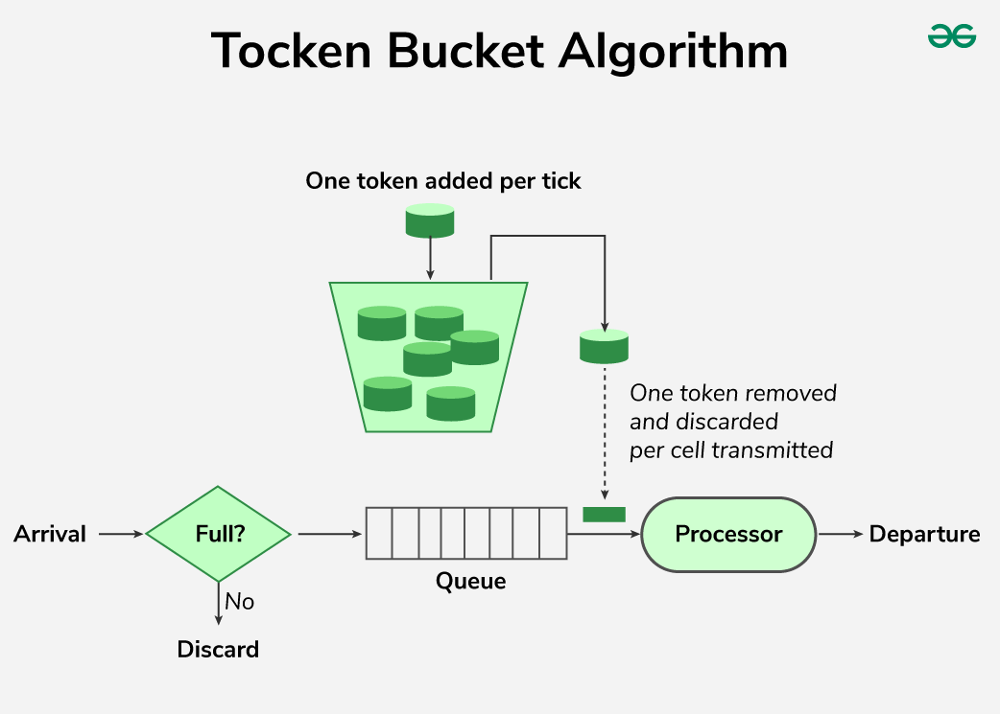
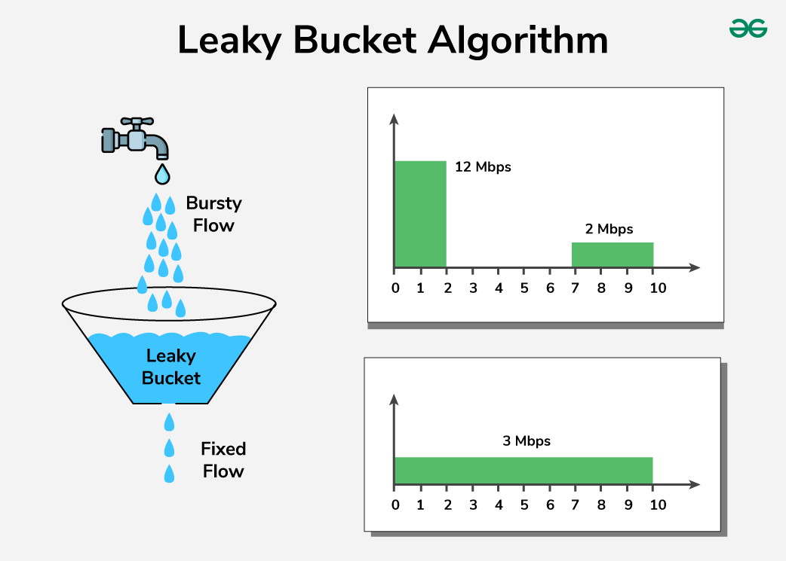
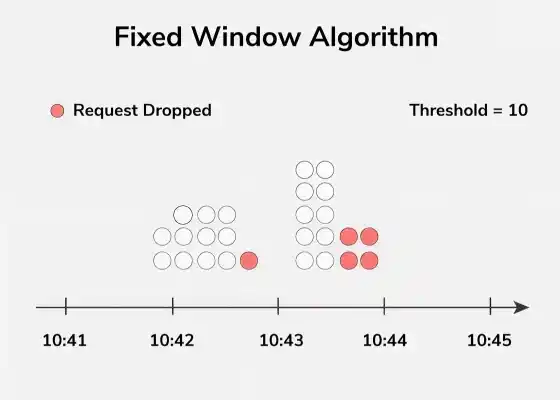
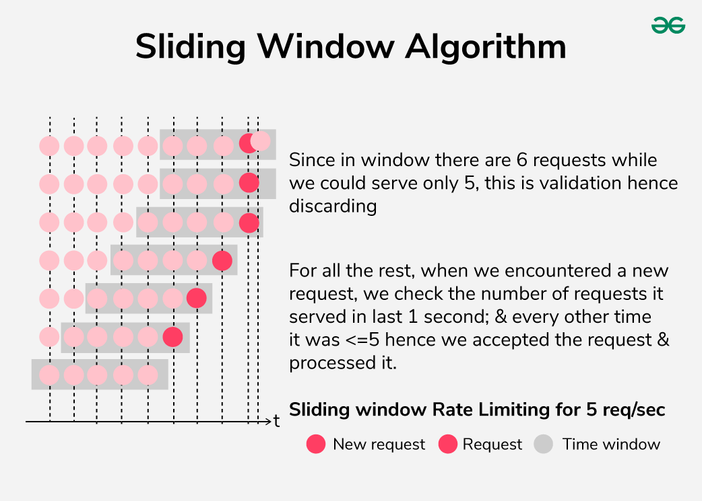

# Rate Limiting

[TOC]

Rate Limiting is a technique used in system architecture to regulate how quickly a system processes or serves incoming requests or a actions. It limits the quantity or frequency of client requests to prevent overload, maintain stability, and ensure fair resource distribution.

## Rate Limiter

A rate limiter is a component that controls the rate of traffic or requests to a system. It is a specific implementation or tool used to enforce rate-limiting.

## Types

### IP-based Rate Limiting

By restricting the amount of traffic that can originate from a single IP address, it is frequently used to stop abuses like bots and denial-of-service attacks.

Advantage:

- It's simple to implement at both the network and application level.
- If someone is trying to flood the system with requests, limiting their IP can prevent this.

Disadvantage:

- Attackers can use techniques like VPNs, proxy servers, or even botnets to spoof different IPs and get around the limit.
- If multiple users share the same IP address(like in a corporate network), a legitimate user could get blocked if someone else on the same network exceeds the limit.

### Server-based Rate Limiting

The number of requests that can be sent to a particular server in a predetermined period of time is controlled by server-based rate restriction.

Advantages:

- Helps protect the server from being overwhelmed, especially during peak usage.
- By limiting requests per server, you make sure that no single user can monopolize resources and degrade the experience for others.

Limitations:

- If attackers send requests across different servers, they might avoid hitting the rate limit on any single one.
- If the limit is too low or the server is under heavy load, even legitimate users might face delays or blocks.

### Geography-based Rate Limiting

Geography-based rate limiting restricts traffic based on the geographic location of the IP address. it's useful for blocking malicious requests that originate from certain regions, or for complying with regional laws and regulations.

Advantages:

- If you know certain regions are the source of a lot of bad traffic, you can limit requests from those areas.
- Helps comply with local data protection laws or restrictions on content in certain countries.

Limitations:

- Attackers can use VPNs or proxy servers to disguise their actual location and get around geography-based limits.
- Users traveling or accessing services via international servers might get blocked if they're in a region that's restricted.

## Algorithms

Rate Limiting Algorithms are mechanisms designed to control the rate at which requests are processed or served by a system.

### Token Bucket Algorithm

Token bucket algorithm regulates the amount of data transferred by continuously generating new tokens to comprise the bucket. Every request requires a token, and if the requester does not have any tokens, his or her request is turned down.

### Leaky Bucket Algorithm

The approach of using a leaky bucket is where the bucket size is constant and has a leak that allows it to shrink in size progressively. new incoming requests are acumulated into the bucket, and if this one is full, requests are rejected.

### Fixed Window Algorithm

The fixed window algorithm categorizes time into fixed intervals known as windows, and it restricts the requests to specific numbers in thw window.

### Sliding Window Algorithm

The sliding window algorithm is actually a variation of the two algorithms, namely the fixed window and the leaky bucket. It keeps a moving time frame and restricts the number of requests to be made within that frame. It provides for a finer and basically a better rate limiting in that the window is most likely renewed and the rate ideally spread out evenly over a period such that there can be adequate control over the traffic direction and occurrence.

## References

[1] [Rate Limiting in System Design](https://www.geeksforgeeks.org/system-design/rate-limiting-in-system-design/)

[2] [Rate Limiting Algorithms - System Design](https://www.geeksforgeeks.org/system-design/rate-limiting-algorithms-system-design/)

