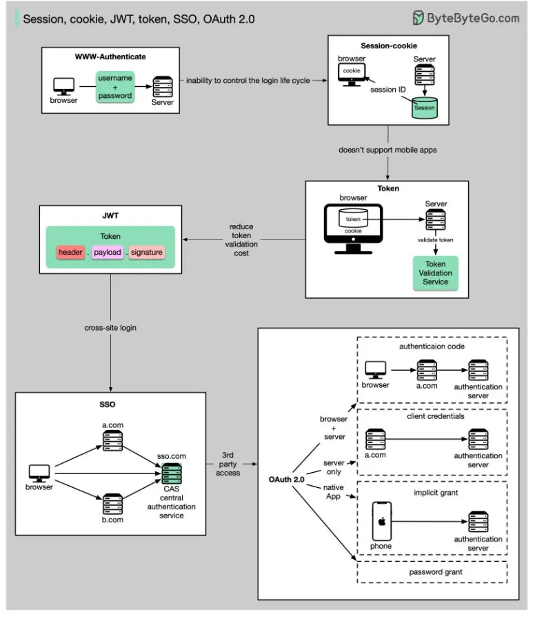
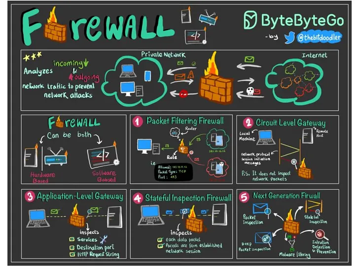
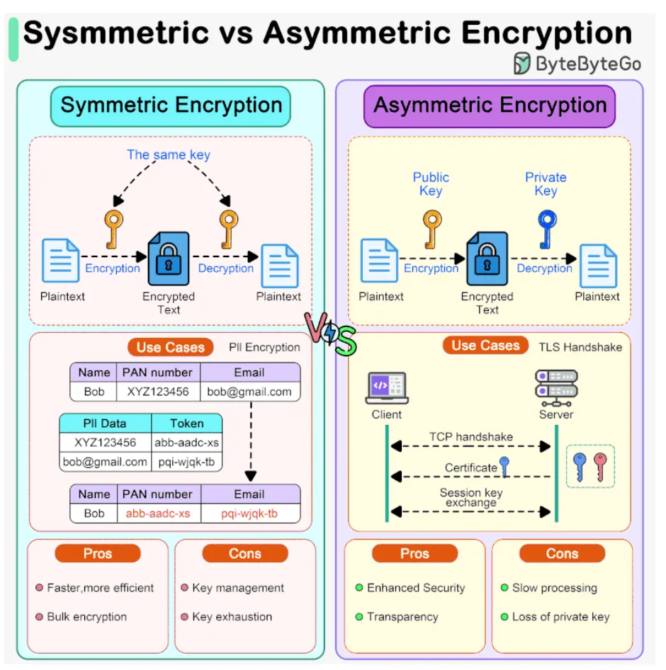

# Security

[TOC]

## Encrypt

TODO

## Auth

### Authentication

Authentication is the process of verifying the identity of a user or system. It ensures that the user is legitimate by validating credentials like passwords, OTPs, or biometrics.

### Authorization

Authorization determines the access rights and permissions of an authenticated user. It decides what resources the user can access and what actions they are allowed to perform.

## SSL And TLS

### Secure Socket Layer(SSL)

The Secure Socket Layer(SSL) is a cryptographic protocol designed to provide secure communication over a computer network.

### Transport Layer Security(TLS)

The Transport Layer Security(TLS) is the successor to SSL and is designed to provide improved security and efficiency. TLS was developed as an enhancement of SSL to the address various vulnerabilities and to the incorporate modern cryptographic techniques.

## Firewall

## Summary

### Sysmmetric vs Asymmetric Encryption

### Authentication vs Authorization

- Authentication: Confirms the user's identity(proves who the user is).
- Authorization: Controls what the verified user is allowed to do(decides what they can access).

### Difference Between Authentication And Authorization

| Authentication                                         | Authorization                                                |
| ------------------------------------------------------ | ------------------------------------------------------------ |
| Verifies who the user is                               | Determines what the user can access                          |
| Performed before authorization                         | Happens after authentication                                 |
| Requires login details(username, password, biometrics) | Requires user roles, privileges, or access levels            |
| Determines if the user is valid                        | Determines what permissions the valid user has               |
| Uses ID Tokens                                         | Uses Access Tokens                                           |
| Governed by OpenID Connect(OIDC)                       | Governed by OAuth 2.0                                        |
| Credentials can be changed by the user                 | Permissions can only be changed by the system owner          |
| Visible to the user(entering credentials)              | Not visible to the user(handled in the background)           |
| Examples: Password, OTP, fingerprint, face recognition | Examples: Admin rights, reqd/write access, role-based permissions |

### Difference Between SSL and TLS

| SSL                                                          | TLS                                                          |
| ------------------------------------------------------------ | ------------------------------------------------------------ |
| SSL stands for Secure Socket Layer.                          | TLS stands for Transport Layer Security.                     |
| It supports the Fortezza algorithm.                          | It does not support the Fortezza algorithm.                  |
| It is the 3.0 version.                                       | It is the 1.0 version.                                       |
| In SSL(Secure Socket Layer), the Message digest is used to create a master secret. | In TLS(Transport Layer Security), a Pseudo-random function is used to create a master secret. |
| In SSL(Secure Socket Layer), the Message Authentication Code protocol is used. | In TLS(Transport Layer Security), Hashed message Authentication Code protocol is used. |
| It is more complex than TLS(Transport Layer Security).       | It is simple than SSL.                                       |
| It is less secured as compared to TLS(Transport Layer Security). | It provides high security.                                   |
| It is less reliable and slower.                              | It is highly reliable and upgraded. It provides less latency. |
| It has been depreciated.                                     | It is still widely used.                                     |
| It uses port to set up explicit connection.                  | It uses protocol to set up implicit connection.              |

## Reference

[1] [System Design CheatSheet for Interview](https://medium.com/javarevisited/system-design-cheatsheet-4607e716db5a)