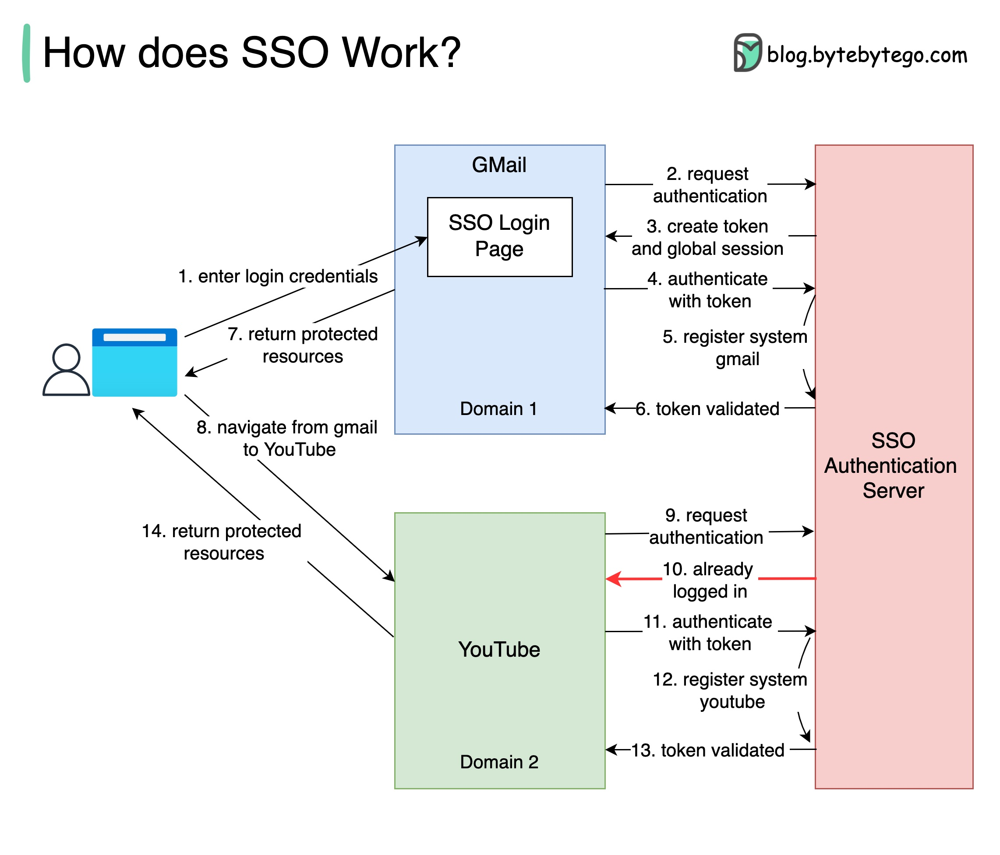
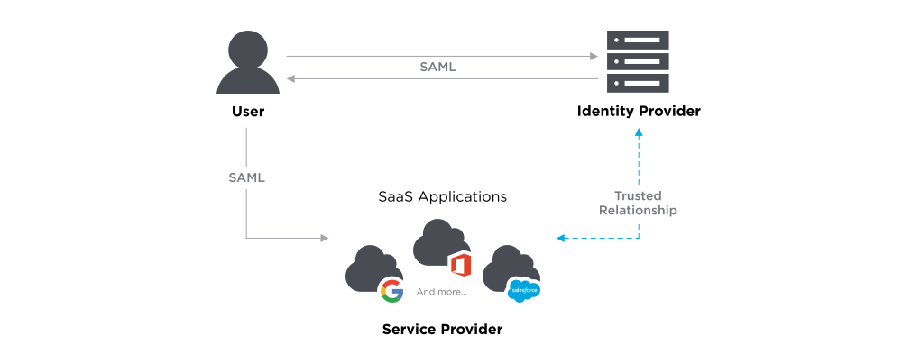
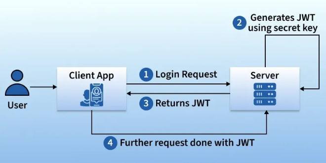
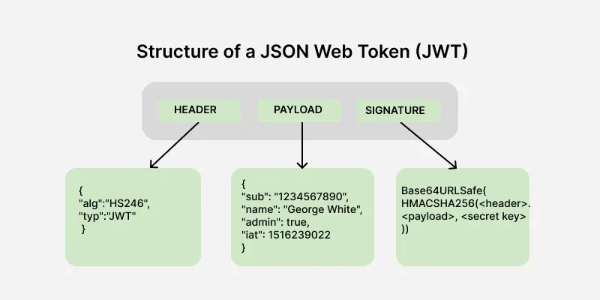

# Security

[TOC]

## Encrypt

TODO

## Auth

### Authentication

Authentication is the process of verifying the identity of a user or system. It ensures that the user is legitimate by validating credentials like passwords, OTPs, or biometrics.

### Authorization

Authorization determines the access rights and permissions of an authenticated user. It decides what resources the user can access and what actions they are allowed to perform.

## Secure Socket Layer(SSL) And Transport Layer Security(TLS)

### Secure Socket Layer(SSL)

The Secure Socket Layer(SSL) is a cryptographic protocol designed to provide secure communication over a computer network.

### Transport Layer Security(TLS)

The Transport Layer Security(TLS) is the successor to SSL and is designed to provide improved security and efficiency. TLS was developed as an enhancement of SSL to the address various vulnerabilities and to the incorporate modern cryptographic techniques.

## SSO(Single Sign-On)

Single Sign-On(SSO) is an authentication schema. It allows a user to login to different systems using a single ID.

### Types

- Kerberos-Based SSO
- SAML SSO
- Smart card-based SSO
- Social SSO
- Enterprise SSO

### Workflow

### Advantage

For Users:

- The risk of access to third-party sites is mitigated as the website database does not store the user's login credentials.
- Increased convenience for users as they only need to remember and key in login information once.
- Increased security assurance for users as website owners do not store login credentials.

For Businesses:

- Increase customer base and satisfaction as SSO provides a lower barrier to entry and seamless user experience.
- Reduce IT costs for managing customer's usernames and passwords.

### Disadvantage

- Increased security risk if login credentials are not securely protected and are exposed or stolen as adversaries can now access many websites and applications with a single credential.
- Authentication systems must have high availability as loss of availability can lead to denial of service for applications using a shard cluster of authentication systems.

## Firewall

## SAML

SAML is the underlying technology that allows people to sign in once using one set of credentials and access multiple applications.

## OAuth

OAuth is an open-standard authorization protocol that allows applications to access user data withotu requiring the user's password.

### JWT

A JSON Web Token(JWT) is a secure way to send information between a client and a server.

#### Structure

## Summary

### Sysmmetric vs Asymmetric Encryption

### Authentication vs Authorization

- Authentication: Confirms the user's identity(proves who the user is).
- Authorization: Controls what the verified user is allowed to do(decides what they can access).

### Difference Between Authentication And Authorization

| Authentication                                         | Authorization                                                |
| ------------------------------------------------------ | ------------------------------------------------------------ |
| Verifies who the user is                               | Determines what the user can access                          |
| Performed before authorization                         | Happens after authentication                                 |
| Requires login details(username, password, biometrics) | Requires user roles, privileges, or access levels            |
| Determines if the user is valid                        | Determines what permissions the valid user has               |
| Uses ID Tokens                                         | Uses Access Tokens                                           |
| Governed by OpenID Connect(OIDC)                       | Governed by OAuth 2.0                                        |
| Credentials can be changed by the user                 | Permissions can only be changed by the system owner          |
| Visible to the user(entering credentials)              | Not visible to the user(handled in the background)           |
| Examples: Password, OTP, fingerprint, face recognition | Examples: Admin rights, reqd/write access, role-based permissions |

### Difference Between SSL and TLS

| SSL                                                          | TLS                                                          |
| ------------------------------------------------------------ | ------------------------------------------------------------ |
| SSL stands for Secure Socket Layer.                          | TLS stands for Transport Layer Security.                     |
| It supports the Fortezza algorithm.                          | It does not support the Fortezza algorithm.                  |
| It is the 3.0 version.                                       | It is the 1.0 version.                                       |
| In SSL(Secure Socket Layer), the Message digest is used to create a master secret. | In TLS(Transport Layer Security), a Pseudo-random function is used to create a master secret. |
| In SSL(Secure Socket Layer), the Message Authentication Code protocol is used. | In TLS(Transport Layer Security), Hashed message Authentication Code protocol is used. |
| It is more complex than TLS(Transport Layer Security).       | It is simple than SSL.                                       |
| It is less secured as compared to TLS(Transport Layer Security). | It provides high security.                                   |
| It is less reliable and slower.                              | It is highly reliable and upgraded. It provides less latency. |
| It has been depreciated.                                     | It is still widely used.                                     |
| It uses port to set up explicit connection.                  | It uses protocol to set up implicit connection.              |

### Difference between JWT, OAuth and SAML

|             | JWT                          | OAuth                         | SAML                         |
| ----------- | ---------------------------- | ----------------------------- | ---------------------------- |
| What is it? | A Token Format               | An Authorization Framework    | An Authentication Protocol   |
| Data Format | JSON(Lightweight)            | Not specified(often uses JWT) | XML(Heavy/Verbose)           |
| Main Goal   | Securely transmit info       | Delegate Access to data       | Single Sign-On(SSO)          |
| Common Use  | Mobile apps, Modern APIs     | "Login with Google/Facebook"  | Corporate/Enterprise login   |
| Security    | Digital Signatures(HMAC/RSA) | Tokens(Access/Refresh)        | Digital Signatures(XML-DSig) |

## Reference

[1] [System Design CheatSheet for Interview](https://medium.com/javarevisited/system-design-cheatsheet-4607e716db5a)

[2] [JSON Web Token (JWT)](https://www.geeksforgeeks.org/web-tech/json-web-token-jwt/)

[3] [SAML Explained in Plain English](https://www.onelogin.com/learn/saml)

[4] [Difference between JWT, OAuth, and SAML for Authentication and Authorization in Web Apps?](https://medium.com/javarevisited/difference-between-jwt-oauth-and-saml-for-authentication-and-authorization-in-web-apps-75b412754127)

[5] [What is OAuth (Open Authorization) ?](https://www.geeksforgeeks.org/ethical-hacking/what-is-oauth-open-authorization/)