# Security

[TOC]

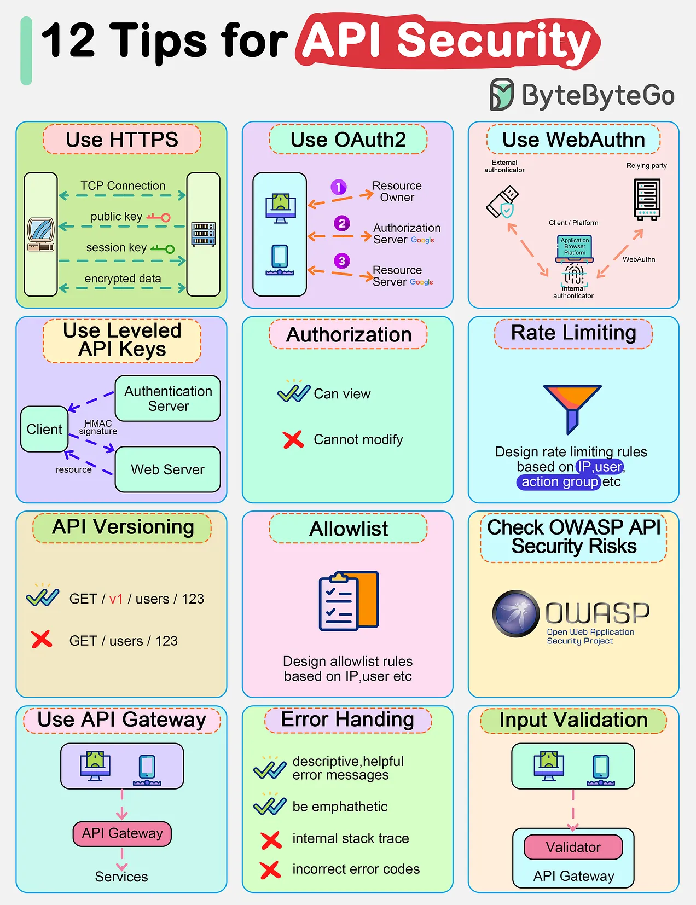

## Intro

### Data Encryption

Data Encryption is also a crucial step to ensure the safety of any system.

### Secure Communication Protocols

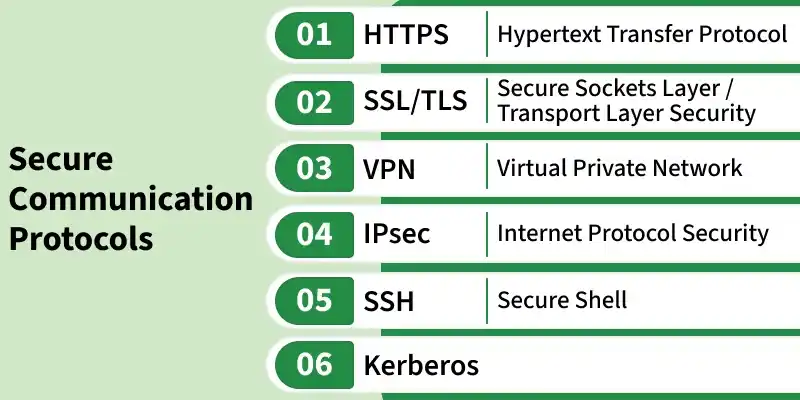

## Auth

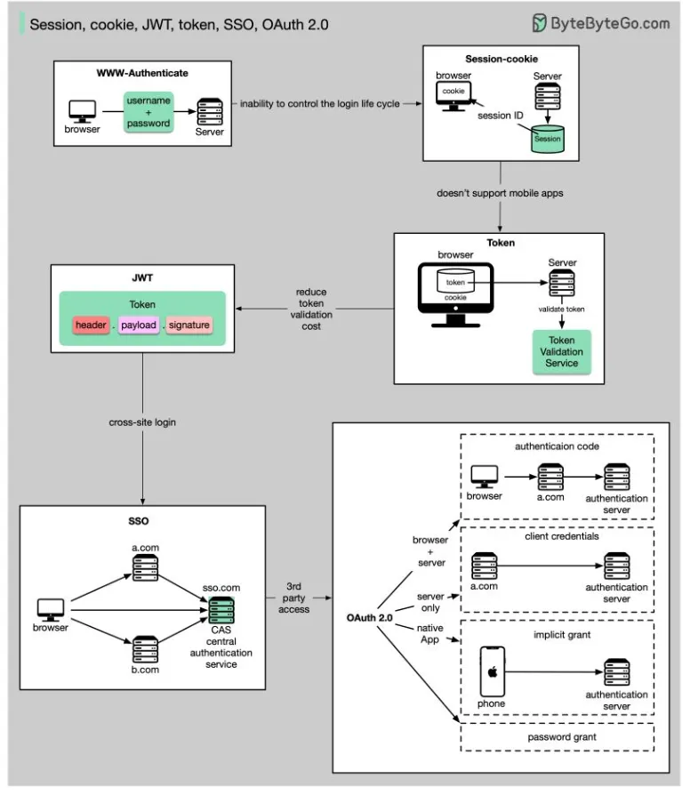

### Authentication

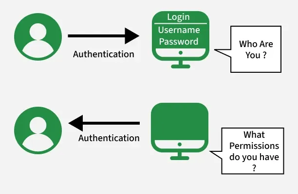

Authentication is the process of verifying the identity of a user or system. It ensures that the user is legitimate by validating credentials like passwords, OTPs, or biometrics.

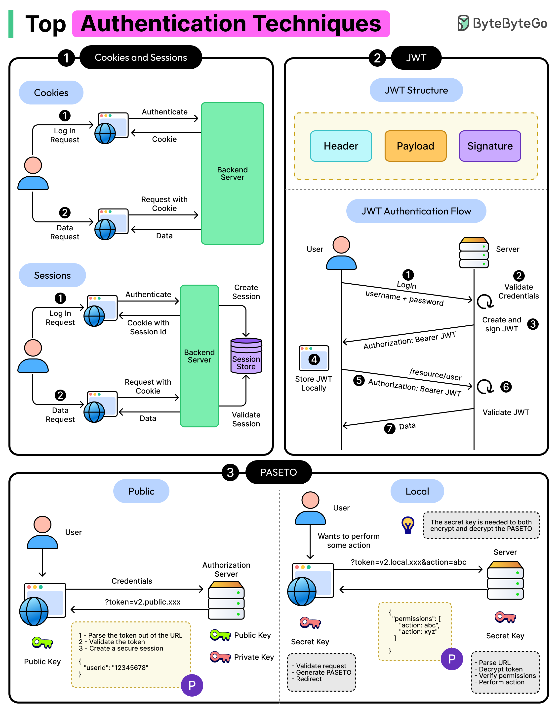

### Authorization

Authorization determines the access rights and permissions of an authenticated user. It decides what resources the user can access and what actions they are allowed to perform.

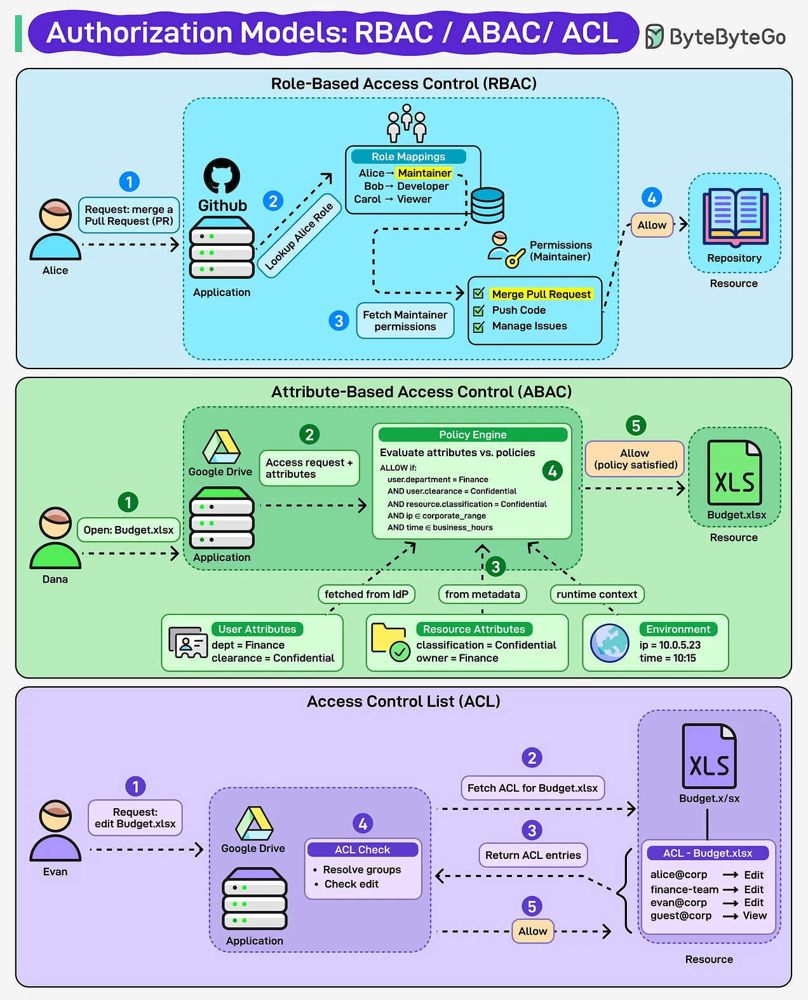

- Role-Based Access Control (RBAC): Access based on roles (e.g., Maintainer, Viewer). Simple, scalable.
- Attribute-Based Access Control (ABAC): Access based on attributes (user, resource, environment). Flexible, but complex.
- Access Control List (ACL): Explicit permissions for each user or group. Direct, but hard to manage at scale.

## SSL And TLS

SSL (Secure Socket Layer) and TLS (Transport Layer Security) are protocols that secure communication between web browsers and servers. TLS is the newer, more secure version of SSL, providing enhanced encryption and integrity checks.

### Secure Socket Layer (SSL)

The Secure Socket Layer(SSL) is a cryptographic protocol designed to provide secure communication over a computer network.

SSL ensures secure communication through three main mechanisms:

1. Encryption

   Data transmitted over the network is encrypted, preventing unauthorized parties from reading it. If intercepted, encrypted data appears as an unreadable jumble of characters.

2. Authentication

   SSL uses a handshake process to authenticate both the client and server, ensuring each party is legitimate and not an imposter.

3. Data Integrity

   SSL digitally signs transmitted data to detect any tampering, ensuring that the data received is exactly what was sent.

#### SSL Record Protocol

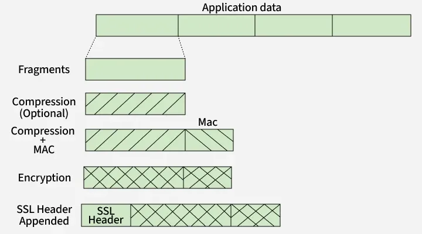

- Provides confidentiality and message integrity.
- Application data is divided into fragments, optionally compressed and appended with a Message Authentication Code (MAC).
- The data is then encrypted and transmitted with an SSL header.

#### Handshake Protocol

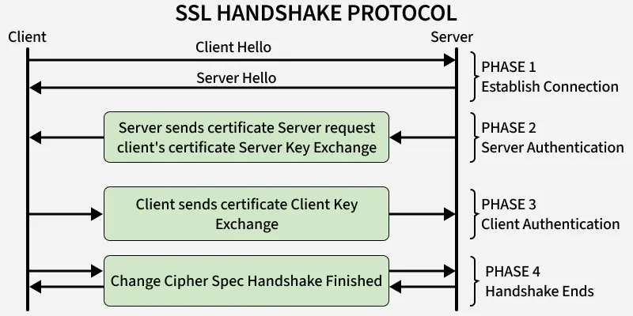

Four phases:

- Client and server exchange hello packets, protocol versions and cipher suites.
- Server sends its certificate and server key information.
- Client responds with its certificate and key exchange.
- Change Cipher Spec finalizes the handshake, activating secure communication.

#### Change-Cipher Spec Protocol

- Signals that pending cryptographic parameters from the handshake should now become active.
- Consists of a single 1-byte message.

#### Alert Protocol

- Communicates SSL-related warnings or errors.
- Warning alerts (level 1): Non-critical issues, such as expired or unsupported certificates.
- Fatal alerts (level 2): Critical errors, such as handshake failures, bad record MAC or illegal parameters, which terminate the connection.

### Transport Layer Security (TLS)

The Transport Layer Security(TLS) is the successor to SSL and is designed to provide improved security and efficiency. TLS was developed as an enhancement of SSL to the address various vulnerabilities and to the incorporate modern cryptographic techniques.

## SSO(Single Sign-On)

Single Sign-On(SSO) is an authentication schema. It allows a user to log in to different systems using a single ID.

Types of SSO:

- Kerberos-Based SSO
- SAML SSO
- Smart card-based SSO
- Social SSO
- Enterprise SSO

### SSO Workflow

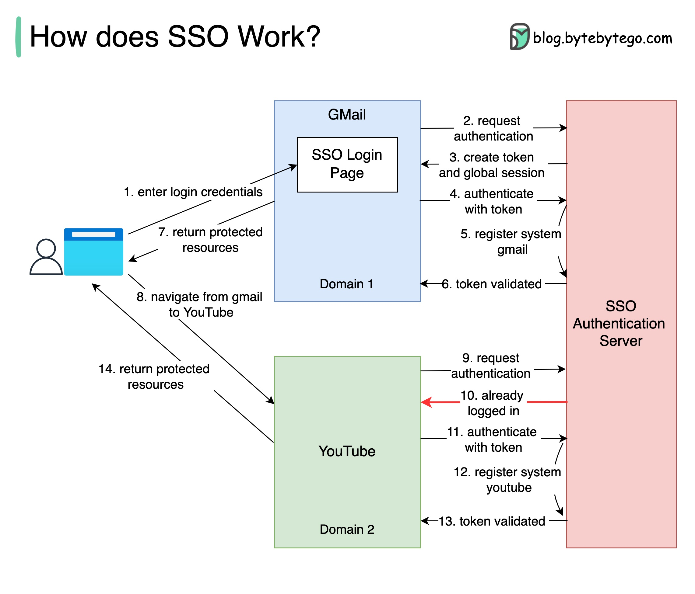

**Advantage:**

For Users:

- The risk of access to third-party sites is mitigated as the website database does not store the user's login credentials.
- Increased convenience for users as they only need to remember and key in login information once.
- Increased security assurance for users as website owners do not store login credentials.

For Businesses:

- Increase customer base and satisfaction as SSO provides a lower barrier to entry and seamless user experience.
- Reduce IT costs for managing customer's usernames and passwords.

**Disadvantage:**

- Increased security risk if login credentials are not securely protected and are exposed or stolen as adversaries can now access many websites and applications with a single credential.
- Authentication systems must have high availability as loss of availability can lead to denial of service for applications using a shard cluster of authentication systems.

## SSDLC (Secure Software Development Life Cycle)

Secure Software Development Life Cycle is a structured approach to software development that integrates security practices into every phase of the development process.

### Key Principles of SSDLC

The key principles of Secure Software Development Life Cycle define the core practices that guide the development of secure applications. These principles help teams integrate security effectively at every stage of the development process.

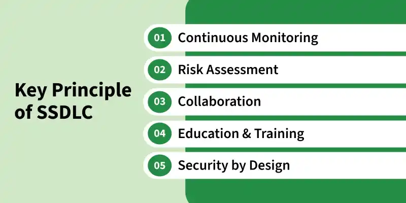

- Security by Design

  This principle highlights the need to think about security right from the start of creating software. It means including security requirements in the initial planning and design stages of development.

- Continuous Monitoring

  Continuous monitoring ensures that potential threats and vulnerabilities are identified and addressed throughout the entire lifecycle.

- Risk Assessment

  Risk assessment involves identifying and evaluating potential security threats early. It helps prioritize vulnerabilities and take timely actions to minimize risks.

- Education and Training

  Developers and team members must be well-trained in security practices. Proper education ensures they have the knowledge and skills to handle security challenges effectively.

- Collaboration

  Effective security requires teamwork. Collaboration between development, operations and security teams ensures better communication, shared responsibility and stronger overall protection

### Phases of SSDLC

Phases of Secure Software Development Life Cycle (SDLC) refer to the different stages involved in building secure software. These phases guide the step-by-step process from the initial planning to the ongoing maintenance of the software.

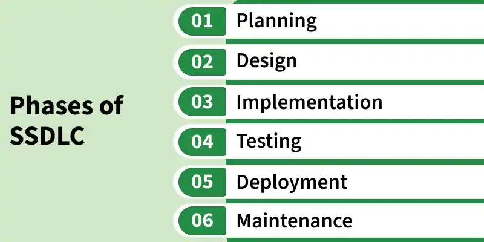

- Planning

  In the planning stage, the main focus is on figuring out the security requirements for the software. This includes identifying possible risks and creating a plan for how to make the software secure from the beginning.

- Design

  During the design phase, the plan for security is put into action. This involves making decisions about how to build security features into the software. The goal is to ensure that the design can handle potential security problems.

- Implementation

  In the implementation phase, developers start building the software using secure coding practices. This means writing code in a way that reduces the chances of security problems. Code reviews are done to catch and fix any security issues.

- Testing

  Testing is all about checking how secure the software is. Different tests are done, like trying to break into the software to find vulnerabilities, scanning the code for potential problems and making sure the software can handle different security threats.

- Deployment

  Deployment is when the software is released. Here, the focus is on making sure the release process is secure, taking precautions to avoid any security issues during this stage.

- Maintenance

  Maintenance is an ongoing process where the software is continuously looked after. This involves keeping an eye on security and regularly updating the software to deal with new threats, making sure it stays secure over time.

## Disaster Recovery

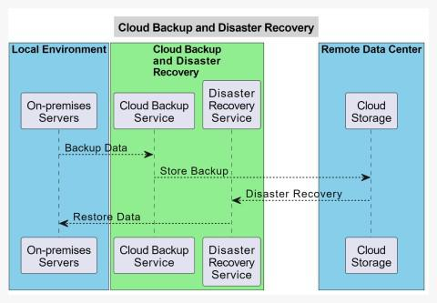

Data Backup involves creating secure copies of critical data, while Disaster Recovery ensures quick restoration and business continuity after failures. Modern cloud-based BDR solutions automate these processes using scalable, software-driven systems. 

Advantage:

- Data Protection and Redundancy
- Scalability
- Cost-Efficiency
- Accessibility And Flexibility
- Automated Backup And Recovery
- Disaster Recovery Capabilities

Disadvantages:

- Internet Dependency
- Data Security
- Vendor Reliability
- Data Transfer Speed
- Loss Of Control
- Rising Costs

### Recovery Point Objective (RPO)

Defines the maximum amount of data loss a system can tolerate. Determines how frequently backups should be taken to minimize data loss

### Recovery Time Objective (RTO)

Defines the maximum acceptable downtime after a failure. Determines how quickly systems and data must be restored.

## IP Security (IPSec)

IP Security (IPsec) is a set of network security protocols used to protect data transmitted over an IP network, such as the Internet. It provides security by authenticating, encrypting, and ensuring the integrity of IP packets during communication between devices.

### IPSec Workflow

IPsec is used to secure data when it travels over the Internet by creating a protected connection between communicating devices. It ensures that the transmitted information remains confidential, authentic, and unchanged during transmission.

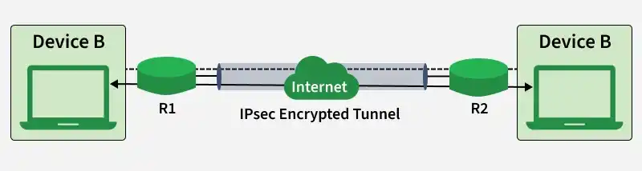

### IP Security Architecture

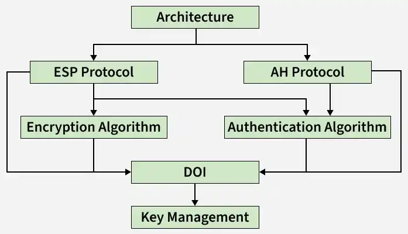

`IPSec (IP Security) architecture` uses two protocols to secure the traffic or data flow. These protocols are ESP (Encapsulation Security Payload) and AH (Authentication Header).

### Connection Establishment Process

IPsec establishes a secure communication channel by authenticating devices and encrypting the data transmitted over the network. The connection establishment process takes place in two main phases.

#### Phase 1: Establishing the IKE Tunnel

In Phase 1, a secure communication channel is created using Internet Key Exchange. This secure channel is used for further negotiation of security parameters and key exchange.

#### Phase 2: Establishing the IPsec Tunnel

In Phase 2, also known as Quick Mode, the devices negotiate the IPsec Security Associations (SA) and decide how data will be protected during communication.

## Firewall

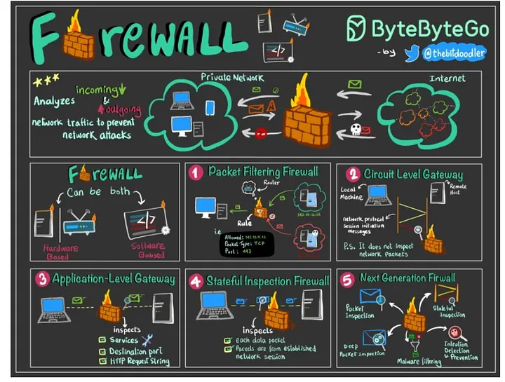

## SAML

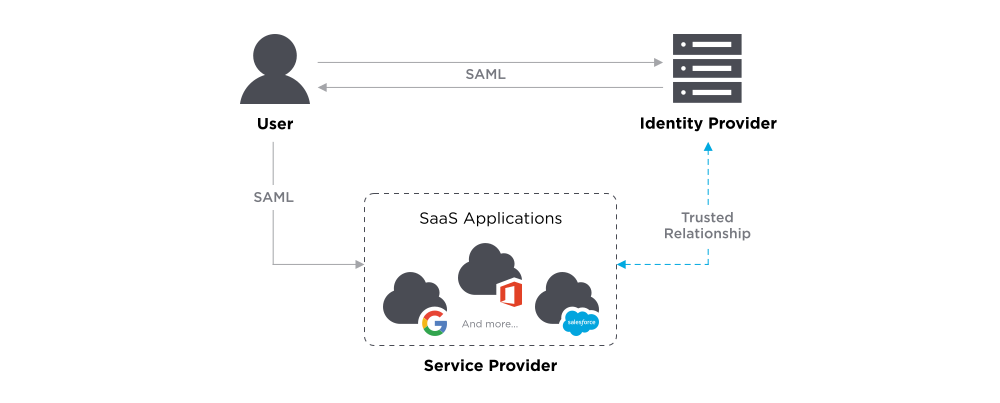

SAML is the underlying technology that allows people to sign in once using one set of credentials and access multiple applications.

## Cookies and Sessions

Sessions are ideal for applications requiring strict server-side control over user data.

session data is stored on the server and referenced via a client-side cookie.

## PASETO

Platform-Agnostic Security Tokens or PASETO improve upon JWT by enforcing stronger cryptographic defaults and eliminating algorithmic vulnerabilities.

## MIME (Multipurpose Internet Mail Extension)

`MIME (Multipurpose Internet Mail Extensions)` is a standard designed to extend the format of email messages, allowing them to include more than just plain text. It enables the transmission of multimedia content such as images, audio, video and attachments, as well as other types of content, across email systems that traditionally only supported plain ASCII text.

Pros of MIME:

- Supports Multiple Data Types: Text, audio, video, images and application files can all be sent via email.
- Multilingual Compatibility: Allows emails in various languages like Hindi, French, Japanese or Chinese.
- Rich Formatting with HTML/CSS: Enables customized emails with enhanced styling.
- Handles Long Messages: Capable of transmitting large or lengthy content without corruption.
- Unique Identification: Each MIME part can have a unique `Content-ID`, helpful for managing embedded media.

Cons of MIME:

- Inconsistent Interpretation: The recipient’s system may not always correctly interpret MIME types.
- Increased Overhead: Adds extra headers and encoding, increasing email size and transmission time.
- Complexity for Users: Multiple media types and headers may be confusing for non-technical users.
- Compatibility Issues: Older or limited email systems may not support MIME, potentially causing errors or data loss.

### MIME Structure

A typical MIME email contains several key components:

- MIME-Version: Specifies the MIME version used (commonly 1.0).
- Content-Type: Indicates the type of content, such as `text/plain`, `text/html`, `image/jpeg` or `audio/mpeg`.
- Content-Transfer-Encoding: Shows how content is encoded for safe transmission (e.g., base64, quoted-printable).
- Content-Disposition: Determines whether content is inline or an attachment.
- Content-ID: Provides a unique identifier for referencing embedded objects like inline images.
- Content-Description: Offers a short description of the content (e.g., "PDF Document" or "Image File").

### MIME Workflow

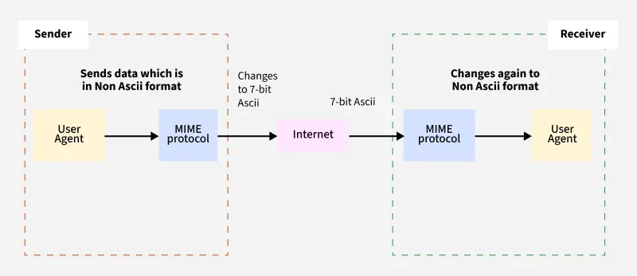

1. Encoding

   The message content is converted into a 7-bit ASCII format for safe transmission.

2. Transmission

   The encoded message travels through the email system using SMTP.

3. Decoding

   The receiving client decodes the message back into its original format.

4. Interpretation

   The recipient’s email client reads the MIME headers to correctly display content and attachments.

## OAuth

OAuth is an open-standard authorization protocol that allows applications to access user data without requiring the user's password.

### JWT

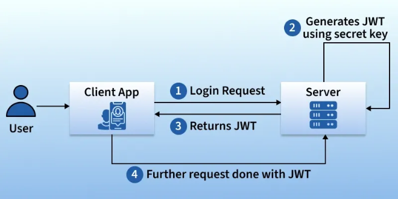

A JSON Web Token(JWT) is a secure way to send information between a client and a server.

#### Structure

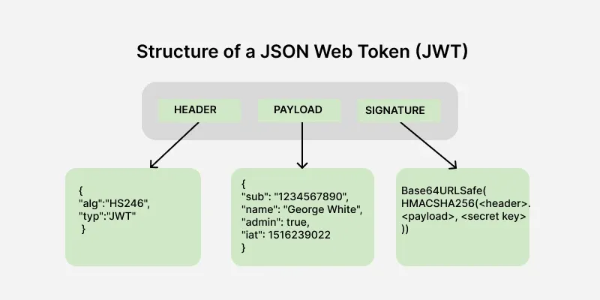

#### Stateless Authentication

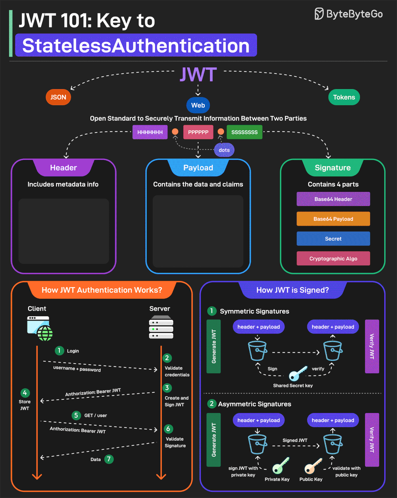

## Two-factor Authentication (2FA)

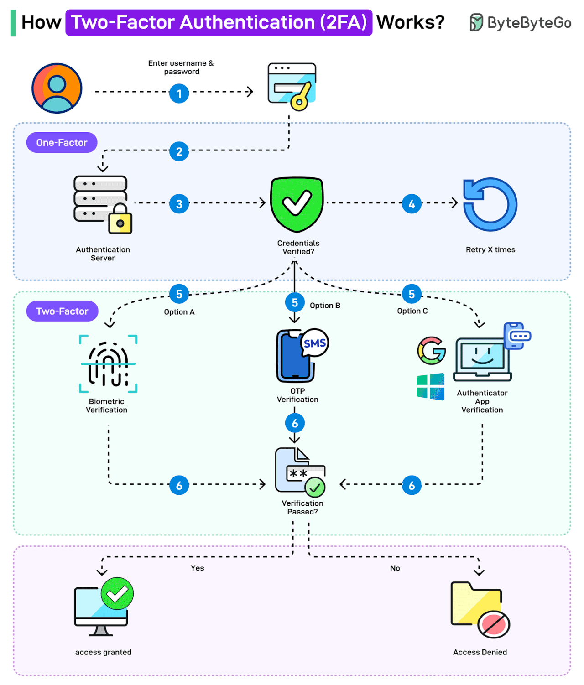

Two-factor authentication (2FA) is a type of multi-factor authentication that makes accounts more secure.

**Workflow:**

1. The user enters username and password. This is for the first level of authentication, also known as single-factor.
2. The authentication request goes to the authentication server.
3. The authentication credentials are verified.
4. In case of any incorrect credentials, a certain number of retries may be allowed.
5. If the credentials are correct, the two-factor authentication kicks in. There are multiple options available: biometric verification, OTP verification, or Authenticator App Verification. Organizations like Google and Microsoft also provide such apps.
6. The user verifies using the chosen option.
7. If the verification fails, access is denied. However, if verification succeeds, access is granted.

## Summary

### Sysmmetric vs Asymmetric Encryption

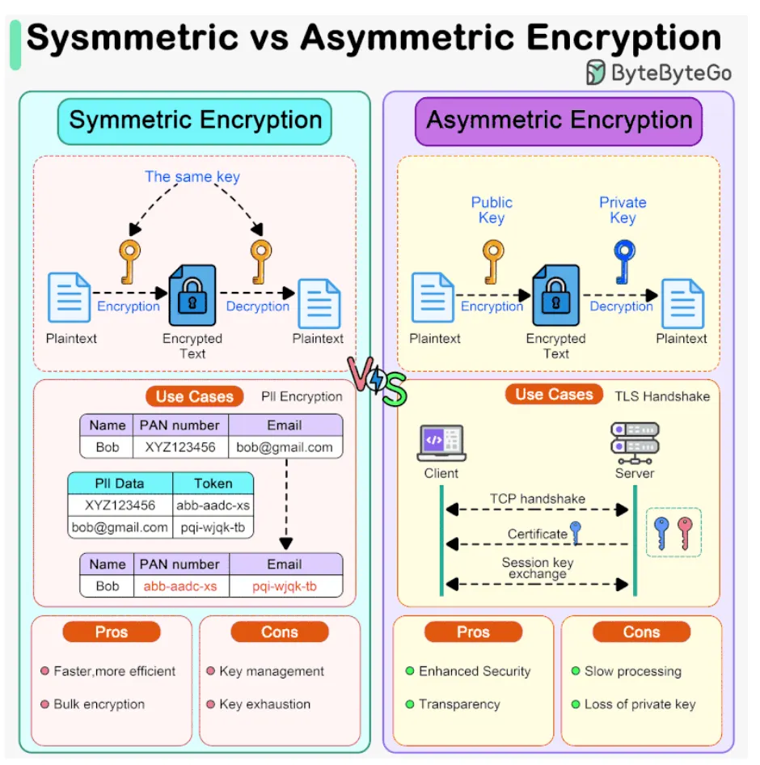

### Authentication vs Authorization

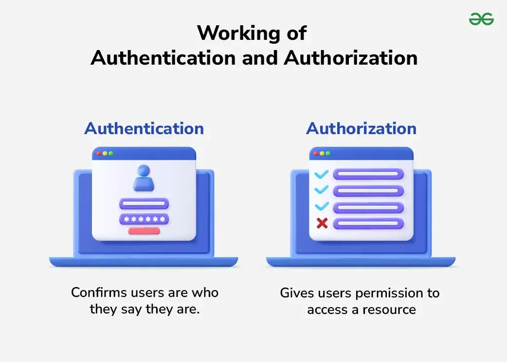

| Authentication                                         | Authorization                                                |
| ------------------------------------------------------ | ------------------------------------------------------------ |
| Verifies who the user is                               | Determines what the user can access                          |
| Performed before authorization                         | Happens after authentication                                 |
| Requires login details(username, password, biometrics) | Requires user roles, privileges, or access levels            |
| Determines if the user is valid                        | Determines what permissions the valid user has               |
| Uses ID Tokens                                         | Uses Access Tokens                                           |
| Governed by OpenID Connect(OIDC)                       | Governed by OAuth 2.0                                        |
| Credentials can be changed by the user                 | Permissions can only be changed by the system owner          |
| Visible to the user(entering credentials)              | Not visible to the user(handled in the background)           |
| Examples: Password, OTP, fingerprint, face recognition | Examples: Admin rights, reqd/write access, role-based permissions |

### SSL vs TLS

| SSL                                                          | TLS                                                          |
| ------------------------------------------------------------ | ------------------------------------------------------------ |
| SSL stands for Secure Socket Layer.                          | TLS stands for Transport Layer Security.                     |
| It supports the Fortezza algorithm.                          | It does not support the Fortezza algorithm.                  |
| It is the 3.0 version.                                       | It is the 1.0 version.                                       |
| In SSL(Secure Socket Layer), the Message digest is used to create a master secret. | In TLS(Transport Layer Security), a Pseudo-random function is used to create a master secret. |
| In SSL(Secure Socket Layer), the Message Authentication Code protocol is used. | In TLS(Transport Layer Security), Hashed message Authentication Code protocol is used. |
| It is more complex than TLS(Transport Layer Security).       | It is simple than SSL.                                       |
| It is less secured as compared to TLS(Transport Layer Security). | It provides high security.                                   |
| It is less reliable and slower.                              | It is highly reliable and upgraded. It provides less latency. |
| It has been depreciated.                                     | It is still widely used.                                     |
| It uses port to set up explicit connection.                  | It uses protocol to set up implicit connection.              |

### SDLC Process vs SSDLC Process

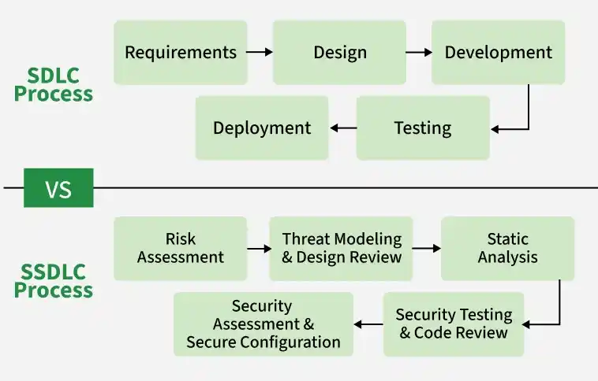

|         **Aspect**          |          **Software Development Life Cycle (SDLC)**          |      **Secure Software Development Life Cycle (SSDLC)**      |
| :-------------------------: | :----------------------------------------------------------: | :----------------------------------------------------------: |
|          **Focus**          |         Primarily on delivering functional software.         |  Emphasizes security considerations throughout the process.  |
|        **Objective**        |       Meeting business requirements and functionality.       | Integrating security measures to protect against vulnerabilities. |
|         **Phases**          | Typically includes phases like planning, analysis, design, implementation, testing, deployment and maintenance. | Incorporates security-related phases, such as threat modeling, secure coding and continuous monitoring. |
| **Security Considerations** |    Security is addressed mainly during the testing phase.    | Security is considered at every stage, from design to deployment. |
|         **Testing**         |         Security testing is often a separate phase.          | Security testing is integrated into each phase of development. |
|      **Documentation**      |     Documentation focuses on functionality and features.     | Comprehensive documentation on security measures, threat models and risk assessments. |
|    **Development Speed**    |       Emphasizes timely delivery of software features.       | May involve slightly longer development cycles due to added security considerations. |
|      **Adaptability**       | Generally more adaptable to changes in business requirements. | May require more effort to incorporate changes due to the stringent security focus. |

### Difference between JWT, OAuth and SAML

|             | JWT                          | OAuth                         | SAML                         |
| ----------- | ---------------------------- | ----------------------------- | ---------------------------- |
| What is it? | A Token Format               | An Authorization Framework    | An Authentication Protocol   |
| Data Format | JSON(Lightweight)            | Not specified(often uses JWT) | XML(Heavy/Verbose)           |
| Main Goal   | Securely transmit info       | Delegate Access to data       | Single Sign-On(SSO)          |
| Common Use  | Mobile apps, Modern APIs     | "Login with Google/Facebook"  | Corporate/Enterprise login   |
| Security    | Digital Signatures(HMAC/RSA) | Tokens(Access/Refresh)        | Digital Signatures(XML-DSig) |

### Tokens vs API Keys

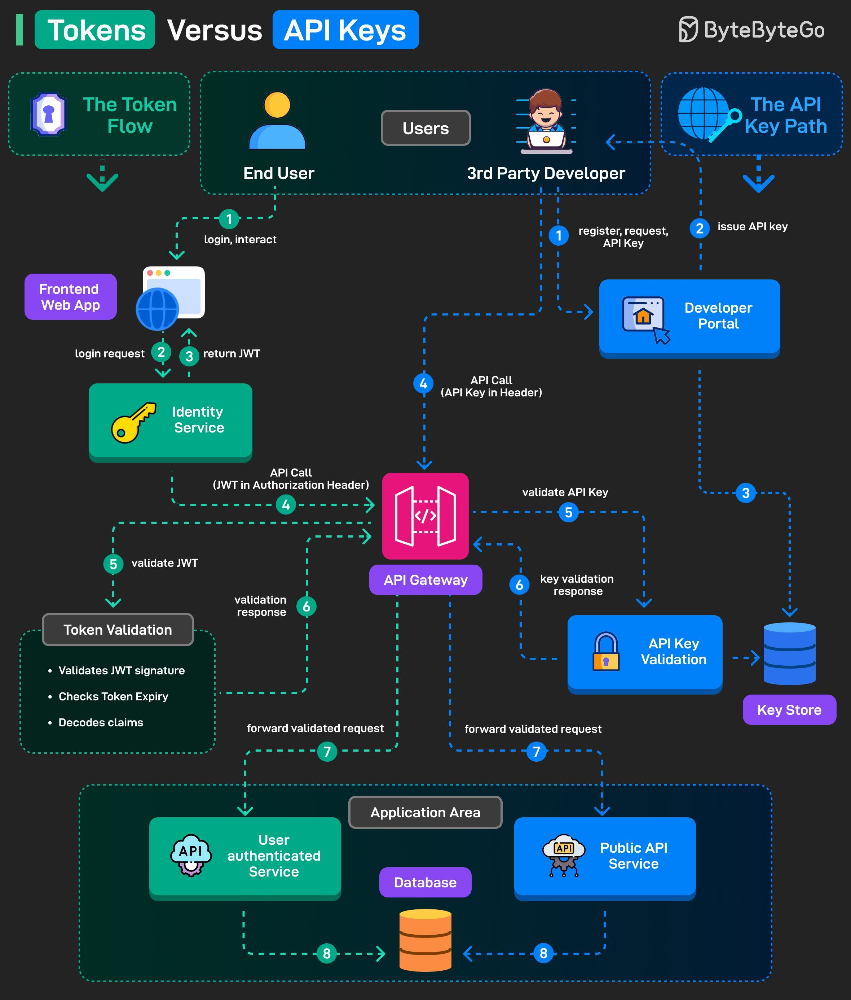

### Cookies vs Sessions vs JWT vs Paseto

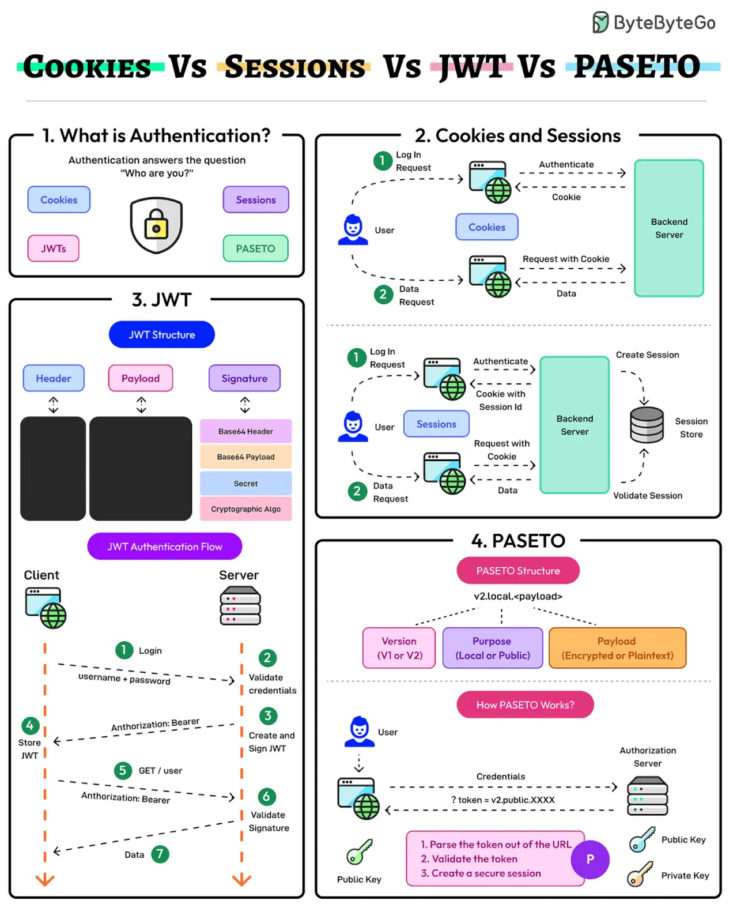

### IPsec Tunnel Mode vs Transport Mode

|                    **Tunnel Mode**                     |                 **Transport Mode**                 |
| :----------------------------------------------------: | :------------------------------------------------: |
| Protects the entire original IP packet (header + data) |       Protects only the payload (data) part        |
|               Adds a new outer IP header               |            Uses the original IP header             |
|                Provides higher security                |       Provides comparatively lower security        |
|         Encapsulates the whole original packet         |        Does not encapsulate the full packet        |
|          Used in site-to-site VPN connections          |         Used in host-to-host communication         |
|       Hides source and destination IP addresses        | Source and destination IP addresses remain visible |
|        More overhead due to the extra IP header        |                   Less overhead                    |
|             Commonly used in VPN gateways              |     Commonly used for end-to-end communication     |

## Reference

[1] [System Design CheatSheet for Interview](https://medium.com/javarevisited/system-design-cheatsheet-4607e716db5a)

[2] [JSON Web Token (JWT)](https://www.geeksforgeeks.org/web-tech/json-web-token-jwt/)

[3] [SAML Explained in Plain English](https://www.onelogin.com/learn/saml)

[4] [Difference between JWT, OAuth, and SAML for Authentication and Authorization in Web Apps?](https://medium.com/javarevisited/difference-between-jwt-oauth-and-saml-for-authentication-and-authorization-in-web-apps-75b412754127)

[5] [What is OAuth (Open Authorization) ?](https://www.geeksforgeeks.org/ethical-hacking/what-is-oauth-open-authorization/)

[6] [Top Authentication Techniques to Build Secure Applications](https://blog.bytebytego.com/p/top-authentication-techniques-to)

[7] [EP172: Top 5 common ways to improve API performance](https://blog.bytebytego.com/p/ep172-top-5-common-ways-to-improve)

[8] [Access Control Clearly Explained](https://blog.bytebytego.com/p/ep182-cookies-vs-sessions)

[9] [Cookies Vs Sessions Vs JWT Vs PASETO](https://blog.bytebytego.com/i/155048027/cookies-vs-sessions-vs-jwt-vs-paseto)

[10] [How Two-factor Authentication (2FA) Works?](https://blog.bytebytego.com/i/159794025/how-two-factor-authentication-2fa-works)

[11] [Security Measures in System Design](https://www.geeksforgeeks.org/system-design/essential-security-measures-in-system-design/)

[12] [Secure Socket Layer (SSL) vs. Transport Layer Security (TLS)](https://www.geeksforgeeks.org/computer-networks/difference-between-secure-socket-layer-ssl-and-transport-layer-security-tls/)

[13] [What is Secure Software Development Life Cycle (SSDLC)](https://www.geeksforgeeks.org/ethical-hacking/what-is-secure-software-development-life-cycle-ssdlc/)

[14] [What is Data Backup and Disaster Recovery?](https://www.geeksforgeeks.org/cloud-computing/what-is-data-backup-and-disaster-recovery/)

[15] [IP Security (IPSec)](https://www.geeksforgeeks.org/computer-networks/ip-security-ipsec/)

[16] [Multipurpose Internet Mail Extension (MIME) Protocol](https://www.geeksforgeeks.org/computer-networks/multipurpose-internet-mail-extension-mime-protocol/)

[17] [Secure Socket Layer (SSL)](https://www.geeksforgeeks.org/computer-networks/secure-socket-layer-ssl/)