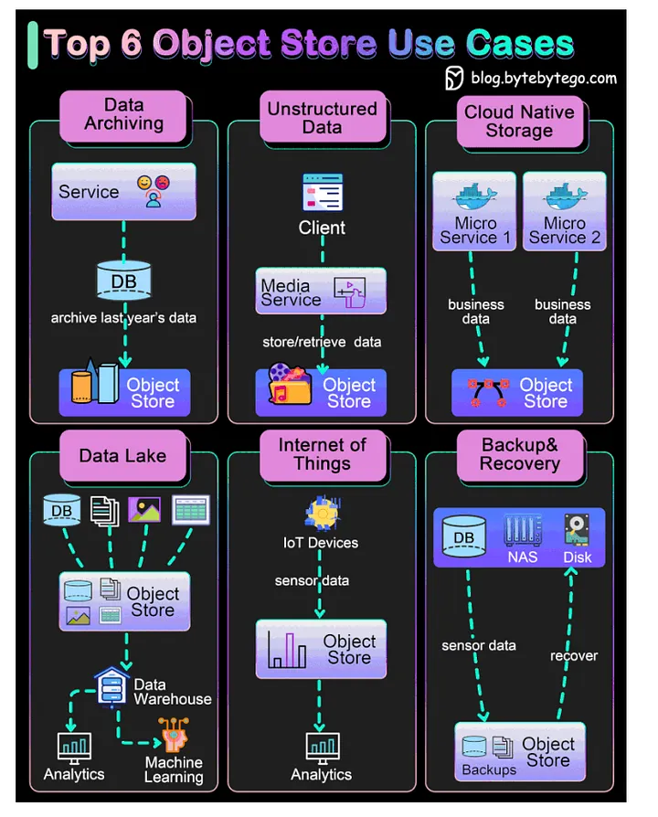

# Storage In System Design

## Object Store

## Reference

[1] [Block, Object, and File Storage in System Design](https://www.geeksforgeeks.org/system-design/block-object-and-file-storage-in-cloud-with-difference/)

[2] [System Design CheatSheet for Interview](https://medium.com/javarevisited/system-design-cheatsheet-4607e716db5a)