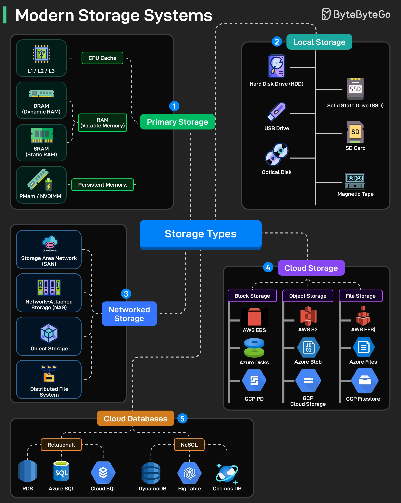
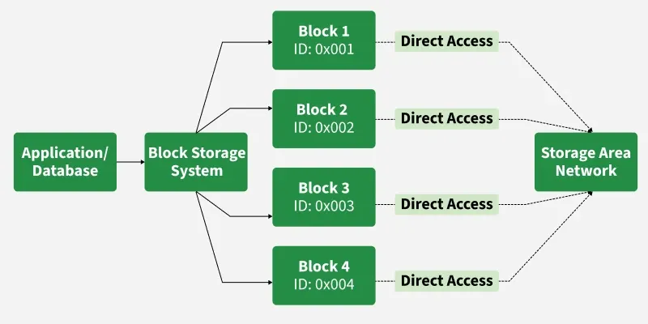
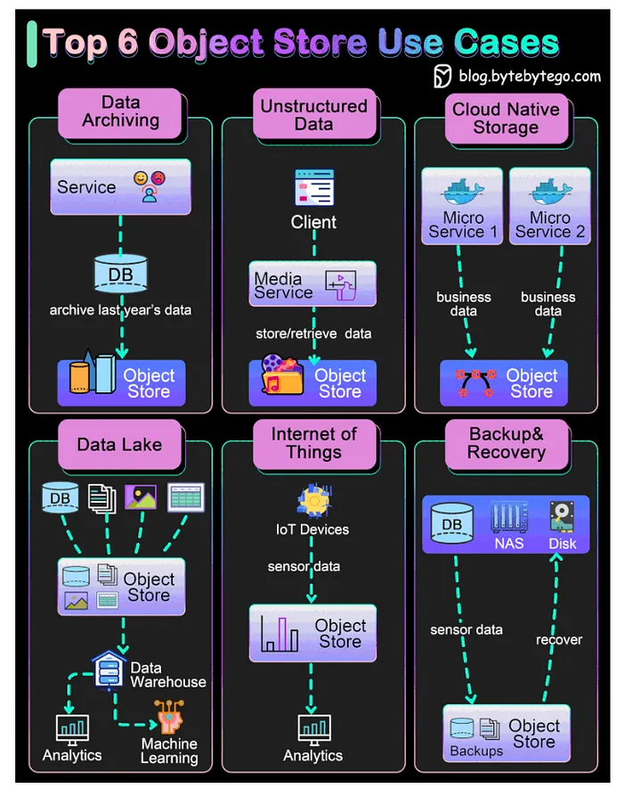
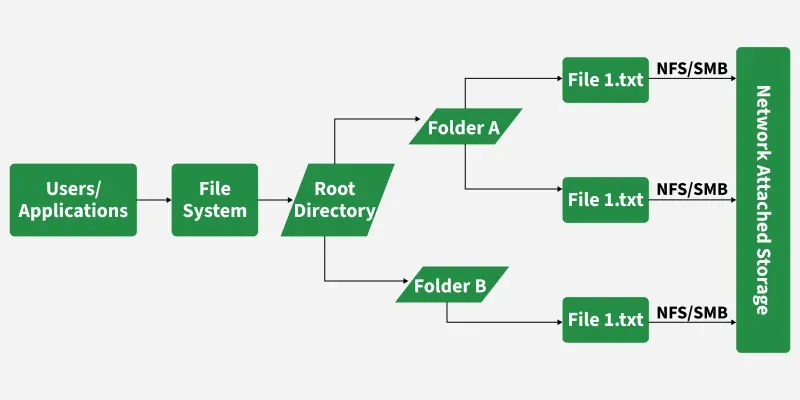
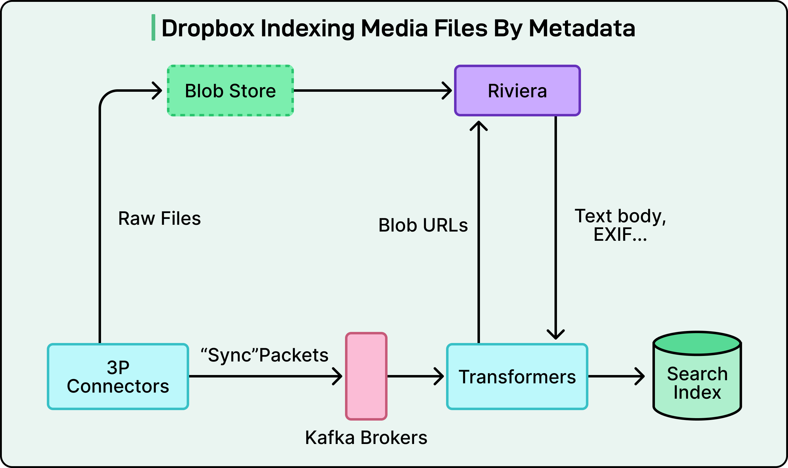
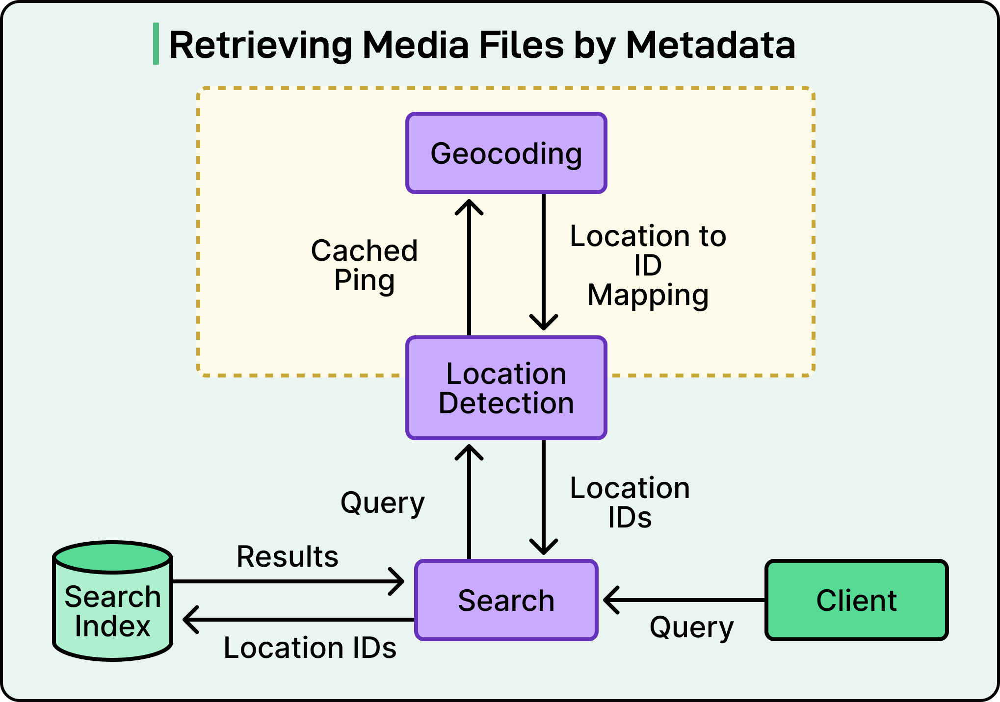
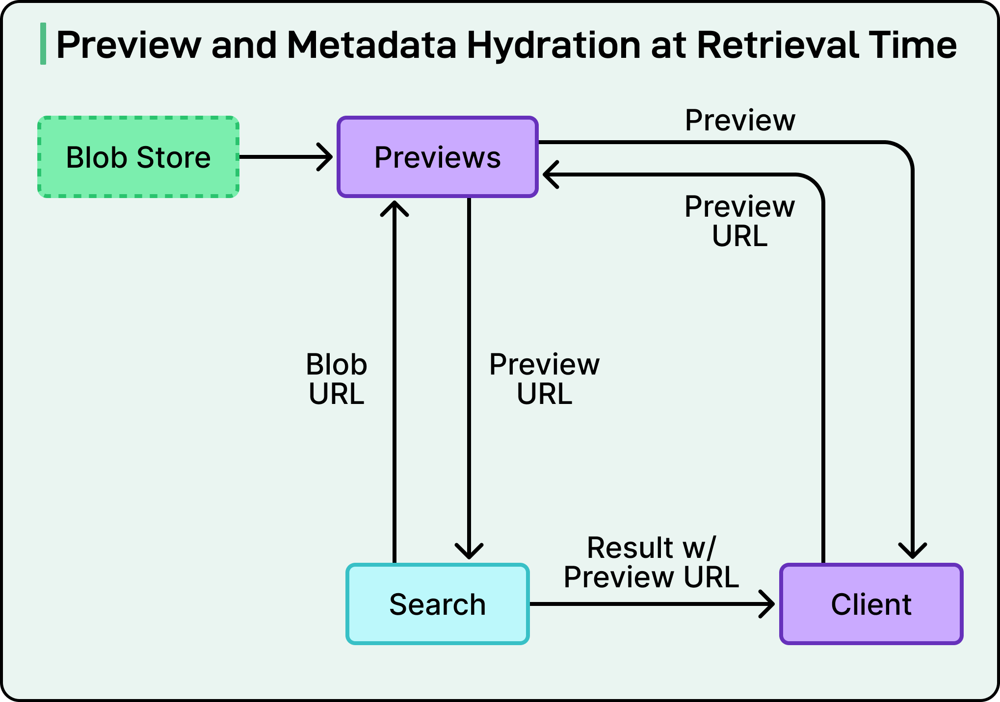
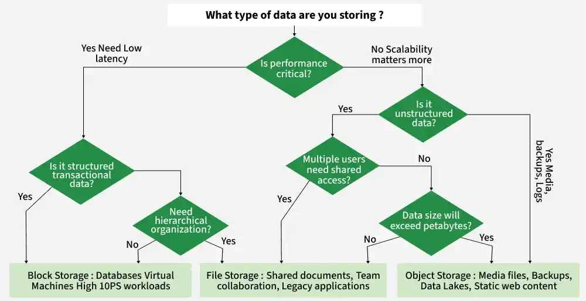

# Storage In System Design

[TOC]

## Storage System

## Block Storage

Block storage is a method of storing data in fixed-size blocks, where each block has a unique address and works independently. Unlike file storage, it does not follow a hierarchical structure, making it more flexible and efficient. It is commonly used in high-performance systems like databases and virtual machines.

## Object Store

With object storage, data is kept as discrete units known as "objects." A unique identity, metadata (information about the data), and the actual data are all contained in each item. Object storage is hence very flexible, scalable, and appropriate for storing vast amounts of unstructured data, such as backups, videos, and pictures.

## File Storage

Similar to how we arrange files on a computer, file storage is a conventional technique of storing data in a hierarchical system of files and folders. Every file has a name and directory path, which helps access and navigation. Applications that need regular updates and organized data management are best suited for it.

## Example 1: Dropbox Multimedia Search

### Indexing Pipeline for Metadata

The data flows through the system in the following way:

- Raw files are stored in a blob store
- Riviera extracts features and metadata from these files
- Information flows through third-party connectors
- Kafka message brokers transport the data
- Transformers process and structure the information
- Finally, everything populates the search index

### Geolocation-Aware Retrieval System

During indexing, when a file contains GPS coordinates in its metadata, Dropbox converts those coordinates into a hierarchical chain of location IDs. For example, a photo taken in San Francisco would generate a chain linking San Francisco to California to the United States. This hierarchy is crucial because it enables flexible searching at different geographic levels.

### Just-In-Time Preview Generation

When a search returns results, the system generates preview URLs that the frontend can fetch. These URLs point to a preview service built on top of Riviera that generates thumbnails and previews in multiple resolutions on the fly. To avoid repeatedly generating the same preview, the system caches them for 30 days, striking a balance between storage costs and performance.

## Summary

### Block Storage vs Object Storage vs File Storage

|                      **Block Storage**                       |                      **Object Storage**                      |                       **File Storage**                       |
| :----------------------------------------------------------: | :----------------------------------------------------------: | :----------------------------------------------------------: |
| Divides data into fixed-size blocks, each with a unique identifier. | Stores data as objects with metadata and a unique ID in a flat structure. | Organizes data in a hierarchical structure of files and folders. |
| Ideal for databases, virtual machines, and transactional workloads requiring high performance. | Best for storing large amounts of unstructured data, like multimedia files or backups. | Suitable for structured file storage and shared file access, such as documents and spreadsheets. |
| High performance and low latency, especially for read/write operations. | Optimised for scalability and durability, not real-time performance. | Moderate performance; dependent on file system and storage device. |
| Scales well but may require manual configuration for capacity expansion. | Highly scalable; can handle massive amounts of data across distributed systems. | Limited scalability compared to object storage; suitable for smaller systems. |
|  Minimal metadata, often handled by the application layer.   | Extensive metadata stored with each object, enabling advanced search and analytics. |  Basic metadata, such as file name, type, and permissions.   |
| Requires manual backup or snapshot configurations for data durability. | Highly durable with built-in redundancy across multiple locations. | Data durability depends on the underlying file system and backup strategies. |
| AWS EBS, Google Persistent Disks, SAN (Storage Area Network). |      AWS S3, Azure Blob Storage, Google Cloud Storage.       | Network Attached Storage (NAS), Shared Drives, Local File Systems. |

## Reference

[1] [Block, Object, and File Storage in System Design](https://www.geeksforgeeks.org/system-design/block-object-and-file-storage-in-cloud-with-difference/)

[2] [System Design CheatSheet for Interview](https://medium.com/javarevisited/system-design-cheatsheet-4607e716db5a)

[3] [Modern Storage Systems](https://blog.bytebytego.com/i/184819571/modern-storage-systems)

[4] [Dropbox Multimedia Search: Making File Search More Useful](https://blog.bytebytego.com/p/dropbox-multimedia-search-making)

[5] [Block, Object, and File Storage](https://www.geeksforgeeks.org/system-design/block-object-and-file-storage-in-cloud-with-difference/)