# System Design

[TOC]

## Requirements

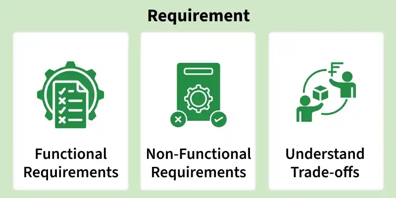

### Functional Requirements

Functional requirements are the requirements that the end user specifically demands as basic functionalities that the system should offer. All these functionalities need to be necessarily included into the system as part of the contract.

### Non-Functional Requirements

Non-functional Requirements are the quality constraints that the system must satisfy according to the project contract. The priority or extent to which these factors are implemented varies from one project to another. They are also called non-behavioral requirements. For example: portability, maintainability, reliability, scalability, security, etc.

### Extended requirements

These are basically "nice to have" requirements that might be out of the scope of the system.

---

## Design

### SOLID

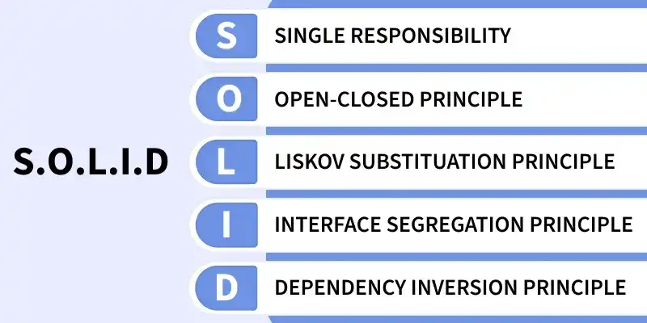

- Single-responsibility principle(SRP)

  This principle states that "A class should have only one reason to change.", which means a class should have only one job or purpose within the software system."

- Open-closed principle(OCP)

  This principle states that "Software entities should be open for extension, but closed modification.", which means you should be able to extend a class behavior, without modifying it.

- Liskov's Substitution Principle(LSP)

  This principle states that "derived or child classes must be able to replace their base or parent classes". This ensures that any subclass can be used in place of its parent class without causing unexpected behavior in the program.

- Interface Segregation Principle(ISP)

  This principle states that "do not force any client to depend on methods which is irrelevant to them".

- Dependency Inversion Principle(DIP)

  This principle states that "High-level modules should not depend on low-level modules. Both should depend on abstractions".

### DRY

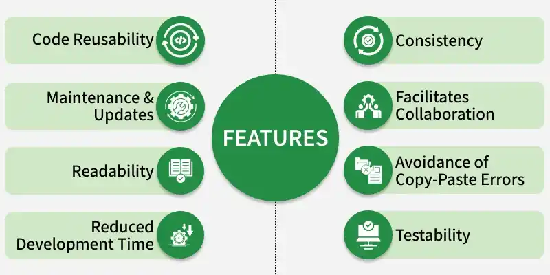

### KISS

### YAGNI

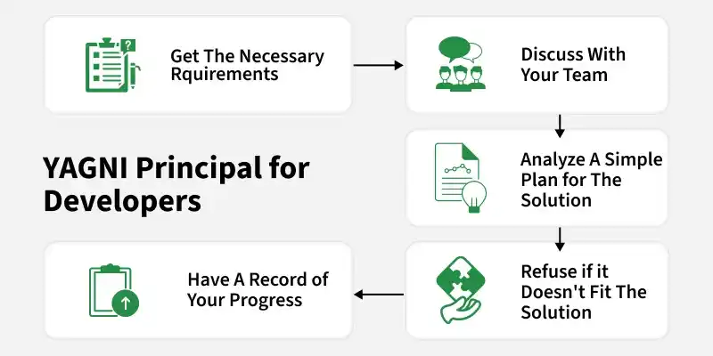

---

## High Level Design(HLD) and Low Level Design(LLD)

System design involves creating both a High-Level Design(HLD), which is like a roadmap showing the overall plan, and a Low-Level Design(LLD), which is a detailed guide for programmers on how to build each part.

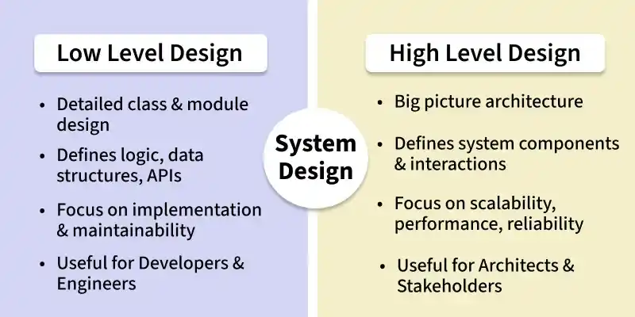

### High Level Design(HLD)

High Level Design(HLD) is an initial step in the development of applications where the overall structure of a system is planned.

A diagram representing each design aspect is include in the HLD (which is based on business requirements and anticipated results):

- It contains description of hardware, software interfaces, and also user interfaces;
- It is also known as macro level/system, design;
- It is created by solution architect;
- The workflow of the user's typical process is detailed in the HLD, along with performance specifications.

#### Components

Below are the main components of high-level design:

- System Architecture;
- Modules and Components;
- Data Flow Diagrams(DFDs);
- Interface Design;
- Technology Stack;
- Deployment Architecture.

#### Roadmap

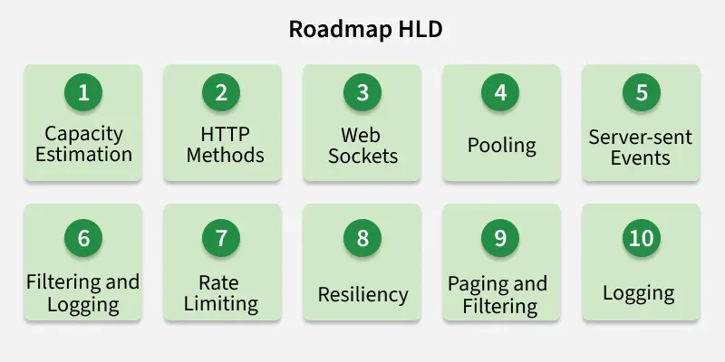

1. Capacity Estimation

   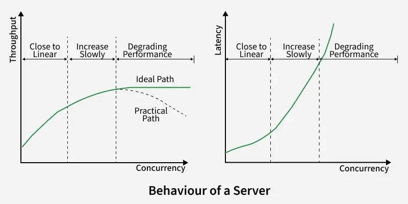

   Capacity estimation in system design involves predicting the resources required to meet the expected workload. It ensures that a system can handle current and future demands efficiently, helping in the proper allocation of resources and preventing performance bootlenecks.

2. HTTP and HTTPS and Their Methods

   

3. Web Sockets

   

4. Pooling

   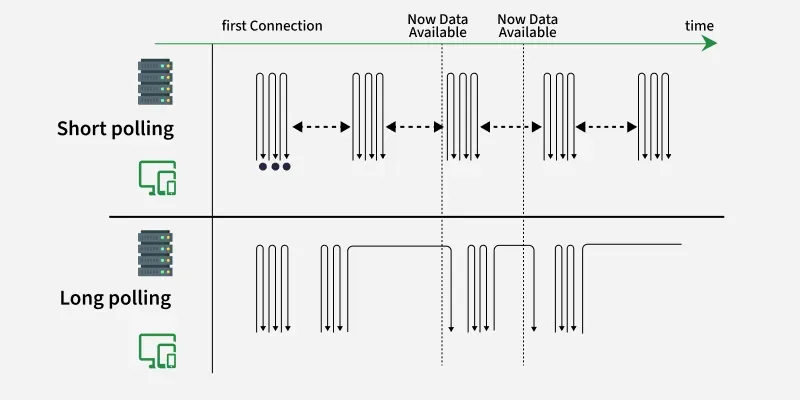

5. Server-Sent Events(SSE)

   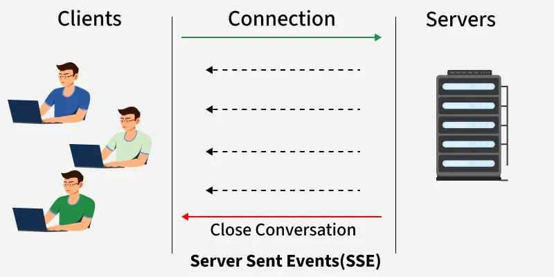

6. Filtering and logging

7. Rate Limiting

   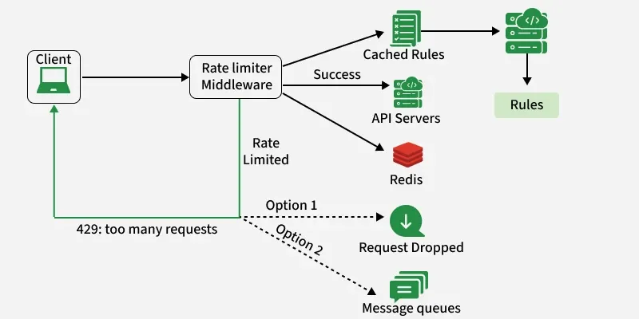

8. Resiliency

9. Paging

   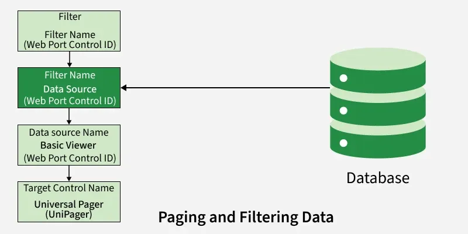

10. Logging

### Low Level Design(LLD)

Low-Level Design(LLD) plays a crucial role in software development, transforming high-level abstract concepts into detailed, actionable components that developers can use to build the system.

LLD is a phase in the software development process where detailed system components and their interactions are specified:

- It describes detailed description of each and every module means it includes actual logic for every system component and it goes deep into each modules specification.
- It is also known as micro level/detailed design.
- It is created by designers and developers.
- It involves converting the high-level design into a more detailed blueprint, addressing specific algorithms, data structures, and interfaces.
- LLD serves as a guide for developers during coding, ensuring the accurate and efficient implementation of the system's functionality.

#### Roadmap

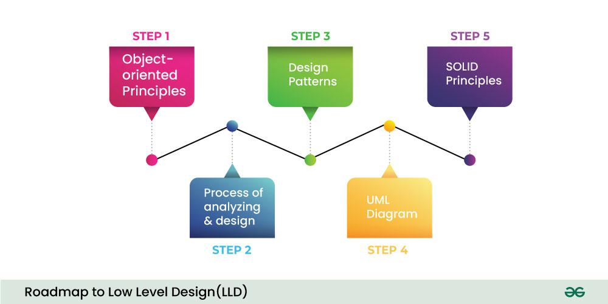

1. Understanding Object-Oriented Principles

   The user requirement is processed by using concepts of OOPS programming. OOP concepts serve as the foundation for LLD, and having a deep understanding of them will help you design maintainable and scalable software components.

2. Analyzing and Designing Components

   LLD requires you to analyze real-world problems and break then down into object-world problems using OOP concepts.

3. Implementing Design Patterns

   Design patterns are reusable solutions to common problems encountered in software design. They provide a structured approach to design by capturing best practices and proven solutions, making it easier to develop scalable, maintainable, and efficient software. By using these patterns, developers can solve problems more effectively while adhering to best practices.

4. Use of UML Diagram in LLD

   Unified Modeling Language(UML) diagrams play an important role in converting HLD to LLD. They provide a proper and clear visual representation of the components and their relationships, which helps developers significantly.

5. Implementing SOLID Principles

---

## API Design

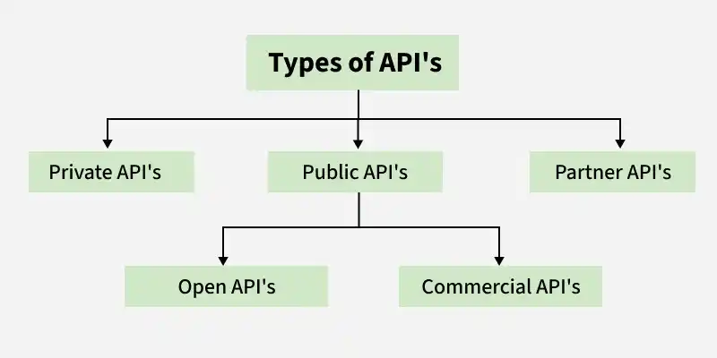

---

## System Design Workflows

Steps to crack system design:

1. Understand the goal and gather all the requirements;

   Asking questions about the exact scope of the problem, and clarifying functional requirements early in the interview is essential.

2. Understand the estimation and constraints;

   Estimate the scale of the system we're going to design. Focus on the system's expected scale (like user volume and request rates) and practical limits (like latency and budget). 

3. High-level component design;

   Identify system components that are needed to solve our problem and draft the first design of our system and outline the flow of data between them. This gives an organized view of the system's architecture and sets up a foundation for further detailed design.

4. Define the Data Model / Database Design

   Doing so would help us to understand the data flow which is the core of every system. In this step, we basically define all the entities and relationships between them.

5. API design

   These APIs will help us define the expectations from the system explicitly. We don't have to write any code, just a simple interface defining the API requirements such as parameters, functions, classes, types, entities, etc.

6. Detailed design

   Now it's time to go into detail about the major components of the system we designed.

7. Identify and resolve bottlenecks.

---

## Reference

[1] Ian Sommerville. SOFTWARE ENGINEERING . 9th Edition

[2] [Cracking the System Design Interview Round](https://www.geeksforgeeks.org/system-design/how-to-crack-system-design-round-in-interviews/)

[3] [Difference between High Level Design(HLD) and Low Level Design(LLD)](https://www.geeksforgeeks.org/system-design/difference-between-high-level-design-and-low-level-design/)

[4] [Data Modeling in System Design](https://www.geeksforgeeks.org/system-design/data-modeling-in-system-design/)

[5] [What is Low Level Design or LLD?](https://www.geeksforgeeks.org/system-design/what-is-low-level-design-or-lld-learn-system-design/)
